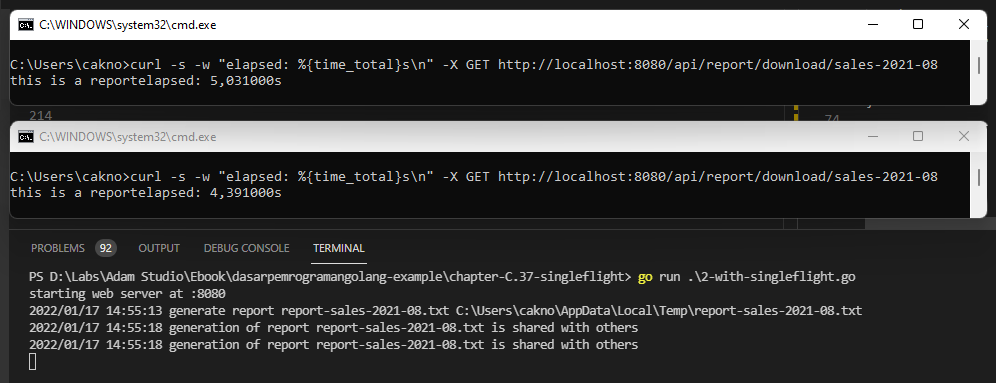

# C.37. Singleflight

Pada chapter ini kita akan belajar tentang pengaplikasian singleflight API.

Singleflight berguna untuk men-*suppress* atau menekan pemanggilan fungsi yang duplikat hanya menjadi 1 saja. Pemanggilan fungsi yang duplikat di sini maksudnya adalah: blok fungsi atau statement yang dipanggil bersamaan oleh beberapa pengguna, dan pemanggilan tersebut menghasilkan output yang sama persis.

Satu contoh yang relevan dengan pemanggilan fungsi duplikat adalah proses *generate report*. Untuk aplikasi dengan dataset yang masif, pastinya proses pembuatan report butuh waktu lebih lama, tidak instan dan tidak bisa *realtime*.

Contoh: suatu ketika `user A` men-trigger *report generation*, di waktu yang hampir bersamaan `user B` juga men-trigger *report generation*, padahal report yg di-inginkan adalah sama persis dengan report `user A`, ini menjadikan 2 proses tersebut menjadi redundan. Idealnya cukup 1 proses saja yang jalan. Nah, di sinilah peran dari singleflight API.

> Singleflight API masuk dalam dependensi [golang.org/x/sync/singleflight](https://pkg.go.dev/golang.org/x/sync/singleflight).

Kita akan memulai pembelajaran dengan membuat 1 buah contoh program sederhana yang mensimulasikan proses *generate report*. Setelahnya kita akan *tune* kode tersebut agar bisa mengantisipasi pemanggilan fungsi duplikat/redundan.

## C.37.1. Persiapan

Siapkan sebuah web server API dengan isi satu buah router untuk method `GET` dengan endpoint path adalah `/api/report/download/{reportID}`.

> Di sini kita gunakan `reportID` sebagai unique identifier report. Umumnya report perlu lebih banyak parameter identifier seperti date filter dan filter lainnya. Tapi pada contoh berikut kita hanya akan pakai `reportID`.

Silakan gunakan router library yg cocok di hati. Pada contoh ini saya akan pakai [go-chi](https://github.com/go-chi/chi).

```go
package main

import (
	"errors"
	"fmt"
	"io"
	"log"
	"net/http"
	"os"
	"path/filepath"
	"time"

	chi "github.com/go-chi/chi/v5"
)

func main() {
	r := chi.NewRouter()
	r.Route("/api", func(r chi.Router) {
		r.Get("/report/download/{reportID}", HandlerDownloadReport)
	})

	host := ":8080"
	fmt.Printf("starting web server at %s \n", host)
	http.ListenAndServe(host, r)
}
```

Selanjutnya siapkan `HandlerDownloadReport`, yang isinya kurang lebih men-generate report sesuai `reportID`.

```go
func HandlerDownloadReport(w http.ResponseWriter, r *http.Request) {
	reportID := chi.URLParam(r, "reportID")

	// construct the report path
	reportName := fmt.Sprintf("report-%s.txt", reportID)
	path := filepath.Join(os.TempDir(), reportName)

	// if the report is not exists, generate it first.
	// otherwise, immediatelly download it
	if _, err := os.Stat(path); errors.Is(err, os.ErrNotExist) {
		log.Println("generate report", reportName, path)

		// simulate long-running process to generate report
		time.Sleep(5 * time.Second)

		f, err := os.Create(path)
		if err != nil {
			f.Close()
			http.Error(w, err.Error(), http.StatusInternalServerError)
			return
		}

		f.Write([]byte("this is a report"))
		f.Close()
	}
    
    // ...
}
```

Dalam handler bisa dilihat, parameter `reportID` value-nya diambil, kemudian dijadikan bagian nama file report dengan format `report-{reportID}.txt`.

Yang dilakukan setelahnya, kita cek file report tersebut, apakah sudah ada atau belum. Jika belum, maka generate dulu report nya.

Di dalam blok kode *report generation* disimulasikan proses memakan waktu `5 detik`.

Ok, sekarang tambahkan kode berikut:

```go
func HandlerDownloadReport(w http.ResponseWriter, r *http.Request) {
	// ...

	// open the file, download it
	f, err := os.OpenFile(path, os.O_RDONLY, 0644)
	if f != nil {
		defer f.Close()
	}
	if err != nil {
		http.Error(w, err.Error(), http.StatusInternalServerError)
		return
	}

	contentDisposition := fmt.Sprintf("attachment; filename=%s", reportName)
	w.Header().Set("Content-Disposition", contentDisposition)

	if _, err := io.Copy(w, f); err != nil {
		http.Error(w, err.Error(), http.StatusInternalServerError)
		return
	}

	http.Error(w, "", http.StatusBadRequest)
}
```

File report yang sudah ter-generate, kita buka lagi dengan mode `READONLY`. Kemudian isi file tersebut di-copy ke objek `ResponseWriter` diiringi dengan header `Content-Disposition` yang di-set, agar response di-proses oleh browser sebagai operasi generate report.

Ok, sekarang mari kita test.

## C.37.2. Download File

Pada contoh berikut penulis menggunakan command `curl` untuk mengetes endpoint. Endpoint yang sama di-call secara hampir bersamaan dari 2 terminal prompt berbeda.

```bash
curl -s -w "elapsed: %{time_total}s\n" -i -X GET http://localhost:8080/api/report/download/sales-2021-10
```


Ok, bisa dilihat, dua operasi `curl` yang hampir bersamaan, masing-masing butuh minimal 5 detik untuk selesai, ini karena kita set proses generate report 5 detik.

Sedangkan pada bagian web server log, terlihat report di-generate 2x padahal report tersebut ekuivalen atau sama persis.

Coba jalankan lagi, harusnya pada api call berikut response akan sangat cepat, karena report sudah terbuat.


Ok, mantab, hanya butuh 0,xxx detik untuk mengunduh report. Ok, sampai sini berarti sudah jelas bagian mana yang perlu di-*tune*, yaitu di bagian proses generate report concurrent-nya, agar tidak duplikat pengeksekusiannya untuk report yang sama di waktu eksekusi yang hampir bersamaan.

## C.37.3. Pengaplikasian `singleflight` API

Sekarang coba duplikat kode sebelumnya pada file baru, lalu tambahkan modifikasi berikut.

Pertama import dulu dependensi-nya. Lalu siapkan variabel baru dengan tipe `singleflight.Group`.

> Jangan lupa `go get -u golang.org/x/sync/singleflight`

```go
package main

import (
	// ...
	"golang.org/x/sync/singleflight"
)

var singleflightGroupDownloadReport singleflight.Group
```

Variabel `singleflightGroupDownloadReport` akan kita gunakan untuk men-*suppress* duplicate call terhadap kode generate report.

Selanjutnya, modifikasi isi handler antara statement `path := ...` dan statement `f, err := ...`

```go
func HandlerDownloadReport(w http.ResponseWriter, r *http.Request) {
	// ...
	path := filepath.Join(os.TempDir(), reportName)

	sharedProcessKey := fmt.Sprintf("generate %s", reportName)
	_, err, shared := singleflightGroupDownloadReport.Do(sharedProcessKey, func() (interface{}, error) {
		// if the report is not exists, generate it first.
		// otherwise, immediatelly download it
		if _, err := os.Stat(path); errors.Is(err, os.ErrNotExist) {
			log.Println("generate report", reportName, path)

			// simulate long-running process to generate report
			time.Sleep(5 * time.Second)

			f, err := os.Create(path)
			if err != nil {
				f.Close()
				return nil, err
			}

			f.Write([]byte("this is a report"))
			f.Close()
		}

		return true, nil
	})
	if err != nil {
		http.Error(w, err.Error(), http.StatusInternalServerError)
		return
	}
	if shared {
		log.Printf("generation of report %v is shared with others", reportName)
	}

	// open the file, download it
	f, err := os.OpenFile(path, os.O_RDONLY, 0644)
	// ...
}
```

Pada kode di atas, kurang lebih modifikasi yang ditambahkan hanya membungkus kode untuk generate report dengan `singleflightGroupDownloadReport.Do()`.

Variabel `singleflightGroupDownloadReport` kita siapkan sebagai variabel global, yang berarti *shared* dan *accessible* pada setiap API call.

Kegunaan `singleflightGroupDownloadReport.Do()` adalah semua statement yang berada di dalamnya akan dipanggil 1x saja meskipun kode dipanggil banyak kali secara hampir bersamaan, dengan ketentuan data `key` yang disisipkan pada parameter pertama itu sama. Misalnya, jika ada 10 api call untuk generate report yang sama, `report-sales-2021-10.txt`, maka di sisi backend proses generate report hanya akan terjadi sekali.

Melanjutkan pembahasan pada contoh yang dijelaskan, berarti dari 10 api call hanya 1 request yang benar-benar men-generate report. Lalu bagaimana dengan 9 api call yang lain. Yang terjadi adalah request yang lain juga akan menunggu hingga `singleflightGroupDownloadReport.Do()` selesai dieksekusi, hanya saja tanpa mengeksekusi kode di dalam `singleflightGroupDownloadReport.Do()`.

Agar lebih jelas, mari kita test saja.

## C.37.4. Generate report dengan `singleflight` API

```bash
curl -s -w "elapsed: %{time_total}s\n" -i -X GET http://localhost:8080/api/report/download/sales-2021-09
```



Bisa dilihat pada gambar di atas, log `generate report report-sales....` hanya dipanggil sekali meskipun ada dua concurrent api call ke endpoint tersebut. Ini tandanya fungsi untuk generate `report-sales-2021-08.txt` di-suppress agar tidak redundant.

Log setelahnya, yaitu `generation of report report-sales-2021-08.txt is shared with others` hanya akan muncul jika ada lebih dari satu api call yang hampir bersamaan di waktu proses singleflight sedang berjalan. Variabel `shared` di situ menandakan bahwa proses di-share di api call lainnya.

Cukup berguna bukan? Dengan adahnya singleflight API ini, beban backend akan sedikit diringankan. Proses yang sifatnya duplikat hanya akan dijalankan 1 saja dengan tanpa merusak flow proses.

---

 - [go-chi](https://github.com/go-chi/chi), by Peter Kieltyka, MIT license
 - [Singleflight](https://pkg.go.dev/golang.org/x/sync/singleflight), by Go Team, BSD-3-Clause

---

<div class="source-code-link">
    <div class="source-code-link-message">Source code praktek chapter ini tersedia di Github</div>
    <a href="https://github.com/novalagung/dasarpemrogramangolang-example/tree/master/chapter-C.37-singleflight">https://github.com/novalagung/dasarpemrogramangolang-example/.../chapter-C.37...</a>
</div>
