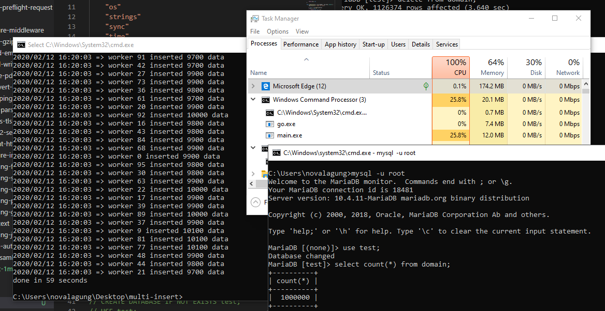

# D.1. Insert 1 Juta Data dari File CSV Ke Database Server, Menggunakan Teknik Worker Pool, Database Connection Pool, dan Mekanisme Failover.

Pada bab ini kita akan praktek penerapan salah satu teknik concurrent programming di Go yaitu worker pool, dikombinasikan dengan database connection pool, untuk membaca 1jt rows data dari sebuah file csv untuk kemudian di-insert-kan ke mysql server.

Pada bagian insert data kita terapkan mekanisme failover, jadi ketika ada operasi insert gagal, maka akan otomatis di recover dan di retry. Jadi idealnya di akhir, semua data, sejumlah satu juta, akan berhasil di-insert.

## D.1.1. Penjelasan

#### Worker Pool

Worker pool adalah teknik manajemen goroutine dalam *concurrent programming* pada Go. Sejumlah worker dijalankan dan masing-masing memiliki tugas yang sama yaitu menyelesaikan sejumlah jobs.

Dengan metode worker pool ini, maka penggunaan memory dan performansi program akan bisa optimal.

#### Database Connection Pool

*Connection pool* adalah metode untuk manajemen sejumlah koneksi database, agar bisa digunakan secara optimal.

Connection pool sangat penting dalam kaskus operasi data yang berhubungan dengan database yang dimana concurrent programming diterapkan.

Karena pada concurrent programming, beberapa proses akan berjalan bersamaan, maka penggunaan 1 koneksi db akan menghambat proses tersebut. Perlu ada beberapa koneksi database, agar goroutine tidak rebutan objek koneksi database.

#### Failover

Failover merupakan mekanisme backup ketika sebuah proses gagal. Pada konteks ini, failover mengarah ke proses untuk me-retry operasi insert ketika gagal.

## D.1.2. Persiapan

File [majestic-million-csv]([https://blog.majestic.com/development/majestic-million-csv-daily/](https://blog.majestic.com/development/majestic-million-csv-daily/)) digunakan sebagai bahan dalam praktek. File tersebut gratis dengan lisensi CCA3. Isinya adalah list dari top website berjumlah 1jt.

Silakan download file nya disini http://downloads.majestic.com/majestic_million.csv.

Setelah itu siapkan My SQL database server, create database dan sebuah tabel di dalamnya dengan nama domain.

```sql
CREATE DATABASE IF NOT EXISTS test;
USE test;
CREATE TABLE IF NOT EXISTS domain (
    GlobalRank int,
    TldRank int,
    Domain varchar(255),
    TLD varchar(255),
    RefSubNets int,
    RefIPs int,
    IDN_Domain varchar(255),
    IDN_TLD varchar(255),
    PrevGlobalRank int,
    PrevTldRank int,
    PrevRefSubNets int,
    PrevRefIPs int
);
```

Setelah itu buat projek baru, dan sebuah file `main.go`, dan tempatkan file csv yang sudah didownload dalam folder yang sama.

Karena di contoh ini saya menggunakan My SQL, maka perlu untuk go get driver RDBMS ini untuk go.

```bash
go get -u github.com/go-sql-driver/mysql
```

Jika pembaca ingin menggunakan driver lain, juga silakan.

## D.1.3. Praktek

#### Definisi Konstanta

Ada beberapa konstanta yang perlu dipersiapkan. Pertama connection string untuk komunikasi ke database server. Sesuaikan value nya dengan yang dipergunakan.

```go
const dbConnString = "root@/test"
```

Lalu jumlah koneksi idle yang diperbolehkan, kita set saja 4, karena nantinya semua connection yg di create akan sibuk untuk bekerja meng-insert data.

```go
const dbMaxIdleConns = 4
```

Jumlah maksimum koneksi database dalam pool.

```go
const dbMaxConns = 100
```

Jumlah worker yang akan bekerja untuk menjalankan job.

```go
const totalWorker = 100
```

Path dari file CSV. Karena file berada satu level dengan `main.go` maka tulis saja nama file nya.

```go
const csvFile = "majestic_million.csv"
```

Terakhir, siapkan variabel untuk menamping data header dari pembacaan CSV nanti.

```go
var dataHeaders = make([]string, 0)
```

#### Fungsi Buka Koneksi Database

Buat fungsi untuk buka koneksi database, yg dikembalikan objek database kembalian fungsi `sql.Open()`.

Jangan lupa set nilai `MaxOpenConns` dan `MaxIdleConns`.

O iya, untuk yang tidak menggunakan mysql, maka sesuaikan saja nilai argument pertama statement `sql.Open()`.

```go
func openDbConnection() (*sql.DB, error) {
	log.Println("=> open db connection")

	db, err := sql.Open("mysql", dbConnString)
	if err != nil {
		return nil, err
	}

	db.SetMaxOpenConns(dbMaxConns)
	db.SetMaxIdleConns(dbMaxIdleConns)

	return db, nil
}
```

O iya jangan lupa untuk import driver nya.

```go
import _ "github.com/go-sql-driver/mysql"
```

#### Fungsi Baca CSV

Buka file CSV, lalu gunakan objek file untuk membuat objek CSV reader baru.

```go
func openCsvFile() (*csv.Reader, *os.File, error) {
	log.Println("=> open csv file")

	f, err := os.Open(csvFile)
	if err != nil {
		return nil, nil, err
	}

	reader := csv.NewReader(f)
	return reader, f, nil
}
```

#### Fungsi Menjalankan Workers

Ok, sekarang kita mulai masuk ke aspek konkurensi dari pembahasan ini. Siapkan fungsi yang isinya men-dispatch beberapa goroutine sejumlah `totalWorker`.

Tiap-tiap goroutine tersebut adalah worker atau pekerja, yang tugasnya nanti akan meng-insert data ke database.

Saat aplikasi dijalankan, sejumlah 100 worker akan berlomba-lomba menyelesaikan job insert data sejumlah 1jt data.

1 job adalah 1 data, maka rata-rata setiap worker akan menyelesaikan operasi insert sekitar 10k. Tapi ini jelasnya tidak pasti karena worker akan berkompetisi dalam penjeleasaian job, jadi sangat besar kemungkinan akan ada job yang menyelesaikan lebih dari 10k jobs, ataupun yg dibawah 10k jobs.

```go
func dispatchWorkers(db *sql.DB, jobs <-chan []interface{}, wg *sync.WaitGroup) {
	for workerIndex := 0; workerIndex <= totalWorker; workerIndex++ {
		go func(workerIndex int, db *sql.DB, jobs <-chan []interface{}, wg *sync.WaitGroup) {
			counter := 0

			for job := range jobs {
				doTheJob(workerIndex, counter, db, job)
				wg.Done()
				counter++
			}
		}(workerIndex, db, jobs, wg)
	}
}
```

Bisa dilihat dalam fungsi di atas, di dalam goroutine/worker, isi channel jobs (yang berupa data dari proses pembacaan CSV), didistribusikan ke worker, ke goroutine. 

Fungsi `doTheJob()` yang nantinya kita buat, isinya adalah operasi insert data ke database server. Setiap satu operasi insert selesai, `wg.Done()` untuk menandai bahwa 1 job adalah selesai.

Idealnya di akhir aplikasi akan terjadi pemanggilan `wg.Done()` sejumlah 1jt karena ada 1jt jobs.

#### Fungsi Baca CSV dan Pengiriman Jobs ke Worker

Proses pembacaan CSV, apapun metodenya pasti yang dijalankan adalah membaca data dari line ke line dari baris paling bawah.

> Proses baca satu file tidak bisa di-konkurensi-kan

```go
func readCsvFilePerLineThenSendToWorker(csvReader *csv.Reader, jobs chan<- []interface{}, wg *sync.WaitGroup) {
	for {
		row, err := csvReader.Read()
		if err != nil {
			if err == io.EOF {
				err = nil
			}
			break
		}

		if len(dataHeaders) == 0 {
			dataHeaders = row
			continue
		}

		rowOrdered := make([]interface{}, 0)
		for _, each := range row {
			rowOrdered = append(rowOrdered, each)
		}

		wg.Add(1)
		jobs <- rowOrdered
	}
	close(jobs)
}
```

Data dibaca dalam perulangan per baris. Pada pembacaan pertama, rows akan ditampung ke variabel `dataHeaders`. Selanjutnya, data dikirimkan ke worker lewat channel `jobs`.

Setelah proses baca data selesai, channel di close. Karena pengiriman dan penerimaan data pada channel bersifat synchronous untuk unbuffered channel. Jadi aman untuk berasumsi bahwa ketika semua data berhasil dikirim, maka semua data tersebut juga berhasil diterima. 

Jika blok kode perulangan dalam fungsi di atas selesai, maka sudah tidak ada lagi operasi kirim terima data, maka kita close channelnya.

#### Fungsi Insert Data ke Database

```go
func doTheJob(workerIndex, counter int, db *sql.DB, values []interface{}) {
	for {
		var outerError error
		func(outerError *error) {
			defer func() {
				if err := recover(); err != nil {
					*outerError = fmt.Errorf("%v", err)
				}
			}()

			conn, err := db.Conn(context.Background())
			query := fmt.Sprintf("INSERT INTO domain (%s) VALUES (%s)",
				strings.Join(dataHeaders, ","),
				strings.Join(generateQuestionsMark(len(dataHeaders)), ","),
			)

			_, err = conn.ExecContext(context.Background(), query, values...)
			if err != nil {
				log.Fatal(err.Error())
			}

			err = conn.Close()
			if err != nil {
				log.Fatal(err.Error())
			}
		}(&outerError)
		if outerError == nil {
			break
		}
	}

	if counter%100 == 0 {
		log.Println("=> worker", workerIndex, "inserted", counter, "data")
	}
}

func generateQuestionsMark(n int) []string {
	s := make([]string, 0)
	for i := 0; i < n; i++ {
		s = append(s, "?")
	}
	return s
}
```

Pada kode di atas bisa dilihat bahwa kode insert dibungkus dalam IIFE dalam sebuah perulangan.

Kenapa butuh perulangan? keyword `for` di atas perannya sangat penting. Disini diterapkan mekanisme failover dimana ketika proses insert gagal akan di recover dan di-retry ulang.

Nah jadi ketika operasi insert di atas gagal, maka error tetap di tampilkan tapi kemudian diulang kembali insert data yang gagal tadi, hingga sukses.
*emphasized text*
O iya, di atas juga ada fungsi `generateQuestionsMark()`, digunakan untuk membantu pembentukan query insert data secara dinamis.

## D.1.4. Eksekusi Program

Ok, sekarang mari kita coba eksekusi program-nya.



Nah, bisa dilihat operasi insert selesai dalam waktu sekitar 1 menitan. Saya menggunakan laptop dengan spek berikut untuk run program:

- Core i7-8750H 2.20GHz (6 core, 12 logical prosesor)
- RAM 16GB
- SSD

Kalau diperhatikan, hanya 25.8% utilisasi CPU, dan hanya 12MB saja resource RAM yang dibutuhkan. Di Task Manager CPU usage nya 100% karena My SQL server di lokal saya benar-benar bekerja keras untuk menjalankan operasi insert.

> Kecepatan aplikasi sangat tergantung dengan spesifikasi hardware laptop/server yang dipakai.

Kalau dibandingkan dengan operasi insert data secara sekuensial, yang tanpa worker pool dan tanpa db connection pool, memakan waktu hingga **20 MENIT!**. Metode pada bab ini jauh lebih cepat.

Praktek pada bab ini sifatnya adalah POC, jadi sangat mungkin diperlukan penyesuaian untuk kasus nyata. Kode di atas sebenarnya juga masih bisa di optimize lagi dari banyak sisi.

---

 - [go-sql-driver/mysql](https://github.com/go-sql-driver/mysql), by Go SQL Driver Team, Mozilla Public License 2.0

---

<div class="source-code-link">
    <div class="source-code-link-message">Source code praktek pada bab ini tersedia di Github</div>
    <a href="https://github.com/novalagung/dasarpemrogramangolang-example/tree/master/chapter-D.1-insert-1mil-csv-record-into-db-in-a-minute">https://github.com/novalagung/dasarpemrogramangolang-example/.../chapter-D.1...</a>
</div>
