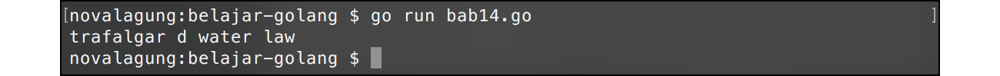
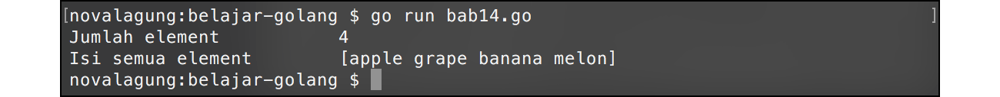
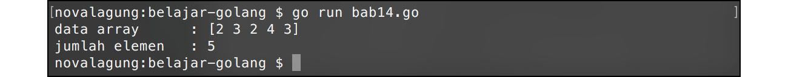
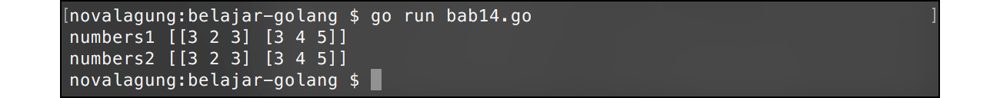
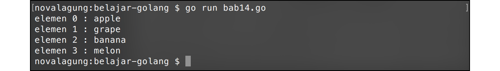
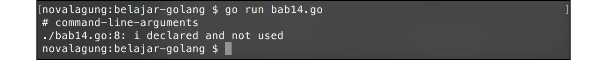
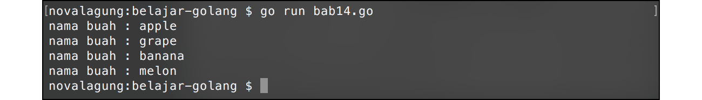

# A.15. Array

Array adalah kumpulan data bertipe sama, yang disimpan dalam sebuah variabel. Array memiliki kapasitas yang nilainya ditentukan pada saat pembuatan, menjadikan elemen/data yang disimpan di array tersebut jumlahnya tidak boleh melebihi yang sudah dialokasikan.

Default nilai tiap elemen array pada awalnya tergantung dari tipe datanya. Jika `int` maka tiap element zero value-nya adalah `0`, jika `bool` maka `false`, dan seterusnya. Setiap elemen array memiliki indeks berupa angka yang merepresentasikan posisi urutan elemen tersebut. Indeks array dimulai dari 0.

Contoh penerapan array:

```go
var names [4]string
names[0] = "trafalgar"
names[1] = "d"
names[2] = "water"
names[3] = "law"

fmt.Println(names[0], names[1], names[2], names[3])
```

Variabel `names` dideklarasikan sebagai `array string` dengan alokasi kapasitas elemen adalah `4` slot. Cara mengisi slot elemen array bisa dilihat di kode di atas, yaitu dengan langsung mengakses elemen menggunakan indeks, lalu mengisinya.



## A.15.1. Pengisian Elemen Array yang Melebihi Alokasi Awal

Pengisian elemen array pada indeks yang tidak sesuai dengan jumlah alokasi menghasilkan error. Contoh: jika array memiliki 4 slot, maka pengisian nilai slot 5 seterusnya adalah tidak valid.

```go
var names [4]string
names[0] = "trafalgar"
names[1] = "d"
names[2] = "water"
names[3] = "law"
names[4] = "ez" // baris kode ini menghasilkan error
```

Solusi dari masalah di atas adalah dengan menggunakan keyword `append`, yang pembahasannya ada pada chapter selanjutnya, ([A.16. Slice](/A-slice.html)).

## A.15.2. Inisialisasi Nilai Awal Array

Pengisian elemen array bisa dilakukan pada saat deklarasi variabel. Caranya dengan menuliskan data elemen dalam kurung kurawal setelah tipe data, dengan pembatas antar elemen adalah tanda koma (`,`).

```go
var fruits = [4]string{"apple", "grape", "banana", "melon"}

fmt.Println("Jumlah element \t\t", len(fruits))
fmt.Println("Isi semua element \t", fruits)
```

Penggunaan fungsi `fmt.Println()` pada data array tanpa mengakses indeks tertentu, menghasilkan output dalam bentuk string dari semua array yang ada. Teknik ini umum digunakan untuk keperluan *debugging* data array.



Fungsi `len()` berfungsi untuk menghitung jumlah elemen sebuah array.

## A.15.3. Inisialisasi Nilai Array Dengan Gaya Vertikal

Elemen array bisa dituliskan dalam bentuk horizontal (seperti yang sudah dicontohkan di atas) ataupun dalam bentuk vertikal.

```go
var fruits [4]string

// cara horizontal
fruits  = [4]string{"apple", "grape", "banana", "melon"}

// cara vertikal
fruits  = [4]string{
    "apple",
    "grape",
    "banana",
    "melon",
}
```

Khusus untuk deklarasi array dengan cara vertikal, tanda koma wajib dituliskan setelah setiap elemen (termasuk elemen terakhir), agar tidak memunculkan syntax error.

## A.15.4. Inisialisasi Nilai Awal Array Tanpa Jumlah Elemen

Deklarasi array yang nilainya diset di awal, boleh tidak dituliskan jumlah lebar array-nya, cukup ganti dengan tanda 3 titik (`...`). Metode penulisan ini membuat kapasitas array otomatis dihitung dari jumlah elemen array yang ditulis.

```go
var numbers = [...]int{2, 3, 2, 4, 3}

fmt.Println("data array \t:", numbers)
fmt.Println("jumlah elemen \t:", len(numbers))
```

Variabel `numbers` secara otomatis kapasitas elemennya adalah `5`.



## A.15.5. Array Multidimensi

Array multidimensi adalah array yang tiap elemennya juga berupa array.

> Level kedalaman array multidimensi adalah tidak terbatas, bisa saja suatu array berisi elemen array yang setiap elemennya juga adalah nilai array, dst.

Cara deklarasi array multidimensi secara umum sama dengan array biasa, bedanya adalah pada array biasa, setiap elemen berisi satu nilai, sedangkan pada array multidimensi setiap elemen berisi array.

Khusus penulisan array yang merupakan subdimensi/elemen, boleh tidak dituliskan jumlah datanya. Contohnya bisa dilihat pada deklarasi variabel `numbers2` di kode berikut.

```go
var numbers1 = [2][3]int{[3]int{3, 2, 3}, [3]int{3, 4, 5}}
var numbers2 = [2][3]int{{3, 2, 3}, {3, 4, 5}}

fmt.Println("numbers1", numbers1)
fmt.Println("numbers2", numbers2)
```

Kedua array di atas memiliki jumlah dan isi elemen yang sama.



## A.15.6. Perulangan Elemen Array Menggunakan Keyword `for`

Keyword `for` dan array memiliki hubungan yang sangat erat. Dengan memanfaatkan perulangan/looping menggunakan keyword ini, elemen-elemen dalam array bisa didapat.

Ada beberapa cara yang bisa digunakan untuk me-looping data array, yg pertama adalah dengan memanfaatkan variabel iterasi perulangan untuk mengakses elemen berdasarkan indeks-nya. Contoh:

```go
var fruits = [4]string{"apple", "grape", "banana", "melon"}

for i := 0; i < len(fruits); i++ {
    fmt.Printf("elemen %d : %s\n", i, fruits[i])
}
```

Perulangan di atas dijalankan sebanyak jumlah elemen array `fruits` (bisa diketahui dari kondisi `i < len(fruits`). Di tiap perulangan, elemen array diakses lewat variabel iterasi `i`.



## A.15.7. Perulangan Elemen Array Menggunakan Keyword `for` - `range`

Ada cara lain yang lebih sederhana untuk operasi perulangan array, yaitu menggunakan kombinasi keyword `for` - `range`. Contoh pengaplikasiannya bisa dilihat di kode berikut.

```go
var fruits = [4]string{"apple", "grape", "banana", "melon"}

for i, fruit := range fruits {
    fmt.Printf("elemen %d : %s\n", i, fruit)
}
```

Array `fruits` diambil elemen-nya secara berurutan. Nilai tiap elemen ditampung variabel oleh `fruit` (tanpa huruf s), sedangkan indeks nya ditampung variabel `i`.

Output program di atas, sama persis dengan output program sebelumnya, hanya saja cara yang diterapkan berbeda.

## A.15.8. Penggunaan Variabel Underscore `_` Dalam `for` - `range`

Terkadang, dalam penerapan *looping* menggunakan `for` - `range`, ada kebutuhan di mana yang dibutuhkan dari perulangan adlah adalah elemen-nya saja, sedangkan indeks-nya tidak, contoh:

```go
var fruits = [4]string{"apple", "grape", "banana", "melon"}

for i, fruit := range fruits {
    fmt.Printf("nama buah : %s\n", fruit)
}
```

Hasil dari kode program di atas adalah error, karena Go tidak memperbolehkan adanya variabel yang menganggur atau tidak dipakai.



Di sinilah salah satu kegunaan dari variabel pengangguran, atau underscore (`_`). Tampung saja nilai yang tidak ingin digunakan ke underscore.

```go
var fruits = [4]string{"apple", "grape", "banana", "melon"}

for _, fruit := range fruits {
    fmt.Printf("nama buah : %s\n", fruit)
}
```

Pada kode di atas, yang sebelumnya adalah variabel `i` diganti dengan `_`, karena kebetulan variabel `i` tidak digunakan.



Bagaiamana jika sebaliknya? Misal, yang dibutuhkan hanya indeks-nya saja, nilainya tidak penting. Maka cukup tulis satu variabel saja setelah keyword `for`, yaitu variabel penampung nilai indeks.

```go
for i, _ := range fruits { }
// atau
for i := range fruits { }
```

## A.15.9. Alokasi Elemen Array Menggunakan Keyword `make`

Deklarasi sekaligus alokasi kapasitas array juga bisa dilakukan lewat keyword `make`.

```go
var fruits = make([]string, 2)
fruits[0] = "apple"
fruits[1] = "manggo"

fmt.Println(fruits)  // [apple manggo]
```

Parameter pertama keyword `make` diisi dengan tipe data elemen array yang diinginkan, parameter kedua adalah jumlah elemennya. Pada kode di atas, variabel `fruits` tercetak sebagai array string dengan kapasitas alokasi 2 slot.

---

<div class="source-code-link">
    <div class="source-code-link-message">Source code praktek chapter ini tersedia di Github</div>
    <a href="https://github.com/novalagung/dasarpemrogramangolang-example/tree/master/chapter-A.15-array">https://github.com/novalagung/dasarpemrogramangolang-example/.../chapter-A.15...</a>
</div>

---

<iframe src="partial/ebooks.html" width="100%" height="390px" frameborder="0" scrolling="no"></iframe>
