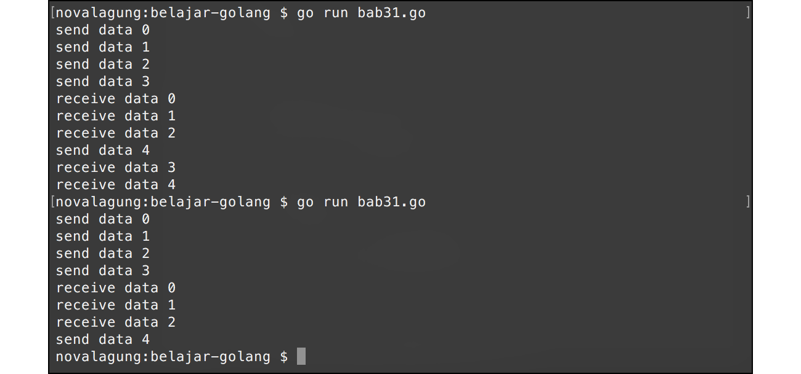

# A.32. Buffered Channel

Proses transfer data pada channel secara default dilakukan dengan metode **un-buffered** atau tidak di-buffer di memori. Ketika terjadi proses kirim data via channel dari sebuah goroutine, maka harus ada goroutine lain yang menerima data dari channel yang sama, dengan proses serah-terima yang bersifat blocking. Maksudnya, baris kode setelah kode pengiriman dan juga penerimaan data tidak akan diproses sebelum proses serah-terima itu sendiri selesai.

Buffered channel sedikit berbeda. Pada channel jenis ini, ditentukan angka jumlah buffer-nya. Angka tersebut menjadi penentu jumlah data yang bisa dikirimkan bersamaan. Selama jumlah data yang dikirim tidak melebihi jumlah buffer, maka pengiriman akan berjalan **asynchronous** (tidak blocking).

Ketika jumlah data yang dikirim sudah melewati batas buffer, maka pengiriman data hanya bisa dilakukan ketika salah satu data yang sudah terkirim adalah sudah diambil dari channel di goroutine penerima, sehingga ada slot channel yang kosong.

Proses pengiriman data pada buffered channel adalah *asynchronous* ketika jumlah data yang dikirim tidak melebihi batas buffer. Namun pada bagian channel penerimaan data selalu bersifat *synchronous* atau blocking.


## A.32.1. Penerapan Buffered Channel

Penerapan buffered channel pada dasarnya mirip seperti channel biasa. Perbedaannya hanya pada penulisan deklarasinya, perlu ditambahkan angka buffer sebagai argumen `make()`.

Berikut adalah contoh penerapan buffered channel. Program di bawah ini merupakan pembuktian bahwa pengiriman data lewat buffered channel adalah asynchronous selama jumlah data yang sedang di-buffer oleh channel tidak melebihi kapasitas buffer.

```go
package main

import (
    "fmt"
    "runtime"
    "time"
)

func main() {
    runtime.GOMAXPROCS(2)

    messages := make(chan int, 3)

    go func() {
        for {
            i := <-messages
            fmt.Println("receive data", i)
        }
    }()

    for i := 0; i < 5; i++ {
        fmt.Println("send data", i)
        messages <- i
    }

    time.Sleep(1 * time.Second)
}

```

Pada kode di atas, parameter kedua fungsi `make()` adalah representasi jumlah buffer. Kapasitas buffered channel ditentukan oleh nilai tersebut, `make(chan int, 3)` berarti maksimal 3 data bisa dikirim tanpa blocking.

Terdapat juga IIFE goroutine yang isinya proses penerimaan data dari channel `messages`, untuk kemudian datanya ditampilkan. Setelah goroutine tersebut dieksekusi, perulangan dijalankan dan pada setiap iterasi dilakukan pengiriman data. Total ada 5 data dikirim lewat channel `messages` secara sekuensial.



Terlihat di output, proses pengiriman data dengan nilai `i` = 3 dan 4 diikuti dengan proses penerimaan data yang transfernya bersifat *synchronous* atau blocking.

Pengiriman data indeks ke 0, 1, dan 2 akan berjalan secara asynchronous, hal ini karena channel ditentukan nilai buffer-nya sebanyak 3 (ingat, jika nilai buffer adalah 3, maka maksimal 3 data yang bisa di-buffer tanpa blocking). Pengiriman selanjutnya (indeks 3 dan 4) hanya akan terjadi jika ada salah satu data yang sebelumnya telah dikirimkan sudah diterima (dengan serah terima data yang bersifat blocking), sehingga ada slot buffer yang kosong.

Karena pengiriman dan penerimaan data via buffered channel tidak selalu synchronous (tergantung jumlah buffer-nya), maka ada kemungkinan eksekusi program selesai namun tidak semua data diterima via channel `messages`. Karena alasan ini pada bagian akhir ditambahkan statement `time.Sleep(1 * time.Second)` agar ada jeda 1 detik sebelum program selesai.

> `time.Sleep()` di sini hanya sebagai cara mudah untuk contoh awal. Pendekatan ini tidak *reliable* di kode produksi karena tidak ada jaminan durasi sleep selalu cukup. Cara yang tepat adalah menggunakan `sync.WaitGroup` atau menutup channel dan meng-iterasinya dengan `for range` (dibahas di chapter [A.34. Channel Range & Close](/A-channel-range-close.html) dan [A.60. WaitGroup](/A-waitgroup.html)).

#### ◉ Fungsi `time.Sleep()`

Fungsi ini digunakan untuk menambahkan delay sebelum statement berikutnya dieksekusi. Durasi delay ditentukan oleh parameter, misal `1 * time.Second` maka durasi delay adalah 1 detik.

Lebih jelasnya mengenai fungsi `time.Sleep()` dan `time.Second` dibahas pada chapter terpisah, yaitu [Time Duration](/A-time-duration.html).

---

<div class="source-code-link">
    <div class="source-code-link-message">Source code praktik chapter ini tersedia di Github</div>
    <a href="https://github.com/novalagung/dasarpemrogramangolang-example/tree/master/chapter-A.32-buffered-channel">https://github.com/novalagung/dasarpemrogramangolang-example/.../chapter-A.32...</a>
</div>

---

<iframe src="partial/ebooks.html" width="100%" height="390px" frameborder="0" scrolling="no"></iframe>
