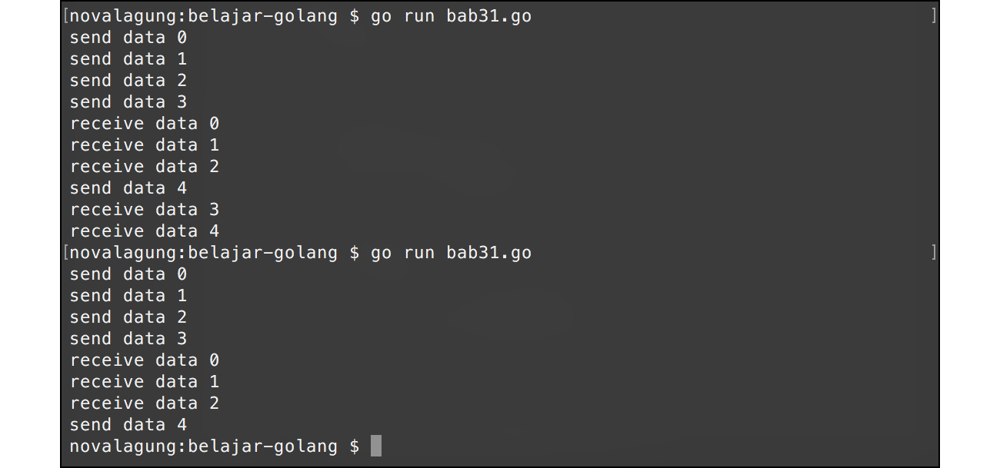

# A.32. Buffered Channel

Proses transfer data pada channel secara default dilakukan dengan metode **un-buffered** atau tidak di-buffer di memori. Ketika terjadi proses kirim data via channel dari sebuah goroutine, maka harus ada goroutine lain yang menerima data dari channel yang sama, dengan proses serah-terima yang bersifat blocking. Maksudnya, baris kode setelah kode pengiriman dan juga penerimaan data tidak akan diproses sebelum proses serah-terima itu sendiri selesai.

Buffered channel sedikit berbeda. Pada channel jenis ini, ditentukan angka jumlah buffer-nya. Angka tersebut menjadi penentu jumlah data yang bisa dikirimkan bersamaan. Selama jumlah data yang dikirim tidak melebihi jumlah buffer, maka pengiriman akan berjalan **asynchronous** (tidak blocking).

Ketika jumlah data yang dikirim sudah melewati batas buffer, maka pengiriman data hanya bisa dilakukan ketika salah satu data yang sudah terkirim adalah sudah diambil dari channel di goroutine penerima, sehingga ada slot channel yang kosong.

Proses pengiriman data pada buffered channel adalah *asynchronous* ketika jumlah data yang dikirim tidak melebihi batas buffer. Namun pada bagian channel penerimaan data selalu bersifat *synchronous* atau blocking.


## A.32.1. Penerapan Buffered Channel

Penerapan buffered channel pada dasarnya mirip seperti channel biasa. Perbedaannya hanya pada penulisan deklarasinya, perlu ditambahkan angka buffer sebagai argumen `make()`.

Berikut adalah contoh penerapan buffered channel. Program di bawah ini merupakan pembuktian bahwa pengiriman data lewat buffered channel adalah asynchronous selama jumlah data yang sedang di-buffer oleh channel tidak melebihi kapasitas buffer.

```go
package main

import (
    "fmt"
    "runtime"
    "time"
)

func main() {
    runtime.GOMAXPROCS(2)

    messages := make(chan int, 3)

    go func() {
        for {
            i := <-messages
            fmt.Println("receive data", i)
        }
    }()

    for i := 0; i < 5; i++ {
        fmt.Println("send data", i)
        messages <- i
    }

    time.Sleep(1 * time.Second)
}

```

Pada kode di atas, parameter kedua fungsi `make()` adalah representasi jumlah buffer. Perlu diperhatikan bahwa nilai buffered channel dimulai dari `0`. Ketika nilainya adalah **3** berarti jumlah buffer maksimal ada **4**.

Terdapat juga IIFE goroutine yang isinya proses penerimaan data dari channel `messages`, untuk kemudian datanya ditampilkan. Setelah goroutine tersebut dieksekusi, perulangan dijalankan dengan di-masing-masing perulangan dilakukan pengiriman data. Total ada 5 data dikirim lewat channel `messages` secara sekuensial.



Terlihat di output, proses pengiriman data indeks ke-4 adalah diikuti dengan proses penerimaan data yang proses transfernya sendiri dilakukan *syncrhonous* atau blocking.

Pengiriman data indeks ke 0, 1, 2 dan 3 akan berjalan secara asynchronous, hal ini karena channel ditentukan nilai buffer-nya sebanyak 3 (ingat, jika nilai buffer adalah 3, maka 4 data yang akan di-buffer). Pengiriman selanjutnya (indeks 5) hanya akan terjadi jika ada salah satu data dari ke-empat data yang sebelumnya telah dikirimkan sudah diterima (dengan serah terima data yang bersifat blocking). Setelahnya, pengiriman data kembali dilakukan secara asynchronous (karena sudah ada slot buffer ada yang kosong).

Karena pengiriman dan penerimaan data via buffered channel terjadi tidak selalu synchronous (tergantung jumlah buffer-nya), maka ada kemungkinan dimana eksekusi program selesai namun tidak semua data diterima via channel `messages`. Karena alasan ini pada bagian akhir ditambahkan statement `time.Sleep(1 * time.Second)` agar ada jeda 1 detik sebelum program selesai.

#### ◉ Fungsi `time.Sleep()`

Fungsi ini digunakan untuk menambahkan delay sebelum statement berikutnya dieksekusi. Durasi delay ditentukan oleh parameter, misal `1 * time.Second` maka durasi delay adalah 1 detik.

Lebih detailnya mengenai fungsi `time.Sleep()` dan `time.Second` dibahas pada chapter terpisah, yaitu [Time Duration](/A-time-duration.html).

---

<div class="source-code-link">
    <div class="source-code-link-message">Source code praktek chapter ini tersedia di Github</div>
    <a href="https://github.com/novalagung/dasarpemrogramangolang-example/tree/master/chapter-A.32-buffered-channel">https://github.com/novalagung/dasarpemrogramangolang-example/.../chapter-A.32...</a>
</div>

---

<iframe src="partial/ebooks.html" width="100%" height="390px" frameborder="0" scrolling="no"></iframe>
