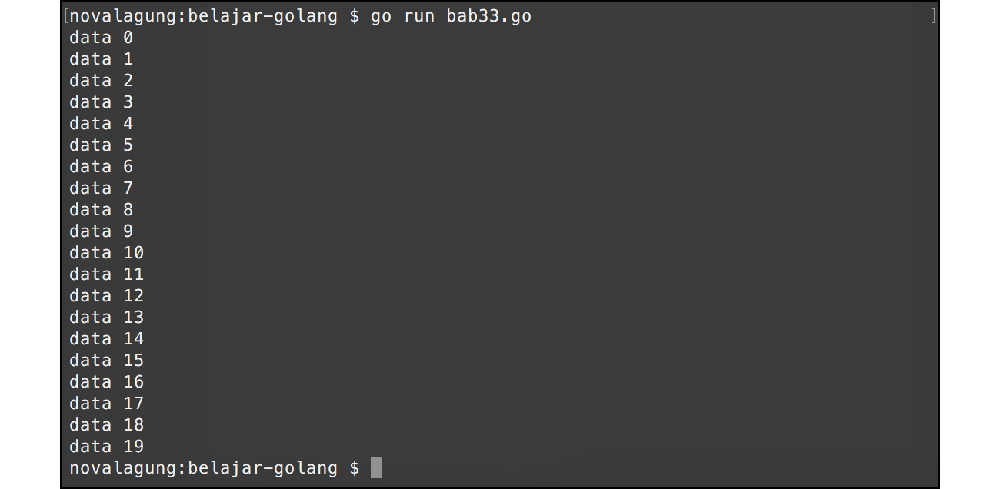

# A.34. Channel - Range dan Close

Proses penerimaan/*retrieving* data dari banyak channel bisa lebih mudah dilakukan dengan memanfaatkan kombinasi keyword `for` - `range`. Penerapannnya cukup mudah, yaitu dengan menuliskan keyword `for` - `range` pada variabel channel.

Cara kerjanya:

- Transaksi data via channel men-trigger perulangan `for` - `range`. Perulangan akan berlangsung seiring terjadinya pengiriman data ke channel yang di-iterasi.
- Perulangan tersebut hanya akan berhenti jika channel di-**close** atau di non-aktifkan via fungsi `close()`. Channel yang sudah di-close tidak bisa digunakan lagi baik untuk menerima data ataupun untuk mengirim data.

## A.34.1. Penerapan `for` - `range` - `close`

Berikut adalah contoh program pengaplikasian `for`, `range`, dan `close` untuk penerimaan data dari channel.

Pertama siapkan fungsi `sendMessage()` yang tugasnya mengirim data via channel. Di dalam fungsi ini dijalankan perulangan sebanyak 20 kali, ditiap perulangannya data dikirim ke channel. Channel di-close setelah semua data selesai dikirim.

```go
func sendMessage(ch chan<- string) {
    for i := 0; i < 20; i++ {
        ch <- fmt.Sprintf("data %d", i)
    }
    close(ch)
}
```

Siapkan juga fungsi `printMessage()` untuk handle penerimaan data. Di dalam fungsi tersebut, channel di-looping menggunakan `for` - `range`. Di setiap iterasi, data yang diterima dari channel ditampilkan.

```go
func printMessage(ch <-chan string) {
    for message := range ch {
        fmt.Println(message)
    }
}
```

Selanjutnya, buat channel baru dalam fungsi `main()`, jalankan `sendMessage()` sebagai goroutine. Dengan ini 20 data yang berada dalam fungsi tersebut dikirimkan via goroutine baru. Tak lupa jalankan juga fungsi `printMessage()`.

```go
func main() {
    runtime.GOMAXPROCS(2)

    var messages = make(chan string)
    go sendMessage(messages)
    printMessage(messages)
}
```

Setelah 20 data yang dikirim sukses diterima, channel `ch` di-non-aktifkan dengan adanya statement `close(ch)`. Statement tersebut menghentikan perulangan channel dalam `printMessage()`.



## A.34.2. Penjelasan tambahan

Berikut merupakan penjelasan tambahan untuk beberapa hal dari kode yang sudah dipraktekan:

#### ◉ Channel Direction

Go mendesain API channel untuk mendukung level akses channel, apakah hanya sebagai penerima, pengirim, atau penerima sekaligus pengirim. Konsep ini disebut dengan **channel direction**.

Cara pemberian level akses adalah dengan menambahkan tanda `<-` sebelum atau setelah keyword `chan`. Untuk lebih jelasnya bisa dilihat di list berikut.

| Sintaks | Penjelasan |
| :------- | :--------- |
| `ch chan string` | Parameter `ch` untuk **mengirim** dan **menerima** data |
| `ch chan<- string` | Parameter `ch` hanya untuk **mengirim** data |
| `ch <-chan string` | Parameter `ch` hanya untuk **menerima** data |

Pada kode di atas bisa dilihat bahwa secara default channel akan memiliki kemampuan untuk mengirim dan menerima data. Untuk mengubah channel tersebut agar hanya bisa mengirim atau menerima saja, dengan memanfaatkan simbol `<-`.

Sebagai contoh fungsi `sendMessage(ch chan<- string)` yang parameter `ch` dideklarasikan dengan level akses untuk pengiriman data saja. Channel tersebut hanya bisa digunakan untuk mengirim, contohnya: `ch <- fmt.Sprintf("data %d", i)`.

Dan sebaliknya pada fungsi `printMessage(ch <-chan string)`, channel `ch` hanya bisa digunakan untuk menerima data saja.

---

<div class="source-code-link">
    <div class="source-code-link-message">Source code praktik chapter ini tersedia di Github</div>
    <a href="https://github.com/novalagung/dasarpemrogramangolang-example/tree/master/chapter-A.34-channel-range-close">https://github.com/novalagung/dasarpemrogramangolang-example/.../chapter-A.34...</a>
</div>

---

<iframe src="partial/ebooks.html" width="100%" height="390px" frameborder="0" scrolling="no"></iframe>
