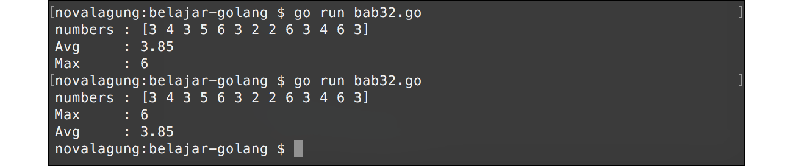

# A.33. Channel - Select

Channel membuat manajemen goroutine menjadi sangat mudah di Go. Namun perlu di-ingat, fungsi utama channel adalah bukan untuk kontrol eksekusi goroutine, melainkan untuk sharing data atau komunikasi goroutine.

> Pada chapter [A.59. sync.WaitGroup](/A-waitgroup.html) akan dibahas secara komprehensif tentang cara yang lebih optimal untuk kontrol eksekusi goroutine.

Tergantung jenis kasusnya, ada kalanya kita butuh lebih dari satu channel untuk komunikasi data antar goroutine. Penerimaan data pada banyak goroutine penerapannya masih sama, yaitu dengan menambahkan karakter `<-` pada statement. Selain itu, ada juga cara lain yaitu menggunakan keyword `select`. Keyword ini mempermudah kontrol penerimaan data via satu atau lebih dari satu channel.

Cara penggunaan `select` untuk kontrol channel sama seperti penggunaan `switch` untuk seleksi kondisi.

## A.33.1. Penerapan Keyword `select`

Program berikut merupakan contoh sederhana penerapan keyword `select`. Di sini disiapkan 2 buah goroutine, satu untuk menghitung rata-rata dari data array numerik, dan satu lagi untuk pencarian nilai tertinggi. Hasil operasi di masing-masing goroutine dikirimkan ke fungsi `main()` via channel (ada dua channel). Di fungsi `main()` sendiri, data tersebut diterima dengan memanfaatkan keyword `select`.

Ok, langsung saja kita praktek. Pertama, siapkan 2 fungsi yang sudah dibahas di atas. Fungsi pertama digunakan untuk mencari rata-rata, dan fungsi kedua untuk penentuan nilai tertinggi dari sebuah slice.

```go
package main

import "fmt"
import "runtime"

func getAverage(numbers []int, ch chan float64) {
    var sum = 0
    for _, e := range numbers {
        sum += e
    }
    ch <- float64(sum) / float64(len(numbers))
}

func getMax(numbers []int, ch chan int) {
    var max = numbers[0]
    for _, e := range numbers {
        if max < e {
            max = e
        }
    }
    ch <- max
}
```

Kedua fungsi tersebut dijalankan sebagai goroutine. Di akhir blok masing-masing fungsi, hasil kalkulasi dikirimkan via channel yang sudah dipersiapkan, yaitu `ch1` untuk menampung data rata-rata, `ch2` untuk data nilai tertinggi.

Ok lanjut, buat implementasinya pada fungsi `main()`.

```go
func main() {
    runtime.GOMAXPROCS(2)

    var numbers = []int{3, 4, 3, 5, 6, 3, 2, 2, 6, 3, 4, 6, 3}
    fmt.Println("numbers :", numbers)

    var ch1 = make(chan float64)
    go getAverage(numbers, ch1)

    var ch2 = make(chan int)
    go getMax(numbers, ch2)

    for i := 0; i < 2; i++ {
        select {
        case avg := <-ch1:
            fmt.Printf("Avg \t: %.2f \n", avg)
        case max := <-ch2:
            fmt.Printf("Max \t: %d \n", max)
        }
    }
}
```

Pada kode di atas, pengiriman data pada channel `ch1` dan `ch2` dikontrol menggunakan `select`. Terdapat 2 buah `case` kondisi penerimaan data dari kedua channel tersebut.

 - Kondisi `case avg := <-ch1` akan terpenuhi ketika ada penerimaan data dari channel `ch1`, yang kemudian akan ditampung oleh variabel `avg`.
 - Kondisi `case max := <-ch2` akan terpenuhi ketika ada penerimaan data dari channel `ch2`, yang kemudian akan ditampung oleh variabel `max`.

Karena ada 2 buah channel, maka perlu disiapkan perulangan 2 kali sebelum penggunaan keyword `select`.



Cukup mudah bukan?

---

<div class="source-code-link">
    <div class="source-code-link-message">Source code praktek chapter ini tersedia di Github</div>
    <a href="https://github.com/novalagung/dasarpemrogramangolang-example/tree/master/chapter-A.33-channel-select">https://github.com/novalagung/dasarpemrogramangolang-example/.../chapter-A.33...</a>
</div>

---

<iframe src="partial/ebooks.html" width="100%" height="390px" frameborder="0" scrolling="no"></iframe>
