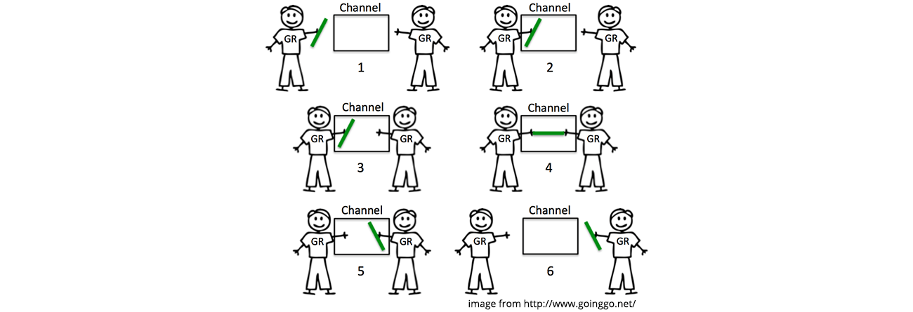
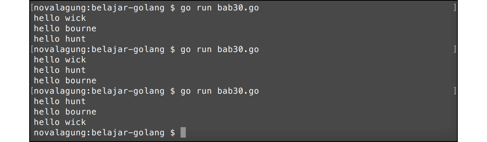
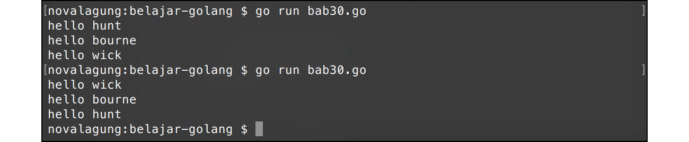

# A.31. Channel

**Channel** digunakan untuk menghubungkan goroutine satu dengan goroutine lain dengan mekanisme serah terima data, jadi harus ada data yang dikirim dari goroutine A untuk kemudian diterima di goroutine B.

Peran channel adalah sebagai media perantara bagi pengirim data dan juga penerima data. Jadi channel adalah *thread safe*, aman digunakan di banyak goroutine.

Pengiriman dan penerimaan data pada channel bersifat **blocking** atau **synchronous**. Artinya, statement di-bawah syntax pengiriman dan penerimaan data via channel hanya akan dieksekusi setelah proses serah terima berlangsung dan selesai.



## A.31.1. Penerapan Channel

Channel berbentuk variabel, dibuat dengan menggunakan kombinasi keyword `make` dan `chan`.

Program berikut adalah contoh implementasi channel. 3 buah goroutine dieksekusi, di masing-masing goroutine terdapat proses pengiriman data lewat channel. Kesemua data tersebut nantinya diterima oleh di goroutine utama yaitu proses yang dijalankan di dalam blok fungsi `main()`.

```go
package main

import "fmt"
import "runtime"

func main() {
    runtime.GOMAXPROCS(2)

    var messages = make(chan string)

    var sayHelloTo = func(who string) {
        var data = fmt.Sprintf("hello %s", who)
        messages <- data
    }

    go sayHelloTo("john wick")
    go sayHelloTo("ethan hunt")
    go sayHelloTo("jason bourne")

    var message1 = <-messages
    fmt.Println(message1)

    var message2 = <-messages
    fmt.Println(message2)

    var message3 = <-messages
    fmt.Println(message3)
}
```

Pada kode di atas, variabel `messages` dideklarasikan bertipe channel `string`. Contoh cara pembuatan channel bisa dilihat di situ, yaitu dengan memanggil fungsi `make()` dengan isi adalah keyword `chan` diikuti dengan tipe data channel yang diinginkan.

```go
var messages = make(chan string)
```

Selain itu disiapkan juga closure `sayHelloTo` yang tugasnya membuat sebuah pesan string yang kemudian dikirim via channel. Pesan string tersebut dikirim lewat channel `messages`. Tanda `<-` jika dituliskan di sebelah kiri nama variabel, berarti sedang berlangsung proses pengiriman data dari variabel yang berada di kanan lewat channel yang berada di kiri (pada konteks ini, variabel `data` dikirim lewat channel `messages`).

```go
var sayHelloTo = func(who string) {
    var data = fmt.Sprintf("hello %s", who)
    messages <- data
}
```

Fungsi `sayHelloTo` dieksekusi tiga kali sebagai goroutine berbeda. Menjadikan tiga proses ini berjalan secara **asynchronous** atau tidak saling tunggu.

> Sekali lagi perlu diingat bahwa eksekusi goroutine adalah *asynchronous*, sedangkan serah-terima data antar channel adalah *synchronous*.

```go
go sayHelloTo("john wick")
go sayHelloTo("ethan hunt")
go sayHelloTo("jason bourne")
```

Dari ketiga fungsi tersebut, goroutine yang selesai paling awal akan mengirim data lebih dulu, datanya kemudian diterima variabel `message1`. Tanda `<-` jika dituliskan di sebelah kiri channel, menandakan proses penerimaan data dari channel yang di kanan, untuk disimpan ke variabel yang di kiri.

```go
var message1 = <-messages
fmt.Println(message1)
```

Penerimaan channel bersifat blocking. Artinya:

- Statement `var message1 = <-messages` hingga setelahnya tidak akan dieksekusi sebelum ada data yang dikirim lewat channel.
- Berlaku juga dengan statement `messages <- data`. Statement dibawahnya tidak akan dieksekusi hingga data yang dikirim ke channel `messages` benar-benar diterima oleh penerima, yaitu variabel `message1`.

Ke semua data yang dikirim dari tiga goroutine berbeda tersebut nantinya diterima oleh `message1`, `message2`, `message3`; untuk kemudian ditampilkan.



Dari screenshot output di atas bisa dilihat bahwa text yang dikembalikan oleh `sayHelloTo` tidak selalu berurutan, meskipun penerimaan datanya adalah berurutan. Hal ini dikarenakan, pengiriman data adalah dari 3 goroutine yang berbeda, yang kita tidak tau mana yang prosesnya selesai lebih dulu. Goroutine yang dieksekusi lebih awal belum tentu selesai lebih awal, yang jelas proses yang selesai lebih awal datanya akan diterima lebih awal.

Karena pengiriman dan penerimaan data lewat channel bersifat **blocking**, tidak perlu memanfaatkan sifat blocking dari fungsi seperti `fmt.Scanln()` (atau lainnya) untuk mengantisipasi goroutine utama (yaitu `main`) selesai sebelum ketiga goroutine di atas selesai.

## A.31.2. Channel Sebagai Tipe Data Parameter

Variabel channel bisa di-pass ke fungsi lain via parameter. Cukup tambahkan keyword `chan` pada deklarasi parameter agar operasi pass channel variabel bisa dilakukan.

Siapkan fungsi `printMessage()` dengan parameter adalah channel. Lalu ambil data yang dikirimkan lewat channel tersebut untuk ditampilkan.

```go
func printMessage(what chan string) {
    fmt.Println(<-what)
}
```

Setelah itu ubah implementasi di fungsi `main()`.

```go
func main() {
    runtime.GOMAXPROCS(2)

    var messages = make(chan string)

    for _, each := range []string{"wick", "hunt", "bourne"} {
        go func(who string) {
            var data = fmt.Sprintf("hello %s", who)
            messages <- data
        }(each)
    }

    for i := 0; i < 3; i++ {
        printMessage(messages)
    }
}
```

Output program di atas sama dengan program sebelumnya.

Parameter `what` pada fungsi `printMessage()` bertipe channel `string`, bisa dilihat dari kode `chan string` pada cara deklarasinya. Operasi serah-terima data akan bisa dilakukan pada variabel tersebut, dan akan berdampak juga pada variabel `messages` di fungsi `main()`.

Passing data bertipe channel lewat parameter sifatnya **pass by reference**, yang di transferkan adalah pointer datanya, bukan nilai datanya.



## A.32.3. Penjelasan tambahan

Berikut merupakan penjelasan tambahan untuk beberapa hal dari kode yang sudah dipraktekan:

#### ◉ Iterasi Data Slice/Array Langsung Pada Saat Inisialisasi

Data slice yang baru di inisialisasi bisa langsung di-iterasi, caranya mudah dengan menuliskannya langsung setelah keyword `range`.

```go
for _, each := range []string{"wick", "hunt", "bourne"} {
    // ...
}
```

#### ◉ Eksekusi Goroutine Pada IIFE

Eksekusi goroutine tidak harus pada fungsi atau closure yang sudah terdefinisi. Sebuah IIFE juga bisa dijalankan sebagai goroutine baru. Caranya dengan langsung menambahkan keyword `go` pada waktu deklarasi-eksekusi IIFE-nya.

```go
var messages = make(chan string)

go func(who string) {
    var data = fmt.Sprintf("hello %s", who)
    messages <- data
}("wick")

var message = <-messages
fmt.Println(message)
```

---

<div class="source-code-link">
    <div class="source-code-link-message">Source code praktek chapter ini tersedia di Github</div>
    <a href="https://github.com/novalagung/dasarpemrogramangolang-example/tree/master/chapter-A.31-channel">https://github.com/novalagung/dasarpemrogramangolang-example/.../chapter-A.31...</a>
</div>

---

<iframe src="partial/ebooks.html" width="100%" height="390px" frameborder="0" scrolling="no"></iframe>
