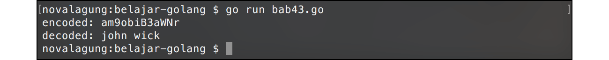

# A.46. Encode - Decode Base64

Go menyediakan package `encoding/base64`, berisikan fungsi-fungsi untuk kebutuhan **encode** dan **decode** data ke bentuk base64 dan sebaliknya. Data yang akan di-encode harus bertipe `[]byte`, maka perlu dilakukan casting untuk data-data yang tipenya belum `[]byte`.

Proses encoding dan decoding bisa dilakukan via beberapa cara yang pada chapter ini kita akan pelajari.

## A.46.1. Penerapan Fungsi `EncodeToString()` & `DecodeString()`

Fungsi `EncodeToString()` digunakan untuk encode data dari bentuk string ke base64. Fungsi `DecodeString()` melakukan kebalikan dari `EncodeToString()`. Berikut adalah contoh penerapannya.

```go
package main

import "encoding/base64"
import "fmt"

func main() {
    var data = "john wick"

    var encodedString = base64.StdEncoding.EncodeToString([]byte(data))
    fmt.Println("encoded:", encodedString)

    var decodedByte, _ = base64.StdEncoding.DecodeString(encodedString)
    var decodedString = string(decodedByte)
    fmt.Println("decoded:", decodedString)
}
```

Variabel `data` yang bertipe `string`, harus di-casting terlebih dahulu ke dalam bentuk `[]byte` sebelum di-encode menggunakan fungsi `base64.StdEncoding.EncodeToString()`. Hasil encode adalah data base64 bertipe `string`.

Sedangkan pada fungsi decode `base64.StdEncoding.DecodeString()`, data base64 bertipe `string` di-decode kembali ke string aslinya, tapi bertipe `[]byte`. Ekspresi `string(decodedByte)` menjadikan data `[]byte` tersebut berubah menjadi string.



## A.46.2. Penerapan Fungsi `Encode()` & `Decode()`

Kedua fungsi ini kegunaannya sama dengan fungsi yang sebelumnya kita bahas, salah satu pembedanya adalah data yang akan dikonversi dan hasilnya bertipe `[]byte`. Penggunaan cara ini cukup panjang karena variabel penyimpan hasil encode maupun decode harus disiapkan terlebih dahulu, dan harus memiliki lebar data sesuai dengan hasil yang akan ditampung (yang nilainya bisa dicari menggunakan fungsi `EncodedLen()` dan `DecodedLen()`).

Lebih jelasnya silakan perhatikan contoh berikut.

```go
var data = "john wick"

var encoded = make([]byte, base64.StdEncoding.EncodedLen(len(data)))
base64.StdEncoding.Encode(encoded, []byte(data))
var encodedString = string(encoded)
fmt.Println(encodedString)

var decoded = make([]byte, base64.StdEncoding.DecodedLen(len(encoded)))
var _, err = base64.StdEncoding.Decode(decoded, encoded)
if err != nil {
    fmt.Println(err.Error())
}
var decodedString = string(decoded)
fmt.Println(decodedString)
```

Fungsi `base64.StdEncoding.EncodedLen(len(data))` menghasilkan informasi lebar variable `data` ketika sudah di-encode. Nilai tersebut kemudian ditentukan sebagai lebar alokasi tipe `[]byte` pada variabel `encoded` yang nantinya digunakan untuk menampung hasil encoding.

Fungsi `base64.StdEncoding.DecodedLen()` memiliki kegunaan sama dengan `EncodedLen()`, hanya saja digunakan untuk keperluan decoding.

Dibanding 2 fungsi sebelumnya, fungsi `Encode()` dan `Decode()` ini memiliki beberapa perbedaan. Selain lebar data penampung encode/decode harus dicari terlebih dahulu, terdapat perbedaan lainnya, yaitu pada fungsi ini hasil encode/decode tidak didapat dari nilai kembalian, melainkan dari parameter. Variabel yang digunakan untuk menampung hasil, disisipkan pada parameter fungsi tersebut.

Pada pemanggilan fungsi encode/decode, variabel `encoded` dan `decoded` tidak disisipkan nilai pointer-nya, cukup di-pass dengan cara biasa, tipe datanya sudah dalam bentuk `[]byte`.

## A.46.3. Encode & Decode Data URL

Khusus encode data string yang isinya merupakan URL, lebih efektif menggunakan `URLEncoding` dibandingkan `StdEncoding`.

Cara penerapannya kurang lebih sama, bisa menggunakan metode pertama maupun metode kedua yang sudah dibahas di atas. Cukup ganti `StdEncoding` menjadi `URLEncoding`.

```go
var data = "https://kalipare.com/"

var encodedString = base64.URLEncoding.EncodeToString([]byte(data))
fmt.Println(encodedString)

var decodedByte, _ = base64.URLEncoding.DecodeString(encodedString)
var decodedString = string(decodedByte)
fmt.Println(decodedString)
```

---

<div class="source-code-link">
    <div class="source-code-link-message">Source code praktik chapter ini tersedia di Github</div>
    <a href="https://github.com/novalagung/dasarpemrogramangolang-example/tree/master/chapter-A.46-encode-decode-base64">https://github.com/novalagung/dasarpemrogramangolang-example/.../chapter-A.46...</a>
</div>

---

<iframe src="partial/ebooks.html" width="100%" height="390px" frameborder="0" scrolling="no"></iframe>
