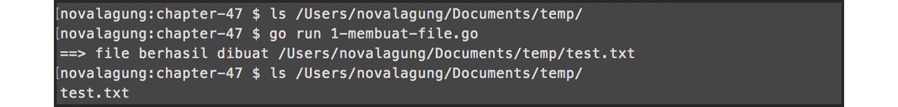
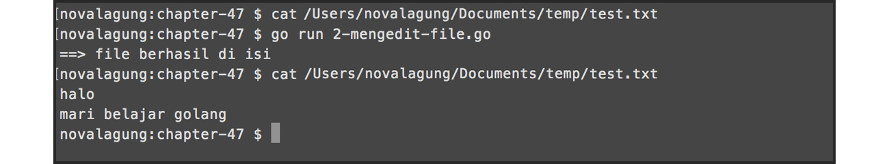
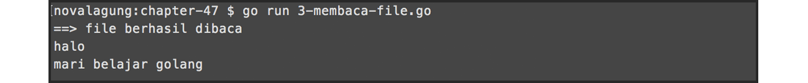
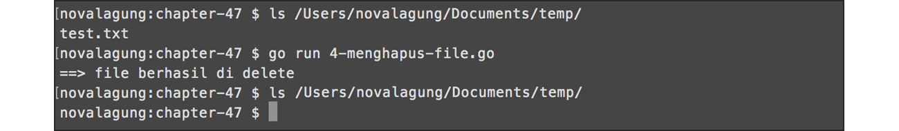

# A.50. File

Pada chapter ini kita akan belajar beberapa teknik operasi file yang paling dasar.

## A.50.1. Membuat File Baru

Pembuatan file di Go sangat mudah, dilakukan dengan memanfaatkan fungsi `os.Create()` disertai path file sebagai argument pemanggilan fungsi. Jika ternyata file yang akan dibuat sudah ada duluan, maka operasi `os.Create()` akan menimpa file yang sudah ada dengan file baru. Untuk menghindari penimpaan file, gunakan fungsi `os.IsNotExist()` untuk mendeteksi apakah file yang ingin dibuat sudah ada atau belum.

Contoh program operasi pembuatan file:

```go
package main

import "fmt"
import "os"

var path = "/Users/novalagung/Documents/temp/test.txt"

func isError(err error) bool {
	if err != nil {
		fmt.Println(err.Error())
	}

	return (err != nil)
}

func createFile() {
    // deteksi apakah file sudah ada
    var _, err = os.Stat(path)

    // buat file baru jika belum ada
	if os.IsNotExist(err) {
		var file, err = os.Create(path)
		if isError(err) { return }
		defer file.Close()
	}

    fmt.Println("==> file berhasil dibuat", path)
}

func main() {
    createFile()
}
```

Fungsi `os.Stat()` mengembalikan 2 data, yaitu informasi tetang path yang dicari, dan error (jika ada). Masukkan error kembalian fungsi tersebut sebagai argument pemanggilan fungsi `os.IsNotExist()`, untuk mengetahui apakah file yang akan dibuat sudah ada. Jika rupanya file belum ada ada, maka fungsi tersebut akan mengembalikan nilai `true`.

Fungsi `os.Create()` ini mengembalikan objek bertipe `*os.File`. File yang baru dibuat, statusnya adalah otomatis **open**. Setelah operasi file selesai, file harus di-**close** menggunakan method `file.Close()`.

Membiarkan file terbuka ketika sudah tak lagi digunakan adalah tidak baik, karena ada efek ke memory dan akses ke file itu sendiri, file menjadi terkunci/locked, membuatnya tidak bisa diakses oleh proses lain selama status file statusnya masih **open** dan belum di-close.



## A.50.2. Mengedit Isi File

Untuk mengedit file, yang pertama perlu dilakukan adalah membuka file dengan level akses **write**. Setelah mendapatkan objek file-nya, gunakan method `WriteString()` untuk penulisan data. Di akhir, panggil method `Sync()` untuk menyimpan perubahan.

```go
func writeFile() {
    // buka file dengan level akses READ & WRITE
    var file, err = os.OpenFile(path, os.O_RDWR, 0644)
	if isError(err) { return }
	defer file.Close()

    // tulis data ke file
    _, err = file.WriteString("halo\n")
	if isError(err) { return }
	_, err = file.WriteString("mari belajar golang\n")
	if isError(err) { return }

    // simpan perubahan
    err = file.Sync()
	if isError(err) { return }

	fmt.Println("==> file berhasil di isi")
}

func main() {
    writeFile()
}
```

Pada program di atas, file dibuka dengan level akses **read** dan **write** dengan kode permission **0664**. Setelah itu, beberapa string diisikan ke dalam file tersebut menggunakan `WriteString()`. Di akhir, semua perubahan terhadap file menjadi tersimpan dengan adanya pemanggilan method `Sync()`.



## A.50.3. Membaca Isi File

File yang ingin dibaca harus dibuka terlebih dahulu menggunakan fungsi `os.OpenFile()` dengan level akses minimal adalah **read**. Dari object file kembalian fungsi tersebut, gunakan method `Read()` dengan disertai argument berupa variabel yang akan menampung data hasil operasi baca.

```go
// tambahkan di bagian import package io
import "io"

func readFile() {
    // buka file
    var file, err = os.OpenFile(path, os.O_RDONLY, 0644)
	if isError(err) { return }
	defer file.Close()

    // baca file
    var text = make([]byte, 1024)
	for {
		n, err := file.Read(text)
		if err != io.EOF {
			if isError(err) { break }
		}
		if n == 0 {
			break
		}
	}
	if isError(err) { return }

	fmt.Println("==> file berhasil dibaca")
	fmt.Println(string(text))
}

func main() {
    readFile()
}
```

Fungsi `os.OpenFile()` dalam pemanggilannya memerlukan beberapa argument parameter untuk di-isi:

 1. Parameter pertama adalah path file yang akan dibuka.
 2. Parameter kedua adalah level akses. `os.O_RDONLY` maksudnya adalah **read only**.
 3. Parameter ketiga adalah permission file-nya.

Variabel `text` disiapkan bertipe slice `[]byte` dengan alokasi elemen `1024`. Variabel tersebut bertugas menampung data hasil statement `file.Read()`. Proses pembacaan file dilakukan terus menerus, berurutan dari baris pertama hingga akhir.

Error yang muncul ketika eksekusi `file.Read()` akan di-filter, ketika error adalah selain `io.EOF` maka proses baca file akan berlanjut. Error `io.EOF` sendiri menandakan bahwa file yang sedang dibaca adalah baris terakhir isi atau **end of file**.



## A.50.4. Menghapus File

Operasi menghapus file dilakukan via fungsi `os.Remove()`. Panggil fungsi tersebut, kemudian isi path dari file yang ingin dihapus sebagai argument fungsi.

```go
func deleteFile() {
    var err = os.Remove(path)
	if isError(err) { return }

	fmt.Println("==> file berhasil di delete")
}

func main() {
    deleteFile()
}
```



---

<div class="source-code-link">
    <div class="source-code-link-message">Source code praktik chapter ini tersedia di Github</div>
    <a href="https://github.com/novalagung/dasarpemrogramangolang-example/tree/master/chapter-A.50-file">https://github.com/novalagung/dasarpemrogramangolang-example/.../chapter-A.50...</a>
</div>

---

<iframe src="partial/ebooks.html" width="100%" height="390px" frameborder="0" scrolling="no"></iframe>
