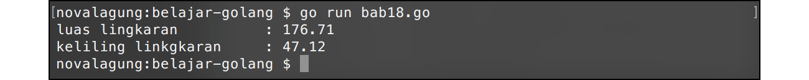

# A.19. Fungsi Multiple Return

Di Go, suatu fungsi bisa saja mengembalikan nilai belik lebih dari 1 buah. Teknik ini bisa menjadi alternatif selain menggunakan tipe data kolektif seperti `map`, slice, atau `struct` sebagai nilai balik. Pada chapter ini kita akan belajar penerapannya.

## A.19.1. Penerapan Fungsi Multiple Return

Cara membuat fungsi agar memiliki banyak nilai balik tidaklah sulit, caranya pada saat deklarasi fungsi, tulis semua tipe data nilai balik yang ingin dikembalikan. Kemudian dalam body fungsi, pada penggunaan keyword `return`, tulis semua data yang ingin dikembalikan. Contoh:

```go
package main

import "fmt"
import "math"

func calculate(d float64) (float64, float64) {
    // hitung luas
    var area = math.Pi * math.Pow(d / 2, 2)
    // hitung keliling
    var circumference = math.Pi * d

    // kembalikan 2 nilai
    return area, circumference
}
```

Fungsi `calculate()` di atas memiliki satu buah parameter yaitu `d` (diameter). Di dalam fungsi terdapat operasi perhitungan nilai **luas** dan **keliling** dari nilai `d`. Kedua hasilnya kemudian dijadikan sebagai return value.

Cara pendefinisian banyak nilai balik bisa dilihat pada kode di atas, langsung tulis tipe data semua nilai balik dipisah tanda koma, lalu ditambahkan kurung di antaranya.

```go
func calculate(d float64) (float64, float64)
```

Tak lupa di bagian penulisan keyword `return` harus dituliskan juga semua data yang dijadikan nilai balik (dengan pemisah tanda koma).

```go
return area, circumference
```

Sekarang, coba panggil fungsi `calculate()` yang sudah dibuat untuk mencari nilai luas dan keliling dari suatu diameter.

```go
func main() {
    var diameter float64 = 15
    var area, circumference = calculate(diameter)

    fmt.Printf("luas lingkaran\t\t: %.2f \n", area)
    fmt.Printf("keliling lingkaran\t: %.2f \n", circumference)
}
```

Output program:



Fungsi `calculate()` memiliki banyak nilai balik, maka dalam pemanggilannya harus disiapkan juga sejumlah variabel untuk menampung nilai balik fungsi (sesuai dengan jumlah nilai balik yang dideklarasikan).

```go
var area, circumference = calculate(diameter)
```

## A.19.2. Fungsi Dengan Predefined Return Value

Keunikan lainnya yang jarang ditemui di bahasa lain adalah, di Go variabel yang digunakan sebagai nilai balik bisa didefinisikan di awal.

```go
func calculate(d float64) (area float64, circumference float64) {
    area = math.Pi * math.Pow(d / 2, 2)
    circumference = math.Pi * d

    return
}
```

Fungsi `calculate` kita modifikasi menjadi lebih sederhana. Bisa dilihat di kode di atas, ada cukup banyak perbedaan dibanding fungsi `calculate` sebelumnya. Perhatikan kode berikut.

```go
func calculate(d float64) (area float64, circumference float64) {
```

Fungsi dideklarasikan memiliki 2 buah tipe data, dan variabel yang nantinya dijadikan nilai balik juga dideklarasikan. Variabel `area` yang bertipe `float64`, dan `circumference` bertipe `float64`.

Karena variabel nilai balik sudah ditentukan di awal, untuk mengembalikan nilai cukup dengan memanggil `return` tanpa perlu diikuti variabel apapun. Nilai terakhir `area` dan `circumference` sebelum pemanggilan keyword `return` adalah hasil dari fungsi di atas.

## A.19.3. Penjelasan tambahan

Ada beberapa hal baru dari kode di atas yang perlu dibahas, diantaranya `math.Pow()` dan `math.Pi`.

#### ◉ Penggunaan Fungsi `math.Pow()`

Fungsi `math.Pow()` digunakan untuk operasi pangkat nilai. `math.Pow(2, 3)` berarti 2 pangkat 3, hasilnya 8. Fungsi ini berada dalam package `math`.

#### ◉ Penggunaan Konstanta `math.Pi`

`math.Pi` adalah konstanta bawaan `package math` yang merepresentasikan **Pi** atau **22/7**.

---

<div class="source-code-link">
    <div class="source-code-link-message">Source code praktik chapter ini tersedia di Github</div>
    <a href="https://github.com/novalagung/dasarpemrogramangolang-example/tree/master/chapter-A.19-fungsi-multiple-return">https://github.com/novalagung/dasarpemrogramangolang-example/.../chapter-A.19...</a>
</div>

---

<iframe src="partial/ebooks.html" width="100%" height="390px" frameborder="0" scrolling="no"></iframe>
