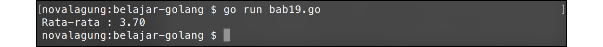
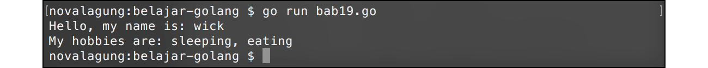

# A.20. Fungsi Variadic

Go mengadopsi konsep **variadic function** atau pembuatan fungsi dengan parameter bisa menampung nilai sejenis yang tidak terbatas jumlahnya.

Parameter variadic memiliki sifat yang mirip dengan slice, yaitu nilai dari parameter-parameter yang disisipkan bertipe data sama, dan kesemuanya cukup ditampung oleh satu variabel saja. Cara pengaksesan tiap nilai juga mirip, yaitu dengan menggunakan index.

Pada chapter ini kita akan belajar mengenai cara penerapan fungsi variadic.

## A.20.1. Penerapan Fungsi Variadic

Deklarasi parameter variadic sama dengan cara deklarasi variabel biasa, pembedanya adalah pada parameter jenis ini ditambahkan tanda titik tiga kali (`...`) tepat setelah penulisan variabel, sebelum tipe data. Nantinya semua nilai yang disisipkan sebagai parameter akan ditampung oleh variabel tersebut.

Contoh program:

```go
package main

import "fmt"

func main() {
    var avg = calculate(2, 4, 3, 5, 4, 3, 3, 5, 5, 3)
    var msg = fmt.Sprintf("Rata-rata : %.2f", avg)
    fmt.Println(msg)
}

func calculate(numbers ...int) float64 {
    var total int = 0
    for _, number := range numbers {
        total += number
    }

    var avg = float64(total) / float64(len(numbers))
    return avg
}
```

Output program:



Bisa dilihat pada fungsi `calculate()`, parameter `numbers` dideklarasikan dengan disisipkan tanda 3 titik (`...`), menandakan bahwa `numbers` adalah sebuah parameter variadic dengan tipe data `int`.

```go
func calculate(numbers ...int) float64 {
```

Pemanggilan fungsi dilakukan seperti biasa, hanya saja jumlah parameter yang disisipkan bisa banyak.

```go
var avg = calculate(2, 4, 3, 5, 4, 3, 3, 5, 5, 3)
```

Nilai tiap parameter bisa diakses seperti cara pengaksesan tiap elemen slice. Pada contoh di atas metode yang dipilih adalah `for` - `range`.

```go
for _, number := range numbers {
```

## A.20.2. Penjelasan tambahan

Berikut merupakan penjelasan tambahan untuk beberapa hal dari kode yang sudah dipraktekan:

#### ◉ Penggunaan Fungsi `fmt.Sprintf()`

Fungsi `fmt.Sprintf()` pada dasarnya sama dengan `fmt.Printf()`, hanya saja fungsi ini tidak menampilkan nilai, melainkan mengembalikan nilainya dalam bentuk string. Pada case di atas, nilai kembalian `fmt.Sprintf()` ditampung oleh variabel `msg`.

Selain `fmt.Sprintf()`, ada juga `fmt.Sprint()` dan `fmt.Sprintln()`.

#### ◉ Penggunaan Fungsi `float64()`

Sebelumnya sudah dibahas bahwa `float64` merupakan tipe data. Tipe data jika ditulis sebagai fungsi (penandanya ada tanda kurungnya) menandakan bahwa digunakan untuk keperluan **casting**. Casting sendiri adalah teknik untuk konversi tipe sebuah data ke tipe lain. Sebagian besar tipe data dasar yang telah dipelajari pada chapter [A.9. Variabel](/A-variabel.html) bisa di-casting.

Cara penerapan casting: panggil saja tipe data yang diingunkan seperti pemanggilan fungsi, lalu masukan data yang ingin dikonversi sebagai argument pemanggilan fungsi tersebut.

Pada contoh di atas, variabel `total` yang tipenya adalah `int`, dikonversi menjadi `float64`, begitu juga `len(numbers)` yang menghasilkan `int` dikonversi ke `float64`.

Variabel `avg` perlu dijadikan `float64` karena penghitungan rata-rata lebih sering menghasilkan nilai desimal.

Operasi bilangan (perkalian, pembagian, dan lainnya) di Go hanya bisa dilakukan jika tipe datanya sejenis. Maka dari itulah perlu adanya casting ke tipe `float64` pada tiap operand.

## A.20.3. Pengisian Parameter Fungsi Variadic Menggunakan Data Slice

Slice bisa digunakan sebagai argument pada fungsi variadic. Caranya penerapannya: tulis saja nama variabel tapi disertai dengan tanda titik tiga kali, dituliskan tepat setelah nama variabel yang dijadikan parameter. Contohnya bisa dilihat pada kode berikut:

```go
var numbers = []int{2, 4, 3, 5, 4, 3, 3, 5, 5, 3}
var avg = calculate(numbers...)
var msg = fmt.Sprintf("Rata-rata : %.2f", avg)

fmt.Println(msg)
```

Pada kode di atas, variabel `numbers` bertipe data slice int, disisipkan pada pemanggilan fungsi `calculate()` sebagai argument parameter fungsi variadic (bisa dilihat tanda 3 titik setelah penulisan variabel). Teknik ini sangat berguna pada case dimana sebuah data slice perlu untuk digunakan sebagai argument parameter variadic.

Agar lebih jelas, perhatikan 2 kode berikut. Intinya sama, hanya cara penulisannya yang berbeda.

```go
var numbers = []int{2, 4, 3, 5, 4, 3, 3, 5, 5, 3}
var avg = calculate(numbers...)

// atau

var avg = calculate(2, 4, 3, 5, 4, 3, 3, 5, 5, 3)
```

Pada deklarasi parameter fungsi variadic, tanda 3 titik (`...`) dituliskan sebelum tipe data parameter. Sedangkan pada pemanggilan fungsi dengan menyisipkan parameter array, tanda tersebut dituliskan di belakang variabelnya.

## A.20.4. Fungsi Dengan Parameter Biasa & Variadic

Parameter variadic bisa dikombinasikan dengan parameter biasa, dengan syarat parameter variadic-nya harus diposisikan di akhir. Contohnya bisa dilihat pada kode berikut.

```go
import "fmt"
import "strings"

func yourHobbies(name string, hobbies ...string) {
    var hobbiesAsString = strings.Join(hobbies, ", ")

    fmt.Printf("Hello, my name is: %s\n", name)
    fmt.Printf("My hobbies are: %s\n", hobbiesAsString)
}
```

Nilai parameter pertama fungsi `yourHobbies()` akan ditampung oleh `name`, sedangkan nilai parameter kedua dan seterusnya akan ditampung oleh `hobbies` sebagai slice.

Cara pemanggilannya masih sama seperi pada fungsi biasa, contoh:

```go
func main() {
    yourHobbies("wick", "sleeping", "eating")
}
```

Jika parameter kedua dan seterusnya ingin diisi dengan data dari slice, maka gunakan tanda titik tiga kali seperti ini:

```go
func main() {
    var hobbies = []string{"sleeping", "eating"}
    yourHobbies("wick", hobbies...)
}
```

Output program:



---

<div class="source-code-link">
    <div class="source-code-link-message">Source code praktik chapter ini tersedia di Github</div>
    <a href="https://github.com/novalagung/dasarpemrogramangolang-example/tree/master/chapter-A.20-fungsi-variadic">https://github.com/novalagung/dasarpemrogramangolang-example/.../chapter-A.20...</a>
</div>

---

<iframe src="partial/ebooks.html" width="100%" height="390px" frameborder="0" scrolling="no"></iframe>
