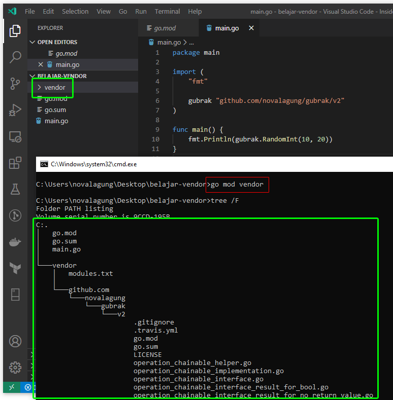

# A.61. Go Vendoring

Pada bagian ini kita akan belajar cara pemanfaatan vendoring untuk menyimpan copy dependency di lokal dalam folder project.

## A.61.1. Penjelasan

Vendoring di Go memberikan kita kapabilitas untuk mengunduh semua dependency atau *3rd party*, untuk disimpan di lokal dalam folder project, dalam subfolder bernama `vendor`.

Dengan adanya folder tersebut, maka Go tidak akan *lookup* 3rd party ke cache folder ataupun ke GOPATH, melainkan langsung mengambil dari yang ada dalam folder `vendor`. Jadi kalau dependency sudah ada di dalam `vendor`, maka kita tidak perlu download lagi dari internet menggunakan command `go mod download` ataupun `go mod tidy`.

Ok lanjut ke praktik ya.

## A.61.2. Praktik Vendoring

Kita akan coba praktikkan untuk vendoring sebuah 3rd party bernama [gubrak](https://github.com/novalagung/gubrak/v2).

Buat folder project baru dengan nama `belajar-vendor` dengan isi satu file `main.go`. Lalu go get library gubrak.

```bash
mkdir belajar-vendor
cd belajar-vendor
go mod init belajar-vendor
go get -u github.com/novalagung/gubrak/v2
```

Isi `main.go` dengan blok kode berikut, untuk menampilkan angka random dengan range 10-20.

```go
package main

import (
	"fmt"

	gubrak "github.com/novalagung/gubrak/v2"
)

func main() {
	fmt.Println(gubrak.RandomInt(10, 20))
}
```

Setelah itu jalankan command `go mod vendor` untuk vendoring *3rd party library* yang dipergunakan, dalam contoh ini adalah gubrak.



Bisa dilihat, sekarang library gubrak *source code*-nya disimpan dalam folder `vendor`. Nah ini juga akan berlaku untuk semua *library* lainnya yg digunakan jika ada.

## A.61.3. Build dan Run Project yang Menerapkan Vendoring

Cara agar Go lookup ke folder `vendor` saat build adalah dengan menambahkan flag `-mod=vendor` sewaktu build atau run project.

```
go run -mod=vendor main.go
go build -mod=vendor -o executable
```

## A.61.4. Manfaat Vendoring

Manfaat vendoring adalah pada sisi kompatibilitas & kestabilan 3rd party, selain itu kita tidak perlu repot mendownload dependency karena semuanya sudah ada di lokal.

Konsekuensi penerapan vendoring adalah size project menjadi cukup besar. Untuk penggunaan vendor apakah wajib? menurut saya tidak. Sesuaikan kebutuhan saja.

## A.61.5. Flag -mod=vendor Otomatis (Go 1.14+)

Sejak Go 1.14, jika project memiliki folder `vendor` dan file `go.mod` mencantumkan versi `go 1.14` atau lebih tinggi, maka flag `-mod=vendor` **sudah aktif secara otomatis**. Kita tidak perlu menambahkannya secara eksplisit saat menjalankan `go run` atau `go build`.

```bash
# Go 1.14+: flag -mod=vendor tidak perlu ditulis, sudah otomatis aktif
go run main.go
go build -o executable
```

Jika ingin mengabaikan folder `vendor` dan menggunakan module cache, gunakan flag `-mod=mod` secara eksplisit:

```bash
go run -mod=mod main.go
```

---

<div class="source-code-link">
    <div class="source-code-link-message">Source code praktik chapter ini tersedia di Github</div>
    <a href="https://github.com/novalagung/dasarpemrogramangolang-example/tree/master/chapter-A.61-go-vendoring">https://github.com/novalagung/dasarpemrogramangolang-example/.../chapter-A.61...</a>
</div>

---

<iframe src="partial/ebooks.html" width="100%" height="390px" frameborder="0" scrolling="no"></iframe>
