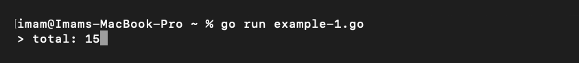
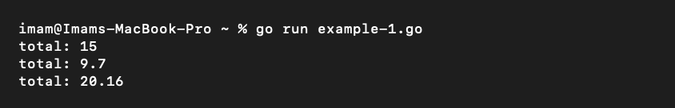
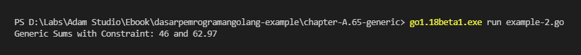

# A.65. Go Generics

Pada chapter ini kita akan belajar tentang penerapan Generics di Go.

## A.65.1. Konsep Generic Programming

Generic Programming adalah salah satu metode dalam penulisan kode program, di mana tipe data dalam kode didefinisikan menggunakan suatu tipe yang tipe pastinya ditulis belakangan saat kode tersebut di-call atau dieksekusi. Konsep generic ini cukup umum diterapkan terutama pada bahasa pemrograman yang mengadopsi static typing.

Di Go, kita punya tipe `any` atau `interface{}` yang biasa difungsikan sebagai penampung data yang tidak pasti tipe datanya. Generic berbeda dibanding `any`. Tipe `any` dalam prakteknya membungkus data asli atau *underlying value*-nya, dengan pengaksesan data asli tersebut dilakukan via metode *type assertion*, contohnya `data.(int)`.

Berbeda dibanding `any`, pada Generic kita perlu mendefinisikan cakupan tipe data yang kompatibel untuk digunakan saat pemanggilan kode.

Ok, mari kita lanjut ke praktek saja agar tidak makin bingung.

## A.65.2. Penerapan Generic pada Fungsi

Mari kita mulai pembelajaran dengan kode sederhana berikut:

```go
package main

import "fmt"

func Sum(numbers []int) int {
	var total int
	for _, e := range numbers {
		total += e
	}
	return total
}

func main() {
	total1 := Sum([]int{1, 2, 3, 4, 5})
	fmt.Println("total:", total1)
}
```

Pada kode di atas, didefinisikan sebuah fungsi `Sum()` yang tugasnya menghitung total atau *summary* dari data slice numerik yang disisipkan di parameter. Dalam `main()`, kita panggil fungsi tersebut untuk menghitung total dari sejumlah data dengan tipe `[]int`. Saya rasa sampai sini cukup jelas.

Fungsi `Sum()` memiliki satu limitasinya, yaitu hanya bisa digunakan pada data yang tipenya `[]int`, tidak bisa untuk tipe slice numerik lain. Bagaimana jika menggunakan tipe `interface{}`? apakah bisa? bisa saja sebenarnya, tapi pastinya lebih report karena sulit untuk menerapkan *type assertion* kalau tidak tau pasti cakupan tipe yang di-support oleh parameter `numbers` itu apa saja.

> Alternatifnya, penggunaan `interface{}` bisa dibarengi dengan penerapan [reflection API](/A-reflect.html).

Nah, agar tidak repot, di sini kita akan terapkan Generic. Kode akan dimodifikasi atas agar bisa menampung tipe data slice numerik lainnya diluar tipe `[]int`.

Ok, sekarang ubah kode fungsi `Sum` menjadi seperti di bawah ini:

```go
func Sum[V int](numbers []V) V {
	var total V
	for _, e := range numbers {
		total += e
	}
	return total
}
```

Notasi penulisan di atas mungkin akan cukup asing teruntuk pembaca yang belum pernah menggunakan Generic pada bahasa selain Go. Tidak apa, di sini kita belajar dari awal :-)

Penulisan notasi fungsi dengan Generic kurang lebih sebagai berikut:

```go
func FuncName[dataType <ComparableType>](params)
```

Pada kode di atas, tipe data `[]int` kita ganti menjadi tipe data `[]V`, yang di mana tipe `V` dideklarasikan dengan notasi `[V int]`. Tipe data `V` di situ artinya kompatibel atau *comparable* dengan tipe `int`. Bisa diambil kesimpulan kedua fungsi yang telah kita tulis adalah ekuivalen.

```go
func Sum(numbers []int) int {
	var total int
    // ...
}

func Sum[V int](numbers []V) V {
	var total V
    // ...
}
```

Ok, sekarang kita sudah mengubah penulisan kode fungsi `Sum` menggunakan Generic, tanpa merubah kegunaan fungsi. Coba jalankan aplikasi untuk mengetes hasilnya.


```go
func Sum[V int](numbers []V) V {
	var total V
	for _, e := range numbers {
		total += e
	}
	return total
}

func main() {
	total1 := Sum([]int{1, 2, 3, 4, 5})
	fmt.Println("total: ", total1)
}
```

Output program:



## A.65.3. Comparable Data Type pada Fungsi Generic

Selanjutnya, modifikasi lagi fungsi `Sum` agar tipe kompatibel `V` di sini bisa kompatibel dengan tipe numerik lainnya seperti `float64`. Caranya sangat mudah, cukup tambahkan tipe data yang diinginkan untuk kompatibel pada statement `V int` menggunakan delimiter pipe (`|`).

```go
func Sum[V int | float32 | float64](numbers []V) V {
	var total V
	for _, e := range numbers {
		total += e
	}
	return total
}
```

Notasi `V int | float32 | float64` artinya tipe `V` adalah kompatibel dengan `int`, `float32`, dan `float64`.

Sekarang coba panggil fungsi tersebut 3 kali dengan 3 parameter berbeda.

```go
total1 := Sum([]int{1, 2, 3, 4, 5})
fmt.Println("total:", total1)

total2 := Sum([]float32{2.5, 7.2})
fmt.Println("total:", total2)

total3 := Sum([]float64{1.23, 6.33, 12.6})
fmt.Println("total:", total3)
```



Jos gandos, hasilnya sesuai harapan. Sampai sini kita sudah paham bagaimana cara pendefinisian tipe kompatibel pada fungsi dan cara pemanfaatannya.

## A.65.4. Tipe Argumen Saat Pemanggilan Fungsi Generic

Ada 2 cara pemanggilan fungsi generic, yang pertama seperti contoh di atas.

```go
Sum([]int{1, 2, 3, 4, 5})
Sum([]float32{2.5, 7.2})
Sum([]float64{1.23, 6.33, 12.6})
```

Atau bisa juga dengan menuliskan secara eksplisit tipe data kompatibelnya. Seperti contoh berikut:

```go
Sum[int]([]int{1, 2, 3, 4, 5})
Sum[float32]([]float32{2.5, 7.2})
Sum[float64]([]float64{1.23, 6.33, 12.6})
```

Di case ini (dan banyak case lainnya), tipe data yang sudah kompatibel tidak perlu dituliskan secara eksplisit karena kompiler secara cerdas bisa mendeteksi tipe yang kompatibel berdasarkan tipe data parameter saat pemanggilan fungsi.

## A.65.5. Keyword `comparable`

Sekarang kita akan belajar kegunaan satu keyword penting lainnya, yaitu `comparable`. Keyword ini merepresentasikan semua tipe data yang kompatibel.

Pada kode di atas kita menggunakan `V int | float32 | float64` untuk mendefinisikan tipe yang kompatibel dengan tipe `int`, `float32`, dan `float64`. Jika ingin membuat tipe `V` kompatibel dengan banyak tipe lainnya, tambahkan saja tipe2 yang diinginkan. Atau, jika ingin kompatibel dengan **semua tipe data** maka gunakan `comparable`, penulisannya menjadi `V comparable`.

Ok, mari kita coba terapkan. Kita tidak akan menerapkan `comparable` pada contoh di atas karena fungsi `Sum()` kita desain untuk komputasi nilai numerik. Jika `comparable` diterapkan disitu jadinya kurang pas. Oleh karena itu kita siapkan 2 fungsi baru yang mirip berikut sebagai bahan praktek selanjutnya.

```go
func SumNumbers1(m map[string]int64) int64 {
    var s int64
    for _, v := range m {
        s += v
    }
    return s
}

func SumNumbers2[K comparable, V int64 | float64](m map[K]V) V {
    var s V
    for _, v := range m {
        s += v
    }
    return s
}

func main() {
    ints := map[string]int64{ "first": 34, "second": 12 }
    floats := map[string]float64{ "first": 35.98, "second": 26.99 }

    fmt.Printf("Generic Sums with Constraint: %v and %v\n",
        SumNumbers2(ints),
        SumNumbers2(floats))
}
```

Dua fungsi di atas mirip, tapi memiliki beberapa perbedaan yaitu:

1. Penulisan `SumNumbers1()` adalah non-generic, sedangkan `SumNumbers2()` adalah generic.
2. Pada `SumNumbers1()`, kita menggunakan kombinasi dua tipe data untuk membentuk `map`, yaitu `string` sebagai map key dan `int64` sebagai map value.
3. Pada `SumNumbers2()`, kita breakdown pendefinisian tipe data map menjadi lebih mendetail:
    - Tipe map key adalah `K` yang tipe datanya kompatibel dengan semua tipe data.
    - Tipe map value adalah `V` yang tipe datanya kompatibel dengan `int64` dan `float64`.
    - Yang sebelumnya `map[string]int64` kini menjadi `map[K]V`.

Karena `SumNumbers2()` menggunakan generic, maka fungsi ini mendukung sangat banyak tipe data karena menggunakan kombinasi dari tipe `K` yang kompatibel dengan semua tipe; dan tipe `V` yang kompatibel dengan `int64` dan `float64`.

- `map[string]int64`
- `map[interface{}]int64`
- `map[string]float64`
- `map[bool]float64`
- ... dan banyak tipe lainnya

Jalankan kode, lihat hasilnya.



## A.65.6. Generic *Type Constraint*

Selanjutnya buat fungsi `SumNumbers3()` yang isinya kurang adalah lebih sama. Kali ini kita tidak menggunakan `V int64 | float64`, melainkan menggunakan tipe `Number` yang merupakan tipe data baru yang akan kita buat juga (generic *type constraint*).

```go
type Number interface {
    int64 | float64
}

func SumNumbers3[K comparable, V Number](m map[K]V) V {
    var s V
    for _, v := range m {
        s += v
    }
    return s
}
```

Cara pendefinisian generic *type constraint* adalah seperti pendefinisan tipe data kustom menggunakan keyword `type`, bedanya adalah di sini `interface{}` dipergunakan sebagai tipe, yang di dalamnya di-embed 2 tipe yang diinginkan untuk menjadi *comparable type*, yaitu `int64` dan `float64`. Hasilnya, tipe `Number` bisa dimanfaatkan dalam penerapan generic sebagai tipe data yang kompatibel.

> Perlu diketahui, tipe yang didefinisikan menggunakan *type constraint* ini hanya bisa dimanfaatkan pada generic. Tipe jenis ini tidak bisa digunakan di luar scope kode generic. Sebagai contoh, coba deklarasikan `var s Number` dalam fungsi `main()`, hasilnya akan muncul syntax error.

Ok, sekarang ubah pemanggilan fungsi `SumNumbers2()` pada main menjadi `SumNumbers3()` lalu coba jalankan dan lihat hasilnya, pasti outputnya sama, menandakan bahwa kode program berjalan sesuai desain.

## A.65.7. Struct Generic

Generic juga bisa diterapkan pada struct, contohnya:

```go
type UserModel[T int | float64] struct {
	Name string
    Scores []T
}

func (m *UserModel[int]) SetScoresA(scores []int) {
	m.Scores = scores
}

func (m *UserModel[float64]) SetScoresB(scores []float64) {
	m.Scores = scores
}

func main() {
	var m1 UserModel[int]
	m1.Name = "Noval"
	m1.Scores = []int{1, 2, 3}
    fmt.Println("scores:", m1.Scores)

	var m2 UserModel[float64] 
	m2.Name = "Noval"
	m2.SetScoresB([]float64{10, 11})
    fmt.Println("scores:", m2.Scores)
}
```

Cukup tuliskan notasi generic pada deklarasi struct. Kemudian siapkan variabel object, tulis secara eksplisit tipe data untuk variabel kompatibel.


## A.65.8. Method Generic

Sampai artikel ini ditulis, generic tidak bisa diterapkan pada method (meski bisa diterapkan pada fungsi)

> Penulis akan update konten chapter ini jika ada update pada spesifikasi generic API.

---

<div class="source-code-link">
    <div class="source-code-link-message">Source code praktek chapter ini tersedia di Github</div>
    <a href="https://github.com/novalagung/dasarpemrogramangolang-example/tree/master/chapter-A.65-generic">https://github.com/novalagung/dasarpemrogramangolang-example/.../chapter-A.65...</a>
</div>

---

<iframe src="partial/ebooks.html" width="100%" height="390px" frameborder="0" scrolling="no"></iframe>
