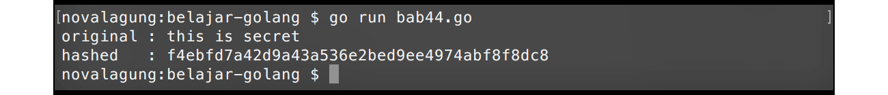
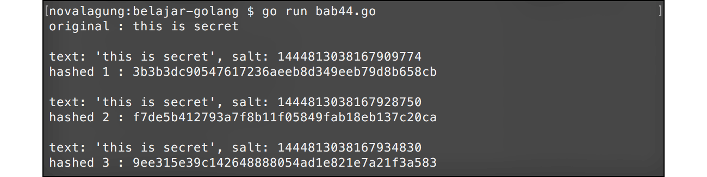

# A.47. Hash SHA1

Hash adalah algoritma satu arah untuk mengubah text menjadi deretan karakter acak dengan panjang tertentu. Hash bukan enkripsi, karena hasil hash tidak bisa di-decrypt untuk dikembalikan ke text asli.

SHA1 atau **Secure Hash Algorithm 1** merupakan salah satu algoritma hashing. Hasil dari sha1 adalah data dengan lebar **20 byte** atau **160 bit**, biasa ditampilkan dalam bentuk bilangan heksadesimal 40 digit.

> SHA1 tidak direkomendasikan untuk kebutuhan keamanan modern seperti penyimpanan password atau tanda tangan digital. Untuk password gunakan algoritma khusus password hashing seperti bcrypt, scrypt, Argon2id, atau PBKDF2.

Pada chapter ini kita akan belajar tentang pemanfaatan sha1 dan teknik salting dalam hash.

## A.47.1. Penerapan Hash SHA1

Go menyediakan package `crypto/sha1`, berisikan library untuk keperluan *hashing*. Cara penerapannya cukup mudah, contohnya bisa dilihat pada kode berikut.

```go
package main

import "crypto/sha1"
import "fmt"

func main() {
    var text = "this is secret"
    var sha = sha1.New()
    sha.Write([]byte(text))
    var encrypted = sha.Sum(nil)
    var encryptedString = fmt.Sprintf("%x", encrypted)

    fmt.Println(encryptedString)
    // f4ebfd7a42d9a43a536e2bed9ee4974abf8f8dc8
}
```

Variabel hasil dari `sha1.New()` adalah objek bertipe `hash.Hash`, memiliki dua buah method `Write()` dan `Sum()`.

 - Method `Write()` digunakan untuk menge-set data yang akan di-hash. Data harus dalam bentuk `[]byte`.
 - Method `Sum()` digunakan untuk eksekusi proses hash, menghasilkan data yang sudah di-hash dalam bentuk `[]byte`. Method ini membutuhkan sebuah parameter, isi dengan nil.

Untuk mengambil bentuk heksadesimal string dari data yang sudah di-hash, bisa memanfaatkan fungsi `fmt.Sprintf` dengan layout format `%x`.



## A.47.2. Metode Salting Pada Hash SHA1

Salt dalam konteks kriptografi adalah data acak yang digabungkan pada data asli sebelum proses hash dilakukan.

Hash menghasilkan data dengan lebar yang sudah pasti, sangat mungkin sekali kalau hasil hash untuk beberapa data adalah sama. Di sinilah kegunaan **salt**, teknik ini berguna untuk mengurangi efektivitas serangan menggunakan tabel hash siap pakai atau pencocokan kata umum *(dictionary attack)*.

Langsung saja kita praktekkan. Pertama import package yang dibutuhkan. Lalu buat fungsi untuk hash menggunakan salt dari waktu sekarang.

> Contoh ini hanya untuk memahami konsep salt. Untuk kebutuhan password production, jangan gunakan SHA1 dan jangan gunakan timestamp sebagai salt. Gunakan salt acak dari `crypto/rand` dan algoritma password hashing.

```go
package main

import "crypto/sha1"
import "fmt"
import "time"

func doHashUsingSalt(text string) (string, string) {
    var salt = fmt.Sprintf("%d", time.Now().UnixNano())
    var saltedText = fmt.Sprintf("text: '%s', salt: %s", text, salt)
    var sha = sha1.New()
    sha.Write([]byte(saltedText))
    var encrypted = sha.Sum(nil)

    return fmt.Sprintf("%x", encrypted), salt
}
```

Salt yang digunakan adalah hasil dari ekspresi `time.Now().UnixNano()`. Angkanya berubah sangat cepat karena resolusi waktunya sampai *nanosecond*, sehingga cocok untuk contoh sederhana, tetapi tetap bukan sumber salt yang ideal untuk production.

Selanjutnya test fungsi yang telah dibuat beberapa kali.

```go
func main() {
    var text = "this is secret"
    fmt.Printf("original : %s\n\n", text)

    var hashed1, salt1 = doHashUsingSalt(text)
    fmt.Printf("hashed 1 : %s\n\n", hashed1)
    // 929fd8b1e58afca1ebbe30beac3b84e63882ee1a

    var hashed2, salt2 = doHashUsingSalt(text)
    fmt.Printf("hashed 2 : %s\n\n", hashed2)
    // cda603d95286f0aece4b3e1749abe7128a4eed78

    var hashed3, salt3 = doHashUsingSalt(text)
    fmt.Printf("hashed 3 : %s\n\n", hashed3)
    // 9e2b514bca911cb76f7630da50a99d4f4bb200b4

    _, _, _ = salt1, salt2, salt3
}
```

Hasil hash fungsi `doHashUsingSalt()` akan selalu beda, karena salt yang digunakan adalah waktu.



Konsep salt sering dipakai pada penyimpanan password user. Salt dan data hasil hash harus disimpan pada database, karena digunakan dalam pencocokan password setiap user melakukan login. Namun untuk implementasi nyata, gunakan algoritma password hashing seperti bcrypt, scrypt, Argon2id, atau PBKDF2.

---

<div class="source-code-link">
    <div class="source-code-link-message">Source code praktik chapter ini tersedia di Github</div>
    <a href="https://github.com/novalagung/dasarpemrogramangolang-example/tree/master/chapter-A.47-hash-sha1">https://github.com/novalagung/dasarpemrogramangolang-example/.../chapter-A.47...</a>
</div>

---

<iframe src="partial/ebooks.html" width="100%" height="390px" frameborder="0" scrolling="no"></iframe>
