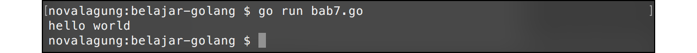

# A.8. Komentar

Komentar biasa dimanfaatkan untuk menyisipkan catatan pada kode program, menulis penjelasan/deskripsi mengenai suatu blok kode, atau bisa juga digunakan untuk me-*remark* kode (men-non-aktifkan kode yg tidak digunakan). Komentar akan diabaikan ketika kompilasi maupun eksekusi program.

Ada 2 jenis komentar di Go, *inline* & *multiline*. Pada pembahasan ini akan dijelaskan tentang penerapan dan perbedaan kedua jenis komentar tersebut.

## A.8.1. Komentar *Inline*

Penulisan komentar jenis ini di awali dengan tanda **double slash** (`//`) lalu diikuti pesan komentarnya. Komentar inline hanya berlaku untuk satu baris pesan saja. Jika pesan komentar lebih dari satu baris, maka tanda `//` harus ditulis lagi di baris selanjutnya.

```go
package main

import "fmt"

func main() {
    // komentar kode
    // menampilkan pesan hello world
    fmt.Println("hello world")

    // fmt.Println("baris ini tidak akan dieksekusi")
}
```

Mari kita praktekan kode di atas. Siapkan file program baru dalam project folder (bisa buat project baru atau gunakan project yang sudah ada). Kemudian isi dengan kode di atas, lalu jalankan.



Hasilnya hanya tulisan **hello world** saja yang muncul di layar, karena semua yang di awali tanda double slash `//` diabaikan oleh compiler.

## A.8.2. Komentar *Multiline*

Komentar yang cukup panjang akan lebih rapi jika ditulis menggunakan teknik komentar multiline. Ciri dari komentar jenis ini adalah penulisannya diawali dengan tanda `/*` dan diakhiri `*/`.

```go
/*
    komentar kode
    menampilkan pesan hello world
*/
fmt.Println("hello world")

// fmt.Println("baris ini tidak akan dieksekusi")
```

Sifat komentar ini sama seperti komentar inline, yaitu sama-sama diabaikan oleh compiler.

---

<div class="source-code-link">
    <div class="source-code-link-message">Source code praktek chapter ini tersedia di Github</div>
    <a href="https://github.com/novalagung/dasarpemrogramangolang-example/tree/master/chapter-A.8-komentar">https://github.com/novalagung/dasarpemrogramangolang-example/.../chapter-A.8...</a>
</div>

---

<iframe src="partial/ebooks.html" width="100%" height="430px" frameborder="0" scrolling="no"></iframe>
