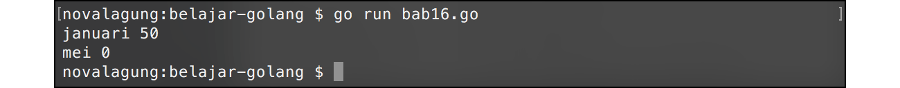
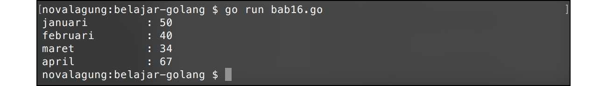
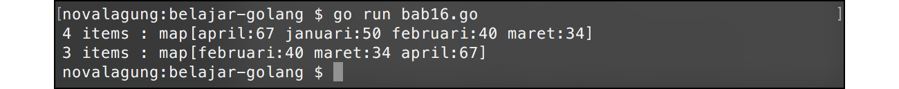

# A.17. Map

**Map** adalah tipe data asosiatif yang ada di Go yang berbentuk *key-value pair*. Data/value yang disimpan di map selalu disertai dengan key. Key sendiri harus unik, karena digunakan sebagai penanda (atau identifier) untuk pengaksesan value yang disimpan di map.

Kalau dilihat, `map` mirip seperti slice, hanya saja identifier yang digunakan untuk pengaksesan bukanlah index numerik, melainkan bisa dalam tipe data apapun sesuai dengan yang diinginkan.

## A.17.1. Penggunaan Map

Cara pengaplikasian map cukup mudah, dengan menuliskan *keyword* `map` diikuti tipe data key dan value-nya. Silakan perhatikan contoh di bawah ini agar lebih jelas.

```go
var chicken map[string]int
chicken = map[string]int{}

chicken["januari"] = 50
chicken["februari"] = 40

fmt.Println("januari", chicken["januari"]) // januari 50
fmt.Println("mei", chicken["mei"])         // mei 0
```

Variabel `chicken` dideklarasikan bertipe data map, dengan key ditentukan tipenya adalah `string` dan tipe value-nya `int`. Dari kode tersebut bisa dilihat bagaimana cara penerapan *keyword* `map` untuk pembuatan variabel.

Kode `map[string]int` merepresentasikan tipe data `map` dengan key bertipe `string` dan value bertipe `int`.

Zero value atau nilai default variabel `map` adalah `nil`. Dari sini maka penting untuk menginisialisasi nilai awal map agar tidak `nil`. Jika dibiarkan `nil`, ketika map digunakan untuk menampung data pasti memunculkan error.

Cara untuk inisialisasi map dengan menambahkan kurung kurawal buka tutup di akhir penulisan map, contoh: `map[string]int{}`.

Cara menambahkan item pada map adalah dengan menuliskan variabel-nya, kemudian diikuti dengan `key` pada kurung siku variabel (mirip seperti cara pengaksesan elemen slice), lalu operator `=`, kemudian nilai/data yang ingin disimpan. Contohnya seperti `chicken["februari"] = 40`. Sedangkan cara mengakses item map dengan cukup dengan menuliskan nama variabel diikuti kurung siku dan `key`.

Pengisian data pada map bersifat **overwrite**, artinya jika variabel sudah memiliki item dengan key yang sama, maka value item yang lama (dengan key sama) akan ditimpa dengan value baru.



Pengaksesan item menggunakan key yang belum tersimpan di map, menghasilkan data berupa nilai default sesuai tipe data value. Contohnya kode `chicken["mei"]` menghasilkan nilai 0 (nilai default tipe `int`), hal ini karena variabel map `chicken` tidak memiliki item dengan key `"mei"`.

## A.17.2. Inisialisasi Nilai Map

Zero value dari map adalah `nil`. Disarankan untuk menginisialisasi secara eksplisit nilai awalnya agar tidak `nil`.

```go
var data map[string]int
data["one"] = 1
// akan muncul error!

data = map[string]int{}
data["one"] = 1
// tidak ada error
```

Nilai variabel bertipe map bisa didefinisikan di awal, caranya dengan menambahkan kurung kurawal setelah tipe data, kemudian menuliskan key dan value di dalam kurung kurawal tersebut. Cara ini sekilas mirip dengan definisi nilai array/slice namun dalam bentuk key-value.

```go
// cara horizontal
var chicken1 = map[string]int{"januari": 50, "februari": 40}

// cara vertical
var chicken2 = map[string]int{
    "januari":  50,
    "februari": 40,
}
```

Key dan value dituliskan dengan pembatas tanda titik dua (`:`). Sedangkan tiap itemnya dituliskan dengan pembatas tanda koma (`,`). Khusus deklarasi dengan gaya vertikal, tanda koma perlu dituliskan setelah item terakhir.

Variabel `map` bisa di-inisialisasi dengan tanpa nilai awal, caranya menggunakan tanda kurung kurawal, contoh: `map[string]int{}`. Atau bisa juga dengan menggunakan fungsi *builtin* `make()`. Contohnya bisa dilihat pada kode berikut. Kedua cara di bawah ini intinya adalah sama.

```go
var chicken3 = map[string]int{}
var chicken4 = make(map[string]int)
```

Map juga bisa dibuat menggunakan `new`, tetapi itu bukan cara inisialisasi yang umum. Hasil dereference-nya adalah nil map, contohnya `var chicken5 = *new(map[string]int)`. Nil map bisa dibaca, tetapi tidak bisa langsung diisi item baru sebelum diinisialisasi. Topik pointer nantinya dibahas lebih detail pada chapter [A.23. Pointer](/A-pointer.html).

## A.17.3. Iterasi Item Map Menggunakan `for` - `range`

Item variabel `map` bisa di iterasi menggunakan `for` - `range`. Cara penerapannya masih sama seperti pada slice, dengan perbedaan pada map data yang dikembalikan di tiap perulangan adalah key dan value (bukan indeks dan elemen). Contohnya bisa dilihat pada kode berikut.

```go
var chicken = map[string]int{
    "januari":  50,
    "februari": 40,
    "maret":    34,
    "april":    67,
}

for key, val := range chicken {
    fmt.Println(key, "  \t:", val)
}
```



## A.17.4. Menghapus Item Map

Fungsi `delete()` digunakan untuk menghapus item dengan key tertentu pada variabel map. Cara penggunaannya, dengan memasukan objek map dan key item yang ingin dihapus sebagai argument pemanggilan fungsi `delete()`.

```go
var chicken = map[string]int{"januari": 50, "februari": 40}

fmt.Println(len(chicken)) // 2
fmt.Println(chicken)

delete(chicken, "januari")

fmt.Println(len(chicken)) // 1
fmt.Println(chicken)
```

Operasi di atas membuat item dengan key `"januari"` dalam variabel map `chicken` dihapus.



Penggunaan fungsi `len()` pada map mengembalikan informasi jumlah item.

## A.17.5. Deteksi Keberadaan Item Dengan Key Tertentu

Ada cara untuk mengetahui apakah dalam variabel map terdapat item dengan key tertentu atau tidak, yaitu dengan memanfaatkan 2 variabel sebagai penampung nilai kembalian pengaksesan item. Return value ke-2 sifatnya opsional, boleh ditulis boleh juga tidak. Isinya nilai `bool`, jika berisi `true` menandakan bahwa item yang dicari ada di map, jika `false` maka tidak ada.

```go
var chicken = map[string]int{"januari": 50, "februari": 40}
var value, isExist = chicken["mei"]

if isExist {
    fmt.Println(value)
} else {
    fmt.Println("item is not exists")
}
```

## A.17.6. Kombinasi Slice & Map

Slice dan `map` bisa dikombinasikan, dan pada praktiknya cukup sering digunakan, contohnya untuk keperluan penyimpanan data array yang berisikan informasi siswa, dan banyak lainnya.

Cara penerapannya cukup mudah, contohnya `[]map[string]int`, tipe tersebut artinya adalah sebuah slice yang tipe setiap elemen-nya adalah `map[string]int`. Agar lebih jelas, silakan praktikkan contoh berikut.

```go
var chickens = []map[string]string{
    map[string]string{"name": "chicken blue", "gender": "male"},
    map[string]string{"name": "chicken red", "gender": "male"},
    map[string]string{"name": "chicken yellow", "gender": "female"},
}

for _, chicken := range chickens {
    fmt.Println(chicken["gender"], chicken["name"])
}
```

Variabel `chickens` di atas berisikan 3 buah item bertipe `map[string]string`. Ketiga item tersebut dideklarasikan memiliki 2 key yang sama, yaitu `name` dan `gender`.

Penulisan tipe data tiap item adalah opsional. Boleh ditulis atau tidak. Contoh alternatif penulisan:

```go
var chickens = []map[string]string{
    {"name": "chicken blue",   "gender": "male"},
    {"name": "chicken red",    "gender": "male"},
    {"name": "chicken yellow", "gender": "female"},
}
```

Dalam `[]map[string]string`, tiap elemen bisa saja memiliki key yang berbeda-beda, contohnya seperti kode berikut.

```go
var data = []map[string]string{
    {"name": "chicken blue", "gender": "male", "color": "brown"},
    {"address": "mangga street", "id": "k001"},
    {"community": "chicken lovers"},
}
```

## A.17.7. Package `maps` (Go 1.21+)

Go 1.21 memperkenalkan package baru [`maps`](https://pkg.go.dev/maps) yang menyediakan fungsi-fungsi generik untuk operasi map. Berikut beberapa fungsi yang umum digunakan.

```go
package main

import (
    "fmt"
    "maps"
)

func main() {
    var chicken = map[string]int{
        "januari":  50,
        "februari": 40,
        "maret":    34,
    }

    // clone map (salinan dangkal)
    var chickenClone = maps.Clone(chicken)
    fmt.Println("clone  :", chickenClone)

    // cek apakah dua map sama persis
    fmt.Println("equal  :", maps.Equal(chicken, chickenClone))

    // hapus semua item yang nilainya di bawah 45
    maps.DeleteFunc(chicken, func(k string, v int) bool {
        return v < 45
    })
    fmt.Println("setelah DeleteFunc:", chicken)

    // salin semua item dari satu map ke map lain
    var extra = map[string]int{"april": 70}
    maps.Copy(chicken, extra)
    fmt.Println("setelah Copy:", chicken)
}
```

Penjelasan fungsi-fungsi yang digunakan:

- `maps.Clone(m)` → membuat salinan dangkal (*shallow copy*) dari map `m`. Perubahan pada map hasil clone tidak memengaruhi map aslinya.
- `maps.Equal(m1, m2)` → mengembalikan `true` jika kedua map memiliki pasangan key-value yang identik.
- `maps.DeleteFunc(m, fn)` → menghapus semua item dari map `m` yang memenuhi kondisi fungsi `fn`. Fungsi `fn` menerima key dan value, mengembalikan `bool`.
- `maps.Copy(dst, src)` → menyalin semua item dari map `src` ke map `dst`. Jika key sudah ada di `dst`, nilainya ditimpa.

Sejak Go 1.23, package `maps` juga menyediakan `maps.Keys()` dan `maps.Values()` untuk mengambil semua key atau semua value dari map dalam bentuk *iterator* (bertipe `iter.Seq`). Keduanya bisa digunakan langsung dengan `for` - `range` (fitur range-over-func, lihat [A.14.8](#a148-range-over-func-go-123)).

```go
for k := range maps.Keys(chicken) {
    fmt.Println(k)
}

for v := range maps.Values(chicken) {
    fmt.Println(v)
}
```

## A.17.8. Fungsi Built-in `clear()` (Go 1.21+)

Sejak Go 1.21, tersedia fungsi built-in `clear()` yang bisa digunakan untuk menghapus semua item dari map sekaligus.

```go
package main

import "fmt"

func main() {
    var chicken = map[string]int{
        "januari":  50,
        "februari": 40,
        "maret":    34,
    }

    fmt.Println("sebelum clear:", len(chicken), chicken)

    clear(chicken)

    fmt.Println("sesudah clear:", len(chicken), chicken)
}
```

Berbeda dengan fungsi `delete()` yang hanya menghapus satu item berdasarkan key tertentu, `clear()` menghapus seluruh isi map sekaligus. Setelah `clear()` dipanggil, `len(chicken)` akan bernilai `0` dan map kembali ke kondisi kosong (namun tetap terinisialisasi, bukan `nil`).

---

<div class="source-code-link">
    <div class="source-code-link-message">Source code praktik chapter ini tersedia di Github</div>
    <a href="https://github.com/novalagung/dasarpemrogramangolang-example/tree/master/chapter-A.17-map">https://github.com/novalagung/dasarpemrogramangolang-example/.../chapter-A.17...</a>
</div>

---

<iframe src="partial/ebooks.html" width="100%" height="390px" frameborder="0" scrolling="no"></iframe>
