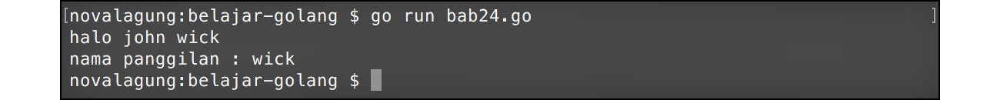
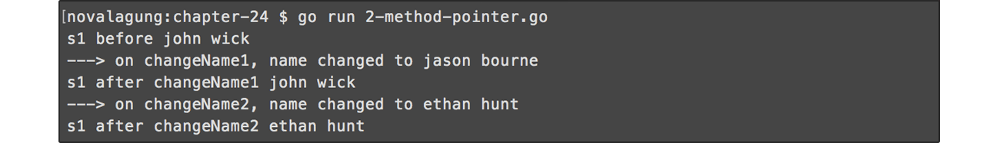

# A.25. Method

**Method** adalah fungsi yang menempel pada `type` (bisa `struct` atau tipe data lainnya). Method bisa diakses lewat variabel objek.

Keunggulan method dibanding fungsi biasa adalah memiliki akses ke property struct hingga level *private* (level akses nantinya akan dibahas lebih detail pada chapter selanjutnya). Dan juga, dengan menggunakan method sebuah proses bisa di-enkapsulasi dengan baik.

## A.25.1. Penerapan Method

Cara menerapkan method sedikit berbeda dibanding penggunaan fungsi. Ketika deklarasi, ditentukan juga siapa pemilik method tersebut. Contohnya bisa dilihat pada kode berikut:

```go
package main

import "fmt"
import "strings"

type student struct {
    name  string
    grade int
}

func (s student) sayHello() {
    fmt.Println("halo", s.name)
}

func (s student) getNameAt(i int) string {
    return strings.Split(s.name, " ")[i-1]
}
```

Cara deklarasi method sama seperti fungsi, hanya saja perlu ditambahkan deklarasi variabel objek di sela-sela keyword `func` dan nama fungsi. Struct yang digunakan akan menjadi pemilik method.

`func (s student) sayHello()` maksudnya adalah fungsi `sayHello` dideklarasikan sebagai method milik struct `student`. Pada contoh di atas struct `student` memiliki dua buah method, yaitu `sayHello()` dan `getNameAt()`.

Contoh pemanfaatan method bisa dilihat pada kode berikut.

```go
func main() {
    var s1 = student{"john wick", 21}
    s1.sayHello()

    var name = s1.getNameAt(2)
    fmt.Println("nama panggilan :", name)
}
```

Output:



Cara mengakses method sama seperti pengaksesan properti berupa variabel. Tinggal panggil saja methodnya.

```go
s1.sayHello()
var name = s1.getNameAt(2)
```

Method memiliki sifat yang sama persis dengan fungsi biasa. Seperti bisa berparameter, memiliki nilai balik, dan lainnya. Dari segi sintaks, pembedanya hanya ketika pengaksesan dan deklarasi. Bisa dilihat di kode berikut, sekilas perbandingan penulisan fungsi dan method.

```go
func sayHello() {
func (s student) sayHello() {

func getNameAt(i int) string {
func (s student) getNameAt(i int) string {
```

## A.25.2. Method Pointer

Method pointer adalah method yang variabel objek pemilik method tersebut berupa pointer.

Kelebihan method jenis ini adalah, ketika kita melakukan manipulasi nilai pada property lain yang masih satu struct, nilai pada property tersebut akan di rubah pada reference nya. Lebih jelasnya perhatikan kode berikut.

```go
package main

import "fmt"

type student struct {
    name  string
    grade int
}

func (s student) changeName1(name string) {
    fmt.Println("---> on changeName1, name changed to", name)
    s.name = name
}

func (s *student) changeName2(name string) {
    fmt.Println("---> on changeName2, name changed to", name)
    s.name = name
}

func main() {
    var s1 = student{"john wick", 21}
    fmt.Println("s1 before", s1.name)
    // john wick

    s1.changeName1("jason bourne")
    fmt.Println("s1 after changeName1", s1.name)
    // john wick

    s1.changeName2("ethan hunt")
    fmt.Println("s1 after changeName2", s1.name)
    // ethan hunt
}
```

Output:



Setelah eksekusi statement `s1.changeName1("jason bourne")`, nilai `s1.name` tidak berubah. Sebenarnya nilainya berubah tapi hanya dalam method `changeName1()` saja, nilai pada reference di objek-nya tidak berubah. Karena itulah ketika objek di print value dari `s1.name` tidak berubah.

Keistimewaan lain method pointer adalah, method itu sendiri bisa dipanggil dari objek pointer maupun objek biasa.

```go
// pengaksesan method dari variabel objek biasa
var s1 = student{"john wick", 21}
s1.sayHello()

// pengaksesan method dari variabel objek pointer
var s2 = &student{"ethan hunt", 22}
s2.sayHello()
```

---

Berikut adalah penjelasan tambahan mengenai beberapa hal pada chapter ini.

#### • Penggunaan Fungsi `strings.Split()`

Pada chapter ini ada fungsi baru yang kita gunakan: `strings.Split()`. Fungsi ini berguna untuk memisah string menggunakan pemisah yang ditentukan sendiri. Hasilnya adalah array berisikan kumpulan substring.

```go
strings.Split("ethan hunt", " ")
// ["ethan", "hunt"]
```

Pada contoh di atas, string `"ethan hunt"` dipisah menggunakan separator spasi `" "`. Maka hasilnya terbentuk array berisikan 2 data, `"ethan"` dan `"hunt"`.

## A.25.3. Apakah `fmt.Println()` & `strings.Split()` Juga Merupakan Method?

Setelah tahu apa itu method dan bagaimana penggunaannya, mungkin akan muncul di benak kita bahwa kode seperti `fmt.Println()`, `strings.Split()` dan lainnya-yang-berada-pada-package-lain adalah merupakan method. Tapi sayangnya **bukan**. `fmt` di situ bukanlah variabel objek, dan `Println()` bukan merupakan method-nya.

`fmt` adalah nama **package** yang di-import (bisa dilihat pada kode `import "fmt"`). Sedangkan `Println()` adalah **nama fungsi**. Untuk mengakses fungsi yang berada pada package lain, harus dituliskan nama package-nya. Hal ini berlaku juga di dalam package `main`. Jika ada fungsi dalam package main yang diakses dari package lain yang berbeda, maka penulisannya `main.NamaFungsi()`.

Lebih detailnya akan dibahas pada chapter selanjutnya.

---

<div class="source-code-link">
    <div class="source-code-link-message">Source code praktek chapter ini tersedia di Github</div>
    <a href="https://github.com/novalagung/dasarpemrogramangolang-example/tree/master/chapter-A.25-method">https://github.com/novalagung/dasarpemrogramangolang-example/.../chapter-A.25...</a>
</div>

---

<iframe src="partial/ebooks.html" width="100%" height="430px" frameborder="0" scrolling="no"></iframe>
