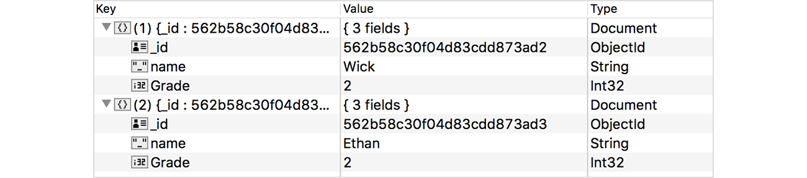
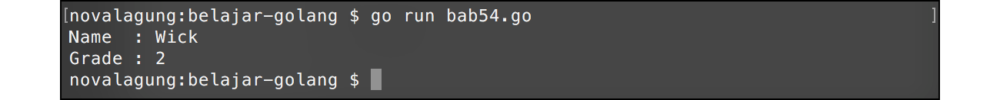
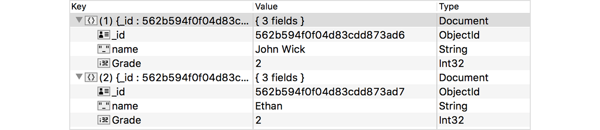

# A.57. NoSQL MongoDB

Go tidak menyediakan interface generic untuk NoSQL, jadi implementasi driver tiap brand NoSQL di Go biasanya berbeda satu dengan lainnya.

Pada chapter ini kita akan belajar cara berkomunikasi dengan NoSQL MongoDB server menggunakan official driver untuk go, yaitu [mongo-go-driver](https://github.com/mongodb/mongo-go-driver).

## A.57.1. Persiapan

Ada beberapa hal yang perlu disiapkan sebelum mulai masuk ke bagian coding.

 1. Instal mongo-go-driver menggunakan `go get`.

    ```
	cd <folder-project>
    go get go.mongodb.org/mongo-driver/mongo
    ```

 2. Pastikan sudah terinstal MongoDB di komputer anda, dan jangan lupa untuk menjalankan daemon-nya. Jika belum, [download](ihttps://www.mongodb.org/downloads) dan install terlebih dahulu.

 3. Instal juga MongoDB GUI untuk mempermudah browsing data. Bisa menggunakan [MongoChef](http://3t.io/mongochef/), [Robomongo](http://robomongo.org/), atau lainnya.

## A.57.2. Insert Data

Cara insert data ke mongodb via Go tidak terlalu sulit. Kita akan mempelajarinya dengan cara praktek langsung. Pertama-tama silakan import package yang dibutuhkan.

```go
package main

import (
	"context"
	"fmt"
	"log"
	"time"

	"go.mongodb.org/mongo-driver/mongo"
	"go.mongodb.org/mongo-driver/mongo/options"
	"go.mongodb.org/mongo-driver/bson"
)
```

Siapkan satu object context dan struct `student`. Rencananya satu buah document kita buat sebagai satu buah objek `student`.

Perlu diketahui bahwa pada chapter ini tidak dijelaskan tentang apa itu context. Silakan merujuk ke [D.2. Google API Search Dengan Timeout](/D-google-api-search.html) untuk mempelajarinya. Menggunakan satu context background untuk semua operasi sangat tidak dianjurkan, tapi pada chapter ini kita terapkan demikian agar tidak menambah kebingungan pembaca yang masih proses belajar. Context sendiri fungsinya sangat banyak, untuk kasus sejenis biasanya digunakan untuk handle operation timeout atau lainnya. 

```go
var ctx = context.Background()

type student struct {
	Name  string `bson:"name"`
	Grade int    `bson:"Grade"`
}
```

Tag `bson` pada property struct digunakan sebagai penentu nama field ketika data disimpan ke dalam collection. Jika sebuah property tidak memiliki tag bson, secara default nama field adalah sama dengan nama property hanya saja lowercase. Untuk customize nama field, gunakan tag `bson`.

Pada contoh di atas, property `Name` ditentukan nama field mongo-nya sebagai `name`, dan `Grade` sebagai `Grade`.

Selanjutnya siapkan fungsi untuk membuat satu buah mongo connection. Dari objek connection diambil object database, kemudian dijadikan sebagai nilai balik fungsi.

```go
func connect() (*mongo.Database, error) {
	clientOptions := options.Client()
	clientOptions.ApplyURI("mongodb://localhost:27017")
	client, err := mongo.NewClient(clientOptions)
	if err != nil {
		return nil, err
	}

	err = client.Connect(ctx)
	if err != nil {
		return nil, err
	}

	return client.Database("belajar_golang"), nil
}
```

Fungsi `mongo.NewClient()` digunakan untuk meng-inisialisasi koneksi database dari client ke server. Fungsi tersebut memerlukan parameter bertipe `*options.ClientOptions`. Pada client options mongo connection string perlu di set (lewat method `.ApplyURI()`).

> Silakan sesuaikan connection string dengan mongo db server yang dipergunakan. Lebih jelasnya silakan merujuk ke [MongoDB Documentation: Connection String URI Format](https://docs.mongodb.com/manual/reference/connection-string/).

Dari object client, panggil method `.Connect()` untuk inisialisasi koneksi ke db server. Setelah itu panggil method `.Database()` untuk set database yang aktif.

Lanjut buat fungsi yang di dalamnya berisikan kode untuk insert data ke mongodb, lalu panggil fungsi tersebut di `main()`.

```go
func insert() {
	db, err := connect()
	if err != nil {
		log.Fatal(err.Error())
	}

	_, err = db.Collection("student").InsertOne(ctx, student{"Wick", 2})
	if err != nil {
		log.Fatal(err.Error())
	}

	_, err = db.Collection("student").InsertOne(ctx, student{"Ethan", 2})
	if err != nil {
		log.Fatal(err.Error())
	}

	fmt.Println("Insert success!")
}

func main() {
    insert()
}
```

Fungsi `connect()` mengembalikan objek bertipe `*mongo.Database`. Dari objek tersebut akses method `.Collection()` lalu chain dengan method lainnya untuk melakukan operasi database, kurang lebih skema statement-nya sama seperti operasi mongodb.

Sebagai contoh, pada kode di atas `.InsertOne()` digunakan untuk insert satu data ke database. Perbandingannya kurang lebih seperti berikut:

```js
// mongodb
db.getCollection("student").insertOne({ name: "Wick", Grade: 2 })

// mongo-go-driver
db.Collection("student").InsertOne(ctx, student{ name: "Wick", Grade: 2})
```

Perlu diketahui, bahwa di mongo-go-driver setiap operasi biasanya membutuhkan objek context untuk disisipkan sebagai parameter pertama. Pada contoh di atas kita gunakan variabel `ctx` yang sudah dideklarasikan sebelumnya.



## A.57.3. Membaca Data

Method `.Find()` digunakan untuk membaca atau mencari data. Method ini mengembalikan objek cursor, objek ini harus digunakan dalam perulangan untuk mengambil data yang ditemukan.

Dalam pencarian, sisipkan query atau filter sebagai parameter ke-dua method `.Find()`.

```go
func find() {
	db, err := connect()
	if err != nil {
		log.Fatal(err.Error())
	}

	csr, err := db.Collection("student").Find(ctx, bson.M{"name": "Wick"})
	if err != nil {
		log.Fatal(err.Error())
	}
	defer csr.Close(ctx)

	result := make([]student, 0)
	for csr.Next(ctx) {
		var row student
		err := csr.Decode(&row)
		if err != nil {
			log.Fatal(err.Error())
		}

		result = append(result, row)
	}

	if len(result) > 0 {
		fmt.Println("Name  :", result[0].Name)
		fmt.Println("Grade :", result[0].Grade)
	}
}

func main() {
    find()
}
```

Query selector ditulis dalam tipe `bson.M`. Tipe ini sebenarnya adalah alias dari `map[string]interface{}`.

Cara untuk mendapatkan semua rows hasil pencarian kursor adalah dengan mengiterasi method `.Next()` dengan di dalamnya method `.Decode()` dipanggil untuk retrieve datanya. Setelah itu data yang sudah terampil di-append ke slice.

Selain method `.Find()` ada juga `.FindOne()`, silakan cek dokumentasi lebih jelasnya.



Berikut adalah skema perbandingan contoh operasi get data menggunakan mongo query vs mongo-go-driver:

```js
// mongodb
db.getCollection("student").find({"name": "Wick"})

// mongo-go-driver
db.Collection("student").Find(ctx, bson.M{"name": "Wick"})
```

## A.57.4. Update Data

Method `.Update()` digunakan untuk update data (jika update hanya diinginkan untuk berlaku pada 1 dokumen saja, maka gunakan `.UpdateOne()`). Method `.Update()` memerlukan 3 buah parameter dalam pemanggilannya.

 1. Parameter pertama, objek context
 2. Parameter kedua adalah query kondisi yang mengacu ke data mana yang ingin di update
 3. Parameter ketiga adalah perubahan datanya.

Di bawah ini adalah contok implementasi method `Update()`.

```go
func update() {
	db, err := connect()
	if err != nil {
		log.Fatal(err.Error())
	}

	var selector = bson.M{"name": "Wick"}
	var changes = student{"John Wick", 2}
	_, err = db.Collection("student").UpdateOne(ctx, selector, bson.M{"$set": changes})
	if err != nil {
		log.Fatal(err.Error())
	}

	fmt.Println("Update success!")
}

func main() {
    update()
}
```

Jalankan kode di atas, lalu cek lewat Mongo GUI apakah data berubah.



Berikut adalah skema perbandingan query vs mongo-go-driver dari operasi di atas.

```js
// mongodb
db.getCollection("student").update({"name": "Wick"}, { "$set": {"name": "Wick", "Grade": 2} })

// mongo-go-driver
db.Collection("student").UpdateOne(ctx, bson.M{"name": "Wick"}, bson.M{"$set": student{"John Wick", 2}})
```

Selain method `.UpdateOne()` ada juga method `.UpdateMany()`, kegunaan masing-masing bisa dilihat dari nama fungsinya.

## A.57.5. Menghapus Data

Untuk menghapus data gunakan method `.DeleteOne()` atau `.DeleteMany()`.

```go
func remove() {
	db, err := connect()
	if err != nil {
		log.Fatal(err.Error())
	}

	var selector = bson.M{"name": "John Wick"}
	_, err = db.Collection("student").DeleteOne(ctx, selector)
	if err != nil {
		log.Fatal(err.Error())
	}

	fmt.Println("Remove success!")
}

func main() {
    remove()
}
```

Hasil dari kode di atas, 2 data yang sebelumnya sudah di-insert kini tinggal satu saja.


Berikut adalah skema perbandingan query vs mongo-go-driver dari operasi di atas.

```js
// mongodb
db.getCollection("student").delete({"name": "John Wick"})

// mongo-go-driver
db.Collection("student").DeleteMany(ctx, bson.M{"name": "John Wick"})
```

## A.57.6. Aggregate Data

Agregasi data menggunakan driver ini juga cukup mudah, caranya tinggal gunakan method `.Aggregate()` dan sisipkan pipeline query sebagai argument ke-2 pemanggilan method. Eksekusi method tersebut mengembalikan objek cursor. Selebihnya capture result dengan cara yang sama seperti capture cursor operasi `.Find()`.

Pipeline sendiri bisa dituliskan langsung dalam `[]bson.M`, atau bisa tulis dalam bentuk string dan unmarshal ke `[]bson.M`.

```go
pipeline := make([]bson.M, 0)
err = bson.UnmarshalExtJSON([]byte(strings.TrimSpace(`
	[
		{ "$group": {
			"_id": null,
			"Total": { "$sum": 1 }
		} },
		{ "$project": {
			"Total": 1,
			"_id": 0
		} }
	]
`)), true, &pipeline)
if err != nil {
	log.Fatal(err.Error())
}
```

Pada kode lanjutan berikut, method `.Aggregate()` dipanggil dan disisipkan pipeline-nya.

```go
csr, err := db.Collection("student").Aggregate(ctx, pipeline)
if err != nil {
	log.Fatal(err.Error())
}
defer csr.Close(ctx)

result := make([]bson.M, 0)
for csr.Next(ctx) {
	var row bson.M
	err := csr.Decode(&row)
	if err != nil {
		log.Fatal(err.Error())
	}

	result = append(result, row)
}

if len(result) > 0 {
	fmt.Println("Total :", result[0]["Total"])
}
```

---

- [Mongo Go Driver](https://github.com/mongodb/mongo-go-driver), by MongoDB Team, Apache-2.0 license

---

<div class="source-code-link">
    <div class="source-code-link-message">Source code praktek chapter ini tersedia di Github</div>
    <a href="https://github.com/novalagung/dasarpemrogramangolang-example/tree/master/chapter-A.57-mongodb">https://github.com/novalagung/dasarpemrogramangolang-example/.../chapter-A.57...</a>
</div>

---

<iframe src="https://novalagung.substack.com/embed" width="100%" height="320" class="substack-embed" frameborder="0" scrolling="no"></iframe>
