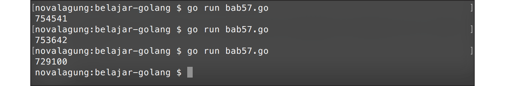
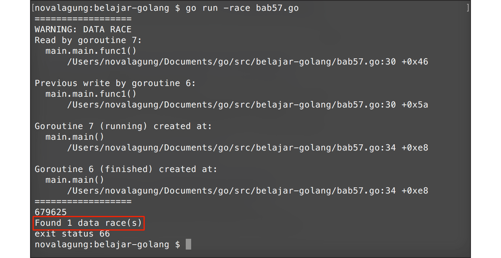
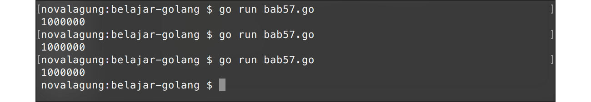

# A.61. Mutex

Sebelum kita membahas mengenai apa itu **mutex**? ada baiknya untuk mempelajari terlebih dahulu apa itu **race condition**, karena kedua konsep ini berhubungan erat satu sama lain.

Race condition adalah kondisi di mana lebih dari satu goroutine mengakses data yang sama pada waktu yang bersamaan (benar-benar bersamaan). Ketika hal ini terjadi, nilai data tersebut akan menjadi kacau. Dalam **concurrency programming**, situasi seperti ini sering terjadi.

Mutex melakukan pengubahan level akses sebuah data menjadi eksklusif, menjadikan data tersebut hanya dapat dikonsumsi (read / write) oleh satu buah goroutine saja. Ketika terjadi race condition, maka hanya goroutine yang beruntung saja yang bisa mengakses data tersebut. Goroutine lain (yang waktu running nya kebetulan bersamaan) akan dipaksa untuk menunggu, hingga goroutine yang sedang memanfaatkan data tersebut selesai.

Go menyediakan `sync.Mutex` yang bisa dimanfaatkan untuk keperluan **lock** dan **unlock** data. Pada chapter ini kita akan membahas mengenai race condition dan cara mengatasinya menggunakan mutex.

## A.61.1. Persiapan

Pertama siapkan struct baru bernama `counter`, dengan isi satu buah property `val` bertipe `int`. Property ini nantinya dikonsumsi dan diolah oleh banyak goroutine.

Lalu buat beberapa method struct `counter`.

 1. Method `Add()`, untuk increment nilai.
 2. Method `Value()`, untuk mengembalikan nilai.

```go
package main

import (
    "fmt"
    "runtime"
    "sync"
)

type counter struct {
    val int
}

func (c *counter) Add() {
    c.val++
}

func (c *counter) Value() int {
    return c.val
}
```

Kode di atas kita gunakan sebagai template contoh source code yang ada pada chapter ini.

## A.61.2. Contoh Race Condition

Program berikut merupakan contoh program yang di dalamnya memungkinkan terjadi race condition atau kondisi goroutine balapan.

> Pastikan jumlah core prosesor komputer anda adalah lebih dari satu. Karena contoh pada chapter ini hanya akan berjalan sesuai harapan jika `GOMAXPROCS` > 1.

```go
func main() {
    runtime.GOMAXPROCS(2)

    var wg sync.WaitGroup
    var meter counter

    for i := 0; i < 1000; i++ {
        wg.Add(1)

        go func() {
            for j := 0; j < 1000; j++ {
                meter.Add()
            }

            wg.Done()
        }()
    }

    wg.Wait()
    fmt.Println(meter.Value())
}
```

Pada kode di atas, disiapkan sebuah instance `sync.WaitGroup` bernama `wg`, dan variabel object `meter` bertipe `counter` (nilai property `val` default-nya adalah **0**).

Setelahnya dijalankan perulangan sebanyak 1000 kali, yang ditiap perulanganya dijalankan sebuah goroutine baru. Di dalam goroutine tersebut, terdapat perulangan lagi, sebanyak 1000 kali. Dalam perulangan tersebut nilai property `val` dinaikkan sebanyak 1 lewat method `Add()`.

Dengan demikian, ekspektasi nilai akhir `meter.val` harusnya adalah 1000000.

Di akhir, `wg.Wait()` dipanggil, dan nilai variabel counter `meter` diambil lewat `meter.Value()` untuk kemudian ditampilkan.

Jalankan program, lihat hasilnya.



Nilai `meter.val` tidak genap 1000000? kenapa bisa begitu? Padahal seharusnya tidak ada masalah dalam kode yang kita tulis di atas.

Inilah yang disebut dengan race condition, data yang diakses bersamaan dalam 1 waktu menjadi kacau.

## A.61.3. Deteksi Race Condition Menggunakan Go Race Detector

Go menyediakan fitur untuk [deteksi race condition](http://blog.golang.org/race-detector). Cara penggunaannya adalah dengan menambahkan flag `-race` pada saat eksekusi aplikasi.



Terlihat pada gambar di atas, ada pesan memberitahu terdapat kemungkinan data race pada program yang kita jalankan.

## A.61.4. Penerapan `sync.Mutex`

Sekarang kita tahu bahwa program di atas menghasilkan bug, ada kemungkinan data race di dalamnya. Untuk mengatasi masalah ini ada beberapa cara yang bisa digunakan, dan di sini kita akan menggunakan `sync.Mutex`.

Cara yang dianjurkan adalah menambahkan `sync.Mutex` sebagai **named field** di dalam struct. Dengan cara ini, mutex jelas menjadi milik struct, dan penggunaannya eksplisit karena diakses lewat nama field-nya.

```go
type counter struct {
    mu  sync.Mutex
    val int
}

func (c *counter) Add() {
    c.mu.Lock()
    c.val++
    c.mu.Unlock()
}

func (c *counter) Value() int {
    return c.val
}
```

Method `Lock()` digunakan untuk menandai bahwa semua operasi pada baris setelah kode tersebut adalah bersifat eksklusif. Hanya ada satu buah goroutine yang bisa melakukannya dalam satu waktu. Jika ada banyak goroutine yang eksekusinya bersamaan, harus antri.

Method `Unlock()` akan membuka kembali akses operasi ke property/variabel yang di-lock, proses mutual exclusion terjadi di antara method `Lock()` dan `Unlock()`.

Di contoh di atas, pada saat bagian pengambilan nilai, mutex tidak dipasang, karena kebetulan pengambilan nilai terjadi setelah semua goroutine selesai. Data Race bisa terjadi saat pengubahan maupun pengambilan data, jadi penggunaan mutex harus disesuaikan dengan kasus.

Coba jalankan program, dan lihat hasilnya.



Selain menggunakan named field, `sync.Mutex` bisa juga di-*embed* langsung ke dalam struct. Cara ini lebih ringkas karena method `Lock()` dan `Unlock()` ter-*promote* dan bisa dipanggil langsung dari objek.

```go
type counter struct {
    sync.Mutex
    val int
}

func (c *counter) Add() {
    c.Lock()
    c.val++
    c.Unlock()
}
```

Perlu diperhatikan bahwa embedding menyebabkan method `Lock()` dan `Unlock()` ikut menjadi bagian dari method set struct `counter`. Jika struct tersebut di-*export* (nama diawali huruf kapital), maka method-method tersebut ikut ter-*expose* ke luar package, yang bisa membingungkan pengguna. Oleh karena itu, untuk struct yang di-*export*, pendekatan named field lebih disarankan.

Selain dua cara di atas, mutex bisa juga digunakan tanpa ditempelkan ke struct sama sekali. Contohnya bisa dilihat di bawah ini.

```go
func (c *counter) Add() {
    c.val++
}

func (c *counter) Value() int {
    return c.val
}

func main() {
    runtime.GOMAXPROCS(2)

    var wg sync.WaitGroup
    var mtx sync.Mutex
    var meter counter

    for i := 0; i < 1000; i++ {
        wg.Add(1)

        go func() {
            for j := 0; j < 1000; j++ {
                mtx.Lock()
                meter.Add(1)
                mtx.Unlock()
            }

            wg.Done()
        }()
    }

    wg.Wait()
    fmt.Println(meter.Value())
}
```

> `sync.Mutex` merupakan salah satu tipe yang *thread safe*. Kita tidak perlu khawatir terhadap potensi *race condition* karena variabel bertipe ini aman untuk digunakan di banyak goroutine secara paralel.

---

<div class="source-code-link">
    <div class="source-code-link-message">Source code praktik chapter ini tersedia di Github</div>
    <a href="https://github.com/novalagung/dasarpemrogramangolang-example/tree/master/chapter-A.61-mutex">https://github.com/novalagung/dasarpemrogramangolang-example/.../chapter-A.61...</a>
</div>

---

<iframe src="partial/ebooks.html" width="100%" height="390px" frameborder="0" scrolling="no"></iframe>
