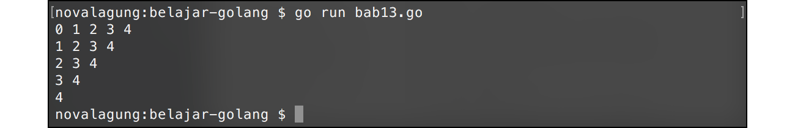
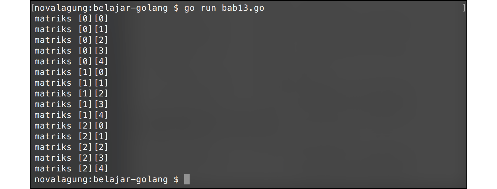

# A.14. Perulangan

Perulangan adalah proses mengulang-ulang eksekusi blok kode tanpa henti, selama kondisi yang dijadikan acuan terpenuhi. Biasanya disiapkan variabel untuk iterasi atau variabel penanda kapan perulangan akan diberhentikan.

Di Go keyword perulangan hanya **for** saja, namun kemampuannya merupakan gabungan dari `for`, `foreach`, dan `while` seperti pada bahasa pemrograman lain.

## A.14.1. Perulangan Menggunakan Keyword `for`

Ada beberapa cara standar menggunakan `for`. Cara pertama dengan memasukkan variabel counter perulangan beserta kondisinya setelah keyword. Perhatikan dan praktikkan kode berikut.

```go
for i := 0; i < 5; i++ {
    fmt.Println("Angka", i)
}
```

Perulangan di atas hanya akan berjalan ketika variabel `i` bernilai di bawah `5`, dengan ketentuan setiap kali perulangan, nilai variabel `i` akan di-iterasi atau ditambahkan 1 (`i++` artinya ditambah satu, sama seperti `i = i + 1`). Karena `i` pada awalnya bernilai 0, maka perulangan akan berlangsung 5 kali, yaitu ketika `i` bernilai 0, 1, 2, 3, dan 4.


## A.14.2. Penggunaan Keyword `for` Dengan Argumen Hanya Kondisi

Cara ke-2 adalah dengan menuliskan kondisi setelah keyword `for` (hanya kondisi). Deklarasi dan iterasi variabel counter tidak dituliskan setelah keyword, hanya kondisi perulangan saja. Konsepnya mirip seperti `while` milik bahasa pemrograman lain.

Kode berikut adalah contoh `for` dengan argumen hanya kondisi (seperti `if`), output yang dihasilkan sama seperti penerapan `for` cara pertama.

```go
var i = 0

for i < 5 {
    fmt.Println("Angka", i)
    i++
}
```

## A.14.3. Penggunaan Keyword `for` Tanpa Argumen

Cara ke-3 adalah `for` ditulis tanpa kondisi. Dengan ini akan dihasilkan perulangan tanpa henti (sama dengan `for true`). Pemberhentian perulangan dilakukan dengan menggunakan keyword `break`.

```go
var i = 0

for {
    fmt.Println("Angka", i)

    i++
    if i == 5 {
        break
    }
}
```

Dalam perulangan tanpa henti di atas, variabel `i` yang nilai awalnya `0` di-inkrementasi. Ketika nilai `i` sudah mencapai `5`, keyword `break` digunakan, dan perulangan akan berhenti.

## A.14.4. Penggunaan Keyword `for` - `range`

Cara ke-4 adalah perulangan dengan menggunakan kombinasi keyword `for` dan `range`. Cara ini biasa digunakan untuk me-looping data gabungan (misalnya string, array, slice, map). Detailnya akan dibahas dalam chapter-chapter selanjutnya ([A.15. Array](/A-array.html), [A.16. Slice](/A-slice.html), [A.17. Map](/A-map.html)).

```go
var xs = "123" // string
for i, v := range xs {
    fmt.Println("Index=", i, "Value=", v)
}

var ys = [5]int{10, 20, 30, 40, 50} // array
for _, v := range ys {
    fmt.Println("Value=", v)
}

var zs = ys[0:2] // slice
for _, v := range zs {
    fmt.Println("Value=", v)
}

var kvs = map[byte]int{'a': 0, 'b': 1, 'c': 2} // map
for k, v := range kvs {
    fmt.Println("Key=", k, "Value=", v)
}

// boleh juga baik k dan atau v nya diabaikan
for range kvs {
    fmt.Println("Done")
}

// selain itu, bisa juga dengan cukup menentukan nilai numerik perulangan
// (fitur ini tersedia sejak Go 1.22)
for i := range 5 {
    fmt.Print(i) // 01234
}
```

## A.14.5. Penggunaan Keyword `break` & `continue`

Keyword `break` digunakan untuk menghentikan secara paksa sebuah perulangan, sedangkan `continue` dipakai untuk memaksa maju ke perulangan berikutnya.

Berikut merupakan contoh penerapan `continue` dan `break`. Kedua keyword tersebut dimanfaatkan untuk menampilkan angka genap berurutan yang lebih besar dari 0 dan kurang dari atau sama dengan 8.

```go
for i := 1; i <= 10; i++ {
    if i%2 == 1 {
        continue
    }

    if i > 8 {
        break
    }

    fmt.Println("Angka", i)
}
```

Kode di atas akan lebih mudah dicerna jika dijelaskan secara berurutan. Berikut adalah penjelasannya.

 1. Dilakukan perulangan mulai angka 1 hingga 10 dengan `i` sebagai variabel iterasi.
 2. Ketika `i` adalah ganjil (dapat diketahui dari `i % 2`, jika hasilnya `1`, berarti ganjil), maka akan dipaksa lanjut ke perulangan berikutnya.
 3. Ketika `i` lebih besar dari 8, maka perulangan akan berhenti.
 4. Nilai `i` ditampilkan.


## A.14.6. Perulangan Bersarang

Tak hanya seleksi kondisi yang bisa bersarang, perulangan juga bisa. Cara pengaplikasiannya kurang lebih sama, tinggal tulis blok statement perulangan di dalam perulangan.

```go
for i := 0; i < 5; i++ {
    for j := i; j < 5; j++ {
        fmt.Print(j, " ")
    }

    fmt.Println()
}
```

Pada kode di atas, untuk pertama kalinya fungsi `fmt.Println()` dipanggil tanpa disisipkan parameter. Cara seperti ini bisa digunakan untuk menampilkan baris baru. Kegunaannya sama seperti output dari statement `fmt.Print("\n")`.



## A.14.7. Pemanfaatan Label Dalam Perulangan

Di perulangan bersarang, `break` dan `continue` akan berlaku pada blok perulangan di mana ia digunakan saja. Ada cara agar kedua keyword ini bisa tertuju pada perulangan terluar atau perulangan tertentu, yaitu dengan memanfaatkan teknik pemberian **label**.

Program untuk memunculkan matriks berikut merupakan contoh penerapan label perulangan.

```go
outerLoop:
for i := 0; i < 5; i++ {
    for j := 0; j < 5; j++ {
        if i == 3 {
            break outerLoop
        }
        fmt.Print("matriks [", i, "][", j, "]", "\n")
    }
}
```

Tepat sebelum keyword `for` terluar, terdapat baris kode `outerLoop:`. Maksud dari kode tersebut adalah disiapkan sebuah label bernama `outerLoop` untuk `for` di bawahnya. Nama label bisa diganti dengan nama lain (dan harus diakhiri dengan tanda titik dua atau *colon* (`:`) ).

Pada `for` bagian dalam, terdapat seleksi kondisi untuk pengecekan nilai `i`. Ketika nilai tersebut sama dengan `3`, maka `break` dipanggil dengan target adalah perulangan yang dilabeli `outerLoop`, perulangan tersebut akan dihentikan.



## A.14.8. Fungsi Iterator & `yield` (Go 1.23+)

**Fungsi iterator** adalah fungsi yang didesain untuk digunakan bersama `for` - `range`, memungkinkan pembuatan perulangan kustom yang menghasilkan nilai satu per satu. Sebelum Go 1.23, `for` - `range` hanya bisa digunakan pada tipe bawaan seperti slice, array, map, string, dan channel. Sejak Go 1.23, `for` - `range` bisa digunakan langsung pada fungsi yang memenuhi skema iterator tertentu.

#### ◉ Apa itu `yield`?

`yield` bukanlah keyword bawaan Go, melainkan nama parameter fungsi yang wajib ada dalam skema iterator. Fungsi bertipe `yield` inilah yang dipanggil oleh iterator untuk "menghasilkan" nilai ke blok `for` - `range` di setiap iterasinya.

Cara kerjanya:

- Iterator memanggil `yield(nilai)` untuk meneruskan nilai ke blok `for`.
- Jika `yield` mengembalikan `true`, iterasi dilanjutkan ke putaran berikutnya.
- Jika `yield` mengembalikan `false` (misalnya karena ada `break` di dalam loop), iterasi dihentikan dan iterator harus segera `return`.

#### ◉ Tiga Skema Fungsi Iterator

Go mendukung tiga skema fungsi iterator tergantung jumlah nilai yang dihasilkan per iterasi.

**Skema 1: `func(yield func() bool)`**

Tidak menghasilkan nilai per iterasi, hanya menandakan bahwa satu putaran terjadi. Cocok untuk mengulangi suatu proses sebanyak N kali tanpa perlu nilai iterasi.

```go
func repeat(n int) func(yield func() bool) {
    return func(yield func() bool) {
        for i := 0; i < n; i++ {
            if !yield() {
                return
            }
        }
    }
}
```

Cara penggunaan:

```go
count := 0
for range repeat(5) {
    count++
    fmt.Println("iterasi ke", count)
}
```

**Skema 2: `func(yield func(V) bool)`**

Menghasilkan satu nilai per iterasi. Ini adalah skema yang paling umum digunakan, setara dengan `for _, v := range slice`.

```go
func counter(n int) func(yield func(int) bool) {
    return func(yield func(int) bool) {
        for i := 1; i <= n; i++ {
            if !yield(i) {
                return
            }
        }
    }
}
```

Cara penggunaan:

```go
for v := range counter(5) {
    fmt.Println(v) // 1, 2, 3, 4, 5
}
```

**Skema 3: `func(yield func(K, V) bool)`**

Menghasilkan dua nilai per iterasi (pasangan key-value). Setara dengan `for k, v := range map`.

```go
func enumerate(items []string) func(yield func(int, string) bool) {
    return func(yield func(int, string) bool) {
        for i, v := range items {
            if !yield(i, v) {
                return
            }
        }
    }
}
```

Cara penggunaan:

```go
fruits := []string{"apple", "mango", "banana"}
for i, v := range enumerate(fruits) {
    fmt.Println(i, v)
}
// output:
// 0 apple
// 1 mango
// 2 banana
```

#### ◉ Menghentikan Iterasi dengan `break`

Ketika `break` digunakan di dalam `for` - `range` pada iterator, fungsi `yield` mengembalikan `false`. Iterator wajib mengecek nilai kembalian `yield` dan langsung `return` jika hasilnya `false`, agar goroutine tidak bocor.

```go
for v := range counter(10) {
    if v == 3 {
        break
    }
    fmt.Println(v)
}
// output: 1 2 3
```

> Go 1.23 juga memperkenalkan package [`iter`](https://pkg.go.dev/iter) yang menyediakan tipe standar untuk iterator: `iter.Seq[V]` (satu nilai) dan `iter.Seq2[K, V]` (dua nilai). Keduanya mempermudah penulisan tipe fungsi iterator tanpa harus menuliskan skema panjang secara manual.

---

<div class="source-code-link">
    <div class="source-code-link-message">Source code praktik chapter ini tersedia di Github</div>
    <a href="https://github.com/novalagung/dasarpemrogramangolang-example/tree/master/chapter-A.14-perulangan">https://github.com/novalagung/dasarpemrogramangolang-example/.../chapter-A.14...</a>
</div>

---

<iframe src="partial/ebooks.html" width="100%" height="390px" frameborder="0" scrolling="no"></iframe>
