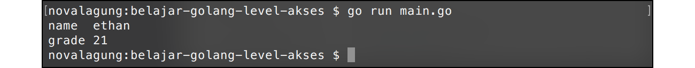

# A.26. Properti Public dan Private (Exported vs Unexported)

Chapter ini membahas tentang *property modifier* public dan private yang ada di pemrograman Go. Peran dari *property modifier* adalah sebagai penentu kapan suatu struct, fungsi, atau method bisa diakses dari package lain dan kapan tidak.

Di Go sebenarnya tidak ada istilah *public modifier* dan *private modifier*. Yang ada adalah **exported** (yang kalau di bahasa lain ekuivalen dengan *public modifier*), dan **unexported** untuk *private modifier*.

## A.26.1. Intro

Intro ini ditulis agar pembaca tau ekspektasi chapter ini sebenarnya apa.

Pembahasan kali ini memiliki beberapa perbedaan dibanding chapter lainnya. Jika pembaca mengikuti pembelajaran di chapter ini secara berurutan, dan benar-benar membaca penjelasan serta pembahasan yang sudah tertulis, maka nantinya **pasti menemui 3 buah error**.

Di setiap error tersebut, sebenarnya sudah terlampir informasi berikut:

1. Screenshot error
2. Penjelasan penyebab terjadinya error
3. Cara resolve atau mengatasi error

Penulis menerima cukup banyak email dari pembaca mengenai beberapa error di chapter ini. Kesimpulan penulis:

**Pembaca bingung karena mendapati error, dan tidak tau apa yang harus dilakukan. Padahal sudah ada keterangan yang cukup jelas bahwa error tersebut pasti muncul, dan sudah disediakan juga penjelasan beserta cara mengatasinya. Ini kemungkinan besar disebabkan karena pembaca hanya copy-paste source code dari chapter ini, tanpa benar-benar membaca penjelasan yang padahal sudah ditulis cukup detail**.

> Saya sangat anjurkan untuk **tidak hanya *copas* source code, usahakan dibaca! dipelajari! dan dipahami!** *No hard feeling* ya 👌😁

## A.26.2. Exported Package dan Unexported Package

Pengembangan aplikasi dalam *real development* pasti membutuhkan banyak sekali file program. Tidak mungkin dalam satu buah project semua source code di tulis di hanya 1 package `main` saja, umumnya akan dipisah ke beberapa package berbeda yang masing-masing punya tugas sendiri yang berbeda satu sama lain.

Project folder selain berisikan file-file `.go` juga bisa berisikan sub-folder lainnya. Di Go, setiap folder atau sub-folder adalah satu package, file-file yang ada di dalam sebuah folder package-nya harus sama. Dan package pada file-file tersebut harus berbeda dengan package pada file-file lainnya yang berada pada folder berbeda.

> Sederhananya, 1 folder adalah 1 package.

Dalam sebuah package, biasanya kita menulis sangat banyak komponen, bisa berupa fungsi, struct, variabel, atau lainnya. Komponen-komponen tersebut bisa secara leluasa dipergunakan di kode yang masih berada di dalam package yang sama. Contohnya seperti program yang telah kita praktekan pada chapter sebelum-sebelumnya, dalam package `main` ada banyak yang di-*define*: fungsi, variabel, closure, struct, dan lainnya; semuanya bisa langsung dimanfaatkan.

Jika dalam satu program terdapat lebih dari 1 package, atau ada package lain selain `main`, maka komponen dalam package lain tersebut tidak bisa diakses secara bebas dari file yang package-nya `main`, perlu dilihat dulu level akses yang sudah ditentukan apa.

Go mengenal 2 jenis level akses atau hak akses:

 - Hak akses **Exported** atau **public**. Menandakan bahwa komponen boleh untuk diakses dari package lain
 - Hak akses **Unexported** atau **private**. Berarti komponen hanya bisa diakses dari file yang package-nya sama, bisa dalam satu file yang sama atau di file berbeda yang masih 1 folder yang package-nya pastinya sama.

Cara menentukan level akses atau modifier di Go sangat mudah, yaitu dengan mengacu ke **character case** huruf pertama nama fungsi, struct, variabel, atau lainnya. Ketika namanya diawali dengan huruf kapital maka level aksesnya adalah *exported* (atau *public*). Dan sebaliknya, jika diawali huruf kecil, berarti *unexported* (atau private).

## A.26.3. Penggunaan Package, Import, Dan Hak Akses *Exported* dan *Unexported*

Agar lebih mudah dipahami, maka langsung saja kita praktekan.

Pertama buat folder proyek baru bernama `belajar-golang-level-akses`, gunakan nama folder tersebut sebagai nama project. Kemudian buat file baru bernama `main.go` di dalamnya, lalu tentukan nama package file tersebut sebagai **main**.

Kemudian, buat sub-folder baru bernama `library` di dalam folder `belajar-golang-level-akses`. Di dalam folder `library`, buat file baru `library.go`, set nama package-nya **library**.


Buka file `library.go` lalu isi dengan kode berikut.

```go
package library

import "fmt"

func SayHello() {
    fmt.Println("hello")
}

func introduce(name string) {
    fmt.Println("nama saya", name)
}
```

File `library.go` yang telah dibuat ditentukan nama package-nya adalah `library` (sesuai dengan nama folder), isinya dua buah fungsi `SayHello()` dan `introduce()`.

 - Fungsi `SayHello()`, level aksesnya adalah publik, ditandai dengan nama fungsi diawali huruf besar.
 - Fungsi `introduce()` dengan level akses private, ditandai oleh huruf kecil di awal nama fungsi.

Selanjutnya kita siapkan beberapa kode tambahan untuk keperluan testing apakah memang fungsi yang ber-modifier private dalam package `library` tidak bisa diakses dari package lain.

Buka file `main.go`, lalu tulis kode berikut.

```go
package main

import "belajar-golang-level-akses/library"

func main() {
    library.SayHello()
    library.introduce("ethan")
}
```

Bisa dilihat bahwa package `library` yang telah dibuat tadi, di-import ke dalam package `main`.

Di awal telah ditentukan bahwa nama project (yang juga merupakan nama folder) adalah `belajar-golang-level-akses`, maka untuk import package lain yang merupakan subfolder, pada syntax import harus dituliskan lengkap, contoh: `belajar-golang-level-akses/library`.

> Penanda root folder adalah tempat di mana file `go.mod` berada

Kembali ke pembahasan kode, silakan perhatikan kode berikut:

```go
library.SayHello()
library.introduce("ethan")
```

Cara pemanggilan fungsi yang berada dalam package lain adalah dengan menuliskan nama package target diikut dengan nama fungsi menggunakan *dot notation* atau tanda titik, seperti `library.SayHello()` atau `library.introduce("ethan")`.

OK, sekarang coba jalankan kode yang sudah disiapkan di atas, hasilnya error.


Error di atas disebabkan oleh fungsi `introduce()` yang berada dalam package `library` memiliki level akses *unexported* (atau *private*), maka fungsi ini tidak bisa diakses dari package lain (pada kasus ini package `main`). Solusi agar bisa diakses adalah dengan mengubah level aksesnya ke *exported* (atau *public*), atau bisa dengan mengubah cara pemanggilannya.

Ok, sekarang kita akan coba cara ke-2, yaitu mengubah cara pemanggilannya. Tambahkan parameter `name` pada fungsi `SayHello()`, lalu masih di dalam fungsi tersebut panggil fungsi `introduce()` dan gunakan parameter `name`-nya.

```go
func SayHello(name string) {
    fmt.Println("hello")
    introduce(name)
}
```

Di fungsi `main()`, cukup panggil fungsi `library.SayHello()` saja. Isi parameternya dengan nilai string apapun, misalnya `"ethan"`.

```go
func main() {
    library.SayHello("ethan")
}
```

Coba jalankan lagi.


## A.26.4. Penggunaan Hak Akses *Exported* dan *Unexported* pada Struct dan Propertinya

Level akses *exported* (atau public) dan *unexported* (atau private) juga bisa diterapkan di fungsi, struct, method, maupun property variabel. Cara penggunaannya sama seperti pada pembahasan sebelumnya, yaitu dengan menentukan **character case** huruf pertama nama komponen, apakah huruf besar atau kecil.

Ok, lanjut ke praktek berikutnya. Hapus isi file `library.go`, lalu buat struct baru dengan nama `student` di dalamnya.

```go
package library

type student struct {
    Name  string
    grade int
}
```

Buat contoh sederhana penerapan struct di atas pada file `main.go`.

```go
package main

import "belajar-golang-level-akses/library"
import "fmt"

func main() {
    var s1 = library.student{"ethan", 21}
    fmt.Println("name ", s1.Name)
    fmt.Println("grade", s1.grade)
}
```

Setelah itu jalankan program.


Error muncul lagi, kali ini penyebabnya adalah karena struct `student` level aksesnya adalah *unexported*. Ubah ke bentuk *exported* dengan cara mengubah huruf awalnya menjadi huruf besar, kemudian jalankan ulang.

```go
// file library/library.go
type Student struct {
    Name  string
    grade int
}

// file main.go
var s1 = library.Student{"ethan", 21}
fmt.Println("name ", s1.Name)
fmt.Println("grade", s1.grade)
```

Output program:


Error masih tetap muncul, tapi kali ini berbeda. Error yang baru ini disebabkan karena salah satu properti dari struct `Student` adalah *unexported*. Properti yg dimaksud adalah `grade`. Solusinya ubah ke bentuk *exported*, lalu jalankan ulang program.

```go
// pada library/library.go
type Student struct {
    Name  string
    Grade int
}

// pada main.go
var s1 = library.Student{"ethan", 21}
fmt.Println("name ", s1.Name)
fmt.Println("grade", s1.Grade)
```

Dari contoh program di atas, bisa disimpulkan bahwa untuk menggunakan `struct` yang berada di package lain, selain nama struct-nya harus berbentuk *exported*, properti yang diakses juga harus *exported* juga.



## A.26.5. Import Dengan Prefix Tanda Titik

Seperti yang kita tahu, untuk mengakses fungsi/struct/variabel yg berada di package lain, nama package nya perlu ditulis, contohnya seperti pada penggunaan `library.Student` dan `fmt.Println()`.

Di Go, komponen yang berada di package lain yang di-import bisa dijadikan se-level dengan komponen package peng-import, caranya dengan menambahkan tanda titik (`.`) setelah penulisan keyword `import`. Maksud dari se-level di sini adalah, semua property di package lain yg di-import bisa diakses tanpa perlu menuliskan nama package, seolah-olah property tersebut berada di file yang sama. Contoh:

```go
import (
    . "belajar-golang-level-akses/library"
    "fmt"
)

func main() {
    var s1 = Student{"ethan", 21}
    fmt.Println("name ", s1.Name)
    fmt.Println("grade", s1.Grade)
}
```

Pada kode di atas package `library` di-import menggunakan tanda titik. Dengan itu, pemanggilan struct `Student` tidak perlu dengan menuliskan nama package nya.

> PERINGATAN!
>
> Penggunaan tanda titik pada saat import package bisa menyebabkan kode menjadi ambigu, karena alasan tersebut teknik import ini kurang direkomendasikan.

## A.26.6. Pemanfaatan Alias Saat Import Package

Fungsi yang berada di package lain bisa diakses dengan cara menuliskan nama-package diikuti nama fungsi-nya, contohnya seperti `fmt.Println()`. Package yang sudah di-import tersebut bisa diubah nama pemanggilannya dengan menerapkan teknik alias yang dituliskan saat import. Contohnya bisa dilihat pada kode berikut.

```go
import (
    f "fmt"
)

func main() {
    f.Println("Hello World!")
}
```

Pada kode di-atas, package `fmt` di tentukan aliasnya adalah `f`, untuk mengakses `Println()` cukup dengan `f.Println()`.

## A.26.7. Mengakses Property Dalam File Yang Package-nya Sama

Jika property yang ingin di akses masih dalam satu package tapi file-nya berbeda, cara mengaksesnya bisa langsung dengan memanggil namanya seperti biasa. Hanya saja saat eksekusi, file-file lain yang yang nama package-nya sama tersebut harus ikut disertakan dalam command `go run`.

Langsung saja kita praktekan, buat file baru dalam folder `belajar-golang-level-akses` dengan nama `partial.go`.


Tulis kode berikut pada file `partial.go`. File tersebut kita tentukan nama package-nya adalah `main` (sama dengan nama package file `main.go`).

```go
package main

import "fmt"

func sayHello(name string) {
    fmt.Println("halo", name)
}
```

Hapus semua isi file `main.go`, ganti dengan kode berikut.

```go
package main

func main() {
    sayHello("ethan")
}
```

Sekarang terdapat 2 file berbeda (`main.go` dan `partial.go`) dengan package adalah sama, `main`. Pada saat `go build` atau `go run`, semua file dengan nama package `main` harus dituliskan sebagai argumen command.

```
go run main.go partial.go
```

Fungsi `sayHello` pada file `partial.go` bisa dikenali meski level aksesnya adalah *unexported*. Hal ini karena kedua file tersebut (`main.go` dan `partial.go`) memiliki nama package yang sama.

> Alternatif yang lebih praktis untuk menjalankan program bisa dengan perintah `go run *.go`, dengan cara ini maka tidak perlu menuliskan nama file-nya satu per satu.


## A.26.8. Penjelasan Tambahan

#### ◉ Fungsi `init()`

Selain fungsi `main()`, terdapat juga fungsi spesial yaitu `init()`. Fungsi ini otomatis dipanggil saat pertama kali program dijalankan. Jika fungsi ini ditulis di package-package lain yang di-import di `main`, maka semua fungsi `init()` tersebut dipanggil lebih dulu sebelum fungsi `main()`.

Agar lebih jelas mari praktekan. Buka file `library.go`, hapus isinya lalu isi dengan kode berikut.

```go
package library

import "fmt"

var Student = struct {
    Name  string
    Grade int
}{}

func init() {
    Student.Name = "John Wick"
    Student.Grade = 2

    fmt.Println("--> library/library.go imported")
}
```

Pada package tersebut, variabel `Student` dibuat dengan isi anonymous struct. Dalam fungsi init, nilai `Name` dan `Grade` variabel di-set.

Selanjutnya buka file `main.go`, isi dengan kode berikut.

```go
package main

import "belajar-golang-level-akses/library"
import "fmt"

func main() {
    fmt.Printf("Name  : %s\n", library.Student.Name)
    fmt.Printf("Grade : %d\n", library.Student.Grade)
}
```

Package `library` di-import, dan variabel `Student` dikonsumsi pada fungsi `main()`. Sewaktu package di-import, fungsi `init()` yang berada di dalamnya langsung dieksekusi.

Di dalam fungsi `init()`, property variabel objek `Student` diisi dan sebuah pesan ditampilkan ke console.


Di Go, setiap package masing-masing boleh memiliki fungsi `init()`. Fungsi tersebut hanya akan dieksekusi ketika package di-import dengan urutan eksekusinya adalah sesuai dengan package mana yg di-import terlebih dahulu. Dan kesemua fungsi `init()` dipanggil sebelum fungsi `main()`.

---

<div class="source-code-link">
    <div class="source-code-link-message">Source code praktik chapter ini tersedia di Github</div>
    <a href="https://github.com/novalagung/dasarpemrogramangolang-example/tree/master/chapter-A.26-property-public-private">https://github.com/novalagung/dasarpemrogramangolang-example/.../chapter-A.26...</a>
</div>

---

<iframe src="partial/ebooks.html" width="100%" height="390px" frameborder="0" scrolling="no"></iframe>
