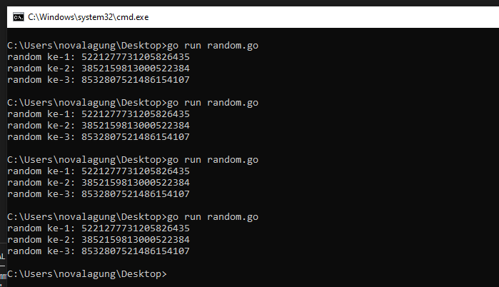
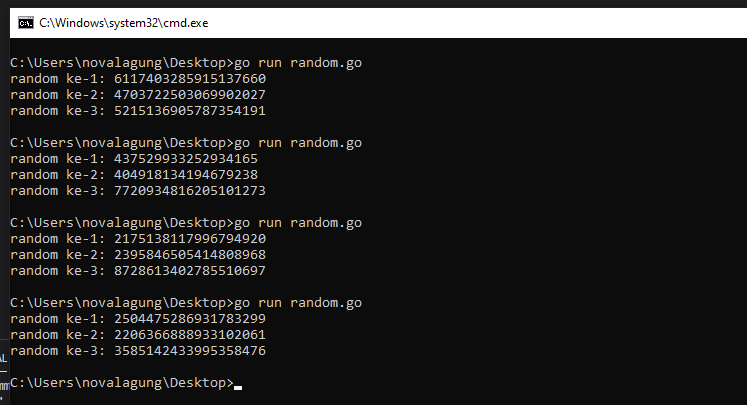

# A.39. Random

Pada chapter ini kita akan belajar pemanfaatan package `math/rand` untuk pembuatan data acak atau random.

## A.39.1. Definisi

Random Number Generator (RNG) merupakan sebuah perangkat (bisa software, bisa hardware) yang menghasilkan data deret/urutan angka yang sifatnya acak.

RNG bisa berupa hardware yang murni bisa menghasilkan data angka acak, atau bisa saja sebuah [pseudo-random](https://en.wikipedia.org/wiki/Pseudorandom_number_generator) yang menghasilkan deret angka-angka yang **terlihat acak** tetapi sebenarnya tidak benar-benar acak. Deret angka tersebut sebenarnya merupakan hasil kalkulasi algoritma deterministik dan probabilitas. Jadi untuk pseudo-random ini, asalkan kita tau *state*-nya maka kita akan bisa menebak hasil deret angka random-nya.

Dalam per-randoman-duniawi terdapat istilah **seed** atau titik mulai (*starting point*). Seed ini digunakan oleh RNG untuk pembuatan angka random.

Sedikit ilustrasi mengenai korelasi antara seed dengan RNG, agar lebih jelas.

- Dimisalkan saya menggunakan seed yaitu angka `10`, maka ketika fungsi RNG dijalankan untuk pertama kalinya, output angka yang dihasilkan pasti `5221277731205826435`. Angka random tersebut pasti *fix* dan akan selalu menjadi hasil pertama ketika seed yang digunakan adalah angka `10`.
- Misalnya lagi, fungsi RNG di-eksekusi untuk ke-dua kalinya, maka angka random kedua yang dihasilkan adalah pasti `3852159813000522384`. Dan seterusnya.
- Misalkan lagi, fungsi RNG di-eksekusi lagi, maka angka random ketiga pasti `8532807521486154107`.
- Jadi untuk seed angka `10`, akan selalu menghasilkan angka random ke-1: `5221277731205826435`, ke-2: `3852159813000522384`, ke-3 `8532807521486154107`. Meskipun fungsi random dijalankan di program yang berbeda, di waktu yang berbeda, di environment yang berbeda, jika seed adalah `10` maka deret angka random yang dihasilkan pasti sama seperti contoh di atas.

## A.39.2. Package `math/rand`

Go menyediakan package `math/rand`, isinya banyak sekali API untuk keperluan pembuatan angka random. Package ini mengadopsi **PRNG** atau *pseudo-random* number generator. Deret angka random yang dihasilkan sangat tergantung dengan angka **seed** yang digunakan.

Cara penggunaan package ini sangat mudah, cukup import `math/rand`, lalu tentukan nilai seed, kemudian panggil fungsi untuk generate angka random-nya. Lebih jelasnya silakan cek contoh berikut.

```go
package main

import (
    "fmt"
    "math/rand"
)

func main() {
    randomizer := rand.New(rand.NewSource(10))
    fmt.Println("random ke-1:", randomizer.Int()) // 5221277731205826435
    fmt.Println("random ke-2:", randomizer.Int()) // 3852159813000522384
    fmt.Println("random ke-3:", randomizer.Int()) // 8532807521486154107
}
```

Fungsi `rand.New(rand.NewSource(x))` digunakan untuk membuat object randomizer sekaligus penentuan nilai seed-nya. Dari object randomizer, method `Int()` bisa diakses, gunanya untuk generate angka random dalam bentuk numerik bertipe `int`. Statement `randomizer.Int()` ini setiap kali dipanggil akan menghasilkan angka berbeda, tapi jika diperhatikan angka-angka tersebut tidak berubah, pasti hanya angka-angka itu saja yang muncul.

Silakan coba sendiri kode di atas di local masing-masing, hasilnya pasti: 

- Angka random ke-1 akan selalu `5221277731205826435`
- Angka random ke-2 akan selalu `3852159813000522384`
- Angka random ke-3 akan selalu `8532807521486154107`

Jika perlu jalankan program di atas beberapa kali, hasilnya selalu sama untuk angka random ke-1, ke-2, dan seterusnya.



## A.39.3. Unique Seed

Lalu bagaimana cara agar angka yang dihasilkan selalu berbeda setiap kali dipanggil? Apakah harus set ulang seed-nya? Jangan, karena kalau seed di-set ulang maka urutan deret random akan berubah. Seed hanya perlu diset sekali di awal. Lalu apa solusi yang benar?

Jadi begini, setiap kali `randomizer.Int()` dipanggil, hasilnya itu selalu berbeda, tapi sangat bisa diprediksi jika kita tau seed-nya. Ada cara agar angka random yang dihasilkan tidak berulang-ulang seperti yang ada di contoh, caranya yaitu dengan menggunakan angka unik sebagai seed, contohnya seperti angka [unix nano](https://en.wikipedia.org/wiki/GNU_nano) yang didapat dari informasi waktu sekarang.

Coba modifikasi program dengan kode berikut, lalu jalankan ulang. Jangan lupa meng-import package `time` ya.

```go
randomizer := rand.New(rand.NewSource(time.Now().UTC().UnixNano()))
fmt.Println("random ke-1:", randomizer.Int())
fmt.Println("random ke-2:", randomizer.Int())
fmt.Println("random ke-3:", randomizer.Int())
```



Bisa dilihat, setiap program dieksekusi angka random nya selalu berbeda, hal ini karena seed yang digunakan pasti berbeda disetiap eksekusi program. Disitu seed yang digunakan adalah data numerik unix nano dari informasi waktu sekarang.

## A.39.4. Random Tipe Data Numerik Lainnya

Di dalam package `math/rand`, ada banyak fungsi untuk generate angka random. Method `Int()` milik object randomizer hanya salah satu dari fungsi yang tersedia di dalam package tersebut, yang gunanya adalah menghasilkan angka random bertipe `int`.

Selain itu, ada juga `randomizer.Float32()` yang menghasilkan angka random bertipe `float32`. Ada juga `randomizer.Uint32()` yang menghasilkan angka random bertipe *unsigned* int, dan lainnya.

Contoh penerapan fungsi-fungsi tersebut:

```go
randomizer := rand.New(rand.NewSource(time.Now().UTC().UnixNano()))
fmt.Println("random int:", randomizer.Int())
fmt.Println("random float32:", randomizer.Float32())
fmt.Println("random uint:", randomizer.Uint32())
```

Lebih jelasnya silakan merujuk ke https://pkg.go.dev/math/rand

## A.39.5. Angka Random Index Tertentu

Gunakan `randomizer.Intn(n)` untuk mendapatkan angka random dengan batas `0` hingga `n - 1`, contoh: `randomizer.Intn(100)` akan mengembalikan angka acak dari 0 hingga 99.

## A.39.6. Random Tipe Data String

Untuk menghasilkan data random string, ada banyak cara yang bisa diterapkan, salah satunya adalah dengan memanfaatkan alfabet dan hasil random numerik.

```go
var randomizer = rand.New(rand.NewSource(time.Now().UTC().UnixNano()))
var letters = []rune("abcdefghijklmnopqrstuvwxyzABCDEFGHIJKLMNOPQRSTUVWXYZ")

func randomString(length int) string {
    b := make([]rune, length)
    for i := range b {
        b[i] = letters[randomizer.Intn(len(letters))]
    }
    return string(b)
}

func main() {
    fmt.Println("random string 5 karakter:", randomString(5))
}
```

Dengan fungsi di atas kita bisa dengan mudah meng-generate string random dengan panjang karakter yang sudah ditentukan, misal `randomString(10)` akan menghasilkan random string 10 karakter.

## A.39.7. Global Random tanpa Seed Manual (Go 1.20+)

Sejak Go 1.20, fungsi-fungsi top-level di package `math/rand` (seperti `rand.Int()`, `rand.Intn()`, dan lainnya) sudah di-seed secara otomatis menggunakan nilai acak. Ini berarti untuk kebutuhan random sederhana yang tidak memerlukan reproduksibilitas, tidak perlu lagi membuat objek randomizer secara manual.

```go
package main

import (
    "fmt"
    "math/rand"
)

func main() {
    fmt.Println("random ke-1:", rand.Int())
    fmt.Println("random ke-2:", rand.Int())
    fmt.Println("random ke-3:", rand.Int())
}
```

Perlu diketahui juga bahwa fungsi `rand.Seed()` sudah deprecated sejak Go 1.20 dan sebaiknya tidak lagi digunakan. Sebagai gantinya, gunakan `rand.New(rand.NewSource(seed))` untuk random yang bisa direproduksi (seperti yang sudah kita pelajari di atas), atau cukup gunakan fungsi global tanpa perlu set seed untuk random biasa.

## A.39.8. Package `math/rand/v2` (Go 1.22+)

Sejak Go 1.22, Go menyediakan package `math/rand/v2` sebagai versi terbaru dari package random. Package ini memiliki API yang lebih bersih dan menggunakan algoritma yang lebih baik.

Beberapa perbedaan utama dari `math/rand/v2` dibanding versi sebelumnya:

- Method `Intn(n)` berubah nama menjadi `IntN(n)` (huruf N kapital)
- Tidak ada lagi fungsi `Seed()` di level global; semua global function selalu menggunakan seed otomatis
- Untuk random yang bisa direproduksi, gunakan `rand.New(rand.NewPCG(seed1, seed2))`

```go
package main

import (
    "fmt"
    "math/rand/v2"
)

func main() {
    // global random, auto-seeded
    fmt.Println("random int:", rand.Int())
    fmt.Println("random N:", rand.IntN(100))

    // reproducible random dengan seed tetap
    r := rand.New(rand.NewPCG(42, 0))
    fmt.Println("reproducible ke-1:", r.Int64())
    fmt.Println("reproducible ke-2:", r.Int64())
}
```

`rand.NewPCG(seed1, seed2)` menerima dua nilai `uint64` sebagai seed. Kombinasi kedua seed tersebut menentukan urutan angka random yang dihasilkan.

---

<div class="source-code-link">
    <div class="source-code-link-message">Source code praktik chapter ini tersedia di Github</div>
    <a href="https://github.com/novalagung/dasarpemrogramangolang-example/tree/master/chapter-A.39-random">https://github.com/novalagung/dasarpemrogramangolang-example/.../chapter-A.39...</a>
</div>

---

<iframe src="partial/ebooks.html" width="100%" height="390px" frameborder="0" scrolling="no"></iframe>
