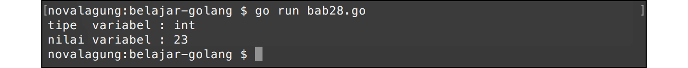
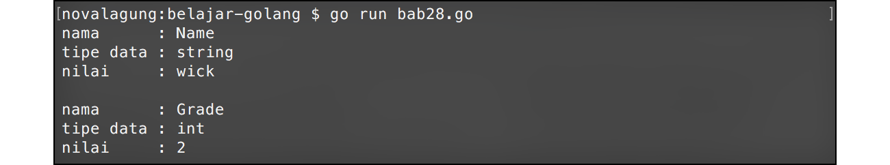
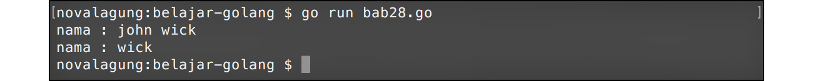

# A.29. Reflect

Reflection adalah teknik untuk inspeksi variabel, mengambil informasi dari suatu variabel untuk dilihat metadatanya atau untuk keperluan manipulasi. Cakupan informasi yang bisa didapatkan lewat reflection sangat luas, seperti melihat struktur variabel, tipe, nilai pointer, dan banyak lagi.

Go menyediakan package `reflect`, berisikan banyak sekali fungsi untuk keperluan reflection. Pada chapter ini, kita akan belajar tentang dasar penggunaan package tersebut.

Dari banyak fungsi yang tersedia di dalam package tersebut, ada 2 fungsi yang paling penting untuk diketahui, yaitu `reflect.ValueOf()` dan `reflect.TypeOf()`.

- Fungsi `reflect.ValueOf()` akan mengembalikan objek dalam tipe `reflect.Value`, yang berisikan informasi yang berhubungan dengan nilai/data variabel yang diinspeksi.
- Sedangkan `reflect.TypeOf()` mengembalikan objek dalam tipe `reflect.Type`. Objek tersebut berisikan informasi yang berhubungan dengan tipe data variabel yang diinspeksi.

## A.29.1. Mencari Tipe Data & Value Menggunakan Reflect

Dengan reflection, tipe data dan nilai variabel dapat diketahui dengan mudah. Contoh penerapannya bisa dilihat pada kode berikut.

```go
package main

import "fmt"
import "reflect"

func main() {
    var number = 23
    var reflectValue = reflect.ValueOf(number)

    fmt.Println("tipe  variabel :", reflectValue.Type())

    if reflectValue.Kind() == reflect.Int {
        fmt.Println("nilai variabel :", reflectValue.Int())
    }
}
```



Fungsi `reflect.valueOf()` memiliki parameter yang bisa menampung segala jenis tipe data. Fungsi tersebut mengembalikan objek dalam tipe `reflect.Value`, yang berisikan informasi mengenai variabel yang bersangkutan.

Objek `reflect.Value` memiliki beberapa method, salah satunya `Type()`. Method ini mengembalikan tipe data variabel yang bersangkutan dalam bentuk `string`.

Statement `reflectValue.Int()` menghasilkan nilai `int` dari variabel `number`. Untuk menampilkan nilai variabel reflect, harus dipastikan dulu tipe datanya. Ketika tipe data adalah `int`, maka bisa menggunakan method `Int()`. Ada banyak lagi method milik struct `reflect.Value` yang bisa digunakan untuk pengambilan nilai dalam bentuk tertentu, contohnya: `reflectValue.String()` digunakan untuk mengambil nilai `string`, `reflectValue.Float64()` untuk nilai `float64`, dan lainnya.

Perlu diketahui, fungsi yang digunakan harus sesuai dengan tipe data nilai yang ditampung variabel. Jika fungsi yang digunakan berbeda dengan tipe data variabelnya, maka dipastikan muncul error. Contohnya seperti pada variabel yang nilainya bertipe `float64`, penggunaan method `String()` di situ pasti menghasilkan error.

Diperlukan adanya pengecekan tipe data pada nilai yang disimpan, agar penggunaan method untuk pengambilan nilai bisa tepat. Salah satunya bisa dengan cara yang dicontohkan di atas, yaitu dengan mengecek dahulu apa jenis tipe datanya menggunakan method `Kind()`, setelah itu diambil nilainya dengan method yang sesuai.

List konstanta tipe data dan method yang bisa digunakan dalam *reflection* di Go bisa dilihat di https://pkg.go.dev/reflect#Kind

## Pengaksesan Nilai Dalam Bentuk `interface{}`

Jika nilai hanya diperlukan untuk ditampilkan ke output, bisa menggunakan `.Interface()`. Lewat method tersebut segala jenis nilai bisa diakses dengan mudah.

```go
var number = 23
var reflectValue = reflect.ValueOf(number)

fmt.Println("tipe  variabel :", reflectValue.Type())
fmt.Println("nilai variabel :", reflectValue.Interface())
```

Fungsi `Interface()` mengembalikan nilai interface kosong atau `interface{}` atau `any`. Nilai aslinya sendiri bisa diakses dengan meng-casting interface kosong tersebut menggunakan teknik *type assertion*.

```go
var nilai = reflectValue.Interface().(int)
```

## A.29.2. Pengaksesan Informasi Property Variabel Objek

Reflect API bisa digunakan untuk melihat metadata suatu property variabel objek cetakan struct, dengan catatan property-property tersebut bermodifier public. Contohnya bisa dilihat pada kode berikut.

Siapkan sebuah struct bernama `student`.

```go
type student struct {
    Name  string
    Grade int
}
```

Buat method baru untuk struct tersebut, dengan nama method `getPropertyInfo()`. Method ini berisikan kode untuk mengambil dan menampilkan informasi tiap property milik struct `student`.

```go
func (s *student) getPropertyInfo() {
    var reflectValue = reflect.ValueOf(s)

    if reflectValue.Kind() == reflect.Ptr {
        reflectValue = reflectValue.Elem()
    }

    var reflectType = reflectValue.Type()

    for i := 0; i < reflectValue.NumField(); i++ {
        fmt.Println("nama      :", reflectType.Field(i).Name)
        fmt.Println("tipe data :", reflectType.Field(i).Type)
        fmt.Println("nilai     :", reflectValue.Field(i).Interface())
        fmt.Println("")
    }
}
```

Terakhir, lakukan uji coba method `getPropertyInfo()` di fungsi `main()`.

```go
func main() {
    var s1 = &student{Name: "wick", Grade: 2}
    s1.getPropertyInfo()
}
```



Di dalam method `getPropertyInfo()` terjadi beberapa hal. Pertama objek `reflect.Value` dari variabel `s` diambil. Setelah itu dilakukan pengecekan apakah variabel objek tersebut merupakan pointer atau tidak (bisa dilihat dari `if reflectValue.Kind() == reflect.Ptr`, jika bernilai `true` maka variabel adalah pointer). jika ternyata variabel memang berisi pointer, maka perlu diambil data objek reflect aslinya via method `Elem()`.

Masih di dalam method `getPropertyInfo()`, dilakukan perulangan sebanyak jumlah property yang ada pada struct `student`. Method `NumField()` mengembalikan jumlah property publik yang ada dalam struct.

Di tiap perulangan, informasi tiap property struct diambil berurutan dengan lewat method `Field()`. Method ini ada pada tipe `reflect.Value` dan `reflect.Type`.

- `reflectType.Field(i).Name` mengembalikan nama property
- `reflectType.Field(i).Type` mengembalikan tipe data property
- `reflectValue.Field(i).Interface()` mengembalikan nilai property dalam bentuk `interface{}`

Pengambilan informasi property, selain menggunakan indeks, bisa diambil berdasarkan nama field dengan menggunakan method `FieldByName()`.

## A.29.3. Pengaksesan Informasi Method Variabel Objek

Informasi mengenai method juga bisa diakses lewat reflect, syaratnya masih sama seperti pada pengaksesan proprerty, yaitu harus bermodifier public.

Pada contoh di bawah ini informasi method `SetName()` akan diambil lewat reflection. Siapkan method baru di struct `student`, dengan nama `SetName()`.

```go
func (s *student) SetName(name string) {
    s.Name = name
}
```

Buat contoh penerapannya di fungsi `main()`.

```go
func main() {
    var s1 = &student{Name: "john wick", Grade: 2}
    fmt.Println("nama :", s1.Name)

    var reflectValue = reflect.ValueOf(s1)
    var method = reflectValue.MethodByName("SetName")
    method.Call([]reflect.Value{
        reflect.ValueOf("wick"),
    })

    fmt.Println("nama :", s1.Name)
}
```



Pada kode di atas, disiapkan variabel `s1` yang merupakan instance struct `student`. Variabel tersebut memiliki property `Name` yang nilainya ditentukan di awal, yaitu string `"john wick"`.

Setelah itu, data *reflection* nilai objek tersebut diambil, *reflection* method `SetName` juga diambil. Pengambilan *reflection* method dilakukan menggunakan `MethodByName` dengan argument adalah nama method yang diinginkan, atau bisa juga lewat indeks method-nya (menggunakan `Method(i)`).

Setelah *reflection* method yang dicari sudah didapatkan, `Call()` dipanggil untuk eksekusi method.

Jika eksekusi method diikuti pengisian parameter, maka parameternya harus ditulis dalam bentuk array `[]reflect.Value` berurutan sesuai urutan deklarasi parameter-nya. Dan nilai yang dimasukkan ke array tersebut harus dalam bentuk `reflect.Value` (gunakan `reflect.ValueOf()` untuk pengambilannya).

```go
[]reflect.Value{
    reflect.ValueOf("wick"),
}
```

---

<div class="source-code-link">
    <div class="source-code-link-message">Source code praktik chapter ini tersedia di Github</div>
    <a href="https://github.com/novalagung/dasarpemrogramangolang-example/tree/master/chapter-A.29-reflect">https://github.com/novalagung/dasarpemrogramangolang-example/.../chapter-A.29...</a>
</div>

---

<iframe src="partial/ebooks.html" width="100%" height="390px" frameborder="0" scrolling="no"></iframe>
