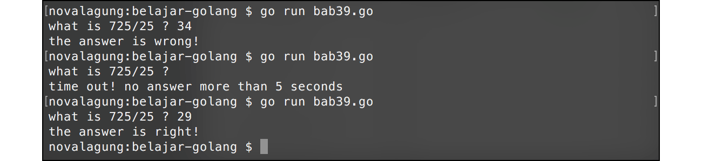

# A.41. Timer, Ticker, & Scheduler

Ada beberapa fungsi dalam package `time` yang bisa dimanfaatkan untuk operasi penundaan eksekusi, countdown timer, dan pengaturan jadwal eksekusi sebuah proses.

## A.41.1. Fungsi `time.Sleep()`

Fungsi ini digunakan untuk menghentikan program sejenak. `time.Sleep()` bersifat **blocking**, statement di bawahnya tidak akan dieksekusi sampai pemberhentian usai. Contoh sederhana penerapan bisa dilihat pada kode berikut.

```go
package main

import "fmt"
import "time"

func main () {
    fmt.Println("start")
    time.Sleep(time.Second * 4)
    fmt.Println("after 4 seconds")
}
```

Hasilnya, tulisan `"start"` muncul, lalu 4 detik kemudian tulisan `"after 4 seconds"` muncul.

## A.41.2. Scheduler Menggunakan `time.Sleep()`

Selain untuk blocking proses, fungsi `time.Sleep()` ini bisa dimanfaatkan untuk membuat scheduler sederhana, contohnya seperti berikut, scheduler untuk menampilkan pesan halo setiap 1 detik.

```go
for true {
    fmt.Println("Hello !!")
    time.Sleep(1 * time.Second)
}
```

## A.41.3. Fungsi `time.NewTimer()`

Fungsi ini sedikit berbeda dengan `time.Sleep()`. Fungsi `time.NewTimer()` mengembalikan objek bertipe `*time.Timer` yang memiliki property `C` yang bertipe channel.

Cara kerja fungsi ini: setelah jeda waktu yang ditentukan sebuah data akan dikirimkan lewat channel `C`. Penggunaan fungsi ini harus diikuti dengan statement untuk penerimaan data dari channel `C`.

Untuk lebih jelasnya silakan perhatikan kode berikut.

```go
var timer = time.NewTimer(4 * time.Second)
fmt.Println("start")
<-timer.C
fmt.Println("finish")
```

Statement `var timer = time.NewTimer(4 * time.Second)` mengindikasikan bahwa nantinya akan ada data yang dikirimkan ke channel `timer.C` setelah 4 detik berlalu. Baris kode `<-timer.C` menandakan penerimaan data dari channel `timer.C`. Karena penerimaan channel sendiri sifatnya adalah blocking, maka statement `fmt.Println("finish")` baru akan dieksekusi setelah **4 detik**.

Hasil program di atas adalah tulisan `"start"` muncul, lalu setelah 4 detik tulisan `"finish"` muncul.

## A.41.4. Fungsi `time.AfterFunc()`

Fungsi `time.AfterFunc()` memiliki 2 parameter. Parameter pertama adalah durasi timer, dan parameter kedua adalah *callback* nya. Callback tersebut akan dieksekusi jika waktu sudah memenuhi durasi timer.

```go
var ch = make(chan bool)

time.AfterFunc(4*time.Second, func() {
    fmt.Println("expired")
    ch <- true
})

fmt.Println("start")
<-ch
fmt.Println("finish")
```

Hasil dari kode di atas, tulisan `"start"` muncul kemudian setelah 4 detik berlalu, tulisan `"expired"` muncul.

Di dalam callback terdapat proses transfer data lewat channel, menjadikan tulisan `"finish"` akan muncul tepat setelah tulisan `"expired"` muncul.

Beberapa hal yang perlu diketahui ketika menggunakan fungsi ini:

 - Jika tidak ada serah terima data lewat channel, maka eksekusi `time.AfterFunc()` adalah asynchronous (tidak blocking).
 - Jika ada serah terima data lewat channel, maka fungsi akan tetap berjalan asynchronous hingga baris kode di mana penerimaan data channel dilakukan. Proses blocking nya berada pada baris kode penerimaan channel.

## A.41.5. Fungsi `time.After()`

Kegunaan fungsi ini mirip seperti `time.Sleep()`. Perbedaannya adalah, fungsi `timer.After()` akan mengembalikan data channel, sehingga perlu menggunakan tanda `<-` dalam penerapannya.

```go
<-time.After(4 * time.Second)
fmt.Println("expired")
```

Tulisan `"expired"` akan muncul setelah 4 detik.

## A.41.6. Scheduler Menggunakan Ticker

Selain fungsi-fungsi untuk keperluan timer, Go juga menyediakan fungsi scheduler (yang di sini kita sebut sebagai ticker).

Cara penggunaan ticker cukup mudah, buat objek ticker baru menggunakan `time.NewTicker()` isi argument dengan durasi yang diinginkan. Dari objek tersebut kita bisa akses properti `.C` yang merupakan channel. Setiap durasi yang sudah ditentukan, objek ticker akan mengirimkan informasi date-time via channel tersebut.

```go
package main

import (
	"fmt"
	"time"
)

func main() {
	done := make(chan bool)
	ticker := time.NewTicker(time.Second)

	go func() {
		time.Sleep(10 * time.Second) // wait for 10 seconds
		done <- true
	}()

	for {
		select {
		case <-done:
			ticker.Stop()
			return
		case t := <-ticker.C:
			fmt.Println("Hello !!", t)
		}
	}
}

```

Pada contoh di atas bisa dilihat, selain ticker disiapkan juga variabel channel `done`. Variabel ini kita gunakan untuk mengontrol kapan ticker harus di stop.

Cara kerja program di atas: teknik `for` - `select` pada channel digunakan untuk mengecek penerimaan data dari channel `done` dan `ticker.C`. By default, channel `ticker.C` akan menerima kiriman data setiap `X` duration yang di mana pada kode di atas adalah 1 detik (lihat argumen inisialisasi objek ticker).

Data yang dikirimkan via channel `ticker.C` adalah data date-time kapan event itu terjadi. Pada kode di atas, setiap ada kiriman data via channel tersebut kita tampilkan.

Sebelum blok kode perulangan `for`, bisa kita lihat ada goroutine baru di-dispatch, isinya adalah mengirim data ke channel `done` setelah 10 detik. Data tersebut nantinya akan diterima oleh blok kode `for` - `select`, dan ketika itu terjadi, method `.Stop()` milik objek ticker dipanggil untuk menonaktifkan scheduler pada ticker tersebut.

Jadi, selama 10 detik, di setiap detiknya akan muncul pesan halo.

## A.41.7. Kombinasi Timer & Goroutine

Berikut merupakan contoh penerapan timer dan goroutine. Program di bawah ini adalah program tanya-jawab sederhana. Sebuah pertanyaan muncul dan user harus menginputkan jawaban dalam waktu tidak lebih dari 5 detik. Jika 5 detik berlalu dan belum ada jawaban, maka akan muncul pesan *time out*.

OK langsung saja, mari kita buat programnya, pertama, import package yang diperlukan.

```go
package main

import "fmt"
import "os"
import "time"
```

Buat fungsi `timer()`, nantinya fungsi ini dieksekusi sebagai goroutine. Di dalam fungsi `timer()` terdapat blok kode jika waktu sudah mencapai `timeout`, maka sebuah data dikirimkan lewat channel `ch`.

```go
func timer(timeout int, ch chan<- bool) {
    time.AfterFunc(time.Duration(timeout)*time.Second, func() {
        ch <- true
    })
}
```

Siapkan juga fungsi `watcher()`. Fungsi ini juga akan dieksekusi sebagai goroutine. Tugasnya cukup sederhana, yaitu menerima data dari channel `ch` (jika ada penerimaan data, berarti sudah masuk waktu timeout), lalu menampilkan pesan bahwa waktu telah habis.

```go
func watcher(timeout int, ch <-chan bool) {
    <-ch
    fmt.Println("\ntime out! no answer more than", timeout, "seconds")
    os.Exit(0)
}
```

Terakhir, buat implementasi di fungsi `main()`.

```go
func main() {
    var timeout = 5
    var ch = make(chan bool)

    go timer(timeout, ch)
    go watcher(timeout, ch)

    var input string
    fmt.Print("what is 725/25 ? ")
    fmt.Scan(&input)

    if input == "29" {
        fmt.Println("the answer is right!")
    } else {
        fmt.Println("the answer is wrong!")
    }
}
```

Ketika user tidak menginputkan apa-apa dalam kurun waktu 5 detik, pesan timeout muncul lalu program berhenti.



---

<div class="source-code-link">
    <div class="source-code-link-message">Source code praktek chapter ini tersedia di Github</div>
    <a href="https://github.com/novalagung/dasarpemrogramangolang-example/tree/master/chapter-A.41-timer-ticker-scheduler">https://github.com/novalagung/dasarpemrogramangolang-example/.../chapter-A.41...</a>
</div>

---

<iframe src="partial/ebooks.html" width="100%" height="390px" frameborder="0" scrolling="no"></iframe>
