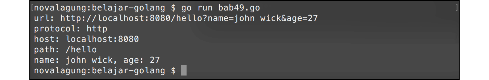

# A.52. URL Parsing

Data string berisi informasi URL bisa dikonversi ke tipe data `url.URL`. Dengan menggunakan tipe `url.URL`, akan ada banyak informasi yang bisa kita dapatkan dengan mudah, di antaranya seperti jenis protokol yang digunakan, path yang diakses, query, dan lainnya.

Berikut adalah contoh sederhana konversi string ke `url.URL`.

```go
package main

import "fmt"
import "net/url"

func main() {
    var urlString = "http://localhost:8080/hello?name=john wick&age=27"
    var u, e = url.Parse(urlString)
    if e != nil {
        fmt.Println(e.Error())
        return
    }

    fmt.Printf("url: %s\n", urlString)

    fmt.Printf("protocol: %s\n", u.Scheme) // http
    fmt.Printf("host: %s\n", u.Host)       // localhost:8080
    fmt.Printf("path: %s\n", u.Path)       // /hello

    var name = u.Query()["name"][0] // john wick
    var age = u.Query()["age"][0]   // 27
    fmt.Printf("name: %s, age: %s\n", name, age)
}
```

Fungsi `url.Parse()` digunakan untuk parsing string ke bentuk url. Fungsi ini mengembalikan 2 data, variabel objek bertipe `*url.URL` dan error (jika ada). Lewat variabel objek tersebut pengaksesan informasi url akan menjadi lebih mudah, contohnya seperti nama host bisa didapatkan lewat `u.Host`, protokol lewat `u.Scheme`, dan lainnya.

Selain itu, query yang ada pada url akan otomatis diparsing juga, menjadi bentuk `map[string][]string`, dengan key adalah nama elemen query, dan value array string yang berisikan value elemen query.



## A.52.1. Fungsi url.JoinPath (Go 1.19+)

Sejak Go 1.19, tersedia fungsi `url.JoinPath()` dan method `(*url.URL).JoinPath()` untuk menggabungkan segmen path URL secara aman. Fungsi ini otomatis melakukan encoding karakter khusus pada setiap segmen path yang diberikan.

```go
package main

import (
    "fmt"
    "net/url"
)

func main() {
    base := "http://localhost:8080/api"

    joined, err := url.JoinPath(base, "v1", "users", "john wick")
    if err != nil {
        fmt.Println(err.Error())
        return
    }
    fmt.Println(joined)
    // http://localhost:8080/api/v1/users/john%20wick

    u, _ := url.Parse(base)
    joined2, _ := u.JoinPath("v2", "items")
    fmt.Println(joined2)
    // http://localhost:8080/api/v2/items
}
```

Pada contoh di atas, spasi pada `"john wick"` otomatis di-encode menjadi `%20` pada URL hasil penggabungan. Pendekatan ini lebih aman dibanding penggabungan string manual karena encoding dilakukan secara otomatis per segmen.

---

<div class="source-code-link">
    <div class="source-code-link-message">Source code praktik chapter ini tersedia di Github</div>
    <a href="https://github.com/novalagung/dasarpemrogramangolang-example/tree/master/chapter-A.52-url-parsing">https://github.com/novalagung/dasarpemrogramangolang-example/.../chapter-A.52...</a>
</div>

---

<iframe src="partial/ebooks.html" width="100%" height="390px" frameborder="0" scrolling="no"></iframe>
