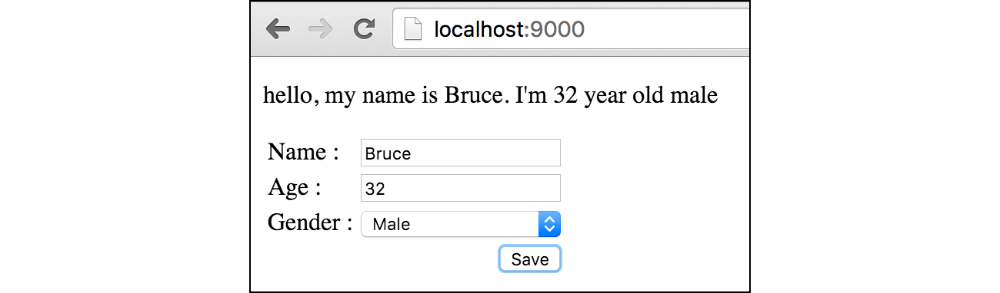
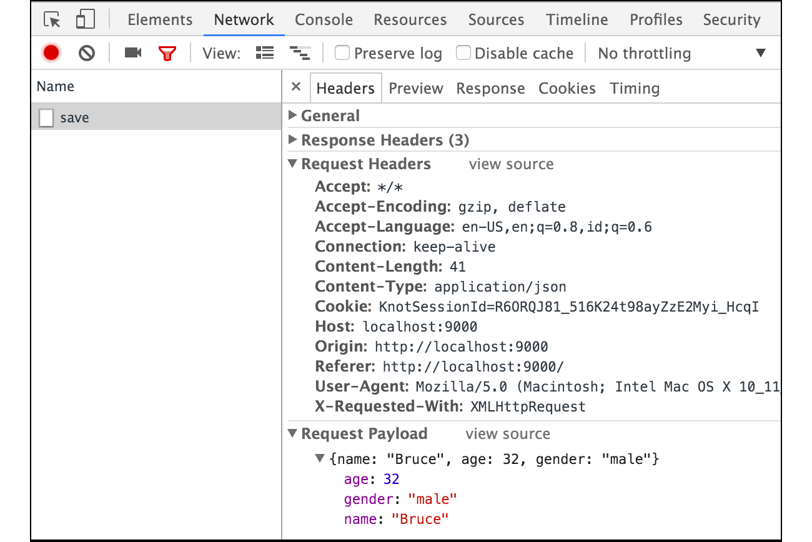

# B.14. AJAX JSON Payload

Sebelumnya kita telah mempelajari cara submit data dari front-end ke back-end dengan menggunakan payload **Form Data**. Kali ini kita akan belajar tentang cara request menggunakan payload **JSON**.

> **Form Data** merupakan tipe payload default HTTP request via tag `<form />`

Pada chapter ini, kita tidak akan menggunakan tag `<form />` untuk submit data, melainkan dengan memanfaatkan teknik AJAX (Asynchronous JavaScript And XML) dengan payload JSON.

Sebenarnya [perbedaan](http://stackoverflow.com/a/23152367/1467988) antara kedua jenis request tersebut ada di dua hal, yaitu isi header `Content-Type` dan struktur informasi dikirimkan. Request lewat `<form />` secara default memiliki content type `application/x-www-form-urlencoded`, efeknya data dikirimkan dalam bentuk query string (key-value) seperti `id=n001&nama=bruce`.

> Pengiriman data via tag `<form />` sebenarnya bisa menggunakan content-type selain `application/x-www-form-urlencoded`, yaitu `multipart/form-data`.

Untuk payload JSON, `Content-Type` yang digunakan adalah `application/json`. Dengannya, data disisipkan di dalam `Body` request dalam bentuk **JSON** string.

## B.14.1. Struktur Folder Proyek 

OK, mari praktek. Pertama siapkan proyek dengan struktur seperti gambar berikut.


> Silakan unduh file JS jQuery dari situs official-nya.

## B.14.2. Front End - HTML

Layout dari view perlu disiapkan terlebih dahulu, tulis kode berikut pada file `view.html`.

```html
<!DOCTYPE html>
<html>
	<head>
		<title>JSON Payload</title>
		<script src="static/jquery-1.12.0.min.js"></script>
		<script>
			$(function () {
				// javascript code here
			});
		</script>
	</head>
	<body>
		<p class="message"></p>
		<form id="user-form" method="post" action="/save">
			<!-- html code here -->
		</form>
	</body>
</html>
```

Selanjutnya, pada tag `<form />` tambahkan tabel sederhana dengan isi didalamnya adalah inputan form. Ada tiga buah inputan yang perlu dibuat yaitu: *Name*, *Age*, dan *Gender*. Selain itu, sebuah button untuk keperluan submit form juga perlu disiapkan.

```html
<table noborder>
	<tr>
		<td><label>Name :</label></td>
		<td>
			<input required type="text" name="name" placeholder="Type name here" />
		</td>
	</tr>
	<tr>
		<td><label>Age :</label></td>
		<td>
			<input required type="number" name="age" placeholder="Set age" />
		</td>
	</tr>
	<tr>
		<td><label>Gender :</label></td>
		<td>
			<select name="gender" required style="width: 100%;">
				<option value="">Select one</option>
				<option value="male">Male</option>
				<option value="female">Female</option>
			</select>
		</td>
	</tr>
	<tr>
		<td colspan="2" style="text-align: right;">
			<button type="submit">Save</button>
		</td>
	</tr>
</table>
```

## B.14.3. Front End - HTML

Sekarang kita masuk ke bagian paling menyenangkan/menyebalkan (tergantung taste), yaitu javascript. Siapkan sebuah event `submit` pada `#user-form`. Default handler untuk event submit milik `<form />` di-override, diganti dengan AJAX request.

```js
$("#user-form").on("submit", function (e) {
	e.preventDefault();

	var $self = $(this);
	var payload = JSON.stringify({
		name: $('[name="name"]').val(),
		age: parseInt($('[name="age"]').val(), 10),
		gender: $('[name="gender"]').val()
	});

	$.ajax({
		url: $self.attr("action"),
		type: $self.attr("method"),
		data: payload,
		contentType: 'application/json',
	}).then(function (res) {
		$(".message").text(res);
	}).catch(function (a) {
		alert("ERROR: " + a.responseText);
	});
});
```

Value semua inputan dalam form diambil, kemudian dimasukkan ke sebuah objek lalu di stringify, agar berubah menjadi JSON string untuk kemudian di jadikan sebagai payload request. Bisa dilihat pada kode AJAX di atas, `contentType` nilainya adalah `application/json`. 

Respon dari AJAX di atas nantinya dimunculkan pada `<p class="message"></p>`.

## B.14.4. Back End

3 buah rute perlu disiapkan, yang pertama adalah untuk menampilkan `view.html`, untuk keperluan submit data, dan registrasi asset.

```go
package main

import "fmt"
import "net/http"
import "html/template"
import "encoding/json"

func main() {
	http.HandleFunc("/", handleIndex)
	http.HandleFunc("/save", handleSave)

	http.Handle("/static/", 
		http.StripPrefix("/static/", 
			http.FileServer(http.Dir("assets"))))

	fmt.Println("server started at localhost:9000")
	http.ListenAndServe(":9000", nil)
}
```

Handler `handleIndex` berisikan kode untuk parsing `view.html`.

```go
func handleIndex(w http.ResponseWriter, r *http.Request) {
	tmpl := template.Must(template.ParseFiles("view.html"))
	if err := tmpl.Execute(w, nil); err != nil {
		http.Error(w, err.Error(), http.StatusInternalServerError)
	}
}
```

Sedangkan `handleSave` akan memproses request yang di-submit dari front-end.

```go
func handleSave(w http.ResponseWriter, r *http.Request) {
	if r.Method == "POST" {
		decoder := json.NewDecoder(r.Body)
		payload := struct {
			Name   string `json:"name"`
			Age    int    `json:"age"`
			Gender string `json:"gender"`
		}{}
		if err := decoder.Decode(&payload); err != nil {
			http.Error(w, err.Error(), http.StatusInternalServerError)
			return
		}

		message := fmt.Sprintf(
			"hello, my name is %s. I'm %d year old %s", 
			payload.Name, 
			payload.Age, 
			payload.Gender,
		)
		w.Write([]byte(message))
		return
	}

	http.Error(w, "Only accept POST request", http.StatusBadRequest)
}
```

Isi payload didapatkan dengan cara men-decode body request (`r.Body`). Proses decoding tidak dilakukan menggunakan `json.Unmarshal()` melainkan lewat JSON decoder dengan alasan [efisiensinya lebih baik](http://stackoverflow.com/a/21198571/1467988).

- `json.Decoder` cocok digunakan untuk decode data JSON yang sumber datanya adalah stream `io.Reader`, contohnya seperti `r.Body`.
- `json.Unmarshal()` cocok untuk proses decoding yang sumber datanya sudah tersimpan di variabel (bukan stream).

## B.14.5. Test

Jalankan program yang telah dibuat, test hasilnya di browser.



Gunakan fasilitas Developer Tools pada Chrome untuk menginspeksi aktifitas AJAX-nya.



---

<div class="source-code-link">
    <div class="source-code-link-message">Source code praktik chapter ini tersedia di Github</div>
    <a href="https://github.com/novalagung/dasarpemrogramangolang-example/tree/master/chapter-B.14-ajax-json-payload">https://github.com/novalagung/dasarpemrogramangolang-example/.../chapter-B.14...</a>
</div>

---

<iframe src="partial/ebooks.html" width="100%" height="390px" frameborder="0" scrolling="no"></iframe>
