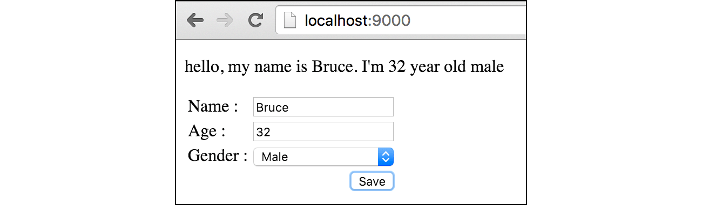
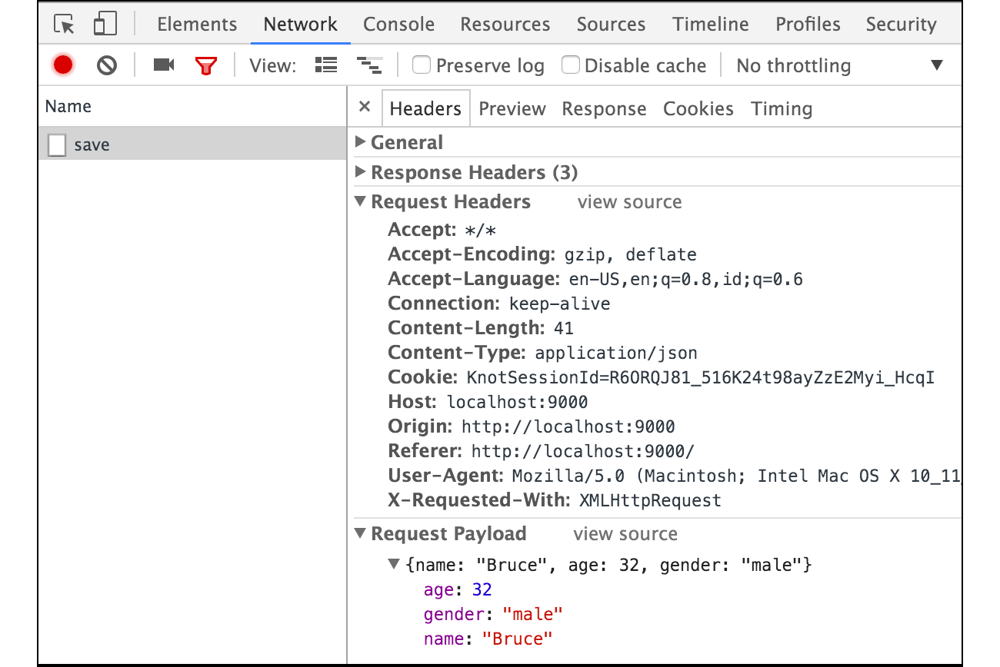

# B.14. HTTP Request JSON Payload

Sebelumnya kita telah mempelajari cara submit data dari front-end ke back-end dengan menggunakan payload **Form Data**. Kali ini kita akan belajar tentang cara request menggunakan payload **JSON**.

> **Form Data** merupakan tipe payload default HTTP request via tag `<form />`

Pada chapter ini, kita tidak akan menggunakan tag `<form />` untuk submit data, melainkan dengan memanfaatkan **Fetch API** untuk mengirimkan HTTP request dengan payload JSON.

Sebenarnya [perbedaan](http://stackoverflow.com/a/23152367/1467988) antara kedua jenis request tersebut ada di dua hal, yaitu isi header `Content-Type` dan struktur informasi dikirimkan. Request lewat `<form />` secara default memiliki content type `application/x-www-form-urlencoded`, efeknya data dikirimkan dalam bentuk query string (key-value) seperti `id=n001&nama=bruce`.

> Pengiriman data via tag `<form />` sebenarnya bisa menggunakan content-type selain `application/x-www-form-urlencoded`, yaitu `multipart/form-data`.

Untuk payload JSON, `Content-Type` yang digunakan adalah `application/json`. Dengannya, data disisipkan di dalam `Body` request dalam bentuk **JSON** string.

## B.14.1. Struktur Folder Proyek

OK, mari praktik. Pertama siapkan proyek dengan struktur berikut.

```
chapter-B.14-http-request-json-payload/
├── main.go
└── view.html
```

## B.14.2. Front End - HTML

Layout dari view perlu disiapkan terlebih dahulu, tulis kode berikut pada file `view.html`.

```html
<!DOCTYPE html>
<html>
    <head>
        <title>JSON Payload</title>
        <script>
            document.addEventListener("DOMContentLoaded", function () {
                // javascript code here
            });
        </script>
    </head>
    <body>
        <p class="message"></p>
        <form id="user-form" method="post" action="/save">
            <!-- html code here -->
        </form>
    </body>
</html>
```

Selanjutnya, pada tag `<form />` tambahkan tabel sederhana dengan isi didalamnya adalah inputan form. Ada tiga buah inputan yang perlu dibuat yaitu: *Name*, *Age*, dan *Gender*. Selain itu, sebuah button untuk keperluan submit form juga perlu disiapkan.

```html
<table noborder>
    <tr>
        <td><label>Name :</label></td>
        <td>
            <input required type="text" name="name" placeholder="Type name here" />
        </td>
    </tr>
    <tr>
        <td><label>Age :</label></td>
        <td>
            <input required type="number" name="age" placeholder="Set age" />
        </td>
    </tr>
    <tr>
        <td><label>Gender :</label></td>
        <td>
            <select name="gender" required style="width: 100%;">
                <option value="">Select one</option>
                <option value="male">Male</option>
                <option value="female">Female</option>
            </select>
        </td>
    </tr>
    <tr>
        <td colspan="2" style="text-align: right;">
            <button type="submit">Save</button>
        </td>
    </tr>
</table>
```

## B.14.3. Front End - JavaScript

Sekarang kita masuk ke bagian JavaScript. Siapkan event listener `submit` pada form `#user-form`. Default behavior submit form di-override menggunakan `e.preventDefault()`, kemudian data dikirim ke server menggunakan Fetch API.

```js
document.getElementById("user-form").addEventListener("submit", async function (e) {
    e.preventDefault();

    const form = e.target;
    const payload = JSON.stringify({
        name: document.querySelector('[name="name"]').value,
        age: parseInt(document.querySelector('[name="age"]').value, 10),
        gender: document.querySelector('[name="gender"]').value,
    });

    try {
        const res = await fetch(form.action, {
            method: form.method,
            headers: { "Content-Type": "application/json" },
            body: payload,
        });
        const text = await res.text();
        if (!res.ok) throw new Error(text);
        document.querySelector(".message").textContent = text;
    } catch (err) {
        alert("ERROR: " + err.message);
    }
});
```

Value semua inputan dalam form diambil menggunakan `document.querySelector()`, dimasukkan ke sebuah objek, lalu di-stringify menjadi JSON string untuk dijadikan payload request. Header `Content-Type` di-set ke `application/json` agar server tahu format data yang dikirimkan.

Fungsi `fetch()` dipanggil dengan `method`, `headers`, dan `body` sesuai konfigurasi form. Karena `fetch()` mengembalikan Promise, keyword `async/await` digunakan untuk menunggu respons secara asinkron. Jika respons HTTP bukan status 2xx (misalnya 4xx atau 5xx), error dilempar dan ditampilkan via `alert()`. Jika request berhasil, teks respons ditampilkan pada `<p class="message"></p>`.

## B.14.4. Back End

2 buah rute perlu disiapkan: satu untuk menampilkan `view.html`, satu lagi untuk memproses data yang di-submit.

```go
package main

import (
    "encoding/json"
    "fmt"
    "html/template"
    "log"
    "net/http"
)

func main() {
    http.HandleFunc("/", handleIndex)
    http.HandleFunc("/save", handleSave)

    log.Println("server started at localhost:9000")
    err := http.ListenAndServe(":9000", nil)
    if err != nil {
        log.Fatal(err)
    }
}
```

Handler `handleIndex` berisikan kode untuk parsing `view.html`.

```go
func handleIndex(w http.ResponseWriter, r *http.Request) {
    tmpl := template.Must(template.ParseFiles("view.html"))
    if err := tmpl.Execute(w, nil); err != nil {
        http.Error(w, err.Error(), http.StatusInternalServerError)
    }
}
```

Sedangkan `handleSave` akan memproses request yang di-submit dari front-end.

```go
func handleSave(w http.ResponseWriter, r *http.Request) {
    if r.Method == "POST" {
        decoder := json.NewDecoder(r.Body)
        payload := struct {
            Name   string `json:"name"`
            Age    int    `json:"age"`
            Gender string `json:"gender"`
        }{}
        if err := decoder.Decode(&payload); err != nil {
            http.Error(w, err.Error(), http.StatusInternalServerError)
            return
        }

        message := fmt.Sprintf(
            "hello, my name is %s. I'm %d year old %s", 
            payload.Name, 
            payload.Age, 
            payload.Gender,
        )
        w.Write([]byte(message))
        return
    }

    http.Error(w, "Only accept POST request", http.StatusBadRequest)
}
```

Isi payload didapatkan dengan cara men-decode body request (`r.Body`). Proses decoding tidak dilakukan menggunakan `json.Unmarshal()` melainkan lewat JSON decoder dengan alasan [efisiensinya lebih baik](http://stackoverflow.com/a/21198571/1467988).

- `json.Decoder` cocok digunakan untuk decode data JSON yang sumber datanya adalah stream `io.Reader`, contohnya seperti `r.Body`.
- `json.Unmarshal()` cocok untuk proses decoding yang sumber datanya sudah tersimpan di variabel (bukan stream).

## B.14.5. Testing

Jalankan program yang telah dibuat, test hasilnya di browser.



Gunakan fasilitas Developer Tools pada Chrome untuk menginspeksi aktifitas HTTP request-nya.



---

<div class="source-code-link">
    <div class="source-code-link-message">Source code praktik chapter ini tersedia di Github</div>
    <a href="https://github.com/novalagung/dasarpemrogramangolang-example/tree/master/chapter-B.14-ajax-json-payload">https://github.com/novalagung/dasarpemrogramangolang-example/.../chapter-B.14...</a>
</div>

---

<iframe src="partial/ebooks.html" width="100%" height="390px" frameborder="0" scrolling="no"></iframe>
