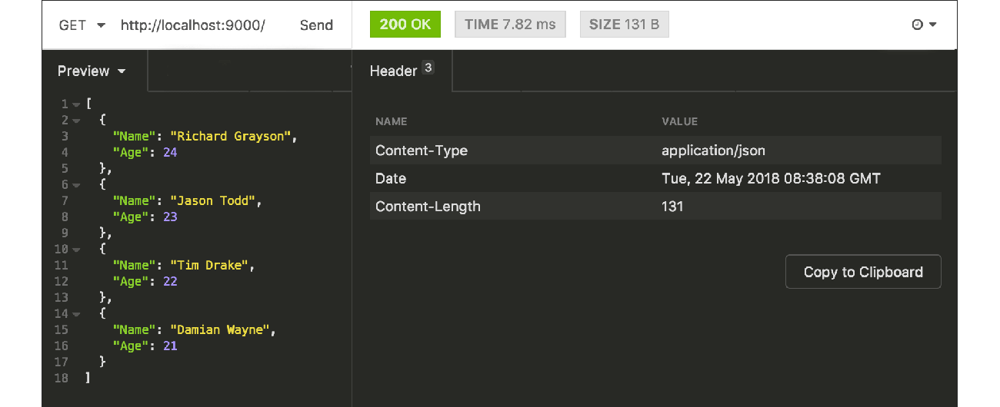

# B.15. AJAX JSON Response

Kita telah belajar cara untuk memproses request dengan payload bertipe JSON di chapter sebelumnya. Pembelajaran kali ini masih tentang tipe data JSON tapi lebih fokus ke bagian back-end-nya, yaitu membuat sebuah Web Service API sederhana yang mengembalikan response berbentuk JSON.

## B.15.1. Praktek

Siapkan satu buah folder proyek baru, dengan satu buah file di dalamnya bernama `main.go`. Dalam file ini siapkan rute `/`.

```go
package main

import "fmt"
import "net/http"
import "encoding/json"

func main() {
    http.HandleFunc("/", ActionIndex)

    fmt.Println("server started at localhost:9000")
    http.ListenAndServe(":9000", nil)
}
```

Selanjutnya buat handler untuk rute `/`. Di dalam fungsi tersenit, disiapkan data dummy ber-tipe slice object. Data ini kemudian dikonversi ke JSON lalu dijadikan nilai balik endpoint `/`.

```go
func ActionIndex(w http.ResponseWriter, r *http.Request) {
    data := [] struct {
        Name string
        Age  int
    } {
        { "Richard Grayson", 24 },
        { "Jason Todd", 23 },
        { "Tim Drake", 22 },
        { "Damian Wayne", 21 },
    }

    jsonInBytes, err := json.Marshal(data)
    if err != nil {
        http.Error(w, err.Error(), http.StatusInternalServerError)
        return
    }

    w.Header().Set("Content-Type", "application/json")
    w.Write(jsonInBytes)
}
```

Cara mengkonversi data ke bentuk json cukup mudah, bisa menggunakan `json.Marshal()`. Fungsi ini mengembalikan dua nilai balik, data JSON dalam bentuk `[]byte`, dan error jika ada. 

> Untuk mengambil bentuk string dari hasil konversi JSON, cukup lakukan casting pada data slice bytes tersebut. Contoh: `string(jsonInBytes)`

Karena nilai balik konversi sudah dalam bentuk bytes, maka langsung saja panggil method `Write()` milik `http.ResponseWriter` untuk menjadikannya sebagai API response. Panggil method tersebut, kemudian sisipkan data JSON sebagai argument pemanggilan method.

Jangan lupa juga untuk menambahkan response header `Content-Type: application/json`.

## B.15.2. Testing

OK, semua sudah selesai, jalankan program lalu test API-nya.



## B.15.3. JSON Response menggunakan JSON.Encoder

Pada chapter sebelumnya telah disinggung bahwa lebih baik menggunakan `json.Decoder` jika ingin men-decode data yang sumbernya ada di stream `io.Reader`

Selain `json.Decoder`, ada juga `json.Encoder` yang penggunaannya adalah untuk meng-encode data menjadi JSON dengan output langsung disimpan ke stream `io.Reader`. 

Tipe `http.ResponseWriter` adalah meng-embed `io.Reader`, maka tipe tersebut bisa kita gunakan pada proses encoding menggunakan `json.Encoder`. Contoh penerapannya bisa dilihat berikut ini.

```go
w.Header().Set("Content-Type", "application/json")

err := json.NewEncoder(w).Encode(data)
if err != nil {
    http.Error(w, err.Error(), http.StatusInternalServerError)
    return
}
```

Kode di atas hasilnya ekuivalen dengan encoding data object ke JSON string menggunakan `json.Marshal()`.

---

<div class="source-code-link">
    <div class="source-code-link-message">Source code praktik chapter ini tersedia di Github</div>
    <a href="https://github.com/novalagung/dasarpemrogramangolang-example/tree/master/chapter-B.15-ajax-json-response">https://github.com/novalagung/dasarpemrogramangolang-example/.../chapter-B.15...</a>
</div>

---

<iframe src="partial/ebooks.html" width="100%" height="390px" frameborder="0" scrolling="no"></iframe>
