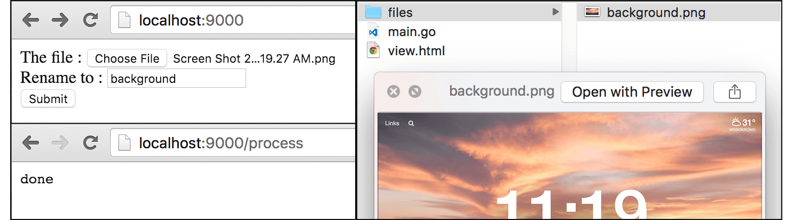

# B.13. Form Upload File

Pada bagian ini kita akan belajar bagaimana cara meng-handle upload file lewat form. Di beberapa bagian caranya mirip seperti pada chapter sebelumnya, hanya perlu ditambahkan proses untuk handling file yang di-upload. File tersebut disimpan ke dalam path/folder tertentu.

## B.13.1. Struktur Folder Proyek

Sebelum mulai masuk ke bagian koding, siapkan terlebih dahulu file dan folder dengan struktur seperti gambar berikut.


Program sederhana yang akan kita buat, memiliki satu form dengan 2 inputan, alias dan file. Data file nantinya disimpan pada folder `files` yang telah dibuat, dengan nama sesuai nama file aslinya. Kecuali ketika user mengisi inputan alias, maka nama tersebut yang akan digunakan sebagai nama file tersimpan.

## B.13.2. Front End

Di bagian front end, isi file `view.html` dengan kode berikut. Template file ini nantinya yang dimunculkan sebagai landing page.

```html
<!DOCTYPE html>
<html>
	<head>
		<title>Input Message</title>
	</head>
	<body>
		<form method="post" action="/process" enctype="multipart/form-data">
			<label>The file :</label>
			<input type="file" name="file" required /><br />

			<label>Rename to :</label>
			<input type="text" name="alias" /><br />

			<button type="submmit">Submit</button>
		</form>
	</body>
</html>
```

Perlu diperhatikan, pada tag `<form>` perlu ditambahkan atribut `enctype="multipart/form-data"`, agar http request mendukung upload file.

## B.13.3. Back End

Di layer back end ada cukup banyak package yang perlu di-import, seperti `os, io, path/filepath`, dan lainnya. Packages tersebut kita perlukan untuk handling file upload.

Pada fungsi `main()` siapkan 2 buah route handler, satu untuk landing page, dan satunya lagi digunakan ketika proses upload selesai (sama seperti pada chapter sebelumnya).

```go
package main

import "net/http"
import "fmt"
import "os"
import "io"
import "path/filepath"
import "html/template"

func main() {
	http.HandleFunc("/", routeIndexGet)
	http.HandleFunc("/process", routeSubmitPost)

	fmt.Println("server started at localhost:9000")
	http.ListenAndServe(":9000", nil)
}
```

Handler route `/` isinya proses untuk menampilkan landing page (file `view.html`). Method yang diperbolehkan mengakses rute ini hanya `GET`.

```go
func routeIndexGet(w http.ResponseWriter, r *http.Request) {
	if r.Method != "GET" {
		http.Error(w, "", http.StatusBadRequest)
		return
	}

	var tmpl = template.Must(template.ParseFiles("view.html"))
	var err = tmpl.Execute(w, nil)

	if err != nil {
		http.Error(w, err.Error(), http.StatusInternalServerError)
	}
}
```

Selanjutnya siapkan handler untuk rute `/proccess`, yaitu fungsi `routeSubmitPost`. Gunakan statement `r.ParseMultipartForm(1024)` untuk parsing form data yang dikirim.

```go
func routeSubmitPost(w http.ResponseWriter, r *http.Request) {
	if r.Method != "POST" {
		http.Error(w, "", http.StatusBadRequest)
		return
	}

	if err := r.ParseMultipartForm(1024); err != nil {
		http.Error(w, err.Error(), http.StatusInternalServerError)
		return
	}

	// ...
}
```

Method `ParseMultipartForm()` digunakan untuk mem-parsing form data yang ada data file nya. Argumen `1024` pada method tersebut adalah `maxMemory`. Pemanggilan method tersebut membuat file yang terupload disimpan sementara pada memory dengan alokasi adalah sesuai dengan `maxMemory`. Jika ternyata kapasitas yang sudah dialokasikan tersebut tidak cukup, maka file akan disimpan dalam temporary file.

Masih dalam fungsi `routeSubmitPost()`, tambahkan kode untuk mengambil data alias dan file.

```go
alias := r.FormValue("alias")

uploadedFile, handler, err := r.FormFile("file")
if err != nil {
	http.Error(w, err.Error(), http.StatusInternalServerError)
	return
}
defer uploadedFile.Close()

dir, err := os.Getwd()
if err != nil {
	http.Error(w, err.Error(), http.StatusInternalServerError)
	return
}
```

Statement `r.FormFile("file")` digunakan untuk mengambil file yg di upload, mengembalikan 3 objek: 

 - Objek bertipe multipart.File (yang merupakan turunan dari `*os.File`)
 - Informasi header file (bertipe `*multipart.FileHeader`)
 - Dan `error` jika ada

Tahap selanjutnya adalah, menambahkan kode membuat file baru, yang nantinya file ini akan diisi dengan isi dari file yang ter-upload. Jika inputan `alias` di-isi, maka nama nilai inputan tersebut dijadikan sebagai nama file.

```go
filename := handler.Filename
if alias != "" {
	filename = fmt.Sprintf("%s%s", alias, filepath.Ext(handler.Filename))
}

fileLocation := filepath.Join(dir, "files", filename)
targetFile, err := os.OpenFile(fileLocation, os.O_WRONLY|os.O_CREATE, 0666)
if err != nil {
	http.Error(w, err.Error(), http.StatusInternalServerError)
	return
}
defer targetFile.Close()

if _, err := io.Copy(targetFile, uploadedFile); err != nil {
	http.Error(w, err.Error(), http.StatusInternalServerError)
	return
}

w.Write([]byte("done"))
```

Fungsi `filepath.Ext` digunakan untuk mengambil ekstensi dari sebuah file. Pada kode di atas, `handler.Filename` yang berisi nama file terupload diambil ekstensinya, lalu digabung dengan `alias` yang sudah terisi.

Fungsi `filepath.Join` berguna untuk pembentukan path.

Fungsi `os.OpenFile` digunakan untuk membuka file. Fungsi ini membutuhkan 3 buah parameter:

 - Parameter pertama merupakan path atau lokasi dari file yang ingin di buka
 - Parameter kedua adalah flag mode, apakah *read only*, *write only*, atau keduanya, atau lainnya. 
 	- `os.O_WRONLY|os.O_CREATE` maknanya, file yang dibuka hanya akan bisa di tulis saja (*write only* konsantanya adalah `os.O_WRONLY`), dan file tersebut akan dibuat jika belum ada (konstantanya `os.O_CREATE`). 
 - Sedangkan parameter terakhir adalah permission dari file, yang digunakan dalam pembuatan file itu sendiri.

Fungsi `io.Copy` akan mengisi konten file parameter pertama (`targetFile`) dengan isi parameter kedua (`uploadedFile`). File kosong yang telah kita buat tadi akan diisi dengan data file yang tersimpan di memory.

> Nantinya pada salah satu pembahasan pada chapter [B.16. AJAX Multiple File Upload](/B-ajax-multi-upload.html) akan dijelaskan cara handling file upload dengan metode yang lebih efektif dan hemat memori, yaitu menggunakan `MultipartReader`.

## B.13.4. Testing

Jalankan program, test hasilnya lewat browser.



---

<div class="source-code-link">
    <div class="source-code-link-message">Source code praktek chapter ini tersedia di Github</div>
    <a href="https://github.com/novalagung/dasarpemrogramangolang-example/tree/master/chapter-B.13-form-upload-file">https://github.com/novalagung/dasarpemrogramangolang-example/.../chapter-B.13...</a>
</div>

---

<iframe src="partial/ebooks.html" width="100%" height="390px" frameborder="0" scrolling="no"></iframe>
