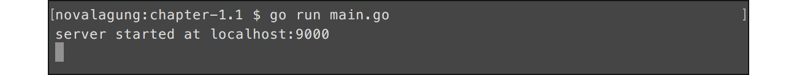
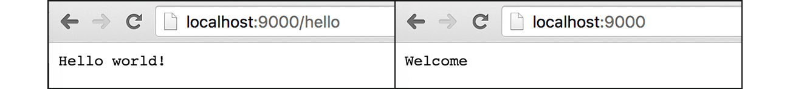

# B.1. Golang Web App: Hello World

Pada serial chapter B ini, kita masih tetap akan belajar tentang topik fundamental atau dasar tapi lebih spesifik ke arah web development. Kita awali dengan pembahasan bagaimana cara membuat aplikasi web "Hello World" sederhana menggunakan Go.

## B.1.1. Pembuatan Aplikasi

Mari belajar dengan praktek langsung. Pertama buat folder project baru dengan isi `main.go`, tentukan package-nya sebagai `main`, lalu import package `fmt` dan `net/http`.

```go
package main

import "fmt"
import "net/http"
```

Setelah itu, siapkan dua buah fungsi, masing-masing fungsi memiliki skema parameter yang sama seperti berikut.

 - Parameter ke-1 bertipe `http.ResponseWrite`
 - Parameter ke-2 bertipe `*http.Request`

Fungsi dengan struktur di atas diperlukan oleh `http.HandleFunc` untuk keperluan penanganan request ke rute yang ditentukan. Berikut merupakan dua fungsi yang dimaksud.

```go
func handlerIndex(w http.ResponseWriter, r *http.Request) {
    var message = "Welcome"
    w.Write([]byte(message))
}

func handlerHello(w http.ResponseWriter, r *http.Request) {
    var message = "Hello world!"
    w.Write([]byte(message))
}
```

Method `Write()` milik parameter pertama (yang bertipe `http.ResponseWrite`), digunakan untuk meng-output-kan nilai balik data. Argumen method adalah data yang ingin dijadikan output, ditulis dalam bentuk `[]byte`. 

Pada contoh ini, data yang akan kita tampilkan bertipe string, maka perlu dilakukan casting dari `string` ke `[]byte`. Contohnya bisa dilihat seperta pada kode di atas, di bagian `w.Write([]byte(message))`.

Selanjutnya, siapkan fungsi `main()` dengan isi di dalamnya adalah beberapa rute atau route, dengan aksi adalah kedua fungsi yang sudah disiapkan di atas. Tak lupa siapkan juga kode untuk start server.

```go
func main() {
    http.HandleFunc("/", handlerIndex)
    http.HandleFunc("/index", handlerIndex)
    http.HandleFunc("/hello", handlerHello)

    var address = "localhost:9000"
    fmt.Printf("server started at %s\n", address)
    err := http.ListenAndServe(address, nil)
    if err != nil {
        fmt.Println(err.Error())
    }
}
```

Fungsi `http.HandleFunc()` digunakan untuk routing. Parameter pertama adalah rute dan parameter ke-2 adalah handler-nya.

Fungsi `http.ListenAndServe()` digunakan membuat sekaligus start server baru, dengan parameter pertama adalah alamat web server yang diiginkan (bisa diisi host, host & port, atau port saja). Parameter kedua merupakan object mux atau multiplexer. 

> Dalam chapter ini kita menggunakan default mux yang sudah disediakan oleh Go, jadi untuk parameter ke-2 cukup isi dengan `nil`.

Ok, sekarang program sudah siap, jalankan menggunakan `go run`.



Cek pada browser rute yang sudah dibuat, output akan muncul.



Berikut merupakan penjelasan detail per-bagian program yang telah kita buat dari contoh di atas.

#### • Penggunaan `http.HandleFunc()`

Fungsi ini digunakan untuk **routing**, menentukan aksi dari sebuah url tertentu ketika diakses (di sini url tersebut kita sebut sebagai rute/route). Rute dituliskan dalam `string` sebagai parameter pertama, dan aksi-nya sendiri dibungkus dalam fungsi (bisa berupa closure) yang ditempatkan pada parameter kedua (kita sebut sebagai handler).

Pada kode di atas, tiga buah rute didaftarkan:

 - Rute `/` dengan aksi adalah fungsi `handlerIndex()`
 - Rute `/index` dengan aksi adalah sama dengan `/`, yaitu fungsi `handlerIndex()`
 - Rute `/hello` dengan aksi fungsi `handlerHello()`

Ketika rute-rute tersebut diakses lewat browser, outpunya adalah isi-handler dari rute yang bersangkutan. Kebetulan pada chapter ini, ketiga rute tersebut outputnya adalah sama, yaitu berupa string.

> Pada contoh di atas, ketika rute yang tidak terdaftar diakses, secara otomatis handler rute `/` akan terpanggil.

#### • Penjelasan Mengenai **Handler**

Route handler atau handler atau parameter kedua fungsi `http.HandleFunc()`, adalah sebuah fungsi dengan ber-skema `func (ResponseWriter, *Request)`. 

 - Parameter ke-1 merupakan objek untuk keperluan http response.
 - Sedang parameter ke-2 yang bertipe `*request` ini, berisikan informasi-informasi yang berhubungan dengan http request untuk rute yang bersangkutan. 

Contoh penulisan handler bisa dilihat pada fungsi `handlerIndex()` berikut.

```go
func handlerIndex(w http.ResponseWriter, r *http.Request) {
    var message = "Welcome"
    w.Write([]byte(message))
}
```

Output dari rute, dituliskan di dalam handler menggunakan method `Write()` milik objek `ResponseWriter` (parameter pertama). Output bisa berupa apapun, untuk output text tinggal lakukan casting dari tipe `string` ke `[]byte`, aturan ini juga berlaku untuk beberapa jenis output lainnya seperti html dan json, namun response header `Content-Type` perlu disesuaikan.

Pada contoh program yang telah kita buat, handler `Index()` memunculkan text `"Welcome"`, dan handler `Hello()` memunculkan text `"Hello world!"`.

Sebuah handler bisa dipergunakan pada banyak rute, bisa dilihat pada di atas handler `Index()` digunakan pada rute `/` dan `/index`.

#### • Penggunaan `http.ListenAndServe()`

Fungsi ini digunakan untuk membuat web server baru. Pada contoh yang telah dibuat, web server di-*start* pada port `9000` (bisa dituliskan dalam bentuk `localhost:9000` atau cukup `:9000` saja).

```go
var address = ":9000"
fmt.Printf("server started at %s\n", address)
err := http.ListenAndServe(address, nil)
```

Fungsi `http.ListenAndServe()` bersifat blocking, menjadikan semua statement setelahnya tidak akan dieksekusi, sebelum di-stop.

Fungsi ini mengembalikan nilai balik ber-tipe `error`. Jika proses pembuatan web server baru gagal, maka kita bisa mengetahui root-cause nya apa.

## B.1.2. Web Server Menggunakan `http.Server`

Selain menggunakan `http.ListenAndServe()`, ada cara lain yang bisa diterapkan untuk start web server, yaitu dengan memanfaatkan struct `http.Server`.

Kode di bagian start server yang sudah kita buat, jika diubah ke cara ini, kurang lebih menjadi seperti berikut.

```go
var address = ":9000"
fmt.Printf("server started at %s\n", address)

server := new(http.Server)
server.Addr = address
err := server.ListenAndServe()
if err != nil {
    fmt.Println(err.Error())
}
```

Informasi host/port perlu dimasukan dalam property `.Addr` milik objek server. Lalu dari objek tersebut panggil method `.ListenAndServe()` untuk start web server.

Kelebihan menggunakan `http.Server` salah satunya adalah kemampuan untuk mengubah beberapa konfigurasi default web server Go. 

Contoh, pada kode berikut, timeout untuk read request dan write request di ubah menjadi 10 detik.

```
server.ReadTimeout = time.Second * 10
server.WriteTimeout = time.Second * 10
```

Ada banyak lagi property dari struct `http.Server` ini, yang pastinya akan dibahas pada pembahasan-pembahasan selanjutnya.

---

<div class="source-code-link">
    <div class="source-code-link-message">Source code praktek chapter ini tersedia di Github</div>
    <a href="https://github.com/novalagung/dasarpemrogramangolang-example/tree/master/chapter-B.1-golang-web-hello-world">https://github.com/novalagung/dasarpemrogramangolang-example/.../chapter-B.1...</a>
</div>

---

<iframe src="https://novalagung.substack.com/embed" width="100%" height="320" class="substack-embed" frameborder="0" scrolling="no"></iframe>
