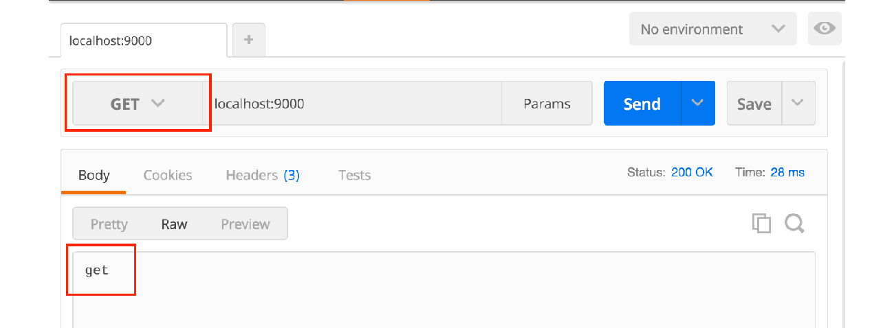
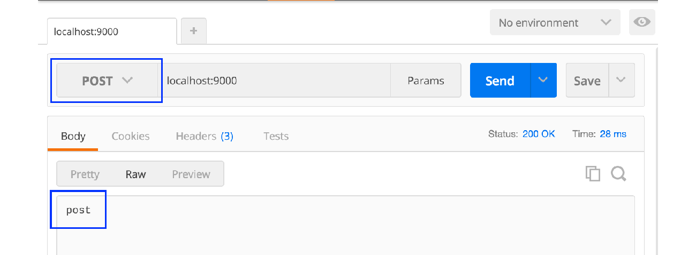
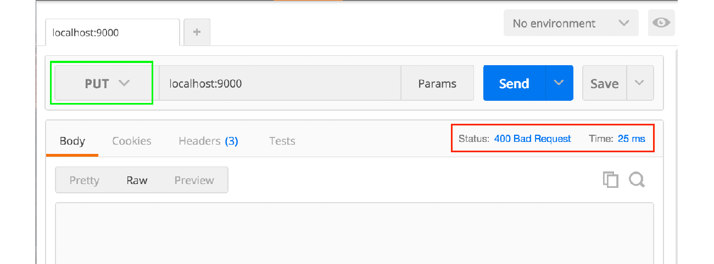

# B.11. HTTP Method: POST & GET

Sampai chapter ini, terhitung kita telah mempelajari banyak hal yang berhubungan dengan template view. Kali ini topik yang akan dibahas sedikit berbeda, yaitu mengenai penanganan HTTP request di back-end.

Sebuah route handler pada dasarnya bisa menerima segala jenis request, apapun jenis HTTP method-nya maka akan tetap masuk ke satu handler (seperti **POST**, **GET**, dan atau lainnya). Pengategorian request berdasarkan HTTP method bisa dilakukan menggunakan seleksi kondisi.

> Pada chapter lain kita akan belajar teknik routing yg lebih advance dengan bantuan *3rd party* routing library.

## B.11.1. Praktek

Mari coba praktekan. Disiapkan sebuah handler untuk rute `/` yang didalamnya ada pengecekan seleksi kondisi berdasarkan HTTP method.

```go
package main

import "net/http"
import "fmt"

func main() {
	http.HandleFunc("/", func(w http.ResponseWriter, r *http.Request) {
		switch r.Method {
		case "POST":
			w.Write([]byte("post"))
		case "GET":
			w.Write([]byte("get"))
		default:
			http.Error(w, "", http.StatusBadRequest)
		}
	})

	fmt.Println("server started at localhost:9000")
	http.ListenAndServe(":9000", nil)
}
```

Struct `*http.Request` memiliki property bernama `Method`, isinya informasi HTTP method dari request.

- Jika HTTP method adalah `POST`, maka text `post` dijadikan nilai response
- Jika HTTP method adalah `GET`, maka text `get` dijadikan nilai response

## B.11.2. Testing

Gunakan [Postman](https://chrome.google.com/webstore/detail/postman/fhbjgbiflinjbdggehcddcbncdddomop?hl=en), atau tools sejenisnya untuk mempermudah testing.

Berikut adalah contoh request dengan method GET.



Dan di bawah ini adalah contoh request dengan method POST.



Jika method yang digunakan adalah selain POST dan GET, maka web server menghasilkan response **400 Bad Request**. Di bawah ini adalah contoh request dengan method **PUT**.



---

<div class="source-code-link">
    <div class="source-code-link-message">Source code praktik chapter ini tersedia di Github</div>
    <a href="https://github.com/novalagung/dasarpemrogramangolang-example/tree/master/chapter-B.11-http-method">https://github.com/novalagung/dasarpemrogramangolang-example/.../chapter-B.11...</a>
</div>

---

<iframe src="partial/ebooks.html" width="100%" height="390px" frameborder="0" scrolling="no"></iframe>
