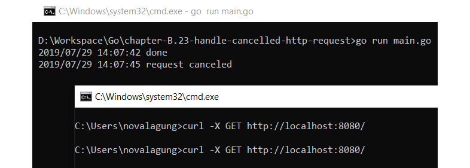
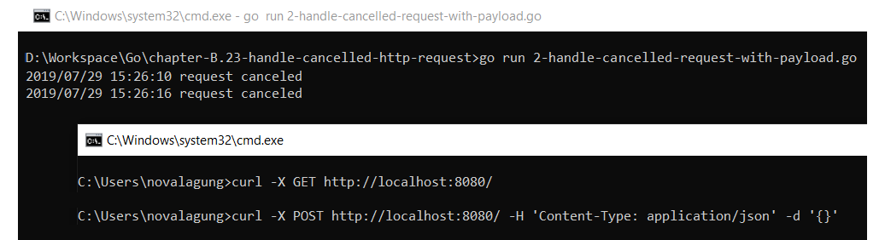

# B.23. Server Handler HTTP Request Cancellation

Dalam konteks web application, kadang kala sebuah http request butuh waktu cukup lama untuk selesai, bisa jadi karena kode yang kurang dioptimasi, atau prosesnya memang lama, atau mungkin faktor lainnya. Dari sisi client, biasanya ada handler untuk cancel request jika melebihi batas timeout yang sudah didefinisikan, dan ketika itu terjadi di client akan sangat mudah untuk antisipasinya.

Berbeda dengan handler di back end-nya, by default request yang sudah di-cancel oleh client tidak terdeteksi (proses di back end akan tetap lanjut). Umumnya tidak ada masalah mengenai ini, tapi ada kalanya kita perlu men-treat cancelled request dengan baik untuk keperluan lain (logging, atau lainnya).

Pada chapter ini kita akan belajar caranya.

> Chapter ini fokus terhadap cancellation pada client http request. Untuk cancellation pada proses konkuren silakan merujuk ke [A.64. Concurrency Pattern: Context Cancellation Pipeline](/A-pipeline-context-cancellation.html).

## B.32.1. Praktek

Dari objek `*http.Request` bisa diambil objek context lewat method `.Context()`, dan dari context tersebut kita bisa mendeteksi apakah sebuah request di-cancel atau tidak oleh client.

> Pada chapter ini kita tidak membahas secara rinci apa itu context. Silakan langsung merujuk ke chapter [D.2. Google API Search Dengan Timeout](/D-google-api-search.html) untuk lebih detailnya.

Object context memiliki method `.Done()` yang nilai baliknya berupa channel. Dari channel tersebut kita bisa deteksi apakah request di-cancel atau tidak, caranya dengan cara mengecek apakah ada data yang terkirim lewat channel tersebut, jika ada maka lakukan pengecekan pada error message-nya, jika ada keterangan `"cancelled"` maka diasumsikan request tersebut dibatalkan.

Mari kita praktekan langsung. Siapkan base kode sederhana berikut.

```go
package main

import (
	"log"
	"net/http"
	"strings"
	"time"
	"log"
)

func handleIndex(w http.ResponseWriter, r *http.Request) {
	// do something here
}

func main() {
	http.HandleFunc("/", handleIndex)
	http.ListenAndServe(":8080", nil)
}
```

Di dalam `handleIndex()` disimulasikan sebuah proses membutuhkan waktu lama untuk selesai (kita gunakan `time.Sleep()` untuk ini). Umumnya kode akan dituliskan langsung dalam handler tersebut, tapi pada kasus ini tidak. Untuk bisa mendeteksi sebuah request di-cancel atau tidak, harus di-dispatch sebuah goroutine baru.

- Cara ke-1: bisa dengan menaruh proses utama di dalam gorutine tersebut, dan menaruh kode untuk deteksi di luar (di dalam handler-nya).
- Cara ke-2: Atau sebaliknya. Menaruh proses utama di dalam handler, dan menempatkan deteksi cancelled request dalam goroutine baru.

Pada contoh berikut, kita gunakan cara pertama. Tulis kode berikut dalam handler.

```go
done := make(chan bool)
go func() {
    // do the process here
    // simulate a long-time request by putting 10 seconds sleep
    time.Sleep(10 * time.Second)

    done <- true
}()

select {
case <-r.Context().Done():
    if err := r.Context().Err(); err != nil {
        if strings.Contains(strings.ToLower(err.Error()), "canceled") {
            log.Println("request canceled")
        } else {
            log.Println("unknown error occured.", err.Error())
        }
    }
case <-done:
    log.Println("done")
}
```

Pada kode di atas terlihat, proses utama dibungkus dalam goroutine. Ketika selesai, sebuah data dikirimkan ke channel `done`.

Lalu diluar, keyword `select` dipergunakan untuk deteksi pengiriman terhadap dua channel.

- Channel `r.Context().Done()`, jika channel ini menerima data maka diasumsikan request selesai. Selanjutnya lakukan pengecekan pada objek error milik konteks untuk deteksi apakah selesai-nya request ini karena memang selesai, atau di-cancel oleh client, atau faktor lainnya.
- Channel `<-done`, jika channel ini menerima data, maka proses utama adalah selesai.

Jalankan kode lalu test hasilnya.

```bash
curl -X GET http://localhost:8080/
```



Pada gambar di atas terdapat dua request, yg pertama sukses dan yang kedua adalah cancelled. Pesan `request cancelled` muncul ketika client http request dibatalkan.

> Di CMD/terminal bisa cukup dengan `ctrl + c` untuk cancel request

## B.32.2. Handle Cancelled Request yang ada Payload-nya

Khusus untuk request dengan HTTP method yang mewajibkan untuk ada request body-nya (payload), maka channel `r.Context().Done()` tidak akan menerima data hingga terjadi proses read pada body payload.

```go
go func() {
    // do the process here
    // simulate a long-time request by putting 10 seconds sleep
    
    body, err := io.ReadAll(r.Body)
    // ...

    time.Sleep(10 * time.Second)

    done <- true
}()
```

Jalankan ulang program kemudian test.

```go
curl -X POST http://localhost:8080/ -H 'Content-Type: application/json' -d '{}'
```



---

<div class="source-code-link">
    <div class="source-code-link-message">Source code praktek chapter ini tersedia di Github</div>
    <a href="https://github.com/novalagung/dasarpemrogramangolang-example/tree/master/chapter-B.23-server-handler-http-request-cancellation">https://github.com/novalagung/dasarpemrogramangolang-example/...</a>
</div>

---

<iframe src="partial/ebooks.html" class="partial-ebooks-wrapper" frameborder="0" scrolling="no"></iframe>
