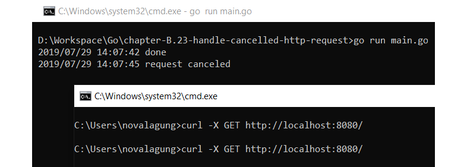
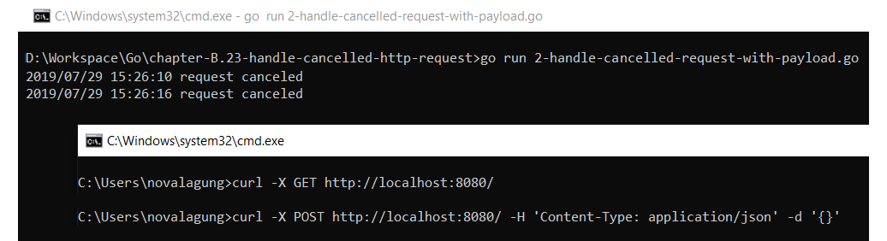

# B.30. HTTP Request Cancellation

Dalam konteks web application, kadang kala sebuah HTTP request butuh waktu cukup lama untuk selesai, bisa jadi karena kode yang kurang dioptimasi atau prosesnya memang lama, atau mungkin ada faktor lainnya. Dari sisi client, biasanya ada handler untuk cancel request ketika request melebihi batas timeout yang sudah ditentukan.

Secara default, request yang sudah di-cancel oleh client tidak mempengaruhi yang terjadi di back-end: proses tetap lanjut hingga selesai. Ini umumnya bukan masalah, tapi ada kalanya kita perlu mendeteksi dan menangani cancelled request agar server tidak membuang resource untuk proses yang tidak lagi dibutuhkan. Pada chapter ini kita akan belajar caranya.

> Chapter ini merupakan lanjutan dari chapter [B.29. HTTP Handler Context Value](/B-http-handler-context-value.html) yang topiknya masih seputar context di sisi server HTTP handler (back-end), namun lebih spesifik ke bagian cancellation tapi di HTTP server.
>
> Untuk topik pembahasan cancellation pada proses konkuren silakan pembahasannya ada di chapter [A.65. Concurrency Pattern: Context Cancellation Pipeline](/A-pipeline-context-cancellation.html).

## B.30.1. Praktik

Dari objek `*http.Request` informasi objek context bisa diakses lewat method `.Context()`, dan dari context tersebut kita bisa mendeteksi apakah sebuah request di-cancel atau tidak oleh client.

Object context memiliki method `.Done()` yang nilai baliknya berupa channel. Channel ini menerima data ketika context selesai, baik karena request normal selesai maupun karena di-cancel oleh client. Untuk membedakan keduanya, gunakan `errors.Is(ctx.Err(), context.Canceled)`, cara yang idiomatis dan lebih andal dibanding pengecekan string error secara manual.

Mari kita praktikkan langsung. Silakan mulai dengan menulis kode berikut.

```go
package main

import (
    "context"
    "errors"
    "log"
    "net/http"
    "time"
)

func handleIndex(w http.ResponseWriter, r *http.Request) {
    // do something here
}

func main() {
    mux := http.NewServeMux()
    mux.HandleFunc("/", handleIndex)
    err := http.ListenAndServe(":9000", mux)
    if err != nil {
        log.Fatal(err)
    }
}
```

Di dalam `handleIndex()` disimulasikan sebuah proses membutuhkan waktu lama untuk selesai (kita gunakan `time.Sleep()` untuk ini). Umumnya kode dituliskan langsung dalam handler tersebut, tapi pada kasus ini tidak. Untuk bisa mendeteksi sebuah request di-cancel atau tidak kita akan manfaatkan goroutine baru.

Dalam penerapannya ada dua pilihan opsi:

- Cara ke-1: Dengan menaruh proses utama di dalam gorutine tersebut, dan menaruh kode untuk deteksi di luar (di dalam handler-nya).
- Cara ke-2: Atau sebaliknya. Menaruh proses utama di dalam handler, dan menempatkan deteksi cancelled request dalam goroutine baru.

Pada contoh berikut, kita gunakan cara pertama. Tulis kode berikut dalam handler.

```go
done := make(chan bool)
go func() {
    // do the process here
    // simulate a long-time request by putting 10 seconds sleep
    time.Sleep(10 * time.Second)

    done <- true
}()

select {
case <-r.Context().Done():
    if err := r.Context().Err(); err != nil {
        if errors.Is(err, context.Canceled) {
            log.Println("request canceled")
        } else {
            log.Println("unknown error occurred.", err.Error())
        }
    }
case <-done:
    log.Println("done")
}
```

Pada kode di atas terlihat, proses utama dibungkus dalam goroutine. Ketika selesai, maka back-end akan menerima data via channel `done`.

Keyword `select` di situ disiapkan untuk pendeteksian dua kondisi berikut:

- Channel `r.Context().Done()`. Jika channel ini menerima data, context sudah selesai. `r.Context().Err()` digunakan untuk mengetahui penyebabnya: `errors.Is(err, context.Canceled)` bernilai `true` jika client yang membatalkan request, selain itu bisa jadi timeout atau penyebab lain.
- Channel `<-done`. Jika channel ini menerima data, maka proses utama adalah selesai.

Jalankan server lalu test dengan curl. Biarkan request berjalan lalu tekan `Ctrl+C` sebelum 10 detik selesai untuk mensimulasikan cancel dari client.

```bash
curl http://localhost:9000/
```



Pada gambar di atas terdapat dua request: yang pertama dibiarkan selesai (log `done`), yang kedua di-cancel sebelum selesai (log `request canceled`).

## B.30.2. Handle Cancelled Request yang ada Payload-nya

Khusus untuk request dengan HTTP method yang memiliki request body (payload), channel `r.Context().Done()` tidak akan menerima data hingga body request mulai dibaca. Ini terjadi karena Go HTTP server baru berinteraksi dengan koneksi TCP underlying saat body dibaca, sehingga status cancellation dari client baru terdeteksi di titik tersebut.

Tambahkan `io.ReadAll(r.Body)` di dalam goroutine sebelum `time.Sleep()`.

```go
go func() {
    // do the process here
    // simulate a long-time request by putting 10 seconds sleep
    
    body, err := io.ReadAll(r.Body)
    // ...

    time.Sleep(10 * time.Second)

    done <- true
}()
```

Test dengan curl POST, cancel sebelum 10 detik selesai.

```bash
curl -X POST http://localhost:9000/ -H 'Content-Type: application/json' -d '{}'
```



---

<div class="source-code-link">
    <div class="source-code-link-message">Source code praktik chapter ini tersedia di Github</div>
    <a href="https://github.com/novalagung/dasarpemrogramangolang-example/tree/master/chapter-B.30-server-handler-http-request-cancellation">https://github.com/novalagung/dasarpemrogramangolang-example/...</a>
</div>

---

<iframe src="partial/ebooks.html" width="100%" height="390px" frameborder="0" scrolling="no"></iframe>
