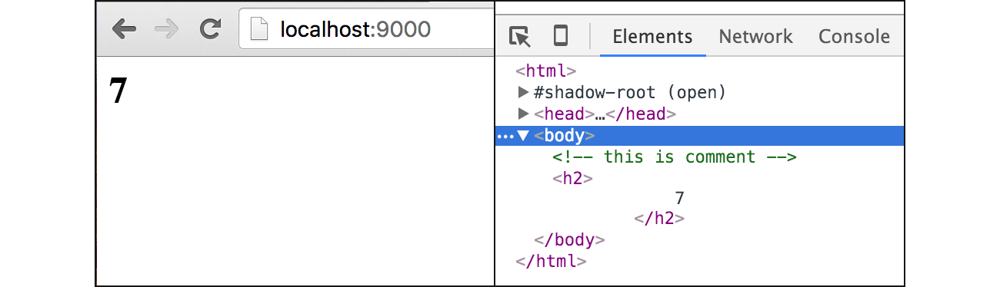

# B.8. Template: Custom Functions

Pada chapter sebelumnya kita telah mengenal beberapa *predefined* function yang disediakan oleh Go. Kali ini kita akan belajar tentang fungsi custom, bagaimana cara membuat dan menggunakannya dalam template.

## B.8.1. Front End

Pertama, siapkan project baru. Buat file template `view.html`, lalu isi dengan kode berikut.

```html
<html>
	<head>
		<title>Learning html/template Functions</title>
	</head>
	<body>
		{{unescape "<!-- this is comment -->"}}
		{{unescape "<h2>"}}
			{{avg 8 9 8 6 7 8 8}}
		{{"</h2>" | unescape}}
	</body>
</html>
```

Ada 2 hal yang perlu diperhatikan dari kode di atas. Pertama, terdapat dua buah fungsi yang dipanggil beberapa kali.

 1. Fungsi `unescape()`, digunakan untuk menampilkan string tanpa di-escape
 2. Fungsi `avg()`, digunakan untuk mencari rata-rata dari angka-angka yang disisipkan sebagai parameter

Kedua fungsi tersebut adalah fungsi kustom yang akan kita buat.

Hal ke-2, terdapat 1 baris statement yang penulisannya agak unik, yaitu `{{"</h2>" | unescape}}`. Statement tersebut maknanya adalah string `"</h2>"` digunakan sebagai parameter dalam pemanggilan fungsi `unescape`. Tanda pipe atau `|` adalah penanda bahwa parameter dituliskan terlebih dahulu sebelum nama fungsi nya.

## B.8.2. Back End

View sudah siap, sekarang saatnya pindah ke bagian back end. Isi `main.go`, tentukan package sebagai `main` dan import package lain yang diperlukan.

```go
package main

import "net/http"
import "fmt"
import "html/template"
```

Selanjutnya beberapa fungsi akan dibuat, lalu disimpan dalam `template.FuncMap`. Pembuatan fungsi dituliskan dalam bentuk key-value atau hash map. Nama fungsi sebagai key, dan body fungsi sebagai value.

```go
var funcMap = template.FuncMap{
	"unescape": func(s string) template.HTML {
		return template.HTML(s)
	},
	"avg": func(n ...int) int {
		var total = 0
		for _, each := range n {
			total += each
		}
		return total / len(n)
	},
}
```

> Tipe `template.FuncMap` sebenarnya merupakan alias dari `map[string]interface{}`

Dalam `funcMap` di atas, dua buah fungsi disiapkan, `unescape()` dan `avg()`. Nantinya fungsi ini kita gunakan di view.

Setelah itu, siapkan fungsi `main()` dengan isi route handler untuk `/`. Di dalam handler ini, `view.html` diparsing, kemudian disisipkan fungsi yang telah dibuat di atas ke dalamnya.

```go
func main() {
	http.HandleFunc("/", func(w http.ResponseWriter, r *http.Request) {
		var tmpl = template.Must(template.New("view.html").
				Funcs(funcMap).
				ParseFiles("view.html"))
		if err := tmpl.Execute(w, nil); err != nil {
			http.Error(w, err.Error(), http.StatusInternalServerError)
		}
	})

	fmt.Println("server started at localhost:9000")
	http.ListenAndServe(":9000", nil)
}
```

Berikut merupakan penjelasan step-by-step mengenai kode panjang untuk parsing dan rendering template di atas.

 1. Sebuah template disipakan dengan nama `view.html`. Pembuatan instance template dilakukan melalui fungsi `template.New()`.
 2. Fungsi custom yang telah kita buat, diregistrasikan agar dikenali oleh template tersebut. Bisa dilihat pada pemanggilan method `Funcs()`.
 3. Setelah itu, lewat method `ParseFiles()`, view `view.html` di-parsing. Akan dicari dalam file tersebut apakah ada template yang didefinisikan dengan nama `view.html`. Karena di dalam template view tidak ada deklarasi template sama sekali (<code>\{\{template "namatemplate"\}\}</code>), maka akan dicari view yang namanya adalah `view.html`. Keseluruhan isi `view.html` akan dianggap sebagai sebuah template dengan nama template adalah nama file itu sendiri.

## B.8.3. Test

Tes hasilnya lewat browser.



## B.8.4. Perbadaan Fungsi `template.ParseFiles()` & Method `ParseFiles()` Milik `*template.Template`

Pada kode di atas, pemanggilan `template.New()` menghasilkan objek bertipe `*template.Template`. 

Pada chapter [B.5. Template: Render Partial HTML Template](/B-template-render-partial-html.html) kita telah belajar mengenai fungsi `template.ParseFiles()`, yang fungsi tersebut juga mengembalikan objek bertipe `*template.Template`.

Pada kode di atas, method `ParseFiles()` yang dipanggil bukanlah fungsi `template.ParseFiles()` yang kita telah pelajari sebelumnya. Meskipun namanya sama, kedua fungsi/method ini berbeda.

 - Fungsi `template.ParseFiles()`, adalah milik package `template`. Fungsi ini digunakan untuk mem-parsing semua view yang disisipkan sebagai parameter.
 - Method `ParseFiles()`, milik `*template.Template`, digunakan untuk memparsing semua view yang disisipkan sebagai parameter, lalu diambil hanya bagian yang nama template-nya adalah sama dengan nama template yang sudah di-alokasikan menggunakan `template.New()`. Jika template yang dicari tidak ada, maka akan mencari yang nama file-nya sama dengan nama template yang sudah ter-alokasi.

Chapter selanjutnya akan membahas lebih detail mengenai penggunaan method `ParseFiles()`.

---

<div class="source-code-link">
    <div class="source-code-link-message">Source code praktek chapter ini tersedia di Github</div>
    <a href="https://github.com/novalagung/dasarpemrogramangolang-example/tree/master/chapter-B.8-template-custom-functions">https://github.com/novalagung/dasarpemrogramangolang-example/.../chapter-B.8...</a>
</div>

---

<iframe src="partial/ebooks.html" width="100%" height="360px" frameborder="0" scrolling="no"></iframe>
