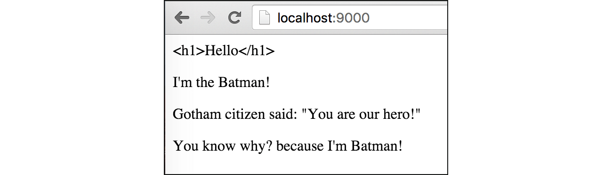

# B.7. Template: Functions

Go menyediakan beberapa *predefiend* function yang bisa digunakan langsung dalam file template. Pada chapter ini kita akan membahas beberapa di antaranya beserta cara penggunaannya.

Cara pemanggilan fungsi atau method sebuah objek pada file template sedikit berbeda dibanding dengan yang telah dicontohkan pada chapter sebelumnya.

## B.7.1. Persiapan

Siapkan folder proyek baru, dengan isi 2 buah file: `main.go` dan `view.html`. Di dalam file main siapkan sebuah struct berisikan 3 buah property dan 1 method.

```go
package main

import "net/http"
import "fmt"
import "html/template"

type Superhero struct {
	Name    string
	Alias   string
	Friends []string
}

func (s Superhero) SayHello(from string, message string) string {
	return fmt.Sprintf("%s said: \"%s\"", from, message)
}
```

Struct `Superhero` di atas nantinya digunakan untuk membuat objek yang kemudian disisipkan ke template view.

Selanjutnya buat fungsi `main()`, isi dengan handler untuk rute `/`. Secara umum isi dari file `main.go` ini mirip seperti yang ada pada chapter sebelumnya.

```go
func main() {
	http.HandleFunc("/", func(w http.ResponseWriter, r *http.Request) {
		var person = Superhero{
			Name:    "Bruce Wayne",
			Alias:   "Batman",
			Friends: []string{"Superman", "Flash", "Green Lantern"},
		}

		var tmpl = template.Must(template.ParseFiles("view.html"))
		if err := tmpl.Execute(w, person); err != nil {
			http.Error(w, err.Error(), http.StatusInternalServerError)
		}
	})

	fmt.Println("server started at localhost:9000")
	http.ListenAndServe(":9000", nil)
}
```

Kemudian isi file `view.html` dengan kode berikut.

```html
<html>
	<head>
		<title>Learning html/template Functions</title>
	</head>
	<body>
	</body>
</html>
```

Jalankan program, buka [http://localhost:9000/](http://localhost:9000/), lalu lanjutkan dengan mengikuti petunjuk di bawah ini.

## B.7.2. Fungsi Escape String

Fungsi pertama yang akan kita bahas adalah `html`. Fungsi ini digunakan untuk meng-escape string. Agar lebih mudah dipahami silakan praktekan kode di bawah ini.

Tulis kode berikut dalam `<body></body>` file `view.html`.

```html
<p>
	{{html "<h2>Hello</h2>"}}
</p>
```

Test output yang dihasilkan di browser dengan cukup me-refresg halaman. Tulisan `<h2>Hello</h2>` akan di-escape, dimunculkan sebagai text.


Bisa dilihat bahwa cara untuk menggunakan fungsi pada file template, adalah cukup dengan menuliskan nama fungsinya dalam notasi `{{namaFungsi}}`. Jika fungsi tersebut membutuhkan parameter (seperti fungsi `html`), maka parameternya dituliskan tepat setelah nama fungsi dengan pembatas spasi.

```html
{{namaFungsi param1 param2 param3 param4}}
```

Selain fungsi `html`, ada juga beberapa fungsi lain yang sudah disediakan oleh Go.

 - Fungsi `js` digunakan untuk meng-escape string **javascript**
 - Fungsi `urlquery` digunakan untuk meng-escape string url query

## B.7.3. Fungsi Operator Perbandingan

Pada chapter sebelumnya telah dibahas bagaimana penggunaan operator `ne` pada actions `if`. `eq` dan `ne` adalah contoh dari fungsi operator perbandingan. Jika digunakan pada seleksi kondisi yang nilai kondisinya bertipe `bool`, maka cukup dengan menuliskannya seletah operator, contohnya.

```html
{{if eq true}}
	benar
{{end}}
```

> Nilai kondisi yang bertipe bool hanya bisa digunakan pada `eq` dan `ne` saja

Jika nilai kondisinya merupakan perbandingan, maka nilai yang dibandingkan harus dituliskan, sebagai contoh di bawah ini adalah seleksi kondisi memanfaatkan operator `gt` untuk deteksi apakah nilai di atas 60.

```html
{{if gt $value 60}}
	lulus
{{end}}
```

Pada kode di atas, nilai variabel `$value` akan dibandingkan dengan angka `60`, apakah nilainya lebih besar atau tidak.

> `gt` merupakan kependekan dari **greater than**

Praktekan kode berikut, tulis ke dalam file `view.html`.

```html
{{if eq .Name "Bruce Wayne"}}
	<p>I'm the Batman!</p>
{{else if ne .Name "Clark Kent"}}
	<p>I'm neither Batman or Superman</p>
{{end}}
```

Lihat hasilnya pada browser.


Berikut merupakan daftar operator perbandingan yang didukung oleh template view.

| Operator | Penjelasan | Analogi |
| :------: | ---------- | :-----: |
| eq | *equal*, sama dengan | `a == b` |
| ne | *not equal*, tidak sama dengan | `a != b` |
| lt | *lower than*, lebih kecil | `a < b` |
| le | *lower than or equal*, lebih kecil atau sama dengan | `a <= b` |
| gt | *greater than*, lebih besar | `a > b` |
| ge | *greater than or equal*, lebih besar atau sama dengan | `a >= b` |

## B.7.4. Pemanggilan Method

Cara memanggil method yang disisipkan ke view sama dengan cara pemanggilan fungsi, hanya saja perlu ditambahkan tanda titik `.` (menyesuaikan scope variabelnya). Contohnya bisa dilihat seperti pada kode berikut.

```html
<p>
	{{.SayHello "Gotham citizen" "You are our hero!"}}
</p>
```

Test hasilnya pada browser.


## B.7.5. Fungsi String

Go juga menyediakan beberapa fungsi string yang bisa dimanfaatkan, yaitu: 

 - `print` (merupakan alias dari `fmt.Sprint`)
 - `printf` (merupakan alias dari `fmt.Sprintf`)
 - `println` (merupakan alias dari `fmt.Sprintln`)

Cara penggunannya juga masih sama, contoh:

```html
<p>
	{{printf "%s because I'm %s" "You know why?" "Batman!"}}
</p>
```

Output program:



Jika merasa sedikit bingung memahami statement di atas, mungkin analogi berikut cukup membantu.

```go
// template view
printf "%s because I'm %s" "You know why?" "Batman!"

// go
fmt.Sprintf("%s because I'm %s", "You know why?", "Batman!")
```

Kedua statement di atas menghasilkan output yang sama.

## B.7.6. Fungsi `len` dan `index`

Kegunaan dari fungsi `len` seperti yang sudah diketahui adalah untuk menghitung jumlah elemen. Sedangkan fungsi `index` digunakan jika elemen tertentu ingin diakses.

Sebagai contoh, `Friends` yang merupakan array, diakses elemen indeks ke-1 menggunakan `index`, maka caranya:

```html
{{index .Friends 1}}
```

Berikut merupakan contoh penerapan fungsi `len` dan `index`.

```html
<p>
	Batman have many friends. {{len .Friends}} of them are:
	{{index .Friends 0}},
	{{index .Friends 1}}, and 
	{{index .Friends 2}}
</p>
```

Output program:


## B.7.7. Fungsi Operator Logika

Selain fungsi operator perbandingan, terdapat juga operator logika `or`, `and`, dan `not`. Cara penggunaannya adalah dengan dituliskan setelah actions `if` atau `elseif`, sebagai fungsi dengan parameter adalah nilai yang ingin dibandingkan.

> Fungsi `not` ekuivalen dengan `ne`

```html
{{$cond1 := true}}
{{$cond2 := false}}

{{if or $cond1 $cond2}}
	<p>Be like Batman!</p>
{{end}}
```

Output program:


---

<div class="source-code-link">
    <div class="source-code-link-message">Source code praktik chapter ini tersedia di Github</div>
    <a href="https://github.com/novalagung/dasarpemrogramangolang-example/tree/master/chapter-B.7-template-functions">https://github.com/novalagung/dasarpemrogramangolang-example/.../chapter-B.7...</a>
</div>

---

<iframe src="partial/ebooks.html" width="100%" height="390px" frameborder="0" scrolling="no"></iframe>
