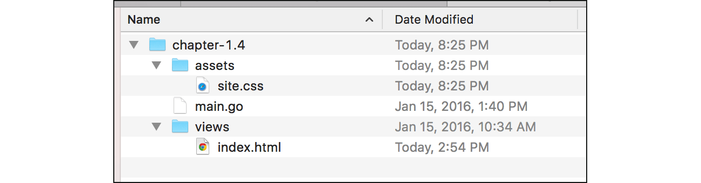
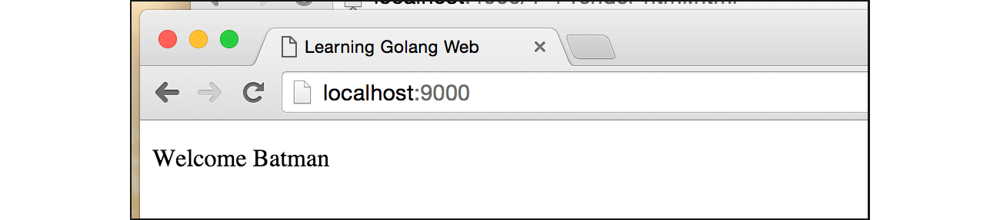
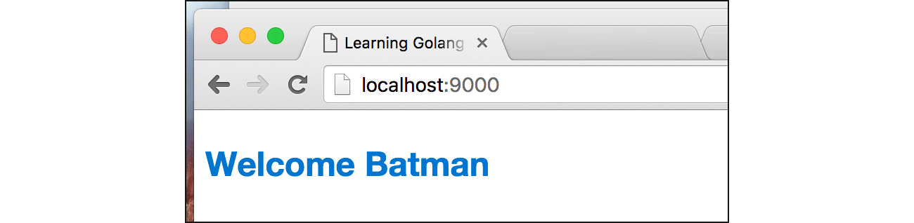

# B.4. Template: Render HTML Template

Pada bagian ini kita akan belajar bagaimana cara render file **template** ber-tipe **HTML**, untuk ditampilkan pada browser. 

Terdapat banyak jenis template pada Go, yang akan kita pakai adalah template HTML. Package `html/template` berisi banyak sekali fungsi untuk kebutuhan rendering dan parsing file template jenis ini.

## B.4.1. Struktur Aplikasi

Buat project baru, siapkan file dan folder dengan struktur sesuai dengan gambar berikut.



## B.4.2. Back End

Hal pertama yang perlu dilakukan adalah mempersiapkan back end. Buka file `main.go`, import package `net/http`, `html/template`, dan `path`. Siapkan juga rute `/`.

```go
package main

import "fmt"
import "net/http"
import "html/template"
import "path"

func main() {
	http.HandleFunc("/", func(w http.ResponseWriter, r *http.Request) {
		// not yet implemented
	})

	fmt.Println("server started at localhost:9000")
	http.ListenAndServe(":9000", nil)
}
```

Handler rute `/` akan kita isi dengan proses untuk rendering template html untuk ditampilkan ke layar browser. Beberapa data disisipkan dalam proses rendering template.

Silakan tulis kode berikut di dalam handler rute `/`.

```go
var filepath = path.Join("views", "index.html")
var tmpl, err = template.ParseFiles(filepath)
if err != nil {
	http.Error(w, err.Error(), http.StatusInternalServerError)
	return
}

var data = map[string]interface{}{
	"title": "Learning Golang Web",
	"name":  "Batman",
}

err = tmpl.Execute(w, data)
if err != nil {
	http.Error(w, err.Error(), http.StatusInternalServerError)
}
```

Package `path` berisikan banyak fungsi yang berhubungan dengan lokasi folder atau path, yang salah satu di antaranya adalah fungsi `path.Join()`. Fungsi ini digunakan untuk menggabungkan folder atau file atau keduanya menjadi sebuah path, dengan separator relatif terhadap OS yang digunakan.

> Separator yang digunakan oleh `path.Join()` adalah `\` untuk wind\*ws dan `/` untuk un\*x.

Contoh penerapan `path.Join()` bisa dilihat di kode di atas, `views` di-join dengan `index.html`, menghasilkan `views/index.html`.

Sedangkan `template.ParseFiles()`, digunakan untuk parsing file template, dalam contoh ini file `view/index.html`. Fungsi ini mengembalikan 2 data, yaitu hasil dari proses parsing yang bertipe `*template.Template`, dan informasi `error` jika ada.

Fungsi `http.Error()` digunakan untuk menandai response (`http.ResponseWriter`) bahwa terjadi error, dengan kode error dan pesan error bisa ditentukan. Pada contoh di atas yang digunakan adalah **500 - internal server error** yang direpresentasikan oleh variabel `http.StatusInternalServerError`.

Method `Execute()` milik `*template.Template`, digunakan untuk menyisipkan data pada template, untuk kemudian ditampilkan ke browser. Data bisa disipkan dalam bentuk `struct`, `map`, atau `interface{}`.

 - Jika dituliskan dalam bentuk `map`, maka **key** akan menjadi nama variabel dan **value** menjadi nilainya
 - Jika dituliskan dalam bentuk variabel objek cetakan `struct`, nama **property** akan menjadi nama variabel

Pada contoh di atas, data map yang berisikan key `title` dan `name` disisipkan ke dalam template yang sudah di parsing.

## B.4.3. Front End

OK, back end sudah siap, selanjutnya kita masuk ke bagian user interface. Pada file `views/index.html`, tuliskan kode html sederhana berikut.

```html
<!DOCTYPE html>
<html>
	<head>
		<title>{{.title}}</title>
	</head>
	<body>
		<p>Welcome {{.name}}</p>
	</body>
</html>
```

Untuk menampilkan variabel yang disisipkan ke dalam template, gunakan notasi `{{.namaVariabel}}`. Pada contoh di atas, data `title` dan `name` yang dikirim dari back end ditampilkan.

Tanda titik "\." pada \{\{\.namaVariabel\}\} menerangkan bahwa variabel tersebut diakses dari **current scope**. Dan current scope default adalah data `map` atau objek yang dilempar back end.

## B.4.4. Testing

Semua sudah siap, maka jalankan program lalu lakukan testing via browser.



## B.4.5. Static File CSS

Kita akan coba tambahkan sebuah stylesheet di sini. Langsung saja, buat file statis `assets/site.css`, isi dengan kode berikut.

```css
body {
	font-family: "Helvetica Neue";
	font-weight: bold;
	font-size: 24px;
	color: #07c;
}
```

Pada `views/index.html`, include-kan file css.

```html
<link rel="stylesheet" href="/static/site.css" />
```

Terakhir pada fungsi `main()`, tambahkan router untuk handling file statis.

```go
func main() {
	// ...

	http.Handle("/static/", 
		http.StripPrefix("/static/", 
			http.FileServer(http.Dir("assets"))))

	fmt.Println("server started at localhost:9000")
	http.ListenAndServe(":9000", nil)
}
```

Jalankan aplikasi untuk test hasil.



---

<div class="source-code-link">
    <div class="source-code-link-message">Source code praktek chapter ini tersedia di Github</div>
    <a href="https://github.com/novalagung/dasarpemrogramangolang-example/tree/master/chapter-B.4-template-render-html">https://github.com/novalagung/dasarpemrogramangolang-example/.../chapter-B.4...</a>
</div>

---

<iframe src="partial/ebooks.html" width="100%" height="360px" frameborder="0" scrolling="no"></iframe>
