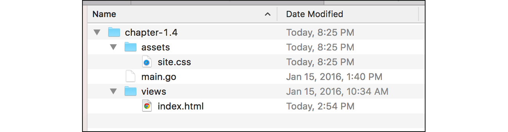
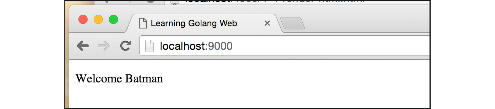
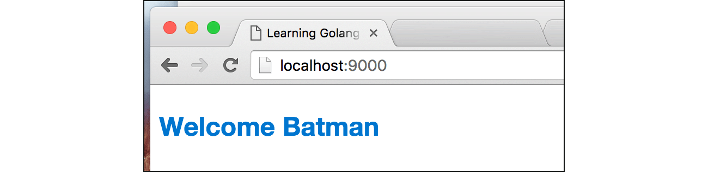

# B.4. Template: Render HTML

Pada bagian ini kita akan belajar bagaimana cara render file **template** yang berisi **HTML** untuk ditampilkan ke layar browser.

Terdapat banyak jenis template pada Go, di sini yang akan kita pakai adalah template HTML. Package `html/template` berisi banyak sekali fungsi untuk operasi rendering dan parsing file template HTML.

## B.4.1. Struktur Aplikasi

Buat project baru, siapkan file dan folder dengan struktur sesuai dengan gambar berikut.



## B.4.2. Back End

Hal pertama yang perlu dilakukan adalah mempersiapkan back end. Buka file `main.go`, import package `net/http`, `html/template`, dan `path/filepath`. Siapkan juga rute `/`.

```go
package main

import (
    "html/template"
    "log"
    "net/http"
    "path/filepath"
)

func main() {
    http.HandleFunc("/", func(w http.ResponseWriter, r *http.Request) {
        // not yet implemented
    })

    log.Println("server started at localhost:9000")
    err := http.ListenAndServe(":9000", nil)
    if err != nil {
        log.Fatal(err)
    }
}
```

Handler rute `/` akan kita isi dengan proses untuk rendering template html untuk ditampilkan ke layar browser. Beberapa data disisipkan dalam proses rendering template.

Silakan tulis kode berikut di dalam handler rute `/`.

```go
var tmplPath = filepath.Join("views", "index.html")
var tmpl, err = template.ParseFiles(tmplPath)
if err != nil {
    http.Error(w, err.Error(), http.StatusInternalServerError)
    return
}

var data = map[string]any{
    "title": "Learning Golang Web",
    "name":  "Batman",
}

err = tmpl.Execute(w, data)
if err != nil {
    http.Error(w, err.Error(), http.StatusInternalServerError)
}
```

Package `path/filepath` berisikan banyak fungsi untuk operasi path file system. Salah satunya adalah `filepath.Join()`, yang digunakan untuk menggabungkan folder atau file menjadi satu path dengan separator yang menyesuaikan sistem operasi (`\` di Windows, `/` di Linux/macOS).

Contoh penerapan `filepath.Join()` bisa dilihat di kode di atas, `views` di-join dengan `index.html`, menghasilkan `views/index.html`.

Sedangkan `template.ParseFiles()`, digunakan untuk parsing file template, dalam contoh ini file `views/index.html`. Fungsi ini mengembalikan 2 data, yaitu hasil dari proses parsing yang bertipe `*template.Template`, dan informasi `error` jika ada.

Fungsi `http.Error()` digunakan untuk menandai HTTP request dengan response berupa error dengan kode serta pesan error bisa kita tentukan sendiri. Pada contoh di atas yang digunakan adalah **500 - internal server error**, direpresentasikan oleh variabel `http.StatusInternalServerError`.

Method `Execute()` milik `*template.Template`, digunakan untuk menyisipkan data pada template, kemudian menampilkannya ke browser. Data bisa disisipkan ke view dalam bentuk `struct`, `map`, atau `interface{}`.

 - Jika dituliskan dalam bentuk `map`, maka **key** akan menjadi nama variabel dan **value** menjadi nilainya
 - Jika dituliskan dalam bentuk variabel objek cetakan `struct`, nama **property** akan menjadi nama variabel

Pada contoh di atas, data map yang berisikan key `title` dan `name` disisipkan ke dalam template yang sudah di parsing.

## B.4.3. Front End

OK, back end sudah siap, selanjutnya kita masuk ke bagian user interface. Pada file `views/index.html`, tuliskan kode html sederhana berikut.

```html
<!DOCTYPE html>
<html>
    <head>
        <title>{{.title}}</title>
    </head>
    <body>
        <p>Welcome {{.name}}</p>
    </body>
</html>
```

Untuk menampilkan variabel yang disisipkan ke dalam template, gunakan notasi `{{.namaVariabel}}`. Pada contoh di atas, data `title` dan `name` yang dikirim dari back end ditampilkan.

Tanda titik "\." pada \{\{\.namaVariabel\}\} menerangkan bahwa variabel tersebut diakses dari **current scope**. Dan current scope default adalah data `map` atau objek yang dilempar back end.

## B.4.4. Testing

Semua sudah siap, sekarang jalankan program, lalu lakukan testing di browser.



## B.4.5. Static File CSS

Coba tambahkan sebuah stylesheet di sini. Buat file `assets/site.css`, isi dengan kode berikut.

```css
body {
    font-family: "Helvetica Neue";
    font-weight: bold;
    font-size: 24px;
    color: #07c;
}
```

Pada `views/index.html`, include-kan file css.

```html
<link rel="stylesheet" href="/static/site.css" />
```

Terakhir pada fungsi `main()`, tambahkan router untuk handling file statis.

```go
func main() {
    // ...

    http.Handle("/static/",
        http.StripPrefix("/static/",
            http.FileServer(http.Dir("assets"))))

    log.Println("server started at localhost:9000")
    err := http.ListenAndServe(":9000", nil)
    if err != nil {
        log.Fatal(err)
    }
}
```

Jalankan aplikasi untuk test hasil.



---

<div class="source-code-link">
    <div class="source-code-link-message">Source code praktik chapter ini tersedia di Github</div>
    <a href="https://github.com/novalagung/dasarpemrogramangolang-example/tree/master/chapter-B.4-template-render-html">https://github.com/novalagung/dasarpemrogramangolang-example/.../chapter-B.4...</a>
</div>

---

<iframe src="partial/ebooks.html" width="100%" height="390px" frameborder="0" scrolling="no"></iframe>
