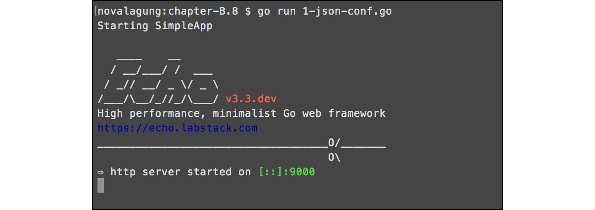

# C.10. Advanced Configuration Menggunakan Viper

Pada chapter ini kita akan belajar cara mudah manajemen konfigurasi file JSON menggunakan [Viper](http://github.com/spf13/viper) library. Inti dari chapter ini sebenarnya adalah sama dengan yang sudah dibahas pada [B.22. Simple Configuration](/B-simple-configuration.html), hanya saja di sini proses parsing di-handle oleh 3rd party dengan tidak menggunakan struct untuk pengaksesannya.

Kekurangan dari teknik menyimpan konfigurasi dalam object struct adalah, pada saat ada kebutuhan untuk menambah atau merubah isi konfigurasi file, maka mengharuskan developer juga mengubah skema struct penampung. Pada bagian ini, pengaksesan property konfigurasi dilakukan lewat notasi string konfigurasinya.

## C.10.1. JSON Configuration

Mari langsung kita praktekan. Buat project baru seperti biasa, buat file konfigurasi `app.config.json`, isi dengan data berikut.

```json
{
    "appName": "SimpleApp",

    "server": {
        "port": 9000
    }
}
```

Property `appName` berisi nama aplikasi, sedangkan `server.port` representasi dari port web server.

Selanjutnya buat `main.go`, lakukan parsing pada file konfigurasi.

```go
package main

import (
    "github.com/labstack/echo"
    "github.com/spf13/viper"
    "net/http"
)

func main() {
    e := echo.New()

    viper.SetConfigType("json")
    viper.AddConfigPath(".")
    viper.SetConfigName("app.config")

    err := viper.ReadInConfig()
    if err != nil {
        e.Logger.Fatal(err)
    }

    // ...
}
```

Kode di atas adalah contoh penggunaan dasar viper, untuk parsing file konfigurasi bertipe `JSON`. Fungsi `viper.SetConfigType()` digunakan untuk set jenis file konfigurasi. 

Berikut merupakan list format yang didukung oleh viper.

 - json
 - toml
 - yaml
 - yml
 - properties
 - props
 - prop
 - env
 - dotenv
 - tfvars
 - ini
 - hcl

Fungsi `.AddConfigPath()` digunakan untuk mendaftarkan path folder di mana file-file konfigurasi berada. Fungsi ini bisa dipanggil beberapa kali, jika memang ada banyak file konfigurasi tersimpan dalam path berbeda.

Statement `.SetConfigName()` dieksekusi dengan parameter berisi nama file konfigurasi secara eksplisit tanpa ekstensi. Misalkan nama file adalah `app.config.json`, maka parameter cukup ditulis `app.config`.

Fungsi `.ReadInConfig()` digunakan untuk memproses file-file konfigurasi sesuai dengan path dan nama yang sudah ditentukan.

OK, kembali ke bagian tulis-menulis kode. Tambahkan beberapa kode untuk print nama aplikasi, sebuah rute, dan start web server.

```go
e.GET("/index", func(c echo.Context) (err error) {
    return c.JSON(http.StatusOK, true)
})

e.Logger.Print("Starting", viper.GetString("appName"))
e.Logger.Fatal(e.Start(":" + viper.GetString("server.port")))
```

Cara pengaksesan konfigurasi bisa dilihat pada kode di atas. Statement `viper.GetString("appName")` mengembalikan string `"SimpleApp"`, sesuai dengan isi pada file konfigurasi. 

Selain `.GetString()`, masih banyak lagi fungsi lain yang bisa digunakan, sesuaikan dengan tipe data property yang akan diambil.

| Fungsi | Return type |
| ------ | ----------- |
| Get(string) | interface{} |
| GetBool(string) | bool |
| GetDuration(string) | time.Duration |
| GetFloat64(string) | float64 |
| GetInt(string) | int |
| GetInt32(string) | int32 |
| GetInt64(string) | int64 |
| GetSizeInBytes(string) | uint |
| GetString(string) | string |
| GetStringMap(string) | map[string]interface{} |
| GetStringMapString(string) | map[string]string |
| GetStringMapStringSlice(string) | map[string][]string |
| GetStringSlice(string) | []string |
| GetTime(string) | time.Time |

Pengaksesan property nested seperti `server.port` juga mudah, tinggal tulis saja skema property yang ingin diambil nilainya dengan separator tanda titik (`.`).

Jalankan aplikasi untuk test hasilnya.



## C.10.2. YAML Configuration

Cara penerapan viper pada file konfigurasi bertipe `.yaml` kurang lebih sama seperti pada file `.json`. Cukup ubah config type nya dan semua akan beres dengan sendirinya.

Mari kita langsung praktekan saja. Buat file konfigurasi baru `app.config.yaml` dengan isi berikut.

```yaml
appName: SimpleApp
server:
  port: 9000
```

Pada bagian kode golang, cukup ubah argumen pemanggilan fungsi set config type.

```go
viper.SetConfigType("yaml")
```

Jalankan aplikasi, dan hasilnya sama seperti sebelumnya.

## C.10.3. Watcher Configuration

Viper memiliki banyak fitur, satu di antaranya adalah mengaktifkan watcher pada file konfigurasi. Dengan adanya watcher, maka kita bisa membuat callback yang akan dipanggil setiap kali ada perubahan konfigurasi.

```go
viper.WatchConfig()
viper.OnConfigChange(func(e fsnotify.Event) {
    fmt.Println("Config file changed:", e.Name)
})
```

Penggunaan fasilitas watcher memerlukan tambahan 3rd party library [fsnotify](https://github.com/fsnotify/fsnotify), jadi jangan lupa juga untuk meng-*import*-nya.

---

 - [Echo](https://github.com/labstack/echo), by Vishal Rana (Lab Stack), MIT license
 - [fsnotify](https://github.com/fsnotify/fsnotify), by fsnotify team, BSD-3-Clause license
 - [Viper](https://github.com/spf13/viper), by Steve Francia, MIT license

---

<div class="source-code-link">
    <div class="source-code-link-message">Source code praktek chapter ini tersedia di Github</div>
    <a href="https://github.com/novalagung/dasarpemrogramangolang-example/tree/master/chapter-C.10-advanced-configuration-viper">https://github.com/novalagung/dasarpemrogramangolang-example/.../chapter-C.10...</a>
</div>

---

<iframe src="https://novalagung.substack.com/embed" width="100%" height="320" class="substack-embed" frameborder="0" scrolling="no"></iframe>
