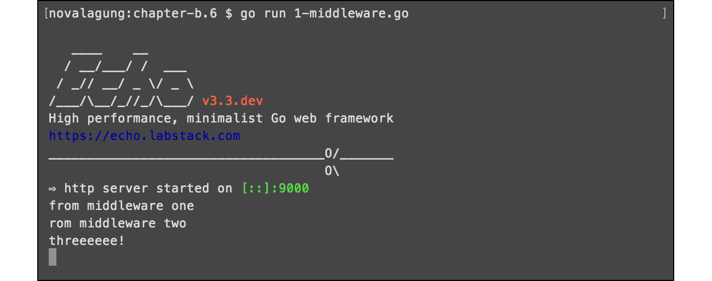
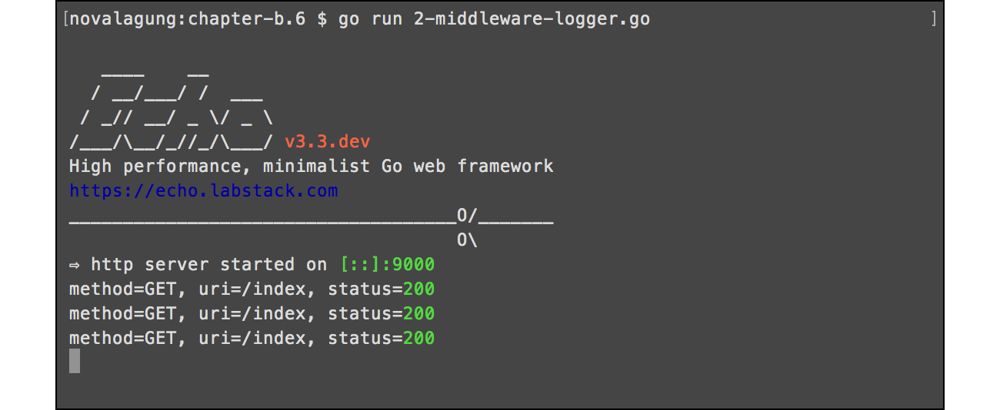

# C.8. Advanced Middleware & Logging (Logrus, Echo Logger)

Middleware adalah sebuah blok kode yang dipanggil sebelum ataupun sesudah http request di-proses. Middleware biasanya dibuat per-fungsi-nya, contohnya: middleware autentikasi, middleware untuk logging, middleware untuk gzip compression, dan lainnya.

Pada chapter ini kita akan belajar cara membuat dan me-manage middleware.

## C.8.1. Custom Middleware

Pembuatan middleware pada echo sangat mudah, cukup gunakan method `.Use()` milik objek echo untuk registrasi middleware. Method ini bisa dipanggil berkali-kali, dan eksekusi middleware-nya sendiri adalah berurutan sesuai dengan urutan registrasi.

OK, langsung saja, buat folder project baru dengan isi sebauh file `main.go` seperti biasanya. Lalu tulis kode berikut.

```go
package main

import (
    "fmt"
    "github.com/labstack/echo"
    "net/http"
)

func main() {
    e := echo.New()

    // middleware here

    e.GET("/index", func(c echo.Context) (err error) {
        fmt.Println("threeeeee!")

        return c.JSON(http.StatusOK, true)
    })

    e.Logger.Fatal(e.Start(":9000"))
}
```

Kode di atas merupakan aplikasi web kecil, berisi satu buah rute `/index` yang ketika di akses akan print log `"threeeeee!"` ke console.

Selanjutnya, buat dua middleware, `middlewareOne` dan `middlewareTwo`. Isinya juga menampilkan log.

```go
func middlewareOne(next echo.HandlerFunc) echo.HandlerFunc {
    return func(c echo.Context) error {
        fmt.Println("from middleware one")
        return next(c)
    }
}

func middlewareTwo(next echo.HandlerFunc) echo.HandlerFunc {
    return func(c echo.Context) error {
        fmt.Println("from middleware two")
        return next(c)
    }
}
```

Registrasikan kedua middleware di atas. Kode di bawah ini adalah contoh cara registrasinya.

```go
func main() {
    e := echo.New()

    e.Use(middlewareOne)
    e.Use(middlewareTwo)

    // ...
```

Jalankan aplikasi, lihat hasilnya.



## C.8.2. Integrasi Middleware ber-skema Non-Echo-Middleware

Di echo, fungsi middleware harus memiliki skema `func(echo.HandlerFunc)echo.HandlerFunc`. Untuk 3rd party middleware, tetap bisa dikombinasikan dengan echo, namun membutuhkan sedikit penyesuaian tentunya. 

Echo menyediakan solusi mudah untuk membantu integrasi 3rd party middleware, yaitu dengan menggunakan fungsi `echo.WrapMiddleware()` untuk mengkonversi middleware menjadi echo-compatible-middleware, dengan syarat skema harus dalam bentuk `func(http.Handler)http.Handler`.

Silakan praktekan kode berikut.

```go
func middlewareSomething(next http.Handler) http.Handler {
    return http.HandlerFunc(func(w http.ResponseWriter, r *http.Request) {
        fmt.Println("from middleware something")
        next.ServeHTTP(w, r)
    })
}

func main() {
    e := echo.New()

    e.Use(echo.WrapMiddleware(middlewareSomething))

    // ...
```

Bisa dilihat, fungsi `middlewareSomething` tidak menggunakan skema middleware milik echo, namun tetap bisa digunakan dalam `.Use()` dengan cara dibungkus fungsi `echo.WrapMiddleware()`.

## C.8.3. Echo Middleware: Logger

Seperti yang sudah penulis jelaskan pada awal chapter B, bahwa echo merupakan framework besar, di dalamnya terdapat banyak dependency dan library, salah satunya adalah logging middleware.

Cara menggunakan logging middleware (ataupun middleware lainnya milik echo) adalah dengan meng-import package `github.com/labstack/echo/middleware`, lalu panggil nama middleware nya. Lebih detailnya silakan baca dokumentasi echo mengenai middleware di https://echo.labstack.com/middleware.

Berikut merupakan contoh penggunaan echo logging middleware.

```go
package main

import (
    "github.com/labstack/echo"
    "github.com/labstack/echo/middleware"
    "net/http"
)

func main() {
    e := echo.New()

    e.Use(middleware.LoggerWithConfig(middleware.LoggerConfig{
        Format: "method=${method}, uri=${uri}, status=${status}\n",
    }))

    e.GET("/index", func(c echo.Context) (err error) {
        return c.JSON(http.StatusOK, true)
    })

    e.Logger.Fatal(e.Start(":9000"))
}
```

Cara menggunakan echo logging middleware adalah dengan membuat objek logging baru lewat statement `middleware.Logger()`, lalu membungkusnya dengan `e.Use()`. Atau bisa juga menggunakan `middleware.LoggerWithConfig()` jika logger yang dibuat memerlukan beberapa konfigurasi (tulis konfigurasinya sebagai property objek cetakan `middleware.LoggerConfig`, lalu tempatkan sebagai parameter method pemanggilan `.LoggerWithConfig()`).

Jalankan aplikasi, lalu lihat hasilnya.



---

Berikut merupakan list middleware yang disediakan oleh echo, atau cek https://echo.labstack.com/middleware untuk lebih detailnya.

- Basic Auth
- Body Dump
- Body Limit
- CORS
- CSRF
- Casbin Auth
- Gzip
- JWT
- Key Auth
- Logger
- Method Override
- Proxy
- Recover
- Redirect
- Request ID
- Rewrite
- Secure
- Session
- Static
- Trailing Slash

## C.8.4. 3rd Party Logging Middleware: Logrus

Selain dengan membuat middleware sendiri, ataupun menggunakan echo middleware, kita juga bisa menggunakan 3rd party middleware lain. Tinggal sesuaikan sedikit agar sesuai dengan skema fungsi middleware milik echo untuk bisa digunakan.

Next, kita akan coba untuk meng-implementasi salah satu golang library terkenal untuk keperluan logging, yaitu [logrus](https://github.com/sirupsen/logrus).

Buat file baru, import packages yang diperlukan, lalu buat fungsi `makeLogEntry()`, fungsi ini menerima satu parameter bertipe `echo.Context` dan mengembalikan objek logrus `*log.Entry`.

```go
package main

import (
    "fmt"
    "github.com/labstack/echo"
    log "github.com/sirupsen/logrus"
    "net/http"
    "time"
)

func makeLogEntry(c echo.Context) *log.Entry {
    if c == nil {
        return log.WithFields(log.Fields{
            "at": time.Now().Format("2006-01-02 15:04:05"),
        })
    }

    return log.WithFields(log.Fields{
        "at":     time.Now().Format("2006-01-02 15:04:05"),
        "method": c.Request().Method,
        "uri":    c.Request().URL.String(),
        "ip":     c.Request().RemoteAddr,
    })
}
```

Fungsi `makeLogEntry()` bertugas membuat basis log objek yang akan ditampilkan. Informasi standar seperti waktu, dibentuk di dalam fungsi ini. Khusus untuk log yang berhubungan dengan http request, maka informasi yang lebih detail dimunculkan (http method, url, dan IP).

Selanjutnya, buat fungsi `middlewareLogging()` dan `errorHandler()`.

```go
func middlewareLogging(next echo.HandlerFunc) echo.HandlerFunc {
    return func(c echo.Context) error {
        makeLogEntry(c).Info("incoming request")
        return next(c)
    }
}

func errorHandler(err error, c echo.Context) {
    report, ok := err.(*echo.HTTPError)
    if ok {
        report.Message = fmt.Sprintf("http error %d - %v", report.Code, report.Message)
    } else {
        report = echo.NewHTTPError(http.StatusInternalServerError, err.Error())
    }

    makeLogEntry(c).Error(report.Message)
    c.HTML(report.Code, report.Message.(string))
}
```

Fungsi `middlewareLogging()` bertugas untuk menampilkan log setiap ada http request masuk. Dari objek `*log.Entry` -yang-dicetak-lewat-fungsi-`makeLogEntry()`-, panggil method `Info()` untuk menampilkan pesan log dengan level adalah INFO.

Sedang fungsi `errorHandler` akan digunakan untuk meng-override default http error handler milik echo. Dalam fungsi ini log dengan level ERROR dimunculkan lewat pemanggilan method `Error()` milik `*log.Entry`.

Buat fungsi `main()`, implementasikan semua fungsi tersebut, siapkan yang harus disiapkan.

```go
func main() {
    e := echo.New()

    e.Use(middlewareLogging)
    e.HTTPErrorHandler = errorHandler

    e.GET("/index", func(c echo.Context) error {
        return c.JSON(http.StatusOK, true)
    })

    lock := make(chan error)
    go func(lock chan error) { lock <- e.Start(":9000") }(lock)

    time.Sleep(1 * time.Millisecond)
    makeLogEntry(nil).Warning("application started without ssl/tls enabled")

    err := <-lock
    if err != nil {
        makeLogEntry(nil).Panic("failed to start application")
    }
}
```

Fungsi `main()` di atas berisikan beberapa kode yang jarang kita gunakan, pada saat men-start web server. 

Web server di start dalam sebuah goroutine. Karena method `.Start()` milik echo adalah blocking, kita manfaatkan nilai baliknya untuk di kirim ke channel `lock`.

Selanjutnya dengan delay waktu 1 milidetik, log dengan level WARNING dimunculkan. Ini hanya simulasi saja, karena memang aplikasi tidak di start menggunakan ssl/tls. Dengan memberi delay 1 milidetik, maka log WARNING bisa muncul setelah log default dari echo muncul.

Nah pada bagian penerimaan channel, jika nilai baliknya tidak `nil` maka pasti terjadi error pada saat start web server, dan pada saat itu juga munculkan log dengan level PANIC.

OK, sekarang jalankan lalu test aplikasi.


Satu kata, *cantik*.

---

 - [Echo](https://github.com/labstack/echo), by Vishal Rana (Lab Stack), MIT license
 - [Logrus](https://github.com/sirupsen/logrus), by Simon Eskildsen, MIT license

---

<div class="source-code-link">
    <div class="source-code-link-message">Source code praktek chapter ini tersedia di Github</div>
    <a href="https://github.com/novalagung/dasarpemrogramangolang-example/tree/master/chapter-C.8-advanced-middleware-and-logging">https://github.com/novalagung/dasarpemrogramangolang-example/.../chapter-C.8...</a>
</div>

---

<iframe src="partial/ebooks.html" class="partial-ebooks-wrapper" frameborder="0" scrolling="no"></iframe>
