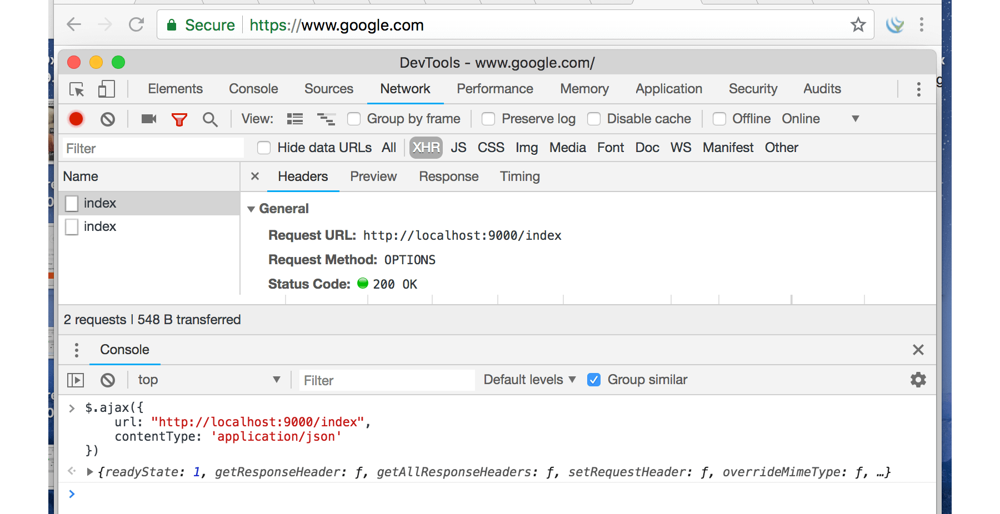

# C.14. CORS & Preflight Request

Pada chapter ini kita akan belajar tentang Cross-Origin Resource Sharing (CORS) dan Preflight Request.

## C.14.1. Teori & Penerapan

CORS adalah mekanisme untuk memberi tahu browser, apakah sebuah request yang di-dispatch dari aplikasi web domain lain atau origin lain, ke aplikasi web kita itu diperbolehkan atau tidak. Jika aplikasi kita tidak mengijinkan maka akan muncul error, dan request pasti digagalkan oleh browser.

CORS hanya berlaku pada request-request yang dilakukan lewat browser, dari javascript; dan tujuan request-nya berbeda domain/origin. Jadi request yang dilakukan dari curl maupun dari back end, tidak terkena dampak aturan CORS.

> Request jenis ini biasa disebut dengan istilah cross-origin HTTP request.

Konfigurasi CORS dilakukan di **response header** aplikasi web. Penerapannya di semua bahasa pemrograman yang web-based adalah sama, yaitu dengan memanipulasi response header-nya. Berikut merupakan list header yang bisa digunakan untuk konfigurasi CORS.

 - Access-Control-Allow-Origin
 - Access-Control-Allow-Methods
 - Access-Control-Allow-Headers
 - Access-Control-Allow-Credentials
 - Access-Control-Max-Age

Konfigurasi CORS berada di sisi server, di aplikasi web tujuan request. 

Permisalan: aplikasi kita di local mengambil data dari google.com, maka konfigurasi CORS berada di google.com; Jika kita terkena error CORS maka tak ada lagi yang bisa dilakukan, karena CORS aplikasi tujuan dikontrol oleh orang-orang yang ada di google.com.

Agar lebih mudah untuk dipahami bagaimana penerapannya, mari langsung kita praktekan seperti biasanya.

## C.14.2. Aplikasi dengan konfigurasi CORS sederhana

Buat project baru, lalu isi fungsi `main()` dengan kode berikut. Aplikasi sederhana ini akan kita jalankan pada domain atau origin `http://localhost:3000/`, lalu akan kita coba akses dari domain berbeda.

```go
package main

import (
    "log"
    "net/http"
)

func main() {
    http.HandleFunc("/index", func(w http.ResponseWriter, r *http.Request) {
        w.Header().Set("Access-Control-Allow-Origin", "https://www.google.com")
        w.Header().Set("Access-Control-Allow-Methods", "OPTIONS, GET, POST, PUT")
        w.Header().Set("Access-Control-Allow-Headers", "Content-Type, X-CSRF-Token")

        if r.Method == "OPTIONS" {
            w.Write([]byte("allowed"))
            return
        }

        w.Write([]byte("hello"))
    })

    log.Println("Starting app at :9000")
    http.ListenAndServe(":9000", nil)
}
```

Seperti yang sudah dijelaskan, bahwa konfigurasi CORS berada di header response. Pada kode di atas 3 buah property header untuk keperluan CORS digunakan.

Header `Access-Control-Allow-Origin` digunakan untuk menentukan domain mana saja yang diperbolehkan mengakses aplikasi ini. Kita bisa set value-nya dengan banyak origin, hal ini diperbolehkan dalam [spesifikasi CORS](https://www.w3.org/TR/cors/#access-control-allow-origin-response-header) namun sayangnya banyak browser yang tidak support.

```http
Access-Control-Allow-Origin: https://www.google.com
```

Kode di atas artinya request yang di-dispatch dari https://www.google.com diijinkan untuk masuk; Penulis memilih domain google karena testing akan dilakukan dari sana, dengan tujuan destinasi request adalah `http://localhost:3000/`.

Simulasi pada chapter ini adalah **aplikasi web localhost:3000 diakses dari google.com** (eksekusi request sendiri kita lakukan dari browser dengan memanfaatkan developer tools milik chrome). BUKAN google.com diakses dari aplikasi web localhost:3000, jangan sampai dipahami terbalik.

Kembali ke pembahasan source code. Dua header CORS lainnya digunakan untuk konfigurasi yang lebih mendetail.

```http
Access-Control-Allow-Methods: OPTIONS, GET, POST, PUT
Access-Control-Allow-Headers: Content-Type, X-CSRF-Token
```

Header `Access-Control-Allow-Methods` menentukan HTTP Method mana saja yang diperbolehkan masuk (penulisannya dengan pembatas koma). 

> Dianjurkan untuk selalu memasukan method `OPTIONS` karena method ini dibutuhkan oleh preflight request.

Header `Access-Control-Allow-Headers` menentukan key header mana saja yang diperbolehkan di-dalam request.

Jika request tidak memenuhi salah satu saja dari ke-tiga rules di atas, maka request bisa dipastikan gagal. Contoh:

 - Request dari https://novalagung.com ke http://localhost:3000, hasilnya pasti gagal, karena origin novalagung.com tidak diijinkan untuk mengakses http://localhost:3000.
 - Request dari https://www.google.com ke http://localhost:3000 dengan method adalah `DELETE`, hasilnya pasti gagal. Method `DELETE` adalah tidak di-ijinkan. hanya empat method `OPTIONS`, `GET`, `POST`, `PUT` yang diijinkan.
 - Request dari https://www.google.com ke http://localhost:3000 dengan method GET, degan header `Authorization: Basic xxx` dan `X-CSRF-Token: xxxx`, hasilnya adalah gagal. Karena salah satu dari kedua header tersebut tidak diijinkan (header `Authorization`).
 - Request dari https://www.google.com ke http://localhost:3000 dengan method `GET` dan memiliki header `Content-Type` adalah diijinkan masuk, karena memenuhi semua aturan yang kita definiskan.

Khusus untuk beberapa header seperti `Accept`, `Origin`, `Referer`, dan `User-Agent` tidak terkena efek CORS, karena header-header tersebut secara otomatis di-set di setiap request.

## C.14.3. Testing CORS

#### • Persiapan

Ada beberapa hal yang perlu dipersiapkan. Pertama, pastikan punya google chrome. Lalu install extension [jQuery Injector](https://chrome.google.com/webstore/detail/jquery-injector/ekkjohcjbjcjjifokpingdbdlfekjcgi?hl=en). Buka https://www.google.com lalu inject jQuery. Dengan melakukan inject jQuery secara paksa maka dari situs google kita bisa menggunakan jQuery.

Buka chrome developer tools, klik tab console. Lalu jalankan perintah jQuery AJAX berikut.

```js
$.ajax({
    url: "http://localhost:9000/index",
})
```

Silakan lihat gambar berikut untuk memperjelas.


Bisa dilihat, tidak ada error, karena memang request dari google diijinkan. Silakan coba-coba melakukan request AJAX lainnya dengan method POST, DELETE, atau lainnya; atau ditambah dengan menyisipkan header tertentu dalam ajax request.

#### • Akses http://localhost:9000 dari Origin yang Tidak Didaftarkan di CORS

Selanjutnya coba buka tab baru, buka https://novalagung.com, lalu jalankan script yang sama.


<pre style="font-size: .85em; white-space: pre-wrap; white-space: -moz-pre-wrap; white-space: -pre-wrap; white-space: -o-pre-wrap; word-wrap: break-word;">Failed to load http://localhost:9000/index: The 'Access-Control-Allow-Origin' header has a value 'https://www.google.com' that is not equal to the supplied origin. Origin 'https://novalagung.com' is therefore not allowed access.</pre>

Dari screenshot dan error log di atas, bisa dilihat bahwa request gagal. Hal ini dikarenakan origin https://novalagung.com tidak diijinkan untuk mengakses http://localhost:9000.

#### • CORS Multiple Origin

Sekarang coba tambahkan situs https://novalagung.com ke CORS header.

```go
http.HandleFunc("/index", func(w http.ResponseWriter, r *http.Request) {
    w.Header().Set("Access-Control-Allow-Origin", 
        "https://www.google.com, https://novalagung.com")

    // ...
```

Jalankan ulang aplikasi, lalu dispatch lagi AJAX dari situs tersebut.


Masih tetap error, tapi berbeda dengan error sebelumnya.

<pre style="font-size: .85em; white-space: pre-wrap; white-space: -moz-pre-wrap; white-space: -pre-wrap; white-space: -o-pre-wrap; word-wrap: break-word;">Failed to load http://localhost:9000/index: The 'Access-Control-Allow-Origin' header contains multiple values 'https://www.google.com, https://novalagung.com', but only one is allowed. Origin 'https://novalagung.com' is therefore not allowed access.</pre>

Sebenarnya sudah kita singgung juga di atas, bahwa di spesifikasi adalah diperbolehkan isi header `Access-Control-Allow-Origin` lebih dari satu website. Namun, kebanyakan browser tidak mendukung bagian ini. Oleh karena itu error di atas muncul. Konfigurasi ini termasuk tidak valid, hasilnya kedua website tersebut tidak punya ijin masuk.

#### • Allow All

Gunakan tanda asteriks (`*`) sebagai nilai ketiga CORS header untuk memberi ijin ke semua.

```go
// semua origin mendapat ijin akses
w.Header().Set("Access-Control-Allow-Origin", "*")

// semua method diperbolehkan masuk
w.Header().Set("Access-Control-Allow-Methods", "*")

// semua header diperbolehkan untuk disisipkan
w.Header().Set("Access-Control-Allow-Headers", "*")
```

## C.14.4. Preflight Request

#### • Teori

Dalam konteks CORS, request dikategorikan menjadi 2 yaitu, **Simple Request** dan **Preflighted Request**. Beberapa contoh request yang sudah kita pelajari di atas termasuk simple request.

Sedangkan mengenai preflighted request sendiri, mungkin pembaca secara tidak langsung juga pernah menerapkannya, terutama ketika bekerja di bagian front-end yang mengonsumsi data dari RESTful API yang server nya terpisah antara layer front end dan back end.

Ketika melakukan cross origin request dengan payload adalah JSON, atau request jenis lainnya, biasanya di developer tools -> network log muncul 2 kali request, request pertama method-nya `OPTIONS` dan request ke-2 adalah actual request.

Request ber-method `OPTIONS` tersebut disebut dengan **Preflight Request**. Request ini akan otomatis muncul ketika http request yang kita dispatch memenuhi kriteria preflighted request. 

Tujuan dari preflight request adalah untuk mengecek apakah destinasi url mendukung CORS. Tiga buah informasi dikirimkan `Access-Control-Request-Method`, `Access-Control-Request-Headers`, dan `Origin`, dengan method adalah `OPTIONS`.

Berikut merupakan kriteria preflighted request.

 - Method yang digunakan adalah salah satu dari method berikut:
    - `PUT`
    - `DELETE`
    - `CONNECT`
    - `OPTIONS`
    - `TRACE`
    - `PATCH`
 - Terdapat header SELAIN yang otomatis di-set dalam http request. Contoh header untuk kriteria ini adalah `Authorization`, `X-CSRF-Token`, atau lainnya.
 - Isi header `Content-Type` adalah SELAIN satu dari 3 berikut.
    - application/x-www-form-urlencoded
    - multipart/form-data
    - text/plain
 - Ada event yang ter-registrasi dalam objek `XMLHttpRequestUpload` yang digunakan dalam request.
 - Menggunakan objek `ReadableStream` dalam request.

> Lebih detailnya mengenai simple dan preflighted request silakan baca https://developer.mozilla.org/en-US/docs/Web/HTTP/CORS.

Pada kode yang kita tulis, terdapat pengecekan method `OPTIONS`. Pengecekan ini digunakan untuk mencegah eksekusi statement selanjutnya. Hal ini dikarenakan preflight request tidak membutuhkan kembalian data, tugas si dia hanya mengecek apakah cross origin request didukung atau tidak. Jadi pada handler, ketika method nya adalah `OPTIONS`, langsung saja intercept proses utamanya.

> Header `Access-Control-Max-Age` diisi dengan data waktu, digunakan untuk menentukan sebearapa lama informasi preflight request di-cache. Jika diisi dengan `-1` maka cache di-non-aktifkan.

```go
http.HandleFunc("/index", func(w http.ResponseWriter, r *http.Request) {
    // ...

    if r.Method == "OPTIONS" {
        w.Write([]byte("allowed"))
        return
    }

    // ...
})
```

#### • Praktek

Langsung saja buka google.com lalu lakukan AJAX request yang memenuhi alah satu kriteria preflighted request, misalnya, gunakan header `Content-Type: application/json`.



Bisa dilihat pada screenshot, dua request muncul, yang pertama adalah preflight yang kedua adalah actual request.

## C.14.5. CORS Handling Menggunakan Golang CORS Library dan Echo 

Pada bagian ini kita akan mengkombinasikan library CORS golang buatan Olivier Poitrey, dan Echo, untuk membuat back end yang mendukung cross origin request.

Pertama `go get` dulu library-nya.

```bash
go get https://github.com/rs/cors
```

Buat file baru, import library yang diperlukan lalu buat fungsi main.

```go
package main

import (
    "github.com/labstack/echo"
    "github.com/rs/cors"
    "net/http"
)

func main() {
    e := echo.New()

    // ...

    e.GET("/index", func(c echo.Context) error {
        return c.String(http.StatusOK, "hello")
    })

    e.Logger.Fatal(e.Start(":9000"))
}
```

Siapkan objek `corsMiddleware`, cetak dari fungsi `cors.New()` . Pada parameter konfigurasi, isi spesifikasi CORS sesuai kebutuhan.

Gaya konfigurasi library ini menarik, mudah sekali untuk dipahami.

```go
corsMiddleware := cors.New(cors.Options{
    AllowedOrigins: []string{"https://novalagung.com", "https://www.google.com"},
    AllowedMethods: []string{"OPTIONS", "GET", "POST", "PUT"},
    AllowedHeaders: []string{"Content-Type", "X-CSRF-Token"},
    Debug:          true,
})
e.Use(echo.WrapMiddleware(corsMiddleware.Handler))
```

Pada kode di atas, kita meng-allow dua buah origin. Sebelumnya sudah kita bahas bahwa kebanyakan browser tidak mendukung ini. Dengan menggunakan CORS library, hal itu bisa teratasi. 

> Sebenarnya mekanisme yang diterapkan oleh CORS library adalah meng-allow semua origin, lalu kemudian mem-filter sesuai dengan spesifikasi yang kita buat, lalu memodifikasi response header `Access-Control-Allow-Origin`-nya.

Jalankan aplikasi, coba test dari dua domain, https://novalagung.com dan https://www.google.com.


Berikut adalah list konfigurasi yang bisa dimanfaatkan dari library ini.

| Key | Description |
| --- | ----------- |
| AllowedOrigins | list origin/domain yang diperbolehkan mengakses, gunakan `*` untuk allow all |
| AllowOriginFunc | callback untuk validasi origin. cocok digunakan untuk menge-set CORS header origin dengan ijin rumit |
| AllowedMethods | list HTTP method yang diperbolehkan untuk pengaksesan |
| AllowedHeaders | list header yang diperbolehkan untuk pengaksesan |
| ExposedHeaders | menentukan header mana saja yang di-expose ke consumer | 
| AllowCredentials | enable/disable credentials |
| MaxAge | durasi cache preflight request |
| OptionsPassthrough | digunakan untuk menginstruksikan handler selanjutnya untuk memproses OPTIONS method |
| Debug | aktifkan properti ini pada stage development, agar banyak informasi log tambahan bisa muncul |

---

 - [CORS](https://github.com/rs/cors), by Olivier Poitrey, MIT license
 - [Echo](https://github.com/labstack/echo), by Vishal Rana (Lab Stack), MIT license

---

<div class="source-code-link">
    <div class="source-code-link-message">Source code praktek chapter ini tersedia di Github</div>
    <a href="https://github.com/novalagung/dasarpemrogramangolang-example/tree/master/chapter-C.14-cors-preflight-request">https://github.com/novalagung/dasarpemrogramangolang-example/.../chapter-C.14...</a>
</div>

---

<iframe src="partial/ebooks.html" width="100%" height="430px" frameborder="0" scrolling="no"></iframe>
