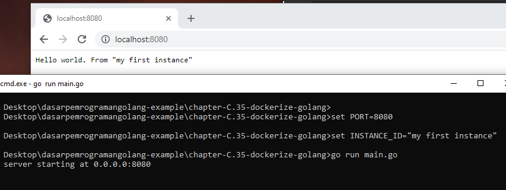

# C.35. Dockerize Aplikasi Golang

Pada chapter ini kita akan praktek men-*dockerize* aplikasi Go, membungkus aplikasi hello world sebagai docker image untuk kemudian di jalankan sebagai container.

Kita tidak akan membahas docker secara detail ya, hanya pengenalannya saja. Untuk teman-teman yang tertarik belajar docker secara komprehensif mulai dari awal, hingga masuk ke docker compose kemudian kubernetes *from zero to hero*, bisa *enroll* course Udemy [Praktis Belajar Docker dan Kubernetes untuk Pemula](https://www.udemy.com/course/praktis-belajar-docker-dan-kubernetes-untuk-pemula/) berikut.

<a href="https://www.udemy.com/course/praktis-belajar-docker-dan-kubernetes-untuk-pemula/" target="_blank">
    
</a>

## C.35.1. Prerequisities

Pastikan Docker Engine ter-*install* untuk pengguna Windows atau MacOS. Untuk pengguna Linux/Unix, install saja Docker Engine. Silakan merujuk ke laman panduan instalasi https://docs.docker.com/get-docker/ jika belum meng-*install* Docker-nya.

## C.35.2. Istilah Dalam Docker

#### • Container

Container adalah sebuah environment ter-isolasi, merupakan bentuk virtualisasi yang lebih kecil dan ringan dibanding VM (Virtual Machine). Virtualisasi pada container disebut dengan *Containerization*.

#### • Docker Container

Docker container adalah sebuah container yang di-manage oleh Docker Engine.

#### • Docker Engine

Docker engine merupakan *daemon* yang bertugas untuk manajemen container-container.

#### • Docker Image

Docker Image adalah sebuah file yang di-*generate* oleh docker, yang file tersebut nantinya digunakan untuk basis pembuatan dan eksekusi container.

#### • Containerize dan Dockerize

Containerize merupakan istilah terhadap aplikasi yang di-*build* ke bentuk Image. Sedangkan Dockerize merupakan istilah untuk containerize menggunakan Docker. Perlu diketahui bahwa penyedia container tidak hanya Docker saja, ada banyak engine container lainnya yang bisa dipergunakan.

## C.35.3. Pembuatan Aplikasi Hello World

Sebelum masuk ke aspek docker, mari kita siapkan dulu aplikasi web sederhana yang nantinya akan di-*build* ke bentuk Image. O iya, jangan lupa inisialisasi project-nya ya menggunakan perintah `go mod init hello-world`.

Siapkan folder project baru dengan isi file `main.go`. Tulis kode berikut.


```go
package main

import (
	"log"
	"net/http"
	"os"
)

func main() {
    // ...
}
```

Dalam fungsi main, tambahkan statement untuk ambil informasi port dari *env var* `PORT`, dan informasi id instance dari *env var* `INSTANCE_ID`. Kedua variabel ini akan dipergunakan dalam web server yang akan kita buat.

* *env var* `PORT` digunakan sebagai port web server.
* *env var* `INSTANCE_ID` untuk *instance identifier*, hanya sebagai info saja dan variabel ini opsional.

```go
port := os.Getenv("PORT")
if port == "" {
    log.Fatal("PORT env is required")
}

instanceID := os.Getenv("INSTANCE_ID")
```

Selanjutnya siapkan satu buah *multiplexor* dengan isi satu buah route `GET /`, yang *handler*-nya mengembalikan sebuah pesan teks `Hello world`. Jika *env var* `INSTANCE_ID` di set, maka akan ditampilkan isinya sebagai bagian dari respon handler ini.

```go
mux := http.NewServeMux()
mux.HandleFunc("/", func(w http.ResponseWriter, r *http.Request) {
    if r.Method != "GET" {
        http.Error(w, "http method not allowed", http.StatusBadRequest)
        return
    }

    text := "Hello world"
    if instanceID != "" {
        text = text + ". From " + instanceID
    }

    w.Write([]byte(text))
})
```

Lanjut siapkan objek `http.Server`-nya, gunakan objek `mux` yang sudah dibuat sebagai basis handler web server, kemudian start web server-nya.

```go
server := new(http.Server)
server.Handler = mux
server.Addr = "0.0.0.0:" + port

log.Println("server starting at", server.Addr)
err := server.ListenAndServe()
if err != nil {
    log.Fatal(err.Error())
}
```

## C.35.4. Testing Aplikasi Hello World

Kita akan coba test aplikasi hello world yang baru dibuat. Untuk Windows gunakan command berikut.

```bat
set PORT=8080
set INSTANCE_ID="my first instance"
go run main.go
```

Untuk sistem operasi non-Windows, gunakan:

```sh
export PORT=8080
export INSTANCE_ID="my first instance"
go run main.go
```



Ok bisa dilihat aplikasi berjalan sesuai harapan. Selanjutnya kita akan *dockerize* aplikasi hello world ini.

## C.35.5. Pembuatan Dockerfile

Aplikasi hello world yang sudah dibuat akan kita *build* ke bentuk Docker Image untuk kemudian di-*run* sebagai container. Nah untuk pembuatan Image, salah satu syaratnya adalah mempersiapkan `Dockerfile`.

Jadi sekarang buat file baru bernama `Dockerfile`, lalu isi dengan kode berikut.

```dockerfile
FROM golang:alpine

RUN apk update && apk add --no-cache git

WORKDIR /app

COPY . .

RUN go mod tidy

RUN go build -o binary

ENTRYPOINT ["/app/binary"]
```

Berikut adalah penjelasan per baris dari kode di atas.

#### 1. Statement `FROM golang:alpine`

Keyword `FROM` ini digunakan untuk inisialisasi *build stage* dan juga menentukan basis Image yang digunakan. Informasi `golang:alpine` di sini adalah basis image yang dimaksud, yaitu image bernama `golang` dengan tag bernama `alpine` yang tersedia di laman officila Docker Hub Golang https://hub.docker.com/_/golang.

Dalam Image `golang:alpine` sudah tersedia beberapa utilitas untuk keperluan *build* aplikasi Golang. Image `golang:alpine` basisnya adalah Alpine OS.

#### 2. Statement `RUN apk update && apk add --no-cache git`

Keyword `RUN` digunakan untuk menjalankan shell comamnd. Argument setelahnya, yaitu `apk update && apk add --no-cache git` akan dijalankan di Image `golang:alpine` yang sudah di-set sebelumnya. Command tersebut merupakan command Alpine OS yang kurang lebih gunanya adalah berikut:

* Command `apk update` digunakan untuk meng-*update* *index packages* pada OS.
* Command `apk add --no-cache git` digunakan untuk meng-*install* Git. Kebetulan pada basis image `golang:alpine` *by default* Git adalah tidak tersedia. Jadi harus di-*install* terlebih dahulu. Git ini nantinya digunakan sewaktu `go get` dependensi lewat command `go mod tidy`. Meskipun pada contoh aplikasi hello world tidak menggunakan dependensi eksternal, *install* saja tidak apa.

#### 3. Statement `WORKDIR /app`

Digunakan untuk menentukan *working directory* yang pada konteks ini adalah `/app`. Statement ini menjadikan semua statement `RUN` di bawahnya akan dieksekusi pada *working directory*.

#### 4. Statement `COPY . .`

Digunakan untuk meng-*copy* file pada argument pertama yaitu `.` yang merepresentasikan direktori yang aktif pada host atau komputer kita (yang isinya file `main.go`, `go.mod`, dan `Dockerfile`), untuk kemudian di-*paste* ke dalam Image ke *working directory* yaitu `/app`. 

Dengan ini isi `/app` adalah sama persis seperti isi folder project hello world.

#### 5. Statement `RUN go mod tidy`

Digunakan untuk validasi dependensi, dan meng-automatisasi proses *download* jika dependensi yang ditemukan belum ter-*download*. Command ini akan mengeksekusi `go get` jika butuh untuk unduh dependensi, makanya kita perlu install Git.

#### 6. Statement `RUN go build -o binary`

Command `go build` digunakan untuk build *binary* atau *executable* dari kode program Go. Dengan ini *source code* dalam *working directory* akan di-*build* ke *executable* dengan nama `binary`.

#### 7. Statement `ENTRYPOINT ["/app/binary"]`

Statement ini digunakan untuk menentukan entrypoint container sewaktu dijalankan. Jadi khusus statement `ENTRYPOINT` ini pada contoh di atas adalah yang efeknya baru kelihatan ketika Image di-*run* ke container. Sewaktu proses *build* aplikasi ke Image maka efeknya belum terlihat.

Dengan statement tersebut nantinya sewaktu container jalan, maka executable `binary` yang merupakan aplikasi hello world kita, itu dijalankan di container sebagai entrypoint.

Ok, file `Dockerfile` sudah siap, mari kita lanjut ke proses *build* dan *start container*.

## C.35.6. *Build Image* dan *Create Container*

#### • Build Image

Pertama masuk ke direktori folder project, lalu jalankan *command* `docker build` berikut.

```bash
cd folder-project
docker build -t my-image-hello-world .
```

*Command* di atas akan melakukan proses *build* Image pada file yang ada di dalam `.` yang merupakan isi folder project. Project akan di-*build* ke sebuah Image dengan nama adalah `my-image-hello-world`. Flag `-t` digunakan untuk menentukan nama Image.

Kurang lebih outputnya seperti gambar berikut. O iya gunakan *command* `docker images` untuk menampilkan list semua image yang ada di lokal.


#### • Create Container

Image sudah siap, sekarang mari kita buat container baru menggunakan basis image `my-image-hello-world`. *Command*-nya kurang lebih berikut:

```bash
docker container create --name my-container-hello-world -e PORT=8080 -e INSTANCE_ID="my first instance" -p 8080:8080 my-image-hello-world
```

Command di atas akan menjalankan sebuah proses yang isinya kurang lebih berikut:

1. Buat container baru dengan nama `my-container-hello-world`.
2. Flag `--name` digunakan untuk menentukan nama container.
3. Sewaktu pembuatan container, *env var* `PORT` di-set dengan nilai adalah `8080`.
4. *env var* `INSTANCE_ID` juga di set di-set, nilai adalah teks `my first instance`.
5. Flag `-e` digunakan untuk menge-*set* *env var*. Flag ini bisa dituliskan banyak kali sesuai kebutuhan.
6. Kemudian port `8080` yang ada di luar network docker (yaitu di host/laptop/komputer kita) di map ke port `8080` yang ada di dalam container.
7. Flag `-p` digunakan untuk mapping port antara host dan container. Bagian ini biasa disebut dengan *expose port*.
8. Proses pembuatan container dilakukan dengan Image `my-image-hello-world` digunakan sebagai basis image.
 
Semoga cukup jelas penjabaran di atas. Setelah container berhasil dibuat, cek menggunakan *command* `docker container ls -a` untuk menampilkan list semua container baik yang sedang running maupun tidak.


#### • Start Container

Ok, sekarang container juga sudah dibuat, lanjut untuk *start* container tersebut, caranya menggunakan command `docker container start`. Jika sudah, coba cek di browser aplikasi web hello world, harusnya sudah bisa diakses.

```bash
docker container start my-container-hello-world
docker container ls
```


Bisa dilihat, sekarang aplikasi web hello world sudah bisa diakses dari host/komputer yang aplikasi tersebut running dalam container docker.

Jika mengalami error saat start container, bisa jadi karena port `8080` sudak dialokasikan untuk proses lain. Solusi untuk kasus ini adalah *kill* saja proses yang menggunakan port tersebut, atau *rebuild image* dan *create container* ulang tapi menggunakan port lainnya, selain `8080`.

O iya, pada image di atas juga bisa dilihat penggunaan *command* `docker container ls` untuk memunculkan list container yang sedand *running* atau aktif. Untuk menampilkan semua container (aktif maupun non-aktif), cukup dengan menambahkan flag `-a` atau `--all`.

#### • Stop Container

Untuk stop container bisa dengan *command* `docker container stop <nama-container-atau-container-id>`.

```bash
docker container stop my-container-hello-world
docker container ls
```

#### • Hapus Container

Untuk hapus container bisa dengan *command* `docker container rm <nama-container-atau-container-id>`.

```bash
docker container rm my-container-hello-world
docker container ls
```

#### • Hapus Image

Untuk hapus image bisa dengan *command* `docker image rm <nama-image-atau-image-id>`. O iya, untuk penghapusan image, harus dipastikan terlebih dahulu tidak ada container yang running menggunakan basis image yang ingin dihapus.

```bash
docker image rm my-image-hello-world
docker images
```

## C.35.7. Run Container

Untuk run container sebenarnya ada dua cara ya, yang pertama seperti contoh di atas dengan membuat container nya terlebih dahulu menggunakan *command* `docker container create` kemudian di start menggunakan *command* `docker container start`.

Atau bisa juga menggunakan *command* `docker run`. *Command* ini akan membuat container baru kemudian otomatis menjalankannya. Tapi saya sampaikan bahwa lewat cara ini tidak ada pengecekan apakah container sudah dibuat atau tidak sebelumnya, pasti akan dibuat container baru.

Mungkin perbandingannya seperti ini:

#### • Jalankan container lewat `create` lalu `start`

```bash
docker container create --name my-container-hello-world -e PORT=8080 -e INSTANCE_ID="my first instance" -p 8080:8080 my-image-hello-world
docker container start my-container-hello-world
```

#### • Jalankan container lewat `run`

```bash
docker container run --name my-container-hello-world -e PORT=8080 -e INSTANCE_ID="my first instance" -p 8080:8080 my-image-hello-world
```

Bisa dilihat bukan bedanya, hanya sedikit.

O iya, khusus untuk *command* `docker run` biasanya dijalankan dengan tambahan beberapa flag agar lebih mudah kontrol-nya, yaitu ditambahkan flag `--rm` dan `-it`.

```bash
docker container run --name my-container-hello-world --rm -it -e PORT=8080 -e INSTANCE_ID="my first instance" -p 8080:8080 my-image-hello-world
```

#### • Flag `--rm`

Flag ini digunakan untuk meng-automatisasi proses penghapusan container sewaktu container tersebut di stop. Jadi kita tidak perlu delete manual pakai `docker container rm`. Hal ini sangat membantu karena *command* `docker run` akan membuat container baru setiap dijalankan. Tapi sebenarnya pada contoh sebelumnya kita tidak perlu khawatir akan dibuat container baru karena sudah ada flag `--name`. Flag tersebut digunakan untuk menentukan nama container, yang di mana nama container harus unik. Jadi kalau ada duplikasi pasti langsung error. Nah dari sini berarti kalau temen-temen tidak pakai `--name` sangat dianjurkan paka `--rm` dalam penerapan `docker run`.

#### • Flag `-it`

Flag ini merupakan flag gabungan antara `-i` yang digunakan untuk meng-enable *interactive mode* dan `-t` untuk *enable* `TTY`. Dengan ini kita bisa masuk ke mode interaktif yang di mana jika kita terminate atau kill command menggunakan `CTRL + C` atau `CMD + C` (untuk mac), maka otomatis container akan di stop.

Nah dengan menggabungkan flag `--rm` dan flag `-it` kita bisa dengan mudah stop kemudian hapus container.

Selain itu ada juga flag yang mungkin penting yaitu `-d` atau dettach. Flag ini bisa digabung dengan `-it`. Dettach adalah mode di mana ketika command `docker run` dijalankan, command akan langsung selesai. Dari sini untuk stop container berarti harus menggunakan command `docker stop`. Contoh:

```bash
docker container run --name my-container-hello-world --rm -itd -e PORT=8080 -e INSTANCE_ID="my first instance" -p 8080:8080 my-image-hello-world
docker container stop my-container-hello-world
```

---

<div class="source-code-link">
    <div class="source-code-link-message">Source code praktek chapter ini tersedia di Github</div>
    <a href="https://github.com/novalagung/dasarpemrogramangolang-example/tree/master/chapter-C.35-dockerize-golang">https://github.com/novalagung/dasarpemrogramangolang-example/...</a>
</div>

---

<iframe src="https://novalagung.substack.com/embed" width="100%" height="320" class="substack-embed" frameborder="0" scrolling="no"></iframe>
