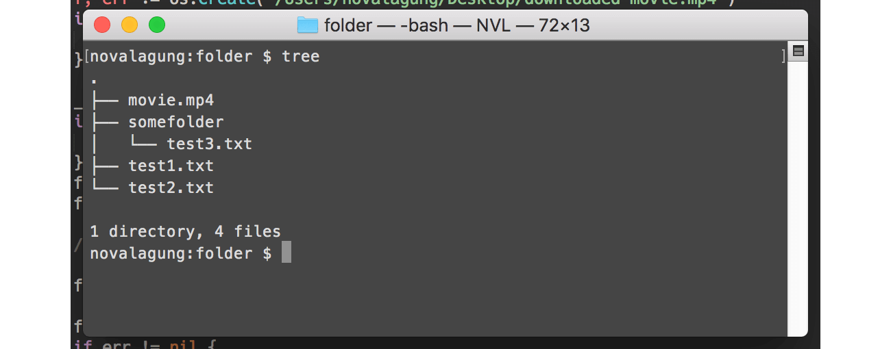

# C.28. FTP

Pada chapter ini kita akan belajar cara melakukan pertukaran data lewat FTP (File Transfer Protocol) menggunakan Golang. 

> Definisi mengenai FTP sendiri adalah sebuah protokol network standar yang digunakan untuk pertukaran atau transfer data antar client dan server.

Sebelum memulai, ada satu hal penting yang perlu dipersiapkan, yaitu sebuah server dengan FTP server ter-install. Jika tidak ada, bisa menggunakan library [ftpd](https://github.com/goftp/ftpd) untuk set up ftp server di local (untuk keperluan belajar).

Dalam server tersebut, siapkan beberapa file dan folder dengan struktur sebagai berikut.



 - File `test1.txt`, isi dengan apapun.
 - File `test2.txt`, isi dengan apapun.
 - File `somefolder/test3.txt`, isi dengan apapun.
 - File `movie.mp4`, gunakan file seadanya.

Library FTP client yang kita gunakan adalah [github.com/jlaffaye/ftp](https://github.com/jlaffaye/ftp).

## C.28.1. Koneksi ke Server

Buat satu buah folder project baru dengan isi `main.go`. Di dalam file main akan kita isi dengan beberapa operasi FTP seperti upload, download, akses ke direktori dan lainnya.

OK, langsung saja, silakan tulis kode berikut.

```go
package main

import (
    "fmt"
    "github.com/jlaffaye/ftp"
    "log"
)

func main() {
    const FTP_ADDR = "0.0.0.0:2121"
    const FTP_USERNAME = "admin"
    const FTP_PASSWORD = "123456"

    // ...
}
```

Tiga buah konstanta dengan prefix `FTP_` disiapkan, isinya adalah credentials FTP untuk bisa melakukan koneksi FTP ke server.

Di dalam `main()`, tambahkan kode untuk terhubung dengan server.

```go
connt, err := ftp.Dial(FTP_ADDR)
if err != nil {
    log.Fatal(err.Error())
}

err = conn.Login(FTP_USERNAME, FTP_PASSWORD)
if err != nil {
    log.Fatal(err.Error())
}
```

Cara konek ke server melalui FTP dipecah menjadi dua tahap. Pertama adalah menggunakan `ftp.Dial()` dengan argumen adalah alamat server (beserta port). Statement tersebut mengembalikan objek bertipe `*ftp.ServerConn` yang ditampung oleh variabel `conn`.

Tahap kedua, lewat objek `conn`, panggil method `.Login()` dengan disisipi argumen username dan password FTP.

## C.28.2. Menampilkan Semua File Menggunakan `.List()`

Lewat tipe `*ftp.ServerConn`, semua method untuk operasi FTP bisa diakses. Salah satu dari method tersebut adalah `.List()`, gunanya untuk listing semua file yang ada di server. Operasi ini sama dengan `ls`.

```go
fmt.Println("======= PATH ./")

entries, err := conn.List(".")
if err != nil {
    log.Fatal(err.Error())
}
for _, entry := range entries {
    fmt.Println(" ->", entry.Name, getStringEntryType(entry.Type))
}
```

Method `.List()` di atas dipanggil dengan argumen adalah string `"."`, berarti semua aset dalam `"."` atau **current path** dimunculkan.

Method tersebut mengembalikan slice yang tiap elemen-nya adalah representasi tiap file. Pada kode di atas, semua file dimunculkan ke console, nama dan tipe-nya.

Property `.Type` milik `entry` tipenya adalah `ftp.EntryType`, yang sebenarnya `int`. Fungsi `getStringEntryType()` kita buat untuk menampilkan keterangan dalam string sesuai dengan tipe.

```go
func getStringEntryType(t ftp.EntryType) string {
    switch t {
    case ftp.EntryTypeFile:
        return "(file)"
    case ftp.EntryTypeFolder:
        return "(folder)"
    case ftp.EntryTypeLink:
        return "(link)"
    default:
        return ""
    }
}
```

Jalankan aplikasi lihat hasilnya.


Jika dibandingkan dengan file yang ada di server, ada satu yang tidak muncul, yaitu `somefolder/test3.txt`. Hal ini dikarenakan file yang di-list adalah yang ada pada `"."` atau **current path**. File `test3.txt` berada di dalam sub folder `somefolder`.

## C.28.3. Pindah Ke Folder Tertentu Menggunakan `.ChangeDir()`

Selanjutnya, kita akan coba masuk ke folder `somefolder`, lalu menampilkan isinya. Gunakan method `.ChangeDir()`, sisipkan path folder tujuan sebagai argument.

```go
fmt.Println("======= PATH ./somefolder")

err = conn.ChangeDir("./somefolder")
if err != nil {
    log.Fatal(err.Error())
}
```

Setelah itu, list semua file. Tetap gunakan `"."` sebagai argument pemanggilan method `.List()` untuk listing current path. Karena kita sudah masuk ke folder `./somefolder`, maka path tersebut-lah yang menjadi current path.

```go
entries, err = conn.List(".")
if err != nil {
    log.Fatal(err.Error())
}
for _, entry := range entries {
    fmt.Println(" ->", entry.Name, getStringEntryType(entry.Type))
}
```

Jalankan aplikasi, lihat lagi hasilnya.


## C.28.4. Pindah Ke Parent Folder Menggunakan `.ChangeDirToParent()`

Gunakan method `.ChangeDirToParent()` untuk mengubah aktif path ke parent path. Tambahkan kode berikut, agar current path `./somefolder` kembali menjadi `.`.

```go
err = conn.ChangeDirToParent()
if err != nil {
    log.Fatal(err.Error())
}
```

## C.28.5. Mengambil File Menggunakan `.Retr()` Lalu Membaca Isinya

Cara mengambil file adalah dengan method `.Retr()`. Tulis saja path file yang ingin diambil sebagai argumen. Nilai baliknya adalah objek bertipe `*ftp.Response` dan error (jika ada).

```go
fmt.Println("======= SHOW CONTENT OF FILES")

fileTest1Path := "test1.txt"
fileTest1, err := conn.Retr(fileTest1Path)
if err != nil {
    log.Fatal(err.Error())
}

test1ContentInBytes, err := io.ReadAll(fileTest1)
fileTest1.Close()
if err != nil {
    log.Fatal(err.Error())
}

fmt.Println(" ->", fileTest1Path, "->", string(test1ContentInBytes))
```

Baca isi objek response tersebut menggunakan method `.Read()` miliknya, atau bisa juga menggunakan `io.ReadAll()` lebih praktisnya (nilai baliknya bertipe `[]byte` maka cast ke tipe `string` terlebih dahulu untuk menampilkan isinya).

> Jangan lupa untuk import package `io`.

Di kode di atas file `test1.txt` dibaca. Lakukan operasi yang sama pada file `somefolder/test3.txt`.

```go
fileTest2Path := "somefolder/test3.txt"
fileTest2, err := conn.Retr(fileTest2Path)
if err != nil {
    log.Fatal(err.Error())
}

test2ContentInBytes, err := io.ReadAll(fileTest2)
fileTest2.Close()
if err != nil {
    log.Fatal(err.Error())
}

fmt.Println(" ->", fileTest2Path, "->", string(test2ContentInBytes))
```

> Jangan lupa juga untuk meng-close objek bertipe `*ftp.Response`, setelah dibaca isinya.

Jalankan aplikasi, cek hasilnya.


Bisa dilihat, isi file yang dibaca adalah aslinya.

## C.28.6. Download File

Proses download secara teknis adalah memindahkan **isi file** dari remote server ke local server. Di local, dibuatkan sebuah file yang nantinya akan menampung isi file dari remote server yang di-transfer. Sebarapa cepat proses download berlangsung sangat tergantung kepada besar file yang isinya sedang di transfer (dan beberapa faktor lainnya).

Di golang, penerapan download lewat FTP kurang lebih adalah sama. perlu dibuat terlebih dahulu file di local untuk menampung isi file yang diambil dari remote server.

OK, mari kita praktekan. File `movie.mp4` yang berada di server akan kita unduh ke local.

```go
fmt.Println("======= DOWNLOAD FILE TO LOCAL")

fileMoviePath := "movie.mp4"
fileMovie, err := conn.Retr(fileMoviePath)
if err != nil {
    log.Fatal(err.Error())
}

destinationMoviePath := "/Users/novalagung/Desktop/downloaded-movie.mp4"
f, err := os.Create(destinationMoviePath)
if err != nil {
    log.Fatal(err.Error())
}

_, err = io.Copy(f, fileMovie)
if err != nil {
    log.Fatal(err.Error())
}
fileMovie.Close()
f.Close()

fmt.Println("File downloaded to", destinationMoviePath)
```

Pertama ambil file tujuan menggunakan `.Retr()`. Lalu buat file di local. Pada contoh di atas nama file di local adalah berbeda dengan nama file asli, `downloaded-movie.mp4`. Buat file tersebut menggunakan `os.Create()`.

Setelah itu, copy isi file yang sudah diambil dari server, ke `downloaded-movie.mp4` menggunakan `io.Copy()`. Setelah proses transfer selesai, jangan lupa untuk close file dari remote dan juga file di local.

> Operasi di atas membutuhkan dua package lain, yaitu `io` dan `os`, maka import kedua package tersebut.

Jalankan aplikasi, coba cek md5 sum dari kedua file, harusnya sama.


Coba buka `downloaded-movie.mp4`, jika proses transfer sukses maka pasti bisa dibuka.


## C.28.7. Upload File

Upload file adalah kebalikan dari download file. File dari lokal di transfer ke server. Mari langsung kita praktekan.

Pertama buka file tujuan menggunakan `os.Open()`. Lalu panggil method `.Store()` milik `conn`, sisipkan path file tujuan remote server sebagai parameter pertama, lalu objek file di local sebagai parameter kedua.

```go
fmt.Println("======= UPLOAD FILE TO FTP SERVER")

sourceFile := "/Users/novalagung/Desktop/Go-Logo_Aqua.png"
f, err = os.Open(sourceFile)
if err != nil {
    log.Fatal(err.Error())
}

destinationFile := "./somefolder/logo.png"
err = conn.Stor(destinationFile, f)
if err != nil {
    log.Fatal(err.Error())
}
f.Close()

fmt.Println("File", sourceFile, "uploaded to", destinationFile)
```

File `Go-Logo_Aqua.png` di upload ke server pada path `./somefolder/logo.png`. Coba list untuk mengecek apakah file sudah terupload.

```go
entries, err = conn.List("./somefolder")
if err != nil {
    log.Fatal(err.Error())
}

for _, entry := range entries {
    fmt.Println(" ->", entry.Name, getStringEntryType(entry.Type))
}
```

Jalankan aplikasi, cek hasilnya. Untuk memvalidasi bahwa file di client dan di server sama, bandingkan md5 sum kedua file.


---

 - [ftpd](https://github.com/goftp/ftpd), by Lunny Xiao
 - [ftp](https://github.com/jlaffaye/ftp), by Julien Laffaye, ISC license

---

<div class="source-code-link">
    <div class="source-code-link-message">Source code praktek chapter ini tersedia di Github</div>
    <a href="https://github.com/novalagung/dasarpemrogramangolang-example/tree/master/chapter-C.28-golang-ftp">https://github.com/novalagung/dasarpemrogramangolang-example/.../chapter-C.28...</a>
</div>

---

<iframe src="partial/ebooks.html" width="100%" height="390px" frameborder="0" scrolling="no"></iframe>
