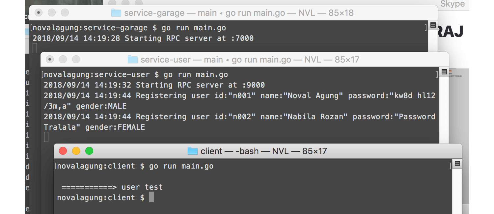
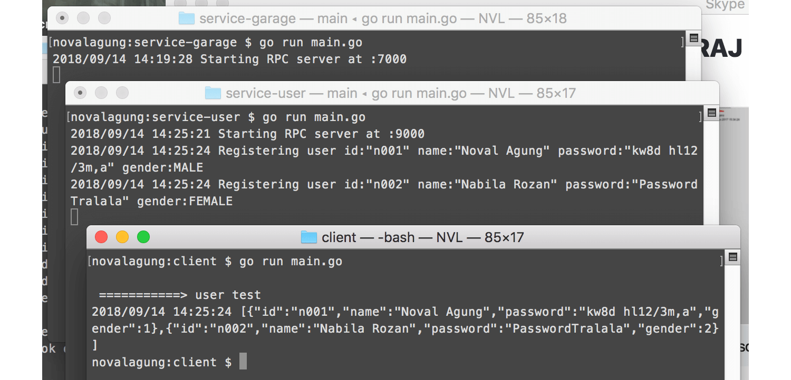

# C.31. gRPC + Protobuf

Pada chapter ini kita akan belajar tentang penerapan **gRPC** dan **protobuf** pada bahasa Go.

Kita akan buat satu buah folder project besar, di dalamnya terdapat 3 buah aplikasi. Dua di antaranya merupakan aplikasi server, lebih tepatnya rpc server, dan yang satu lagi aplikasi client. Aplikasi client akan berkomunikasi dengan kedua aplikasi server.

Bisa dibilang ini adalah contoh super sederhana (dan asal-asalan) tentang penerapan [microservices architecture](https://en.wikipedia.org/wiki/Microservices).

> BEWARE: Tutorial ini sangat panjang! Dan jangan ber-ekspektasi terlalu tinggi, karena target pembaca adalah orang yang baru belajar Go, gRPC, dan protobuf.

## C.31.1. Definisi

gRPC adalah salah satu RPC framework, dibuat oleh Google. gRPC menggunakan protokol RPC untuk transport dan protobuf di bagian antarmuka-nya.

> Remote Procedure Call (RPC) adalah sebuah metode yang memungkinkan kita untuk mengakses sebuah prosedur yang berada di komputer lain. Untuk dapat melakukan ini sebuah server harus menyediakan layanan remote procedure.

## C.31.2 Prerequisites

Sekedar informasi bahwa sebelum mulai mengikuti pembelajaran pada chapter ini, **WAJIB HUKUMNYA** untuk mengikuti pembahasan pada chapter sebelumnya [C.30. Protobuf](/C-golang-protobuf-implementation.html) terlebih dahulu.

## C.31.3. Struktur Aplikasi

Siapkan satu project baru dengan struktur sebagai berikut.

```bash
# Install protobuf go runtime
go install google.golang.org/protobuf/cmd/protoc-gen-go@latest

mkdir chapter-c30
cd chapter-c30
go mod init chapter-c30

go get -u google.golang.org/grpc@v1.26.0

# then prepare underneath structures
tree .
.
├── go.mod
├── common
│   ├── config
│   │   └── config.go
│   └── model
│       ├── garage.proto
│       ├── user.proto
│
├── client
│   └── main.go
│
└── services
    ├── service-garage
    │   └── main.go
    └── service-user
        └── main.go

7 directories, 7 files
```

Salah satu pembeda yang paling terlihat dibanding chapter sebelumnya adalah di sini kita go get package `google.golang.org/grpc`. Package ini diperlukan oleh generator untuk bisa memahami dan men-*generate* spesifikasi `service`. Lebih jelasnya akan kita bahas sambil praktek.

Lanjut. Di bawah ini merupakan penjelasan per bagian dari struktur project di atas.

#### ◉ Folder `common`

Folder `common`, berisikan 2 buah sub folder, `config` dan `model`.

 - Folder `config` berisikan informasi shared atau global, yang digunakan aplikasi client maupun server.
 - Folder `model` berisikan file `.proto`. Silakan salin file `garage.proto` dan `user.proto` pada chapter sebelumnya ke folder tersebut.

#### ◉ Folder `client`

Isinya adalah satu buah file main, yang nantinya di jalankan sebagai aplikasi client. Aplikasi client ini akan berkomunikasi dengan 2 buah aplikasi server.

#### ◉ Folder `services`

Satu buah file proto untuk satu aplikasi rpc server (service). Karena ada dua file proto, berarti jelasnya ada dua aplikasi rpc server, `service-user` dan `service-garage`. Folder `services` ini menampung kedua aplikasi service tersebut.

File `garage.proto` dan `user.proto` tidak dijadikan satu dalam respektif folder `service-garage` dan `service-user`, karena kedua file ini juga digunakan pada aplikasi client, itulah kenapa file ini dipisah ke dalam folder `common/model`.

## C.31.4. File Konfigurasi pada folder `common/config`

Siapkan file bernama `config.go` dalam `common/config`. Di dalam file config ini didefinisikan dua buah konstanta yaitu port untuk service user dan garage. Nantinya aplikasi server di start menggunakan port ini.

```go
package config

const (
	ServiceGaragePort = ":7000"
	ServiceUserPort   = ":9000"
)
```

## C.31.5. Proto Model pada folder `common/model`

Setelah kedua file `user.proto` dan `garage.proto` pada chapter sebelumnya disalin, kita perlu menambahkan pendefinisian service pada masing-masing file proto.

Keyword `service` digunakan untuk membuat service. Service ini nantinya juga ikut di konversi ke bentuk Go (menjadi interface), lewat command `protoc`. Di aplikasi rpc server, nantinya harus dibuat implementasi dari interface tersebut.

OK, sekarang tambahkan kode berikut ke file proto.

#### ◉ Service `Users`

Buka file `user.proto`, tambahkan kode berikut di akhir baris.

```protobuf
// ...

import "google/protobuf/empty.proto";

service Users {
    rpc Register(User) returns (google.protobuf.Empty) {}
    rpc List(google.protobuf.Empty) returns (UserList) {}
}
```

Sebuah service bernama `Users` didefinisikan, dengan isi dua buah method.

 - `Register()`, menerima parameter bertipe model `User`, dan mengembalikan `google.protobuf.Empty`.
 - `List()`, menerima parameter bertipe `google.protobuf.Empty`, dan mengembalikan tipe `UserList`.

Silakan dilihat bagaimana cara untuk membuat service pada kode atas.

Pada method `Register()` sebenarnya kita tidak butuh nilai balik. Tapi karena requirements dari protobuf mewajibkan semua rpc method harus memiliki nilai balik, maka kita gunakan model `Empty` milik google protobuf.

Cara penggunaan model `Empty` adalah dengan meng-import file proto-nya terlebih dahulu, `google/protobuf/empty.proto`, lalu menggunakan `google.protobuf.Empty` sebagai model.

Juga, pada method `List()`, sebenarnya argument tidak dibutuhkan, tapi karena protobuf mewajibkan pendefinisian rpc method untuk memiliki satu buah argument dan satu buah return type, maka mau tidak mau harus ada argument.

Setelah di-compile, dua buah interface terbuat dengan skema nama `<interfacename>Server` dan `<interfacename>Client`. Karena nama service adalah `Users`, maka terbuatlah `UsersServer` dan `UsersClient`.

 - Interface `UsersServer`.

  ```go
  type UsersServer interface {
  	Register(context.Context, *User) (*emptypb.Empty, error)
  	List(context.Context, *emptypb.Empty) (*UserList, error)
  }
  ```
  Interface ini nantinya harus diimplementasikan di aplikasi rpc server.

 - Interface `UsersClient`.

  ```go
  type UsersClient interface {
  	Register(ctx context.Context, in *User, opts ...grpc.CallOption) (*emptypb.Empty, error)
  	List(ctx context.Context, in *emptypb.Empty, opts ...grpc.CallOption) (*UserList, error)
  }
  ```
  Interface ini nantinya harus diimplementasikan di aplikasi rpc client.

#### ◉ Service `Garages`

Pada file `garage.proto`, definisikan service `Garages` dengan isi dua buah method, `Add()` dan `List()`.

```protobuf
import "google/protobuf/empty.proto";

service Garages {
    rpc List(string) returns (GarageList) {}
    rpc Add(string, Garage) returns (google.protobuf.Empty) {}
}
```

Perlu diketahui bahwa protobuf mewajibkan pada rpc method untuk tidak menggunakan tipe primitif sebagai tipe argument maupun tipe nilai balik. Tipe `string` pada `rpc List(string)` akan menghasilkan error saat di-compile. Dan juga protobuf mewajibkan method untuk hanya menerima satu buah parameter, maka jelasnya `rpc Add(string, Garage)` juga invalid.

Lalu bagaimana solusinya? Buat model baru lagi, property nya sesuaikan dengan parameter yang dibutuhkan di masing-masing rpc method.

```protobuf
message GarageUserId {
    string user_id = 1;
}

message GarageAndUserId {
    string user_id = 1;
    Garage garage = 2;
}

service Garages {
    rpc List(GarageUserId) returns (GarageList) {}
    rpc Add(GarageAndUserId) returns (google.protobuf.Empty) {}
}
```

Sama seperti service `Users`, service `Garages` juga akan di-compile menjadi interface.

 - Interface `GaragesServer`.

  ```go
  type GaragesServer interface {
  	Add(context.Context, *GarageAndUserId) (*emptypb.Empty, error)
  	List(context.Context, *GarageUserId) (*GarageList, error)
  }
  ```

 - Interface `GaragesClient`.

  ```go
  type GaragesClient interface {
  	Add(ctx context.Context, in *GarageAndUserId, opts ...grpc.CallOption) (*emptypb.Empty, error)
  	List(ctx context.Context, in *GarageUserId, opts ...grpc.CallOption) (*GarageList, error)
  }
  ```

## C.31.6. Kompilasi File `.proto` Dengan Enable Plugin `grpc`

Sebelum itu kita harus install protobuf compiler plugin untuk grpc terlebih dahulu.

```bash
go install google.golang.org/grpc/cmd/protoc-gen-go-grpc@latest
```

Gunakan command berikut untuk generate file `.go` dari file `.proto` yang sudah kita buat:

```bash
protoc --go_out . --go-grpc_out . common/model/*.proto
```

Perhatikan baik-baik command di atas, Pada flag `--go-grpc_out` di situ kita menggunakan plugin grpc yang sebelumnya kita install (berbeda dibanding pada chapter sebelumnya yang hanya menggunakan `--go_out` `.`).

Plugin `grpc` ini dipergunakan untuk men-*generate* **service bindings behaviour** yang ada pada gRPC. Seperti yang kita telah praktekan bahwa di atas kita menuliskan definisi `service`. Dengan menambahkan flag `--go-grpc_out` maka definisi `service` tersebut akan bisa dipahami oleh generator untuk kemudian di-*transform* menjadi definisi interface beserta isi method-nya.

## C.31.7. Aplikasi Server `service-user`

Buka file `services/service-user/main.go`, import package yang dibutuhkan.

```go
package main

import (
    "context"
    "log"
    "net"

    "chapter-c30/common/config"
    "chapter-c30/common/model"

    "google.golang.org/protobuf/types/known/emptypb"
    "google.golang.org/grpc"
)
```

Lalu buat satu buah objek bernama `localStorage` bertipe `*model.UserList`. Objek ini nantinya menampung data user yang ditambahkan dari aplikasi client (via rpc) lewat method `Register()`. Dan data objek ini juga dikembalikan ke client ketika `List()` diakses.

```go
var localStorage *model.UserList

func init() {
	localStorage = new(model.UserList)
	localStorage.List = make([]*model.User, 0)
}
```

Buat struct baru `UsersServer`. Struct ini akan menjadi implementasi dari generated interface `model.UsersServer`. Siapkan method-method-nya sesuai spesifikasi interface.

```go
type UsersServer struct {
      // Wajib menyertakan embed struct unimplemented dari hasil generate protobuf jika tidak maka akan error
      model.UnimplementedUsersServer
}

func (UsersServer) Register(_ context.Context, param *model.User) (*emptypb.Empty, error) {
	user := param

	localStorage.List = append(localStorage.List, user)

	log.Println("Registering user", user.String())

	return new(emptypb.Empty), nil
}

func (UsersServer) List(context.Context, *emptypb.Empty) (*model.UserList, error) {
	return localStorage, nil
}
```

Buat fungsi `main()`, buat objek grpc server dan objek implementasi `UsersServer`, lalu registrasikan kedua objek tersebut ke model menggunakan statement `model.RegisterUsersServer()`.

```go
func main() {
	srv := grpc.NewServer()
	var userSrv UsersServer
	model.RegisterUsersServer(srv, userSrv)

	log.Println("Starting RPC server at", config.ServiceUserPort)
  // more code here ...
}
```

Pembuatan objek grpc server dilakukan lewat `grpc.NewServer()`. Package [google.golang.org/grpc](https://google.golang.org/grpc) perlu di `go get` dan di-import.

> Fungsi `RegisterUsersServer()` otomatis digenerate oleh protoc, karena service `Users` didefinisikan. Contoh lainnya misal service `SomeServiceTest` disiapkan, maka fungsi `RegisterSomeServiceTestServer()` dibuat.

Selanjutnya, siapkan objek listener yang listen ke port `config.ServiceUserPort`, lalu gunakan listener tersebut sebagai argument method `.Serve()` milik objek rpc server.

```go
// ...

l, err := net.Listen("tcp", config.ServiceUserPort)
if err != nil {
    log.Fatalf("could not listen to %s: %v", config.ServiceUserPort, err)
}

log.Fatal(srv.Serve(l))
```

## C.31.8. Aplikasi Server `service-garage`

Buat file `services/service-garage/main.go`, import package yang sama seperti pada `service-user`. Lalu buat objek `localStorage` dari struct `*model.GarageListByUser`.

```go
var localStorage *model.GarageListByUser

func init() {
	localStorage = new(model.GarageListByUser)
	localStorage.List = make(map[string]*model.GarageList)
}

type GaragesServer struct {
	model.UnimplementedGaragesServer
}
```

Tugas `localStorage` kurang lebih sama seperti pada `service-user`, hanya saja pada aplikasi ini data garage disimpan per user dalam map.

Selanjutnya buat implementasi interface `model.GaragesServer`, lalu siapkan method-method-nya.

 - Method `Add()`

  ```go
  func (GaragesServer) Add(_ context.Context, param *model.GarageAndUserId) (*empty.Empty, error) {
      userId := param.UserId
      garage := param.Garage
  
      if _, ok := localStorage.List[userId]; !ok {
          localStorage.List[userId] = new(model.GarageList)
          localStorage.List[userId].List = make([]*model.Garage, 0)
      }
      localStorage.List[userId].List = append(localStorage.List[userId].List, garage)
  
      log.Println("Adding garage", garage.String(), "for user", userId)
  
      return new(empty.Empty), nil
  }
  ```

 - Method `List()`

  ```go
  func (GaragesServer) List(_ context.Context, param *model.GarageUserId) (*model.GarageList, error) {
      userId := param.UserId
  
      return localStorage.List[userId], nil
  }
  ```

Start rpc server, gunakan `config.ServiceGaragePort` sebagai port aplikasi.

```go
func main() {
	srv := grpc.NewServer()
	var garageSrv GaragesServer
	model.RegisterGaragesServer(srv, garageSrv)

	log.Println("Starting RPC server at", config.ServiceGaragePort)

	l, err := net.Listen("tcp", config.ServiceGaragePort)
	if err != nil {
		log.Fatalf("could not listen to %s: %v", config.ServiceGaragePort, err)
	}

	log.Fatal(srv.Serve(l))
}
```

## C.31.9. Aplikasi Client & Testing

Buat file `client/main.go`, import package yang sama seperti pada `service-user` maupun `service-garage`. Lalu siapkan dua buah method yang mengembalikan rpc client yang terhubung ke dua service yang sudah kita buat.

- RPC client garage:

  ```go
  func serviceGarage() model.GaragesClient {
    port := config.ServiceGaragePort
    conn, err := grpc.Dial(port, grpc.WithTransportCredentials(insecure.NewCredentials()))
    if err != nil {
        log.Fatal("could not connect to", port, err)
    }

    return model.NewGaragesClient(conn)
  }
  ```

- RPC client user:

  ```go
  func serviceUser() model.UsersClient {
	port := config.ServiceUserPort
	conn, err := grpc.Dial(port, grpc.WithTransportCredentials(insecure.NewCredentials()))
	if err != nil {
		log.Fatal("could not connect to", port, err)
	}

	return model.NewUsersClient(conn)
  }
  ```

Buat fungsi `main()`, isi dengan pembuatan object dari generated-struct yang ada di package `model`.

```go
func main() {
  user1 := model.User{
		Id:       "n001",
		Name:     "Noval Agung",
		Password: "kw8d hl12/3m,a",
		Gender:   model.UserGender(model.UserGender_value["MALE"]),
	}

	garage1 := model.Garage{
		Id:   "q001",
		Name: "Quel'thalas",
		Coordinate: &model.GarageCoordinate{
			Latitude:  45.123123123,
			Longitude: 54.1231313123,
		},
	}

  // ...
}
```

#### ◉ Test rpc client user

Selanjutnya akses fungsi `serviceUser()` untuk memperoleh objek rpc client user. Dari situ eksekusi method `.Register()`.

```go
user := serviceUser()

fmt.Printf("\n %s> user test\n", strings.Repeat("=", 10))

// register user1
user.Register(context.Background(), &user1)

// register user2
user.Register(context.Background(), &user2)
```

Jalankan aplikasi `service-user`, `service-garage`, dan client, lalu lihat hasilnya.



Bisa dilihat, pemanggilan method `Add()` pada aplikasi rpc server `service-user` sukses.

Sekarang coba panggil method `.List()`. Jalankan ulang aplikasi client untuk melihat hasilnya. O iya, aplikasi `service-user` juga di-restart, agar datanya tidak menumpuk.

```go
// show all registered users
res1, err := user.List(context.Background(), new(emptypb.Empty))
if err != nil {
    log.Fatal(err.Error())
}
res1String, _ := json.Marshal(res1.List)
log.Println(string(res1String))
```

Bisa dilihat pada gambar berikut, pemanggilan method `.List()` juga sukses. Dua buah data yang sebelumnya didaftarkan muncul.



#### ◉ Test rpc client garage

Tambahkan beberapa statement untuk memanggil method yang ada di `service-garage`.

 - Menambahkan garage untuk user `user1`:

  ```go
  garage := serviceGarage()

  fmt.Printf("\n %s> garage test A\n", strings.Repeat("=", 10))

  // add garage1 to user1
  garage.Add(context.Background(), &model.GarageAndUserId{
      UserId: user1.Id,
      Garage: &garage1,
  })

  // add garage2 to user1
  garage.Add(context.Background(), &model.GarageAndUserId{
      UserId: user1.Id,
      Garage: &garage2,
  })
  ```

 - Menampilkan list semua garage milik `user1`:

  ```go
  // show all garages of user1
  res2, err := garage.List(context.Background(), &model.GarageUserId{UserId: user1.Id})
  if err != nil {
      log.Fatal(err.Error())
  }
  res2String, _ := json.Marshal(res2.List)
  log.Println(string(res2String))
  ```

 - Menambahkan garage untuk user `user2`:

  ```go
  fmt.Printf("\n %s> garage test B\n", strings.Repeat("=", 10))

  // add garage3 to user2
  garage.Add(context.Background(), &model.GarageAndUserId{
  	UserId: user2.Id,
  	Garage: &garage3,
  })
  ```

 - Menampilkan list semua garage milik `user2`:

  ```go
  // show all garages of user2
  res3, err := garage.List(context.Background(), &model.GarageUserId{UserId: user2.Id})
  if err != nil {
      log.Fatal(err.Error())
  }
  res3String, _ := json.Marshal(res3.List)
  log.Println(string(res3String))
  ```

Jalankan ulang services dan aplikasi client, lihat hasilnya.


---

OK, jika anda membaca sampai baris ini, berarti anda telah berhasil sabar dalam mempelajari gRPC dalam pembahasan yang sangat panjang ini 🎉

---

 - [Protobuf](https://github.com/golang/protobuf), by Google, BSD-3-Clause License
 - [gRPC](https://github.com/grpc/grpc), by Google, Apache-2.0 License

---

<div class="source-code-link">
    <div class="source-code-link-message">Source code praktek chapter ini tersedia di Github</div>
    <a href="https://github.com/novalagung/dasarpemrogramangolang-example/tree/master/chapter-C.31-golang-grpc-protobuf">https://github.com/novalagung/dasarpemrogramangolang-example/.../chapter-C.31...</a>
</div>

---

<iframe src="partial/ebooks.html" width="100%" height="390px" frameborder="0" scrolling="no"></iframe>
