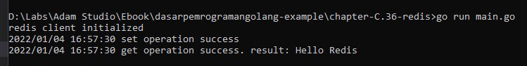
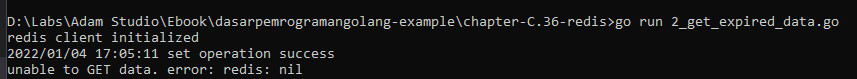

# C.36. Redis

Pada bab ini kita akan belajar cara menggunakan Redis, dari cara koneksi Redis, cara menyimpan data dan cara mengambil data. Untuk command selengkapnya bisa dilihat di https://redis.io/commands.

## C.36.1 Apa itu Redis?

Redis, singkatan dari *Remote Dictionary Server*, adalah penyimpanan data nilai utama di dalam memori yang super cepat. Umumnya Redis dimanfaatkan sebagai database, cache, manajemen session, *message broker*, *queue*, dan jenis kebutuhan lainnya yg relevan dengan operasi real-time dan temporary data.

Salah satu library Redis untuk Go yang populer ketika artikel ini dibuat adalah [go-redis/redis](https://github.com/go-redis/redis), dan pada chapter ini kita akan mempelajarinya.

## C.36.2 Koneksi ke Redis

Sebelum kita mulai, pastikan Redis server sudah ter-install dan sudah berjalan di sistem operasi dengan baik. Lebih jelasnya perihal instalasi redis bisa merujuk ke https://redis.io/topics/quickstart.

Ok, buat proyek baru, lalu buat file baru dengan nama `main.go`. Definisikan package dan import dependensi.

```go
package main

import (
	"context"
	"fmt"
	"log"
	"time"

	"github.com/go-redis/redis/v8"
)
```

> Jangan lupa untuk `go get -u github.com/go-redis/redis/v8` dependensi go-redis

Selanjutnya siapkan fungsi `newRedisClient()` untuk membuat objek Redis client yang nantinya digunakan dalam operasi.

```go
func newRedisClient(host string, password string) *redis.Client {
	client := redis.NewClient(&redis.Options{
		Addr:     host,
		Password: password,
		DB:       0,
	})
	return client
}
```

Sekarang siapkan fungsi `main()` dengan isi kode untuk inisialisasi objek redis client. Di sini saya menggunakan `localhost:6379` sebagai host tujuan koneksi redis, karena redis server saya install di lokal.

```go
func main() {
	var redisHost = "localhost:6379"
	var redisPassword = ""

	rdb := newRedisClient(redisHost, redisPassword)
	fmt.Println("redis client initialized")

	// ...
}
```
## C.36.3 Menyimpan data ke Redis dengan perintah `SET`

Sekarang kita akan belajar cara menyimpan data menggunakan salah satu command Redis, yaitu `SET`.

> Perlu diketahui bahwa command untuk menyimpan data di redis tidak hanya `SET`, ada juga lainnya seperti `SETTEX`, `HMSET`, `SETBIT`, `LSET`, RSET, `HSETNX`, masing-masing perintah memiliki kegunaan sendiri. Selengkapnya bisa merujuk ke https://redis.io/commands.

Salah satu benefit yang didapat dengan menggunakan `go-redis` library, adalah sudah disediakan wrapper untuk command-command redis, termasuk command `SET`.

Ok, sekarang tambahkan kode berikut:

```go
func main() {
	// ...
	
	key := "key-1"
	data := "Hello Redis"
	ttl := time.Duration(3) * time.Second

	// store data using SET command
	op1 := rdb.Set(context.Background(), key, data, ttl)
	if err := op1.Err(); err != nil {
		fmt.Printf("unable to SET data. error: %v", err)
		return
	}
	log.Println("set operation success")
	
	// ...
}
```

Pada kode di atas disiapkan variabel `key` yang difungsikan sebagai identifier untuk data yang kita simpan. Data yang disimpan adalah string `Hello Redis`. Data akan di-retain di redis server selama 3 detik (lihat variabel `ttl`).

Variabel objek `rdb` adalah redis client yang kita buat sebelumnya via fungsi `newRedisClient()`. Lewat variabel ini kita panggil method `.Set()` untuk menyimpan data menggunakan command redis `SET`.

## C.36.4 Mengambil data dar Redis dengan perintah `GET`

Command redis untuk pengambilan data adalah `GET`. Menggunakan go-redis library, kita cukup memanfaatkan method `.Get` dari objek redis client untuk pengambilan data.

Tambahkan kode berikut pada main.

```go
func main() {
	// ...

	// get data
	op2 := rdb.Get(context.Background(), key)
	if err := op2.Err(); err != nil {
		fmt.Printf("unable to GET data. error: %v", err)
		return
	}
	res, err := op2.Result()
	if err != nil {
		fmt.Printf("unable to GET data. error: %v", err)
		return
	}
	log.Println("get operation success. result:", res)
}
```

Method `.Get()` mengembalikan objek bertipe `*redis.StringCmd`. Cara penggunaan method ini cukup pass variabel konteks dan identifier key.

Dari objek bertipe `*redis.StringCmd` tersebut kita bisa ambil minimal 2 hal:

- informasi error, menggunakan method `.Err()`
- data yang tersimpan sesuai key, menggunakan method `.Result()`

## C.36.5 Test

Jalankan program, lihat hasilnya.



Sampai sini bisa disimpulkan operasi `SET` dan `GET` adalah sukses.

## C.36.6 Redis expiration time (`TTL`)

Mari kita sedikit modifikasi kode yang ada. Tambahkan `time.Sleep` untuk menghentikan eksekusi kode selama 4 detik.

```go
func main() {
	// ...
	log.Println("set operation success")

	time.Sleep(time.Duration(4) * time.Second) // <----- add this code

	// get data
	op2 := rdb.Get(context.Background(), key)
	if err := op2.Err(); err != nil {
		fmt.Printf("unable to GET data. error: %v", err)
		return
	}
	// ...
}
```

Jalankan program dan lihat hasilnya.



Error, ini karena data yang disimpan hanya di retain sesuai `ttl` yaitu 3 detik, dan pada kode di atas kita mencoba ambil datanya setelah detik ke 4. Jadi data tersebut expired.

---

 - [go-redis](https://github.com/redis/go-redis), by Redis, BSD-2-Clause License

---

<div class="source-code-link">
    <div class="source-code-link-message">Source code praktik chapter ini tersedia di Github</div>
    <a href="https://github.com/novalagung/dasarpemrogramangolang-example/tree/master/chapter-C.36-redis">https://github.com/novalagung/dasarpemrogramangolang-example/.../chapter-C.36...</a>
</div>

---

<iframe src="partial/ebooks.html" width="100%" height="390px" frameborder="0" scrolling="no"></iframe>
