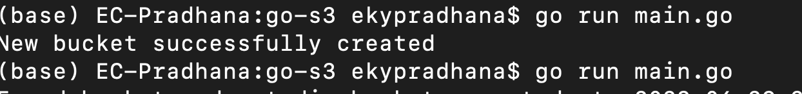
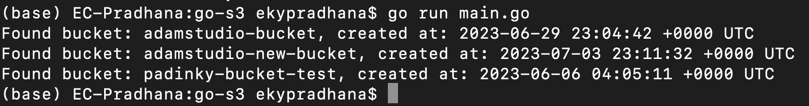
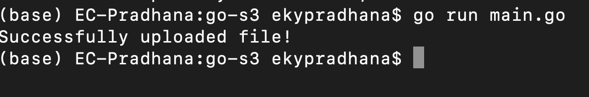
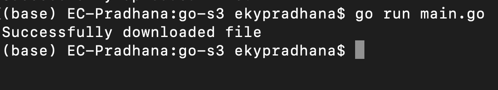
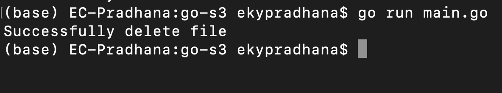

# C.38. Amazon Simple Storage Service (S3)

Pada bab ini kita akan belajar untuk membuat koneksi ke Amazon S3 menggunakan Golang. Mulai dari cara membuat bucket di S3, melihat semua daftar bucket di S3, melihat semua object/file yang ada di dalam sebuah bucket S3, serta mengupload dan mendownload file dari S3 bucket.

Kita mulai bahasan ini dengan mengenal apa itu Amazon S3 dan beberapa istilah yang berkaitan.

## C.38.1 Apa itu Amazon Simple Storage Service (S3)?

Pada dasarnya Simple Storage Service (S3) adalah layanan penyimpanan file/object yang dimiliki oleh Amazon Web Service (AWS). Layanan ini bisa kita nikmati secara gratis dengan batasan-batasan tertentu. Dengan menggunakan Amazon S3, kita bisa menyimpan dan melindungi object untuk berbagai kebutuhan sistem kita. Ringkasnya, kita bisa menganalogikan Amazon S3 sebagai harddisk/storage online yang bisa kita akses selama kita terhubung dengan internet.

## C.39.2 Beberapa istilah terkait Amazon S3

Beberapa istilah yang biasa kita temukan saat kita bekerja dengan Amazon S3 antara lain:
### 1. Bucket
Bucket adalah wadah untuk object bisa disimpan ke dalam Amazon S3. Kita bisa menganalogikan bucket seperti directory yang ada di harddisk kita, dimana kita bisa membuat folder/path dan menyimpan file di dalamnya. Seperti contoh, misal kita membuat bucket ```padinky-bucket-test``` di region ```ap-southeast-1``` dan mengupload file ```adamstudio.jpg```, maka kita bisa mengakses file tersebut dengan URL ```https://adamstudio-bucket.s3.ap-southeast-1.amazonaws.com/adamstudio.jpg``` (dengan authorisasi tertentu pastinya).

### 2. Object
Object secara singkat bisa kita artikan sebagai file, meskipun pada dasarnya berbeda, karena object juga menyimpan metadata file dan data-data lainnya.  
  
Untuk mempelajari lebih lanjut mengenai definisi dan beberapa istilah lain terkait Amazon S3, silakan merujuk ke https://docs.aws.amazon.com/id_id/AmazonS3/latest/userguide/Welcome.html


## C.39.3 Akses ke bucket S3

Untuk mengakses bucket di S3 melalui aplikasi, secara umum kita memerlukan credential berupa ```aws_access_key_id``` dan ```aws_secret_access_key```. Di pembahasan kali ini, kita tidak mencakup cara setting credential ke bucket S3 kita, untuk mempelajari lebih lanjut tentang memberikan akses ke bucket S3, bisa mengunjungi link berikut: https://docs.aws.amazon.com/id_id/AmazonS3/latest/userguide/about-object-ownership.html  
  
> Disini penulis asumsikan kita sudah memiliki akses berupa ```aws_access_key_id``` dan ```aws_secret_access_key``` untuk digunakan di aplikasi kita dalam membuat koneksi ke bucket S3.

## C.39.3 Koneksi ke S3

*And here we go...*

Ok, seperti biasa buat proyek baru, kemudian buat 1 file bernama `main.go`. Definisikan package dan import beberapa dependensi yang dibutuhkan. Disini kita akan menggunaakan official SDK dari AWS untuk Golang. Untuk dokumentasi detailnya bisa dibaca disini : https://aws.amazon.com/id/sdk-for-go/. Sekalian saja kita definisikan konstanta untuk akses dan region disini.


```go
package main

import (
	"context"
	"fmt"
	"os"
	"path/filepath"

	"github.com/aws/aws-sdk-go/aws"
	"github.com/aws/aws-sdk-go/aws/credentials"
	"github.com/aws/aws-sdk-go/aws/session"
	"github.com/aws/aws-sdk-go/service/s3"
	"github.com/aws/aws-sdk-go/service/s3/s3manager"
)

const (
	AWS_ACCESS_KEY_ID     string = "AKIA**********"
	AWS_SECRET_ACCESS_KEY string = "LReO***********"
	AWS_REGION            string = "ap-southeast-1"
)
```

> Jangan lupa untuk `go get -u github.com/aws/aws-sdk-go` dependensi aws-sdk-go

Selanjutnya, kita siapkan fungsi untuk mendapatkaan `session` dari AWS

```go
func newS3Session() (*session.Session, error) {
	sess, err := session.NewSession(&aws.Config{
		Region:      aws.String(AWS_REGION),
		Credentials: credentials.NewStaticCredentials(AWS_ACCESS_KEY_ID, AWS_SECRET_ACCESS_KEY, ""),
	})

	if err != nil {
		return nil, err
	}

	return sess, nil
}
```

Setelah itu, kita siapkan fungsi `main()` untuk inisialisasi `session` dari AWS dan membuat `s3Client`

```go
func main() {
	s3Session, err := newS3Session()
	if err != nil {
		fmt.Println("Failed to create AWS session:", err)
		return
	}

	s3Client := s3.New(s3Session)
	fmt.Println("S3 session & client initialized")

	// ...
}
```

## C.39.4 Membuat bucket baru ke S3

Untuk membuat bucket baru, mari kita siapkan fungsi `createBucket`

```go
func createBucket(client *s3.S3, bucketName string) error {
	_, err := client.CreateBucket(&s3.CreateBucketInput{
		Bucket: aws.String(bucketName),
	})

	return err
}
```

Lalu kita modifikasi fungsi `main` kita dengan menambahkan code untuk memanggil fungsi `createBucket`

```go
func main() {
	// ...

	bucketName := "adamstudio-new-bucket"

	// --- create bucket
	err = createBucket(s3Client, bucketName)
	if err != nil {
		fmt.Printf("Couldn't create new bucket: %v", err)
		return
	}

	fmt.Println("New bucket successfully created")

	// ...
}
```

Jalankan program dan lihat hasilnya



## C.39.5 Melihat semua daftar bucket di S3

Sekarang kita siapkan fungsi untuk melihat semua bucket di S3. Kita siapkan fungsi bernama `listBuckets`

```go
func listBuckets(client *s3.S3) (*s3.ListBucketsOutput, error) {
	res, err := client.ListBuckets(nil)
	if err != nil {
		return nil, err
	}

	return res, nil
}
```

Lalu kita modifikasi fungsi `main` kita dan tambahkan baris kode berikut untuk memanggil fungsi `listBuckets`

```go
func main() {
	// ...

	// --- list all buckets
	buckets, err := listBuckets(s3Client)
	if err != nil {
		fmt.Printf("Couldn't list buckets: %v", err)
		return
	}

	for _, bucket := range buckets.Buckets {
		fmt.Printf("Found bucket: %s, created at: %s\n", *bucket.Name, *bucket.CreationDate)
	}

	// ...
}
```

Jalankan program dan lihat hasilnya



## C.39.6 Mengupload object ke dalam S3 bucket

Untuk mengupload object/file ke S3, kita siapkan fungsi bernama `uploadFile` terlebih dahulu.

```go
func uploadFile(uploader *s3manager.Uploader, filePath string, bucketName string, fileName string) error {
	file, err := os.Open(filePath)
	if err != nil {
		return err
	}

	defer file.Close()

	_, err = uploader.Upload(&s3manager.UploadInput{
		Bucket: aws.String(bucketName),
		Key:    aws.String(fileName),
		Body:   file,
	})

	return err
}
```

Lalu kita siapkan file yang akan kita upload. Asumsikan path file yang akan kita upload berada di `./upload/adamstudio.jpg`. Setelah itu, kita modifikasi lagi fungsi `main` kita untuk memanggil fungsi `uploadFile`.

```go
func main() {
	// ...

	// --- upload file
	fileName := "adamstudio.jpg"
	uploader := s3manager.NewUploader(s3Session)
	filePath := filepath.Join("upload", fileName)

	err = uploadFile(uploader, filePath, bucketName, fileName)
	if err != nil {
		fmt.Printf("Failed to upload file: %v", err)
	}

	fmt.Println("Successfully uploaded file!")

	// ...
}
```

Jalankan program dan lihat hasilnya



## C.39.7 Mendownload object dari S3 bucket

Siapkan fungsi `downloadFile` untuk mendownload file dari S3

```go
func downloadFile(downloader *s3manager.Downloader, bucketName string, key string) error {
	file, err := os.Create(filepath.Join("download", key))
	if err != nil {
		return err
	}

	defer file.Close()

	_, err = downloader.Download(
		file,
		&s3.GetObjectInput{
			Bucket: aws.String(bucketName),
			Key:    aws.String(key),
		},
	)

	return err
}
```

Lalu tambahkan baris kode berikut di fungsi `main` kita untuk memanggil fungsi `downloadFile`

```go
func main() {
	// ...

	// --- download file
	fileName := "adamstudio.jpg"
	bucketName := "adamstudio-new-bucket"
	downloader := s3manager.NewDownloader(s3Session)
	err = downloadFile(downloader, bucketName, fileName)

	if err != nil {
		fmt.Printf("Couldn't download file: %v", err)
		return
	}

	fmt.Println("Successfully downloaded file")

	// ...
}
```

Jalankan program dan lihat hasilnya



## C.39.8 Menghapus object dari S3 bucket

Terakhir di pembahasan kali ini, kita akan tambahkan fungsi `deleteFile` untuk menghapus file/object dari S3

```go
func deleteFile(client *s3.S3, bucketName string, fileName string) error {
	ctx := context.Background()
	iter := s3manager.NewDeleteListIterator(client, &s3.ListObjectsInput{
		Bucket: aws.String(bucketName),
		Prefix: aws.String(fileName),
	})

	if err := s3manager.NewBatchDeleteWithClient(client).Delete(ctx, iter); err != nil {
		return err
	}
	return nil
}
```

Kemudian kita modifikasi lagi fungsi `main` kita untuk memanggil fungsi `deleteFile`

```go
func main() {
	// ...

	// --- delete file
	fileName := "adamstudio.jpg"
	bucketName := "adamstudio-new-bucket"
	err = deleteFile(s3Client, bucketName, fileName)
	if err != nil {
		fmt.Printf("Couldn't delete file: %v", err)
		return
	}

	fmt.Println("Successfully delete file")
}
```

Jalankan program dan lihat hasilnya



---

 - [aws-sdk-go](https://github.com/aws/aws-sdk-go), by AWS, Apache 2.0 License

---

<div class="source-code-link">
    <div class="source-code-link-message">Source code praktek chapter ini tersedia di Github</div>
    <a href="https://github.com/novalagung/dasarpemrogramangolang-example/tree/master/chapter-C.38-S3">https://github.com/novalagung/dasarpemrogramangolang-example/.../chapter-C.38...</a>
</div>

---

<iframe src="https://novalagung.substack.com/embed" width="100%" height="320" class="substack-embed" frameborder="0" scrolling="no"></iframe>

