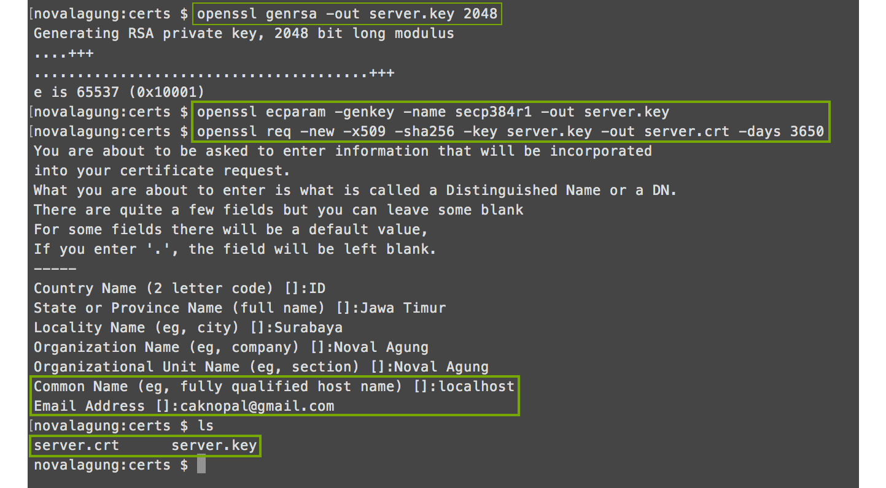
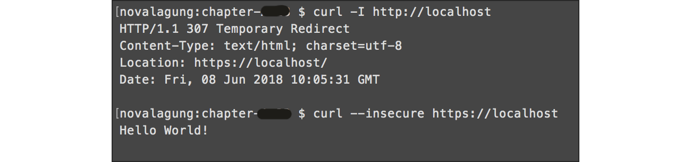

# C.24. HTTPS/TLS Web Server

Pada bagian ini kita akan belajar cara meng-enable fasilitas SSL/TLS pada web server.

## C.24.1. Definisi

#### • SSL

**SSL, Secure Sockets Layer**, adalah standar untuk pengamanan komunikasi lewat internet. Data atau informasi yang sedang dikomunikasikan dari sebuah system ke system lain akan di-proteksi, dengan cara adalah mengacak informasi tersebut menggunakan algoritma enkripsi.

#### • SSL Certificates

**SSL Certificate**, adalah sebuah file berisikan informasi mengenai website, yang nantinya dibutuhkan untuk enkripsi data. SSL Certificate berisi **Public Key**. Public key digunakan untuk meng-enkripsi data yang akan di transfer.

Certificate ditandatangi secara digital oleh **Certificate Authorities (CA)**. Digital Signature atau tanda tangan digital merupakan sebuah kode unik yang di-generate dengan teknologi cryptography **(Public Key Infrastructure)**.

Certificate Authorities sendiri merupakan entitas atau institusi legal yang mengeluarkan dan mem-verifikasi sertifikat digital.

Ketika seorang pengguna internet surfing, mengakses sebuah website yang website tersebut menerapkan SSL, informasi yang dikirim akan di encrypt dengan aman (menggunakan public key) dan hanya bisa di-decrypt menggunakan **Private Key**.

Private Key, atau Secret Key, adalah file terpisah yang diperlukan pada proses dekripsi data yang di-encrypt menggunakan public key.

Berikut merupakan penjelasan dalam bentuk gambar yang diambil dari [coinjolt.com](https://coinjolt.com/what-is-a-public-and-private-key/).


Kedua file certificate dan file private key harus disimpan dengan sangat super aman di server.

#### • TLS

**TLS, Transport Layer Security**, adalah versi yang lebih update dari SSL.

#### • HTTPS

**HTTPS, Hyper Text Transfer Protocol Secure**, adalah ekstensi dari HTTP yang berguna untuk pengamanan komunikasi lewat internet. Data atau informasi yang dikomunikasikan di-enkripsi menggunakan **TLS**.

## C.24.2. Generate Private Key & Public Key Menggunakan `openssl`

Untuk menerapkan TLS pada web server aplikasi golang, private key dan public key perlu kita siapkan terlebih dahulu. 

Gunakan `openssl` untuk generate private key.

```bash
$ openssl genrsa -out server.key 2048
$ openssl ecparam -genkey -name secp384r1 -out server.key
```

Dua command di atas menghasilkan `server.key` yang merupakan private key. Setelah itu, generate *self-signed* certificate (yang berisikan public key) dari private key yang telah dibuat.

```bash
$ openssl req -new -x509 -sha256 -key server.key -out server.crt -days 3650
```

Command untuk generate certificate di atas akan memunculkan form. Informasi seperti alamat, email, host diminta untuk di-isi, pastikan isi dengan benar, terutama di bagian **"Common Name"** dan **Email Address**. 

 - Pada bagian common name isi dengan **localhost**.
 - Untuk email isi dengan alamat email yang valid.

Tampilannya kurang lebih seperti pada screenshot berikut.



> Selain `.crt` dan `.key`, ada ekstensi lain lagi seperti `.pem`. Format `.pem` ini merupakan jenis encoding yang sangat sering digunakan pada file kriptografi sejenis `.key` dan `.crt`. File `.crt` dan `.key` bisa di konversi ke `.pem`, dan juga sebaliknya.

## C.24.3. Project Structure

Buat sebuah project folder, copy 2 file yang telah ter-generate ke dalamnya. Lalu siapkan file `main.go`.


## C.24.4. Web Servers

Pada `main.go`, siapkan sebuah fungsi `StartNonTLSServer()`, berisikan mux dengan satu buah routing, untuk redirect request dari protokol `http` ke `https`. Nantinya semua request yang mengarah ke `http://localhost` di-redirect ke `https://localhost`. Start mux ini pada port `:80`.

```go
package main

import (
    "log"
    "net/http"
)

func StartNonTLSServer() {
    mux := new(http.ServeMux)
    mux.Handle("/", http.HandlerFunc(func(w http.ResponseWriter, r *http.Request) {
        log.Println("Redirecting to https://localhost/")
        http.Redirect(w, r, "https://localhost/", http.StatusTemporaryRedirect)
    }))

    http.ListenAndServe(":80", mux)
}
```

Lalu pada fungsi `main()`, buat mux baru lagi, dengan isi satu buah routing, menampilkan text "Hello World!". Start mux menggunakan `http.ListenAndServeTLS()` pada port `:443`, tak lupa sisipkan path dari file private key dan public key sebagai argumen fungsi.

```go
func main() {
    go StartNonTLSServer()

    mux := new(http.ServeMux)
    mux.HandleFunc("/", func(w http.ResponseWriter, r *http.Request) {
        w.Write([]byte("Hello World!"))
    })

    log.Println("Server started at :443")
    err := http.ListenAndServeTLS(":443", "server.crt", "server.key", mux)
    if err != nil {
        panic(err)
    }
}
```

Tak lupa fungsi `StartNonTLSServer()` juga dipanggil dalam `main()`. Jadi pada satu program terdapat 2 buah web server dijalankan.

OK, jalankan aplikasi.

> Jika error `panic: listen tcp :443: bind: permission denied` muncul, coba jalankan aplikasi menggunakan **sudo**, contoh: `sudo go run main.go`

## C.24.5. Testing

Test aplikasi menggunakan `curl`. Untuk request ke protokol `https` coba tambahkan flag `--insecure` untuk men-disable verifikasi certificate.



Coba test juga menggunakan browser, jika menggunakan chrome maka akan muncul warning `NET::ERR_CERT_AUTHORITY_INVALID` Klik **Advanced → Proceed to localhost (unsafe)**.


Warning `NET::ERR_CERT_AUTHORITY_INVALID` muncul ketika mengakses sebuah website menggunakan protokol `https` yang di mana website ini mengaplikasikan **self-signed certificate**, bukan menggunakan certificate yang sudah diverifikasi oleh CA.

---

<div class="source-code-link">
    <div class="source-code-link-message">Source code praktek chapter ini tersedia di Github</div>
    <a href="https://github.com/novalagung/dasarpemrogramangolang-example/tree/master/chapter-C.24-https-tls">https://github.com/novalagung/dasarpemrogramangolang-example/.../chapter-C.24...</a>
</div>

---

<iframe src="partial/ebooks.html" class="partial-ebooks-wrapper" frameborder="0" scrolling="no"></iframe>
