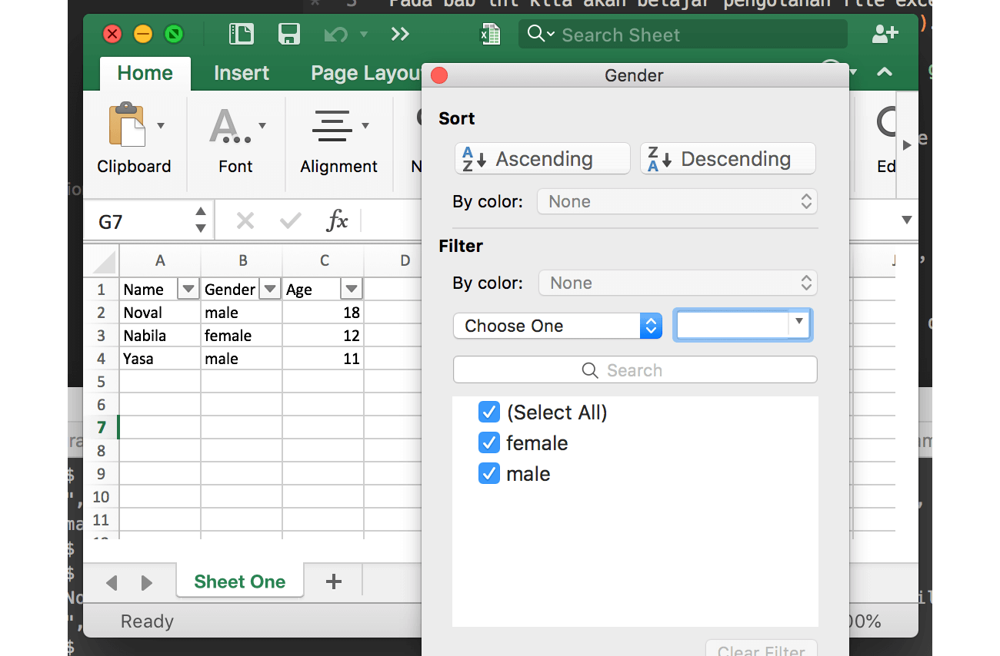

# C.19. Read & Write Excel XLSX File (Excelize)

Dalam pengembangan aplikasi web, di bagian reporting, tidak jarang kita akan berususan dengan file excel. Biasanya di tiap report diharuskan ada fasilitas untuk unduh data ke bentuk excel ataupun pdf.

Pada chapter ini kita akan belajar tentang pengolahan file excel menggunakan [excelize](https://github.com/360EntSecGroup-Skylar/excelize).

Dokumentasi lengkap mengenai excelize bisa dilihat di https://xuri.me/excelize/en. Silakan `go get` untuk mengunduh library ini.

```bash
go get github.com/360EntSecGroup-Skylar/excelize
```

## C.19.1. Membuat File Excel `.xlsx`

Pembahasan akan dilakukan dengan langsung praktek, dengan skenario: sebuah dummy data bertipe `[]M` disiapkan, data tersebut kemudian ditulis ke dalam excel.

Buat project baru, buat file main, import excelize dan siapkan dummy data-nya.

```go
package main

import (
    "fmt"
    "github.com/360EntSecGroup-Skylar/excelize"
    "log"
)

type M map[string]interface{}

var data = []M{
    M{"Name": "Noval", "Gender": "male", "Age": 18},
    M{"Name": "Nabila", "Gender": "female", "Age": 12},
    M{"Name": "Yasa", "Gender": "male", "Age": 11},
}

func main() {
    // magic here
}
```

Di fungsi `main()` buat objek excel baru, menggunakan `excelize.NewFile()`. Secara default, objek excel memiliki satu buah sheet dengan nama `Sheet1`.

```go
xlsx := excelize.NewFile()

sheet1Name := "Sheet One"
xlsx.SetSheetName(xlsx.GetSheetName(1), sheet1Name)
```

Sheet `Sheet1` kita ubah namanya menjadi `Sheet One` lewat statement `xlsx.SetSheetName()`. Perlu diperhatikan index sheet dimulai dari 1, bukan 0.

Siapkan cell header menggunakan kode berikut.

```go
xlsx.SetCellValue(sheet1Name, "A1", "Name")
xlsx.SetCellValue(sheet1Name, "B1", "Gender")
xlsx.SetCellValue(sheet1Name, "C1", "Age")

err := xlsx.AutoFilter(sheet1Name, "A1", "C1", "")
if err != nil {
    log.Fatal("ERROR", err.Error())
}
```

Penulisan cell dilakukan lewat method `.SetCellValue()` milik objek excel. Pemanggilannya membutuhkan 3 buah parameter untuk disisipkan.

 1. Parameter ke-1, sheet name.
 2. Parameter ke-2, lokasi cell.
 3. Parameter ke-3, nilai/text/isi cell.

Pada kode di atas, cell `A1`, `B1`, dan `C1` disiapkan dan diaktifkan filter di dalamnya. Cara mengeset filter pada cell sendiri dilakukan lewat method `.AutoFilter()`. Tentukan range lokasi cell sebagai parameter.

Statement `xlsx.AutoFilter(sheet1Name, "A1", "C1", "")` artinya filter diaktifkan pada sheet `sheet1Name` mulai cell `A1` hingga `C1`.

Lalu lakukan perulangan pada `data`. Tulis tiap map item sebagai cell berurutan per row setelah cell header.

```go
for i, each := range data {
    xlsx.SetCellValue(sheet1Name, fmt.Sprintf("A%d", i+2), each["Name"])
    xlsx.SetCellValue(sheet1Name, fmt.Sprintf("B%d", i+2), each["Gender"])
    xlsx.SetCellValue(sheet1Name, fmt.Sprintf("C%d", i+2), each["Age"])
}
```

Terakhir simpan objek excel sebagai file fisik. Gunakan `.SaveAs()`, isi parameter dengan path lokasi excel akan disimpan.

```go
err = xlsx.SaveAs("./file1.xlsx")
if err != nil {
    fmt.Println(err)
}
```

Jalankan aplikasi, sebuah file bernama `file1.xlsx` akan muncul. Buka file tersebut lihat isinya. Data tersimpan sesuai ekspektasi. Fasilitas filter pada cell header juga aktif.



## C.19.2. Pembuatan Sheet, Merge Cell, dan Cell Styles

Manajemen sheet menggunakan excelize cukup mudah. Pembuatan sheet dilakukan lewat `xlsx.NewSheet()`. Mari langsung kita praktekan. 

Hapus baris kode mulai statement `xlsx.SaveAs()` kebawah. Lalu tambahkan kode berikut.

```go
sheet2Name := "Sheet two"
sheetIndex := xlsx.NewSheet(sheet2Name)
xlsx.SetActiveSheet(sheetIndex)
```

Statement `xlsx.SetActiveSheet()` digunakan untuk menge-set sheet yang aktif ketika file pertama kali dibuka. Parameter yang dibutuhkan adalah index sheet.

Pada sheet baru, `Sheet two`, tambahkan sebuah text `Hello` pada sheet `A1`, lalu merge cell dengan cell di sebelah kanannya.

```go
xlsx.SetCellValue(sheet2Name, "A1", "Hello")
xlsx.MergeCell(sheet2Name, "A1", "B1")
```

Tambahkan juga style pada cell tersebut. Buat style baru lewat `xlsx.NewStyle()`, sisipkan konfigurasi style sebagai parameter.

```go
style, err := xlsx.NewStyle(`{
    "font": {
        "bold": true,
        "size": 36
    },
    "fill": {
        "type": "pattern",
        "color": ["#E0EBF5"],
        "pattern": 1
    }
}`)
if err != nil {
    log.Fatal("ERROR", err.Error())
}
xlsx.SetCellStyle(sheet2Name, "A1", "A1", style)

err = xlsx.SaveAs("./file2.xlsx")
if err != nil {
    fmt.Println(err)
}
```

Di excelize, style merupakan objek terpisah. Kita bisa mengaplikasikan style tersebut ke cell mana saja menggunakan `xlsx.SetCellStyle()`.

Silakan merujuk ke https://xuri.me/excelize/en/cell.html#SetCellStyle untuk pembahasan yang lebih detail mengenai cell style.

Sekarang jalankan aplikasi, lalu coba buka file `file2.xlsx`.


## C.19.3. Membaca File Excel `.xlsx`

Di excelize, objek excel bisa didapat lewat dua cara.

 - Dengan membuat objek excel baru menggunakan `excelize.NewFile()`.
 - Atau dengan membaca file excel lewat `excelize.OpenFile()`.

Dari objek excel, operasi baca dan tulis bisa dilakukan. Berikut merupakan contoh cara membaca file excel yang sudah kita buat, `file1.xlsx`.

```go
xlsx, err := excelize.OpenFile("./file1.xlsx")
if err != nil {
    log.Fatal("ERROR", err.Error())
}

sheet1Name := "Sheet One"

rows := make([]M, 0)
for i := 2; i < 5; i++ {
    row := M{
        "Name":   xlsx.GetCellValue(sheet1Name, fmt.Sprintf("A%d", i)),
        "Gender": xlsx.GetCellValue(sheet1Name, fmt.Sprintf("B%d", i)),
        "Age":    xlsx.GetCellValue(sheet1Name, fmt.Sprintf("C%d", i)),
    }
    rows = append(rows, row)
}

fmt.Printf("%v \n", rows)
```

Pada kode di atas, data tiap cell diambil lalu ditampung ke slice `M`. Gunakan `xlsx.GetCellValue()` untuk mengambil data cell.

Jalankan aplikasi untuk mengecek hasilnya.


---

 - [Excelize](https://github.com/360EntSecGroup-Skylar/excelize), by 360 Enterprise Security Group Team, BSD 3 Clause license

---

<div class="source-code-link">
    <div class="source-code-link-message">Source code praktek chapter ini tersedia di Github</div>
    <a href="https://github.com/novalagung/dasarpemrogramangolang-example/tree/master/chapter-C.19-read-write-excel-xlsx-file">https://github.com/novalagung/dasarpemrogramangolang-example/.../chapter-C.19...</a>
</div>

---

<iframe src="partial/ebooks.html" width="100%" height="430px" frameborder="0" scrolling="no"></iframe>
