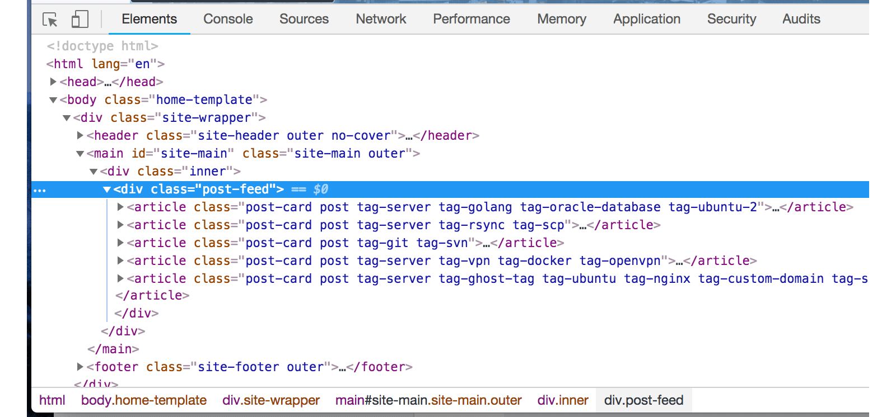
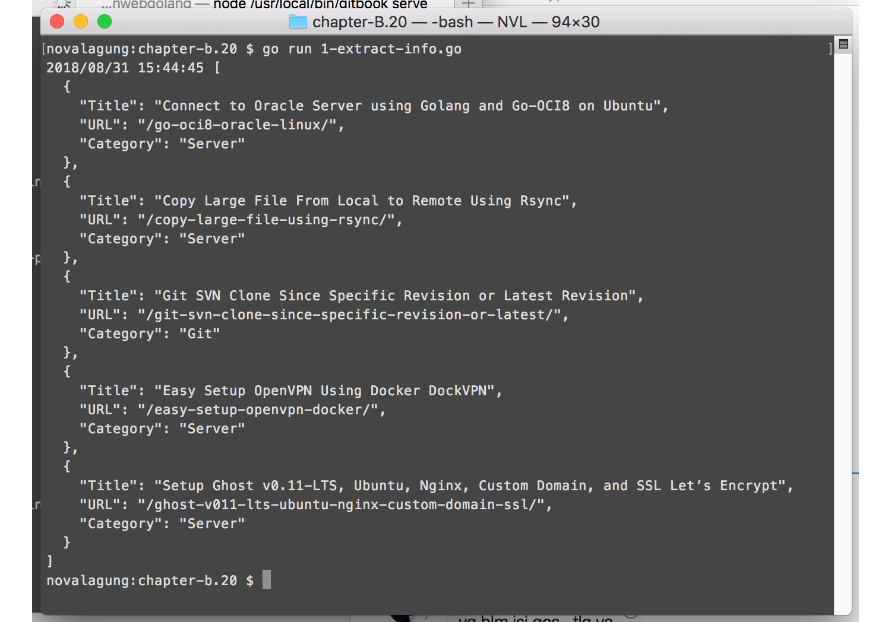
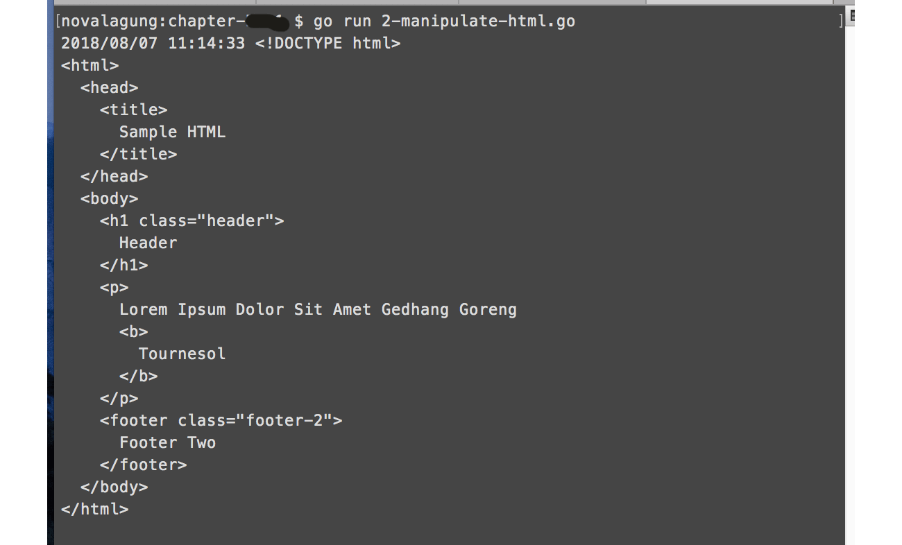

# C.22. Scraping & Parsing HTML (goquery)

Golang mempunyai package `net/html`, isinya digunakan untuk keperluan parsing HTML.

Pada chapter ini kita akan belajar parsing HTML dengan cara yang lebih mudah, tidak memanfaatkan package `net/html`, melainkan menggunakan [goquery](https://github.com/PuerkitoBio/goquery). Library ini penggunannya mirip dengan jQuery.

Sebelum dimulai, unduh terlebih dahulu package-nya menggunakan `go get`.

```bash
go get -u github.com/PuerkitoBio/goquery
```

> Untuk proses scraping konten html-nya sendiri dilakukan cukup dengan menggunakan fungsi `.Get()` milik package `net/http`.

## C.22.1. Skenario Praktek

Kita akan praktekan penerapan goquery untuk mengambil beberapa data dari website https://novalagung.com; pada website tersebut, di halaman landing, ada beberapa blok artikel muncul. Informasi di setiap artikel akan diambil, ditampung dalam satu objek slice, kemudian ditampilkan sebagai JSON string.


## C.22.2. Praktek Scraping dan Parsing HTML

Siapkan folder project baru. Pada file main siapkan sebuah struct dengan nama `Article`, isinya 3 merupakan representasi dari metadata tiap artikel, yaitu `Title`, `URL`, dan `Category`.

```go
package main

import (
    "encoding/json"
    "github.com/PuerkitoBio/goquery"
    "log"
    "net/http"
)

type Article struct {
    Title    string
    URL      string
    Category string
}

func main() {
    // code here ...
}
```

Dalam fungsi `main()`, dispatch sebuah client GET request ke url https://novalagung.com untuk scraping html-nya.

```go
res, err := http.Get("https://novalagung.com")
if err != nil {
    log.Fatal(err)
}
defer res.Body.Close()

if res.StatusCode != 200 {
    log.Fatalf("status code error: %d %s", res.StatusCode, res.Status)
}
```

Akses property `.Body` dari objek response (yang tipenya adalah reader), masukan sebagai parameter di pemanggilan `goquery.NewDocumentFromReader()`.

```go
doc, err := goquery.NewDocumentFromReader(res.Body)
if err != nil {
    log.Fatal(err)
}
```

Statement di atas mengembalikan salah satunya objek `goquery.Document`, yang ditampung dalam `doc`. Kalau dianalogikan dalam jQuery, objek `doc` adalah instance objek hasil `$(selector)`.

Dari objek `goquery.Document`, gunakan API yang tersedia untuk melakukan operasi sesuai kebutuhan. Kita akan ambil semua element artikel sesuai dengan skema html yang ada pada website target.



OK mari langsung kita praktekan, ambil objek `.post-feed` kemudian ambil child elements-nya.

```go
rows := make([]Article, 0)

doc.Find(".post-feed").Children().Each(func(i int, sel *goquery.Selection) {
    row := new(Article)
    row.Title = sel.Find(".post-card-title").Text()
    row.URL, _ = sel.Find(".post-card-content-link").Attr("href")
    row.Category = sel.Find(".post-card-tags").Text()
    rows = append(rows, *row)
})

bts, err := json.MarshalIndent(rows, "", "  ")
if err != nil {
    log.Fatal(err)
}

log.Println(string(bts))
```

Gunakan `.Find()` untuk mencari elemen, isi parameter dengan selector pencarian. Gunakan `.Each()` untuk me-loop semua elemen yang didapat. 

Pada contoh di atas, setelah element `.post-feed` didapatkan, child elements diakses menggunakan `.Children()`.

Method `.Text()` digunakan untuk mengambil text dalam elemen. Sedangkan untuk mengambil value atribut elemen, gunakan `.Attr()`.

Di dalam perulangan, 3 informasi di-ekstrak dari masing-masing elemen artiekl, lalu ditampung ke objek `row`, kemudian di-append ke dalam slice.

Di akhir objek slice dikonversi ke bentuk JSON string, lalu ditampilkan.

Jalankan aplikasi, lihat hasilnya.



## C.22.3. Modifikasi HTML

API yang tersedia dalam goquery tidak hanya untuk keperluan ekstraksi informasi, tapi bisa juga untuk modifikasi/manipulasi HTML, dan operasi lainnya.

Mari kita langsung praktekan saja. Buat file main baru, siapkan string html. Kali ini sumber data bukan berasal dari website asli, melainkan dari string html.

```html
package main

import (
    "github.com/PuerkitoBio/goquery"
    "github.com/yosssi/gohtml"
    "log"
    "strings"
)

const sampleHTML = `<!DOCTYPE html>
    <html>
        <head>
            <title>Sample HTML</title>
        </head>
        <body>
            <h1>Header</h1>
            <footer class="footer-1">Footer One</footer>
            <footer class="footer-2">Footer Two</footer>
            <footer class="footer-3">Footer Three</footer>
        </body>
    </html>
`
```

HTML string di atas dijadikan ke bentuk `goquery.Document` lewat fungsi `goquery.NewDocumentFromReader()`. Karena parameter yang dibutuhkan bertipe reader, maka konversi string html ke tipe reader lewat `strings.NewReader()`.

```go
doc, err := goquery.NewDocumentFromReader(strings.NewReader(sampleHTML))
if err != nil {
    log.Fatal(err)
}
```

Selanjutnya, lakukan beberapa modifikasi.

```go
doc.Find("h1").AfterHtml("<p>Lorem Ipsum Dolor Sit Amet Gedhang Goreng</p>")
doc.Find("p").AppendHtml(" <b>Tournesol</b>")
doc.Find("h1").SetAttr("class", "header")
doc.Find("footer").First().Remove()
doc.Find("body > *:nth-child(4)").Remove()
```

Berikut penjelasan beberapa API yang digunakan pada kode di atas.

 - Method `.AfterHtml()`, digunakan untuk menambahkan elemen baru, posisinya ditempatkan setelah elemen objek pemanggilan method.
 - Method `.AppendHtml()`, digunakan untuk menambahkan child elemen baru.
 - Method `.SetAttr()`, digunakan untuk menambahkan/mengubah atribut elemen.
 - Method `.First()`, digunakan untuk mengakses elemen pertama. Pada kode di atas `doc.Find("footer")` mengembalikan semua footer yang ada, sesuai selector. Pengaksesan method `.First()` menjadikan hanya elemen footer pertama yang diambil.
 - Method `.Remove()`, digunakan untuk menghapus current element.

Ambil bentuk string html dari objek `doc` yang sudah banyak dimodifikasi. Jangan gunakan `doc.Html()` karena yang dikembalikan adalah [inner html](https://developer.mozilla.org/en-US/docs/Web/API/Element/innerHTML). Gunakan `goquery.OuterHtml(doc.Selection)` agar yang dikembalikan [outer html](https://developer.mozilla.org/en-US/docs/Web/API/Element/outerHTML)-nya.

```go
modifiedHTML, err := goquery.OuterHtml(doc.Selection)
if err != nil {
    log.Fatal(err)
}

log.Println(gohtml.Format(modifiedHTML))
```

Pada kode di atas kita menggunakan satu lagi library, [gohtml](https://github.com/yosssi/gohtml). Fungsi `.Format()` dalam library tersebut digunakan untuk code beautification.

Jalankan aplikasi, lihat hasilnya.



---

 - [goquery](https://github.com/PuerkitoBio/goquery), by Martin Angers, BSD-3-Clause license
 - [gohtml](https://github.com/yosssi/gohtml), by Keiji Yoshida, MIT license

---

<div class="source-code-link">
    <div class="source-code-link-message">Source code praktik chapter ini tersedia di Github</div>
    <a href="https://github.com/novalagung/dasarpemrogramangolang-example/tree/master/chapter-C.22-scraping-parsing-html">https://github.com/novalagung/dasarpemrogramangolang-example/.../chapter-C.22...</a>
</div>

---

<iframe src="partial/ebooks.html" width="100%" height="390px" frameborder="0" scrolling="no"></iframe>
