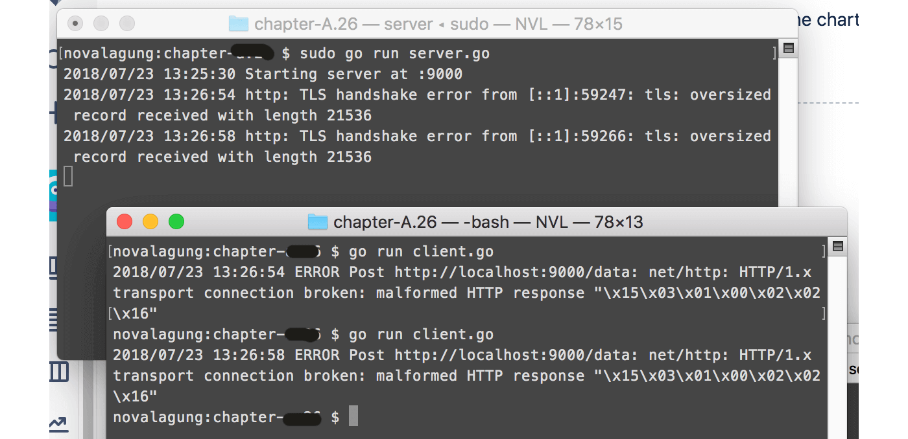
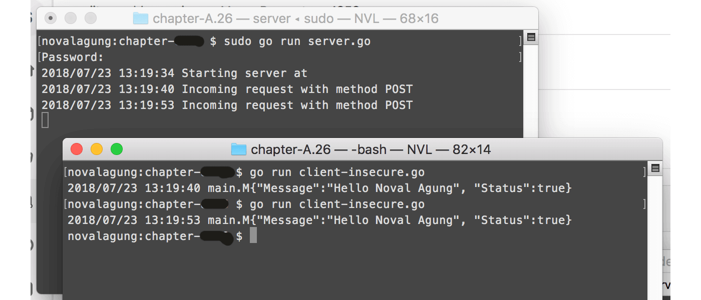
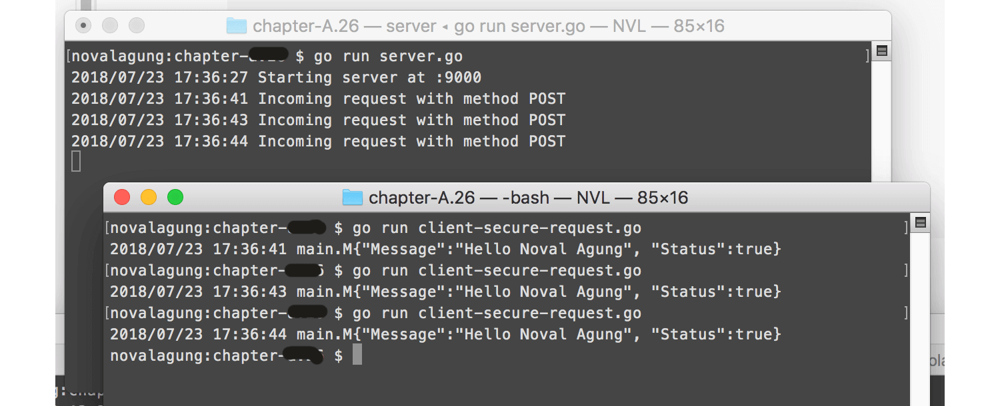

# C.27. Secure & Insecure Client HTTP Request

Pada chapter ini topik yang dibahas adalah cara melakukan http request ke SSL/TLS-enabled web server, menggunakan dua teknik:

 - Insecure request
 - Secure request menggunakan file certificate

## C.27.1. Handshake

Sebelum masuk ke inti pembahasan, kita perlu mempelajari terlebih dahulu tentang pembeda antara secure request dan http request biasa.

Dalam secure request, sebelum data benar-benar diterima oleh server, terjadi proses negosiasi antara client (yg men-dispatch request) dan server (tujuan request), proses ini biasa disebut dengan handshake.

Proses negosiasi tersebut dipecah menjadi 5 fase.

 1. Fase **Client Hello**. Pada fase ini handshake dimulai dengan client mengirimkan pesan yang kita sebut dengan **client hello** ke se server. Pesan tersebut berisikan semua informasi milik client yang diperlukan oleh server untuk bisa terhubung dengan client via SSL. Informasi yang dimaksud di antaranya adalah versi SSL/TLS dan konfigurasi cipher. Cipher suite sendiri adalah seperangkat algoritma, digunakan untuk membantu pengamanan koneksi yang menerapkan TLS/SSL.

 2. Fase **Server Hello**. Setelah diterima, server merespon dengan pesan yang mirip, yaitu **server hello**, isinya juga informasi yang kurang lebih sejenis. Informasi ini diperlukan oleh client untuk bisa terhubung balik dengan server.

 3. Fase **Otentikasi dan Pre-Master Secret**. Setelah kontak antara client dan server terjadi, server mengenalkan dirinya ke client lewat file certificate. Anggap saja certificate tersebut sebagai KTP (Kartu Tanda Penduduk). Client selanjutnya melakukan pengecekan, apakah KTP tersebut valid dan dipercaya, atau tidak. Jika memang terpercaya, client selanjutnya membuat data yang disebut dengan **pre-master secret**, meng-enkripsi-nya menggunakan public key, lalu mengirimnya ke server sebagai response.

 4. Fase **Decryption dan Master Secret**. Data encrypted pre-master secret yang dikirim oleh client diterima oleh server. Data tersebut kemudian di-decrypt menggunakan private key. Selanjutnya server dan client melakukan beberapa hal untuk men-generate **master secret** lewat cipher yang sudah disepakati.

 5. Fase **Encryption with Session Key**. Server dan client melakukan pertukaran pesan untuk menginfokan bahwa data yang dikirim dalam request tersebut dan request-request selanjutnya akan di-enkripsi.

Sekarang kita tau, bahwa agar komunikasi antara client dan server bisa terjalin, pada sisi client harus ada file certificate, dan pada sisi server harus private key & certificate.

OK, saya rasa bagian teori sudah cukup, mari kita lanjut ke bagian praktek.

## C.27.2. Persiapan

Salin project pada chapter sebelumnya, [C.26. Advanced Client HTTP Request](/C-client-http-request-advanced.html) sebagai folder project baru.

## C.27.3. Konfigurasi SSL/TLS pada Web Server

Pada chapter [A.55. Simple Client HTTP Request](/A-client-http-request-simple.html) kita telah belajar implementasi client http request, penerapannya dengan 2 buah aplikasi terpisah, satu aplikasi web server dan satu lagi adalah aplikasi consumer.

Kita perlu menambahkan sedikit modifikasi pada aplikasi web server (yang sudah di salin), mengaktifkan SSL/TLS-nya dengan cara mengubah bagian `.ListenAndServe()` menjadi `.ListenAndServeTLS()`, dengan disisipkan dua parameter berisi path certificate dan private key.

```go
err := server.ListenAndServeTLS("server.crt", "server.key")
```

Silakan generate certificate dan private key baru, caranya sama seperti pada chapter [C.24. HTTPS/TLS Web Server](/C-https-tls.html).

> Konfigurasi SSL/TLS lewat `server.ListenAndServeTLS("server.crt", "server.key")` merupakan cara yang paling mudah dengan konfigurasi adalah paling minimal.

## C.27.4. Insecure Request

Dari yang sudah dijelaskan di atas, agar komunikasi antara client dan server bisa ter-enkripsi, di sisi client atau consumer harus ada yang namanya file certificate.

Jika client tidak menyertakan certificate dalam request-nya, maka pasti terjadi error (pada saat handshake). Contohnya bisa dilihat pada screenshot berikut.



Akan tetapi, jika memang client tidak memilik certificate dan komunikasi ingin tetap dilakukan, masih bisa (dengan catatan server meng-allow kapabilitas ini), caranya yaitu menggunakan teknik *insecure request*. 

> Dalam insecure request, komunikasi terjalin tanpa ada proses enkripsi data. 

Cara membuat insecure request sangat mudah, cukup aktifkan atribut insecure pada request. Misal menggunakan **curl**, maka cukup tambahkan flag `--insecure` pada command.

```bash
curl -X POST https://localhost/data \
    --insecure \
     -H 'Content-Type: application/json' \
     -d '{"Name": "Noval Agung"}'
```

Penerapan inscure request dalam golang juga tidak terlalu sulit. Pada object `http.Client`, isi property `.Transport` dengan objek baru buatan struct `http.Transport` yang di dalamnya berisi konfigurasi insecure request.

```go
client := new(http.Client)
client.Transport = &http.Transport{
    TLSClientConfig: &tls.Config{InsecureSkipVerify: true},
}
```

Ubah kode pada aplikasi client (yang sudah disalin) seperti di atas. Jangan lupa juga untuk mengganti protokol base url destinasi, dari `http` ke `https`. 

```go
baseURL := "https://localhost:9000"
```

Jalankan ulang aplikasi server yang sudah ssl-enabled dan aplikasi client yang sudah dikonfigurasi untuk insecure request, lalu test hasilnya.



## C.27.5. Secure Request

Secure request adalah bentuk request yang datanya ter-enkripsi, bisa dibilang kebalikan dari insecure request. Request jenis ini pada sisi client atau consumer membutuhkan konfigurasi di mana file certificate diperlukan.

Secure request bisa dilakukan dengan mudah di golang. Mari langsung saja kita praktekan. Pertama, pada file consumer, tambahkan package `crypto/x509`.

```go
import (
    // ...
    "crypto/x509"
)
```

> X.509 adalah standar format public key certificates.

Lalu buat objek baru bertipe `x509.CertPool` lewat `x509.NewCertPool()`. Objek ini nantinya menampung list certificate yang digunakan.

Buat objek menggunakan struct `tls.Config`, dengan isi property `RootCAs` adalah objek list certificate yang sudah dibuat.

Isi `client.Transport` dengan konfigurasi secure request. Hapus saja konfigurasi insecure request sebelumnya. 

Kurang lebih kode-nya seperti berikut.

```go
certFile, err := ioutil.ReadFile("server.crt")
if err != nil {
    return nil, err
}

caCertPool := x509.NewCertPool()
caCertPool.AppendCertsFromPEM(certFile)

tlsConfig := &tls.Config{ RootCAs: caCertPool }
tlsConfig.BuildNameToCertificate()

client := new(http.Client)
client.Transport = &http.Transport{
    TLSClientConfig: tlsConfig,
}
```

Bisa dilihat pada kode di atas, file `server.crt` dibaca isinya, lalu dimasukan ke `caCertPool`. Objek `caCertPool` ini bisa menampung banyak certificate, jika memang dibutuhkan banyak.

OK, silakan langsung run aplikasi untuk testing.



## C.27.6. Konfigurasi SSL/TLS Lanjutan

Di atas kita sudah belajar cara setting SSL/TLS pada web server, dengan konfigurasi minimal menggunakan `server.ListenAndServeTLS("server.crt", "server.key")`.

Konfigurasi yang lebih complex bisa kita lakukan menggunakan `tls.Config`. Buat objek menggunakan struct tersebut lalu manfaatkan property struct-nya untuk menciptakan konfigurasi yang sesuai dengan kebutuhan. Contoh kurang lebih seperti kode di bawah ini.

```go
certPair1, err := tls.LoadX509KeyPair("server.crt", "server.key")
if err != nil {
    log.Fatalln("Failed to start web server", err)
}

tlsConfig := new(tls.Config)
tlsConfig.NextProtos = []string{"http/1.1"}
tlsConfig.MinVersion = tls.VersionTLS12
tlsConfig.PreferServerCipherSuites = true

tlsConfig.Certificates = []tls.Certificate{
    certPair1, /** add other certificates here **/
}
tlsConfig.BuildNameToCertificate()

tlsConfig.ClientAuth = tls.VerifyClientCertIfGiven
tlsConfig.CurvePreferences = []tls.CurveID{
    tls.CurveP521,
    tls.CurveP384,
    tls.CurveP256,
}
tlsConfig.CipherSuites = []uint16{
    tls.TLS_ECDHE_RSA_WITH_AES_128_GCM_SHA256,
    tls.TLS_ECDHE_ECDSA_WITH_AES_128_GCM_SHA256,
}
```

Tampung saja objek cetakan `server.TLSConfig` di atas ke dalam `server.TLSConfig`. Jika file certificate dan private key sudah ditambahkan dalam `tlsConfig`, maka dalam pemanggilan `server.ListenAndServeTLS()` kosongkan saja parameter-nya.

```go
server := new(http.Server)
server.Handler = mux
server.Addr = ":9000"
server.TLSConfig = tlsConfig

err := server.ListenAndServeTLS("", "")
if err != nil {
    log.Fatalln("Failed to start web server", err)
}
```

Tujuan mengapa penulis tambahkan sub chapter **Konfigurasi SSL/TLS Lanjutan** ini adalah agar pembaca tau bahwa konfigurasi SSL/TLS yang compleks bisa dilakukan dengan mudah dalam aplikasi web golang. Mengenai pembahasan tiap-tiap property silakan pelajari sendiri.

---

<div class="source-code-link">
    <div class="source-code-link-message">Source code praktek chapter ini tersedia di Github</div>
    <a href="https://github.com/novalagung/dasarpemrogramangolang-example/tree/master/chapter-C.27-secure-insecure-client-http-request">https://github.com/novalagung/dasarpemrogramangolang-example/.../chapter-C.27...</a>
</div>

---

<iframe src="https://novalagung.substack.com/embed" width="100%" height="320" class="substack-embed" frameborder="0" scrolling="no"></iframe>
